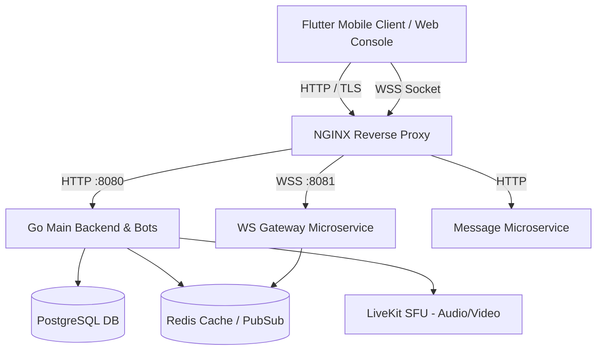

# Contributing to Flicko

Thank you for your interest in contributing to Flicko! This guide covers everything you need to know to contribute effectively to the project, from setting up your development environment to submitting a polished pull request.

Flicko is a high-performance real-time communication platform built with **Go microservices**, a **Flutter mobile client**, **Redis**, **PostgreSQL**, and **LiveKit SFU** for real-time audio/video.

---

## Table of Contents

- [Code of Conduct](#code-of-conduct)
- [Getting Started](#getting-started)
- [Development Environment Setup](#development-environment-setup)
  - [Prerequisites](#prerequisites)
  - [Setting Up Go Backend Services](#setting-up-go-backend-services)
  - [Setting Up the Flutter Mobile App](#setting-up-the-flutter-mobile-app)
- [Project Architecture Overview](#project-architecture-overview)
- [How to Add a New API Endpoint](#how-to-add-a-new-api-endpoint)
- [How to Add a New Bot Command](#how-to-add-a-new-bot-command)
- [How to Create a Database Migration](#how-to-create-a-database-migration)
- [How to Add a New Riverpod Notifier & State](#how-to-add-a-new-riverpod-notifier--state)
- [How to Add a New Flutter Screen](#how-to-add-a-new-flutter-screen)
- [Go Code Style Guide](#go-code-style-guide)
- [Flutter / Dart Code Style Guide](#flutter--dart-code-style-guide)
- [Commit Conventions](#commit-conventions)
- [Pull Request Process](#pull-request-process)
- [Testing Requirements](#testing-requirements)
- [Common Pitfalls](#common-pitfalls)
- [Getting Help](#getting-help)

---

## Code of Conduct

All contributors are expected to follow our [Code of Conduct](CODE_OF_CONDUCT.md). We are committed to providing a welcoming, inclusive, and harassment-free experience for everyone.

---

## Getting Started

1. **Fork the repository** on GitHub.
2. **Clone your fork**:
   ```bash
   git clone https://github.com/YOUR_USERNAME/Flicko.git
   cd Flicko
   ```
3. **Add upstream remote**:
   ```bash
   git remote add upstream https://github.com/Santosh-Prasad-Verma/Flicko.git
   ```
4. **Create a feature branch**:
   ```bash
   git checkout -b feature/your-feature-name
   ```

---

## Development Environment Setup

### Prerequisites

| Tool | Minimum Version | Verification Command | Purpose in Flicko |
|---|---|---|---|
| **Go** | 1.25+ | `go version` | Core backend & microservices |
| **Flutter** | 3.24+ | `flutter --version` | Cross-platform mobile app |
| **Dart** | 3.5+ | `dart --version` | Mobile application language |
| **Docker** | 24.0+ | `docker --version` | Containerized stack & local testing |
| **Git** | 2.30+ | `git --version` | Version control |

---

### Setting Up Go Backend Services

Flicko backend is modularized into specialized services:

```bash
# 1. Main Backend API & Bot Framework (port 8080)
cd backend && go run ./cmd/server

# In a separate terminal - 2. WebSocket Gateway (port 8081)
cd services/ws-gateway && go run ./cmd/gateway

# In a separate terminal - 3. Messaging Service
cd services/msg-service && go run ./cmd/server
```

Or spin up the full local stack with Docker Compose:
```bash
docker compose up -d
```

---

### Setting Up the Flutter Mobile App

The mobile application is written in Flutter with Riverpod state management.

```bash
cd mobile

# Fetch dependencies
flutter pub get

# Run static analysis
flutter analyze

# Run unit and widget tests
flutter test

# Launch on connected simulator or physical device
flutter run
```

---

## Project Architecture Overview



---

## How to Add a New API Endpoint

Adding a new REST endpoint follows the **Handler → Service → Repository** pattern:

### 1. Register Route
```go
// backend/cmd/server/main.go or router setup
router.HandleFunc("/api/v1/custom-feature", handlers.HandleCustomFeature).Methods("POST")
```

### 2. Implement Handler
```go
func HandleCustomFeature(w http.ResponseWriter, r *http.Request) {
    var req CustomFeatureRequest
    if err := json.NewDecoder(r.Body).Decode(&req); err != nil {
        http.Error(w, `{"error":"Invalid request payload"}`, http.StatusBadRequest)
        return
    }
    
    w.Header().Set("Content-Type", "application/json")
    json.NewEncoder(w).Encode(map[string]string{"status": "success"})
}
```

---

## How to Add a New Riverpod Notifier & State

In `mobile/lib/features/`:

```dart
import 'package:flutter_riverpod/flutter_riverpod.dart';

// State model
class CustomFeatureState {
  final bool isLoading;
  final String? error;
  const CustomFeatureState({this.isLoading = false, this.error});
}

// Notifier
class CustomFeatureNotifier extends Notifier<CustomFeatureState> {
  @override
  CustomFeatureState build() => const CustomFeatureState();

  Future<void> executeAction() async {
    state = const CustomFeatureState(isLoading: true);
    try {
      // API invocation
      state = const CustomFeatureState(isLoading: false);
    } catch (e) {
      state = CustomFeatureState(isLoading: false, error: e.toString());
    }
  }
}

// Provider
final customFeatureProvider =
    NotifierProvider<CustomFeatureNotifier, CustomFeatureState>(
  CustomFeatureNotifier.new,
);
```

---

## How to Add a New Flutter Screen

```dart
import 'package:flutter/material.dart';
import 'package:flutter_riverpod/flutter_riverpod.dart';
import 'package:mobile/core/constants/flicko_colors.dart';

class CustomFeatureScreen extends ConsumerWidget {
  const CustomFeatureScreen({super.key});

  @override
  Widget build(BuildContext context, WidgetRef ref) {
    final state = ref.watch(customFeatureProvider);

    return Scaffold(
      backgroundColor: FlickoColors.backgroundDark,
      appBar: AppBar(
        title: const Text('Custom Feature'),
        backgroundColor: FlickoColors.surfaceDark,
      ),
      body: Center(
        child: state.isLoading
            ? const CircularProgressIndicator()
            : const Text('Feature ready', style: TextStyle(color: Colors.white)),
      ),
    );
  }
}
```

---

## Go Code Style Guide

- **Formatting**: Format code with `gofmt -w .`.
- **Constructor Injection**: Pass dependencies explicitly via constructors. No global mutable state.
- **Error Wrapping**: Wrap errors with clear context using `fmt.Errorf("action name: %w", err)`.
- **Validation**: Validate all incoming parameters at the handler boundary.

---

## Flutter / Dart Code Style Guide

- **Formatting**: Format code with `dart format .`.
- **Analysis**: Ensure zero analyzer errors with `flutter analyze --no-fatal-warnings --no-fatal-infos`.
- **Provider Imports**: Always import notifier and repository providers explicitly.
- **Null Safety**: Avoid force unwrapping (`!`) when possible; prefer explicit null-checking.

---

## Commit Conventions

All commits must follow the [Conventional Commits](https://www.conventionalcommits.org/) specification:

| Prefix | Usage | Example |
|---|---|---|
| `feat:` | New feature | `feat(voice): add spatial audio room setting` |
| `fix:` | Bug fix | `fix(auth): handle expired refresh token gracefully` |
| `refactor:` | Code restructuring | `refactor(ws): optimize connection pool mutex` |
| `perf:` | Performance optimization | `perf(db): index messages by channel_id and created_at` |
| `docs:` | Documentation update | `docs: update API endpoints reference` |
| `ci:` | CI/CD changes | `ci: pin action SHAs and configure Go 1.25` |

---

## Pull Request Process

1. Ensure all tests pass locally:
   ```bash
   cd backend && go test -short -v ./...
   cd ../mobile && flutter analyze --no-fatal-warnings --no-fatal-infos && flutter test
   ```
2. Commit with conventional commit format.
3. Push to your fork and submit a PR against `main`.
4. Check GitHub Actions CI output to verify that all lint, build, security, and analysis workflows pass.

---

## Common Pitfalls

1. **Localhost in mobile app**: Simulators and physical devices cannot connect to `localhost`. Use your LAN IP (e.g. `192.168.1.X`) or production endpoints.
2. **Missing Provider Imports**: Ensure Riverpod providers (`authNotifierProvider`, `authRepositoryProvider`, etc.) are imported at the top of your Dart files.
3. **Hardcoding secrets**: Always read secrets from environment variables. Never commit credentials to git.

---

## Getting Help

- **Discussions & Questions**: Open a GitHub Discussion.
- **Bug Reports & Issues**: Open a GitHub Issue with reproduction steps and logs.
- **Security Inquiries**: Report security concerns privately via GitHub Security Advisories.

---

*Maintained with ❤️ by the Flicko Open Source Community*
