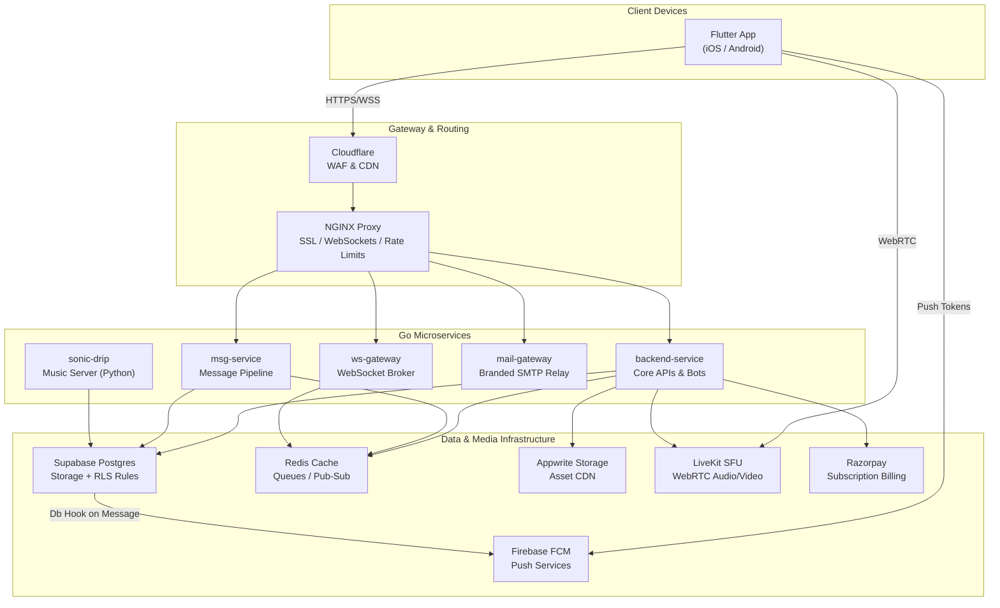

<p align="center">
  
</p>

<h1 align="center">Flicko</h1>

<p align="center">
  <strong>An open-source, self-hostable communication platform featuring real-time messaging, WebRTC-based voice and video channels, integrated music streaming, extensible bot framework, and end-to-end encryption.</strong>
</p>

<p align="center">
  <a href="#quick-start"><strong>Quick Start</strong></a> •
  <a href="#architecture"><strong>Architecture</strong></a> •
  <a href="#key-features"><strong>Features</strong></a> •
  <a href="#self-hosting"><strong>Self-Hosting</strong></a> •
  <a href="docs/README.md"><strong>Full Documentation</strong></a>
</p>

<p align="center">
  
  
  
  
  
  
  
  
</p>

---

## Table of Contents

- [What is Flicko?](#what-is-flicko)
- [Architecture](#architecture)
- [Key Features](#key-features)
- [Tech Stack](#tech-stack)
- [Repository Layout](#repository-layout)
- [Quick Start](#quick-start)
- [Self-Hosting](#self-hosting)
- [Configuration](#configuration)
- [Push Notifications](#push-notifications)
- [Voice & Video Setup](#voice--video-setup)
- [Music System (Sonic Drip)](#music-system-sonic-drip)
- [End-to-End Encryption](#end-to-end-encryption)
- [Database & Migrations](#database--migrations)
- [Security Checklist](#security-checklist)
- [Marketing Website](#marketing-website)
- [Contributing](#contributing)
- [License](#license)

---

## What is Flicko?

Flicko is a modern, performance-oriented communication platform designed to serve as a fully self-hostable, secure alternative to proprietary services. Built with a modular microservices architecture, Flicko is optimized for horizontal scalability and high availability, running efficiently on resources ranging from a single virtual private server to multi-region cloud infrastructures.

### Core Architectural Pillars

* **Real-Time Messaging** — High-performance text channels, threads, reactions, media attachments, custom server emojis, polls, user mentions, and real-time typing indicators.
* **Voice & Video** — WebRTC-powered voice rooms, high-definition video calls, dynamic screen sharing, in-call soundboards, stage channels, and collaborative whiteboards.
* **Integrated Music Streaming** — Native music search and streaming utilizing JioSaavn and YouTube API providers directly within the application client.
* **Decentralized Security** — Private 1:1 direct messages secured via the Signal protocol (X3DH key agreement and Double Ratchet), backed by secure local keychains on user devices.

---

## Architecture

Flicko operates as a suite of specialized Go services fronted by an NGINX reverse proxy. Real-time notification routing and temporary application states are handled by Redis Pub/Sub, while persistent application data is secured using Postgres Row-Level Security (RLS) policies inside Supabase.



---

## Key Features

### Rich Messaging
* **Channel Management:** Supports Text, Voice, Announcement, and Forum channel formats with granular permission inheritance.
* **Interactions:** In-line nested replies, markdown support, Giphy integration, custom server stickers, custom emojis, and message pinning.
* **End-to-End Encryption:** X3DH key agreement and Double Ratchet protocol (utilizing XChaCha20-Poly1305 and HKDF-SHA256) for DMs.
* **Search & Discovery:** Instant full-text channel and message search powered by Postgres `tsvector`.

### Immersive Voice & Video
* **LiveKit SFU:** WebRTC integration providing sub-100ms latency audio and video streams.
* **Stage Channels:** Supports moderator-controlled speaker queues and raise-hand requests.
* **Screen Sharing:** High-resolution stream broadcasting directly from the mobile client.
* **Collaborative Canvas:** Real-time whiteboard synchronization allowing interactive drawing on a shared canvas.

### Sonic Drip Music
* **Streaming Engine:** Direct streaming utilizing JioSaavn and YouTube engines.
* **Spotify Integration:** Optional metadata lookup via local WebView cookie mapping.
* **System Integration:** Full system media controller integration on iOS and Android via `audio_service`.
* **Profile Integration:** Pulsing profile equalizer visualizer synced to real-time track playback.

### Gaming Hub
* **Integrated Engines:** Embedded Chess and Ludo engines with real-time multiplayer support.
* **Matchmaking:** Persistent matchmaking pools and Elo-based leaderboards tracked in Redis.

### Built-in Bot Framework
Flicko includes a background worker bot subsystem orchestrated by `asynq_coordinator.go`:
* **AutoMod Bot:** Automated message, link, and profanity filtering.
* **Leveling Bot:** Advanced user experience progression and automated role assignments.
* **Ticket Bot:** Support ticket management with dynamically created private channels.
* **Starboard, Poll, Music, Welcome, and Moderation Bots.**

---

## Tech Stack

| Layer | Technologies |
|---|---|
| **Mobile Client** | Flutter 3.22+, Dart 3.4+, Riverpod 3, GoRouter 17, Freezed |
| **Backend API** | Go 1.26, Chi Router, pgx/v5, Asynq, LiveKit Go SDK, Zap Logger |
| **Real-time Gateway** | Custom Go WebSocket Broker (`ws-gateway`), Redis Pub/Sub |
| **Database** | Postgres 15 (Supabase) with Row-Level Security (RLS) on all tables |
| **File Storage** | Appwrite Object Storage |
| **WebRTC Media** | LiveKit SFU (WebRTC), just_audio, audio_service |
| **Music Services** | Python FastAPI, spotapi 1.2.7, JioSaavn & YouTube API |
| **Push Notifications** | Firebase Cloud Messaging (FCM HTTP v1) |
| **Payments & Billing** | Razorpay SDK (subscriptions, boosts, catalog transactions) |
| **E2EE Core** | X3DH (Curve25519), Double Ratchet (XChaCha20-Poly1305), Argon2id |

---

## Repository Layout

```
.
├── mobile/              # Flutter Client Application (iOS + Android)
├── backend/             # Primary Go Backend API (Auth, Servers, Bots, Billing)
├── services/            # Core Infrastructure Services (ws-gateway, msg-service, shared)
├── sonic-drip/          # Music Stream Engine (Go + Python spotapi integration)
├── mail-gateway/        # Branded HTML Transactional Email Relay (Go)
├── supabase/            # Database configurations & migrations
│   ├── migrations/      # 131+ production-ready SQL database migrations
│   └── functions/       # Edge Functions (voice-token, push-notify, etc.)
├── nginx/               # NGINX configuration templates
├── monitoring/          # Prometheus, Grafana, and Loki configs
├── web/                 # Marketing Site & Web Portal (Next.js 15 + Bun)
└── docs/                # Extended architectural and deployment guides
```

---

## Quick Start

### 1. Clone & Initialize Environment
```bash
git clone git@github.com:Santosh-Prasad-Verma/Flicko.git
cd Flicko
cp .env.example .env
cp .env.mail-gateway.example mail-gateway/.env
```
*(Review and populate the `.env` files with your local or staging configuration parameters)*

### 2. Launch Infrastructure Services
```bash
docker compose -f docker-compose.dev.yml up -d
```

### 3. Build and Run the Client Application
```bash
cd mobile
flutter pub get
flutter run
```

---

## Self-Hosting

For production environments, the `docker-compose.prod.yml` compose file isolates services within a dedicated container network structure.

| Service Container | Port | Description |
|---|---|---|
| `flicko-nginx` | `80` / `443` | Reverse proxy, SSL termination, WebSocket upgrade handling |
| `flicko-backend` | `8090` | Primary Go REST API and Asynq Bot Worker |
| `flicko-ws-gateway` | `8091` | High-throughput WebSocket connection broker |
| `flicko-msg-service` | `8092` | REST ingestion layer for chat and media |
| `flicko-sonic-drip` | `8001` | Music streaming metadata service |
| `flicko-livekit-sfu` | `7880` - `7882` | LiveKit SFU media server (TCP/UDP WebRTC ports) |
| `flicko-redis` | `6379` | Cache, key-value store, and pub/sub broker |
| `flicko-prometheus` | `9090` | System metrics harvester |
| `flicko-grafana` | `3000` | Real-time performance dashboards |

> [!TIP]
> For small server configurations (e.g. 8GB RAM single VPS), use `docker-compose.zero.yml` to launch without the heavy Prometheus/Grafana monitoring suite.

---

## Configuration

Secrets and configuration tokens are divided across three layers:
1. **`.env`** (Root): Handles database configuration, Redis strings, JWT credentials, Razorpay IDs, and LiveKit keys.
2. **`mail-gateway/.env`**: Handles Brevo SMTP keys and database webhook verification tokens.
3. **`mobile/.env`**: Envs for Flutter client (Supabase URL, anon key, Appwrite API keys, LiveKit server address, Giphy tokens).

---

## Push Notifications

Flicko manages notifications with high reliability:
1. **Token Registration:** The Flutter client registers its FCM token to the `public.user_devices` table.
2. **Database Trigger:** An `INSERT` trigger on `messages` posts a payload to the Supabase `push-notify` Edge function.
3. **FCM Gateway:** The Edge function generates a secure Firebase Admin payload and dispatches it over FCM HTTP v1.
4. **Local Alert:** When received in the foreground, `flutter_local_notifications` displays a beautiful, custom in-app banner.

---

## Voice & Video Setup

LiveKit runs as a container within the stack. Configure `livekit.yaml` to specify key-secret pairs:
```yaml
keys:
  my_api_key_id: my_api_secret_hash_key
```
Generate random keys for production:
```bash
KEY=$(openssl rand -hex 16)
SECRET=$(openssl rand -hex 32)
echo "$KEY: $SECRET"
```
Ensure `LIVEKIT_API_KEY` and `LIVEKIT_API_SECRET` are correctly configured in both the backend `.env` and `livekit.yaml`.

---

## Music System (Sonic Drip)

Sonic Drip compiles music metadata from JioSaavn and YouTube. A WebView captures required cookies when a user authenticates, sending them to the backend to proxy search/stream requests. Lock screen controls interface with iOS/Android audio systems seamlessly.

---

## End-to-End Encryption

Secure conversations are fully decentralized. Key exchanges are handled via X3DH, while ongoing encryption utilizes a Double Ratchet chain. Plaintext is never sent to or visible by the server; it remains strictly inside local secure keychains on the sender and receiver devices.

---

## Database & Migrations

Our Postgres instance contains 131+ structured migrations. Key migrations:
* `001-027`: Base tables (servers, channels, roles, voice state).
* `034`: Strict Row-Level Security (RLS) policies.
* `035`: DB functions to calculate 26-bit role permissions.
* `056-061`: WebRTC voice, video, screen share, and whiteboard states.
* `099`: Strict privacy filters (presence hiding, friend requirements).
* `131`: SQL optimizations for active channel participant tracking.

Run migrations against a live database:
```bash
supabase link --project-ref <your-ref>
supabase db push
```

---

## Security Checklist

Before taking your Flicko stack live:
- [ ] Rotate the default `flicko_livekit_key` and `flicko_livekit_secret` values.
- [ ] Generate a secure, 256-bit JWT secret.
- [ ] Verify that every user-facing table has Row-Level Security (RLS) enabled.
- [ ] Verify SSL certificates are active (Cloudflare Origin certs are recommended).
- [ ] Setup `fail2ban` for automated rate limit blocklisting.
- [ ] Confirm Razorpay webhook signature verification is enabled in `.env`.

---

## Marketing Website

Flicko includes a public-facing corporate website built with Next.js 15, Vercel ready, located inside `/web`.
To run locally:
```bash
cd web
bun install
bun run dev
```

---

## Contributing

Contributions make the open-source community an amazing place. We welcome bug fixes, documentation improvements, and feature PRs.
* Ensure `flutter analyze` runs without errors before making mobile PRs.
* Make sure `go vet ./...` and `go test ./...` pass for backend modifications.
* Follow the [Conventional Commits](https://www.conventionalcommits.org/) standard.

---

## License

Distributed under the MIT License. See `LICENSE` for more information.

---

<p align="center">
  
  <br />
  <sub>Built with passion using Flutter, Go, Supabase, and LiveKit.</sub>
</p>
