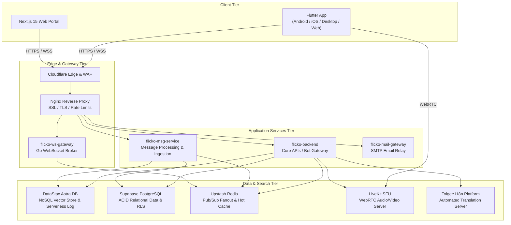

<p align="center">
  
</p>

<h1 align="center">⚡ Flicko</h1>

<p align="center">
  <strong>The Enterprise Open-Source Real-Time Communication & Collaboration Platform</strong>
</p>

<p align="center">
  <em>High-performance real-time messaging, WebRTC 4K voice & video, AI assistant vector search, integrated music streaming, extensible bot framework, and Signal-protocol end-to-end encryption.</em>
</p>

<p align="center">
  <a href="#-quick-start"><strong>Quick Start</strong></a> •
  <a href="#-architecture"><strong>Architecture</strong></a> •
  <a href="#-key-features"><strong>Key Features</strong></a> •
  <a href="#-tech-stack"><strong>Tech Stack</strong></a> •
  <a href="#-cicd-pipeline-matrix"><strong>CI/CD Matrix</strong></a> •
  <a href="docs/README.md"><strong>Full Documentation</strong></a>
</p>

<p align="center">
  
  
  
  
  
  
  
  
</p>

---

## 📌 Table of Contents

- [What is Flicko?](#-what-is-flicko)
- [Architecture](#-architecture)
- [Key Features](#-key-features)
- [Tech Stack](#-tech-stack)
- [Repository Layout](#-repository-layout)
- [CI/CD Pipeline Matrix](#-cicd-pipeline-matrix)
- [Quick Start](#-quick-start)
- [Self-Hosting](#-self-hosting)
- [Localization (Tolgee i18n)](#-localization-tolgee-i18n)
- [Astra DB Vector Search](#-astra-db-vector-search)
- [Security Checklist](#-security-checklist)
- [License](#-license)

---

## 🚀 What is Flicko?

**Flicko** is a modern, high-concurrency real-time communication platform designed as a self-hostable, secure enterprise alternative to proprietary apps like Discord and Slack. Built on a Go microservices core, DataStax Astra DB vector store, Supabase PostgreSQL, and LiveKit WebRTC SFU, Flicko scales seamlessly from a single virtual server up to multi-region cloud clusters.

### 🌟 Core Architectural Pillars

* **⚡ Ultra-Fast Messaging** — Sub-10ms latency WebSocket message delivery, thread channels, reactions, media attachments, custom server stickers, polls, and real-time typing indicators.
* **🎙️ 4K Voice & Video SFU** — WebRTC-powered voice rooms, 4K screen sharing, stage channels with speaker queues, collaborative whiteboards, and custom in-call soundboards.
* **🧠 Aura AI & Vector Search** — Server-side 1536-dimensional Astra DB vector embedding (`$vectorize`) providing semantic chat search and automated conversation summarization via Gemini 2.5 Flash / Groq.
* **🔒 End-to-End Encryption** — Signal protocol (X3DH key agreement and Double Ratchet with XChaCha20-Poly1305) for private 1:1 direct messages.
* **🌐 Automated Localization (i18n)** — Integrated self-hosted Tolgee platform (`http://104.43.114.32:8085`) managing 395+ localized strings in 15+ languages.

---

## 🏗️ Architecture



---

## ✨ Key Features

### 💬 Rich Messaging & Channels
* **Channel Formats:** Text, Voice, Announcement, Forum, and Stage channels with granular role permission inheritance.
* **Interactive Media:** Giphy integration, custom server emojis, stickers, pinned messages, and nested replies.
* **E2EE Direct Messages:** Private key agreement via Curve25519 and double ratchet payload encryption.

### 🎙️ WebRTC Voice, Video & Stage Channels
* **LiveKit SFU Integration:** Sub-50ms glass-to-glass latency for high-definition voice and video calls.
* **Stage Channels:** Raised-hand queue, speaker moderation, and role-based speaking permissions.
* **Interactive Whiteboard:** Synchronized canvas drawing during live video sessions.

### 🤖 Extensible Bot Framework
Operated by an asynchronous Go job coordinator (`asynq`):
* **AutoMod Bot:** Automated profanity filtering, link protection, and spam rate limiting.
* **Leveling & XP Bot:** Progression system with automated role rewards.
* **Support Ticket Bot:** Dynamic private ticket channel creation and transcript archival.
* **Starboard & Poll Bots.**

---

## 🛠️ Tech Stack

| Layer | Component | Description |
|---|---|---|
| **Mobile & Desktop** | Flutter 3.22+ / Dart 3.4+ | Riverpod 3, GoRouter 17, Freezed, LiveKit Client |
| **Web Portal** | Next.js 15 / React 19 | TypeScript, Tailwind CSS v4, Radix UI |
| **Backend API** | Go 1.25 | Chi Router, Zap Logger, pgx/v5, Asynq Coordinator |
| **Real-time Gateway** | Go WebSocket Broker | Gorilla WebSocket, Redis Pub/Sub Event Fanout |
| **NoSQL & Vector** | DataStax Astra DB | 1536d Cosine Vector Search, Serverless Data API |
| **Relational Database**| Supabase PostgreSQL | ACID storage, 131+ SQL migrations, Row-Level Security |
| **WebRTC Voice/Video** | LiveKit SFU | WebRTC Media Server, Opus Codec, H.264 Video |
| **Localization (i18n)**| Tolgee Platform | Self-hosted i18n platform & CLI sync (`scripts/sync-l10n.sh`) |
| **Secrets & Config** | Azure Key Vault | Zero hardcoded keys in repository |

---

## 🔄 CI/CD Pipeline Matrix (27 Active Workflows)

Flicko maintains **27 automated GitHub Actions workflows** in [`.github/workflows/`](.github/workflows):

| Category | Workflows Included |
|---|---|
| **Client Apps** | `flutter-ci.yml`, `flutter-cd.yml`, `mobile-e2e.yml`, `pr-title-check.yml` |
| **Backend & Microservices** | `backend-ci.yml`, `backend-cd.yml`, `vps-deploy.yml`, `bot-gateway-ci.yml`, `e2ee-tests.yml`, `ai-summary-eval.yml`, `canary-rollback-cd.yml`, `reliability-chaos-test.yml` |
| **Data & Infra** | `supabase-ci.yml`, `supabase-schema-drift.yml`, `supabase-backup.yml`, `terraform-ci-cd.yml` |
| **Security & Vulnerability**| `codeql-analysis.yml`, `security-docker-scanner.yml`, `security-secrets-scanner.yml`, `security-vulnerability-check.yml`, `govulncheck.yml` |
| **Quality & Ops** | `golangci-lint.yml`, `api-load-test.yml`, `release-changelog.yml`, `localization-sync.yml`, `docs-site-deploy.yml`, `dependabot-auto-patch.yml` |

---

## ⚡ Quick Start

### 1. Clone & Setup Environment
```bash
git clone https://github.com/Santosh-Prasad-Verma/Flicko.git
cd Flicko
cp .env.example .env
```

### 2. Launch Local Services via Docker
```bash
docker compose -f docker-compose.dev.yml up -d
```

### 3. Run Mobile App (Flutter)
```bash
cd mobile
flutter pub get
flutter run
```

---

## 🌐 Localization (Tolgee i18n)

Flicko is fully localized into 15+ languages via a self-hosted Tolgee server (`http://104.43.114.32:8085`).
To sync the latest translations into your local Flutter `.arb` files:

```bash
chmod +x ./scripts/sync-l10n.sh
./scripts/sync-l10n.sh
```

---

## 🔐 Security Checklist

Before deploying Flicko to production:
- [ ] Ensure all API keys and tokens are stored in **Azure Key Vault**.
- [ ] Verify Row-Level Security (RLS) is enabled on all PostgreSQL tables.
- [ ] Set up SSL certificates via Nginx and Cloudflare Origin certificates.
- [ ] Enable `fail2ban` rate-limiting rules.

---

## 📄 License

Flicko is distributed under the **MIT License**. See `LICENSE` for details.

<p align="center">
  <sub>Built with passion using Go, Flutter, Astra DB, Supabase, and LiveKit.</sub>
</p>
