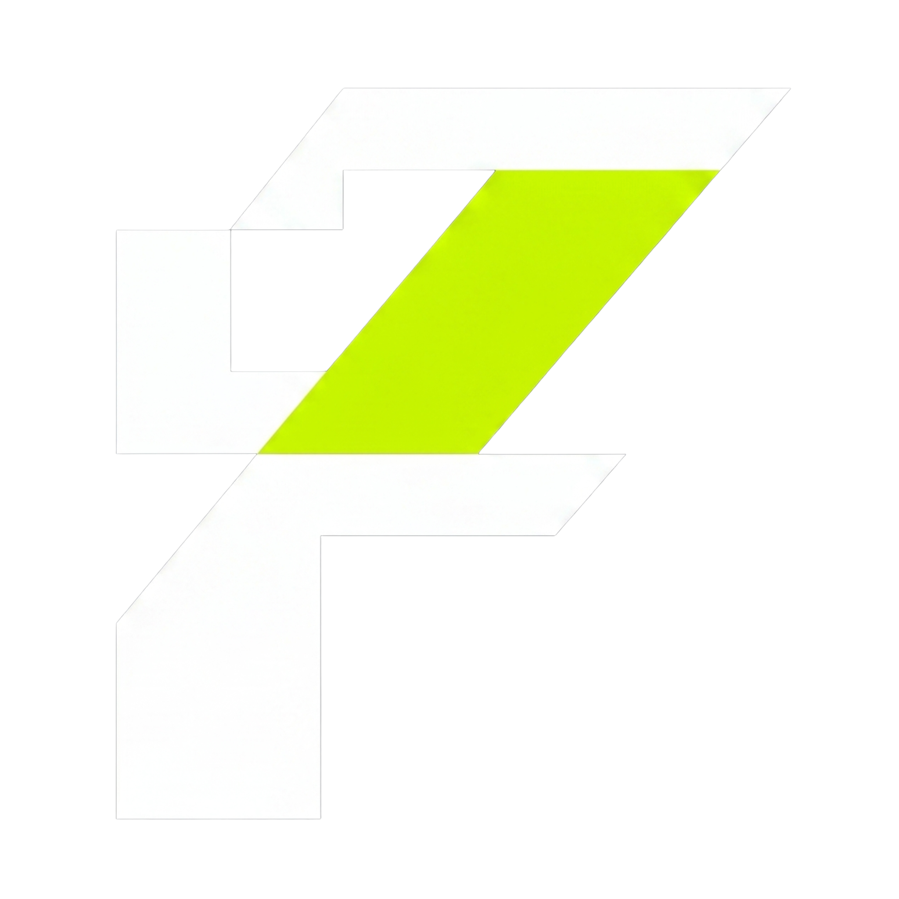
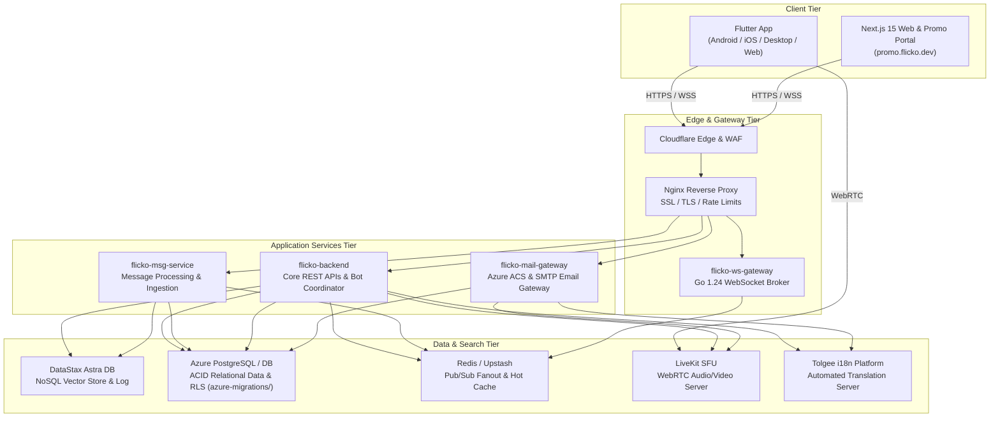

<p align="center">
  
</p>

<h1 align="center">⚡ Flicko</h1>

<p align="center">
  <strong>The Enterprise Open-Source Real-Time Communication & Collaboration Platform</strong>
</p>

<p align="center">
  <em>High-performance real-time messaging, WebRTC 4K voice & video, AI assistant vector search, integrated promotional email dashboard, extensible bot framework, Azure cloud infrastructure, and Signal-protocol end-to-end encryption.</em>
</p>

<p align="center">
  <a href="#-quick-start"><strong>Quick Start</strong></a> •
  <a href="#-architecture"><strong>Architecture</strong></a> •
  <a href="#-key-features"><strong>Key Features</strong></a> •
  <a href="#-tech-stack"><strong>Tech Stack</strong></a> •
  <a href="#-cicd-pipeline-matrix"><strong>CI/CD Matrix</strong></a> •
  <a href="#-repository-layout"><strong>Repository Layout</strong></a>
</p>

<p align="center">
  
  
  
  
  
  
  
  
</p>

---

## 📌 Table of Contents

- [What is Flicko?](#-what-is-flicko)
- [Architecture](#-architecture)
- [Key Features](#-key-features)
- [Tech Stack](#-tech-stack)
- [Repository Layout](#-repository-layout)
- [CI/CD Pipeline Matrix](#-cicd-pipeline-matrix)
- [Quick Start](#-quick-start)
- [Localization (Tolgee i18n)](#-localization-tolgee-i18n)
- [Astra DB & Vector Search](#-astra-db--vector-search)
- [Security & Compliance](#-security--compliance)
- [License](#-license)

---

## 🚀 What is Flicko?

**Flicko** is a modern, high-concurrency real-time communication platform designed as a self-hostable, secure enterprise alternative to proprietary apps like Discord and Slack. Built on a Go 1.24 microservices core, DataStax Astra DB vector store, Azure PostgreSQL, and LiveKit WebRTC SFU, Flicko scales seamlessly from single virtual servers up to multi-region Azure cloud clusters.

### 🌟 Core Architectural Pillars

* **⚡ Ultra-Fast Go Messaging** — Sub-10ms latency WebSocket message delivery powered by dedicated `flicko-ws-gateway` brokers, thread channels, reactions, media attachments, custom stickers, polls, and real-time typing indicators.
* **🎙️ 4K Voice & Video SFU** — WebRTC-powered voice rooms, 4K screen sharing, stage channels with speaker queues, collaborative whiteboards, and custom in-call soundboards via LiveKit.
* **🧠 Aura AI & Vector Search** — Server-side 1536-dimensional Astra DB vector embedding (`$vectorize`) providing semantic chat search and automated conversation summarization via Gemini / Groq.
* **📧 Promotional Email Admin Portal** — Native Next.js 15 marketing and promotional email campaign dispatch dashboard (`promo.flicko.dev`) integrated with Azure Communication Services (ACS) & SMTP mail gateways.
* **🔒 End-to-End Encryption** — Signal protocol (X3DH key agreement and Double Ratchet with XChaCha20-Poly1305) for private 1:1 direct messages.
* **🌐 Automated Localization (i18n)** — Integrated self-hosted Tolgee platform managing localized strings across 15+ languages.

---

## 🏗️ Architecture



---

## ✨ Key Features

### 💬 Rich Messaging & Channels
* **Channel Formats:** Text, Voice, Announcement, Forum, and Stage channels with granular role permission inheritance.
* **Interactive Media:** Custom server emojis, stickers, pinned messages, view-once media, and nested replies.
* **E2EE Direct Messages:** Private key agreement via Curve25519 and double ratchet payload encryption.

### 🎙️ WebRTC Voice, Video & Stage Channels
* **LiveKit SFU Integration:** High-definition voice and video calls with sub-50ms glass-to-glass latency.
* **Stage Channels:** Raised-hand queue, speaker moderation, and role-based speaking permissions.
* **Interactive Whiteboard & Soundboard:** Synchronized canvas drawing and sound FX during live sessions.

### 📧 Promotional Email & Admin Dashboard (`promo.flicko.dev`)
* **Target Audience Filtering:** Filter user directories by tier (`all`, `flicko_plus`, `inactive_30d`, `creators`, `free`).
* **Dynamic Template Selector:** Live HTML preview for `flicko_plus.html`, `upgrade.html`, `welcome.html`, and `notification.html`.
* **Batch Email Dispatcher:** Direct integration with Azure Communication Services (ACS) and `flicko-mail-gateway`.

### 🤖 Extensible Bot Framework
Operated by an asynchronous Go job coordinator (`asynq`):
* **AutoMod Bot:** Automated profanity filtering, link protection, and spam rate limiting.
* **Leveling & XP Bot:** Progression system with automated role rewards.
* **Support Ticket Bot:** Dynamic private ticket channel creation and transcript archival.
* **Starboard & Poll Bots.**

---

## 🛠️ Tech Stack

| Layer | Component | Description |
|---|---|---|
| **Mobile & Desktop** | Flutter 3.22+ / Dart 3.4+ | Riverpod, GoRouter, Freezed, LiveKit Client |
| **Web & Admin Portal** | Next.js 15 / React 19 | TypeScript, Tailwind CSS v4, Vercel |
| **Backend API** | Go 1.24.0 | Chi Router, Zap Logger, pgx/v5, Asynq Coordinator |
| **Real-time Gateway** | Go 1.24 WebSocket Broker | Gorilla WebSocket, Redis Pub/Sub Event Fanout |
| **Email Gateway** | Go 1.24 Mail Gateway | Azure Communication Services (ACS) & SMTP Relay |
| **NoSQL & Vector** | DataStax Astra DB | 1536d Cosine Vector Search, Serverless Data API |
| **Relational Database**| Azure PostgreSQL | ACID storage, 150+ SQL migrations in `azure-migrations/` |
| **WebRTC Voice/Video** | LiveKit SFU | WebRTC Media Server, Opus Codec, H.264 Video |
| **Localization (i18n)**| Tolgee Platform | Self-hosted i18n platform & CLI sync (`scripts/sync-l10n.sh`) |
| **Secrets & Config** | Azure Key Vault | Secure enterprise secrets management |

---

## 📁 Repository Layout

```
.
├── azure-migrations/            # Azure Database Bootstrap & Consolidated SQL Migrations (150+ scripts)
│   ├── 001_bootstrap.sql        # Azure Postgres Schema Bootstrap
│   ├── 002_core_schema.sql      # Core Users, Servers, Channels & Messages
│   ├── 004_rls_policies.sql     # Row-Level Security Policies
│   └── supabase-migrations/     # Migrations, Seeds & RLS Test Suites
├── backend/                     # Go 1.24 Core REST API, Bot Coordinator & Container Config
│   ├── Dockerfile               # Multi-stage Alpine build pinned to golang:1.24-alpine
│   ├── cmd/server/              # Main API Server Entrypoint
│   └── internal/                # Handlers, Services, Middleware & Database Clients
├── services/                    # Go 1.24 Microservices
│   ├── ws-gateway/              # Real-time WebSocket Gateway Broker
│   ├── msg-service/             # High-Throughput Message Ingestion Service
│   └── shared/                  # Shared Go Utilities & Domain Models
├── mail-gateway/                # Go 1.24 Email Gateway (Azure ACS & SMTP)
├── mobile/                      # Flutter Cross-Platform Mobile & Desktop App
├── azure-functions/             # Azure Serverless Functions
├── .github/workflows/           # Automated CI/CD & Security Workflows
└── docker-compose.dev.yml       # Local Development Infrastructure Stack
```

---

## 🔄 CI/CD Pipeline Matrix & Security Scanners

Flicko enforces automated quality, vulnerability scanning, and deployment via **GitHub Actions**:

| Category | Workflows Included |
|---|---|
| **Security & Vulnerabilities**| `security-docker-scanner.yml` (Trivy), `govulncheck.yml`, `security-vulnerability-check.yml` (OSV-scanner), `codeql-analysis.yml`, `security-secrets-scanner.yml` |
| **Backend & Microservices** | `backend-ci.yml`, `backend-cd.yml`, `vps-deploy.yml`, `bot-gateway-ci.yml`, `e2ee-tests.yml`, `golangci-lint.yml` |
| **Client Apps** | `flutter-ci.yml`, `flutter-cd.yml`, `mobile-e2e.yml` |
| **Database & Infra** | `supabase-ci.yml`, `supabase-schema-drift.yml`, `terraform-ci-cd.yml` |

---

## ⚡ Quick Start

### 1. Clone & Setup Environment
```bash
git clone https://github.com/Santosh-Prasad-Verma/Flicko.git
cd Flicko
cp .env.example .env
```

### 2. Launch Local Infrastructure via Docker
```bash
docker compose -f docker-compose.dev.yml up -d
```

### 3. Build & Test Backend Services (Go 1.24)
```bash
cd backend
go mod tidy
go build -o flicko-backend ./cmd/server/main.go
```

### 4. Run Mobile App (Flutter)
```bash
cd mobile
flutter pub get
flutter run
```

---

## 🌐 Localization (Tolgee i18n)

Flicko is fully localized into 15+ languages via a self-hosted Tolgee server (`http://104.43.114.32:8085`).
To sync the latest translations into your local Flutter `.arb` files:

```bash
chmod +x ./scripts/sync-l10n.sh
./scripts/sync-l10n.sh
```

---

## 🔐 Security & Compliance

- **Protected Main Branch**: Force pushes and branch deletions are strictly disabled on `main`.
- **Zero Hardcoded Secrets**: All production connection strings and credentials are sourced via **Azure Key Vault**.
- **Static Binary Stripping**: Go binaries are compiled static (`CGO_ENABLED=0`) with debug symbol stripping (`-s -w`).
- **Automated Container Auditing**: Docker images undergo automated Trivy vulnerability scanning on every push.

---

## 📄 License

Flicko is distributed under the **MIT License**. See `LICENSE` for details.

<p align="center">
  <sub>Built with passion using Go 1.24, Flutter, Azure PostgreSQL, Astra DB, and LiveKit.</sub>
</p>
