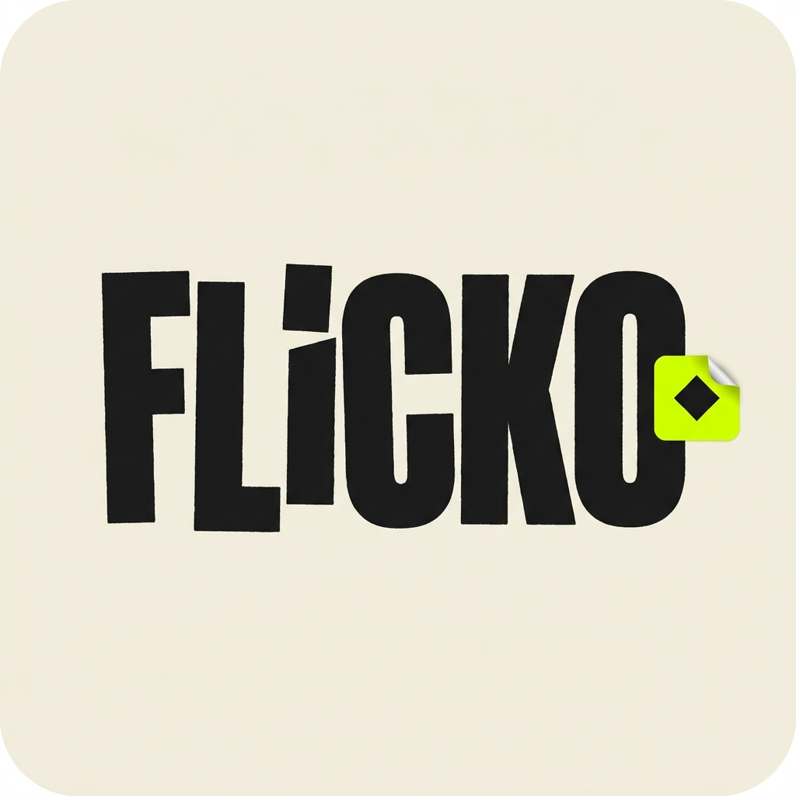
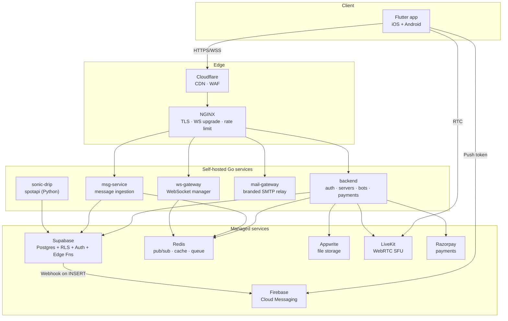

<p align="center">
  
</p>

<h1 align="center">Flicko</h1>

<p align="center">
  <strong>Open-source, self-hostable Discord alternative with voice, video, music, gaming, and end-to-end encryption</strong>
  <br />
  <em>Real-time messaging · LiveKit voice & video · BlackHole-powered music · X3DH/Double Ratchet E2EE · 8-bot moderation framework</em>
</p>

<p align="center">
  
  
  
  
  
  
  
  
</p>

<p align="center">
  <a href="#quick-start"><strong>Quick start</strong></a> ·
  <a href="#architecture"><strong>Architecture</strong></a> ·
  <a href="#features"><strong>Features</strong></a> ·
  <a href="#self-hosting"><strong>Self-hosting</strong></a> ·
  <a href="docs/README.md"><strong>Full docs</strong></a>
</p>

---

## Table of contents

- [What Flicko is](#what-flicko-is)
- [Architecture](#architecture)
- [Features](#features)
- [Tech stack](#tech-stack)
- [Repository layout](#repository-layout)
- [Quick start](#quick-start)
- [Self-hosting](#self-hosting)
- [Configuration](#configuration)
- [Push notifications](#push-notifications)
- [Voice & video setup](#voice--video-setup)
- [Music (Sonic Drip)](#music-sonic-drip)
- [End-to-end encryption](#end-to-end-encryption)
- [Database & migrations](#database--migrations)
- [Security checklist](#security-checklist)
- [Marketing site](#marketing-site)
- [Contributing](#contributing)
- [License](#license)

---

## What Flicko is

Flicko is a complete, self-hostable communication platform built around four core pillars:

1. **Real-time messaging** — text, replies, threads, reactions, attachments, GIFs, stickers, custom emojis, polls, mentions
2. **Voice and video** — LiveKit-backed channels with screen share, soundboard, stage rooms, dm calls, and a shared whiteboard
3. **Music streaming** — JioSaavn + YouTube via the BlackHole-style API surface (no Premium accounts required), with optional Spotify-via-cookies for power users
4. **Servers** — Discord-style guilds with categories, voice/text/forum/stage channels, role-based permissions (26 bits), invites, bans, audit logs, AutoMod, onboarding flows, boosts, and templates

On top of that you get end-to-end encryption for direct messages (X3DH key exchange + Double Ratchet), a built-in bot framework with 8 production bots (welcome, ticket, starboard, poll, music, moderation, leveling, automod), an in-app gaming hub with Chess and Ludo, a creator/store storefront, multi-server discovery, and a marketing site.

## Architecture

Flicko runs as a small fleet of Go services behind NGINX, plus managed cloud services. The mobile client is Flutter and talks to the backend over HTTPS + WebSocket, and to LiveKit directly over WebRTC.



Three Docker networks isolate the stack: `flicko_edge` (NGINX, Cloudflare-facing), `flicko_internal` (Go services, Redis, Postgres replicas), and `flicko_monitor` (Prometheus, Grafana, Loki).

## Features

### Messaging
- Channels: text, voice, stage, forum, announcement, threaded
- Replies, reactions, attachments, GIFs (Giphy), stickers, custom server emojis, polls, mentions, slash commands
- Direct messages with optional **end-to-end encryption** (X3DH + Double Ratchet, secure WAL-backed ratchet store)
- Group DMs
- Read receipts, typing indicators, message search with tsvector + ts_headline
- Slowmode, message pinning, message history pagination

### Voice & video
- LiveKit-backed voice and video channels (Opus + adaptive bitrate)
- Screen share, video, soundboard, in-call activities
- Stage channels with raise-hand and speaker queue
- DM calls (1:1)
- Shared whiteboard (drawing strokes synced via Postgres)
- Push-to-talk + voice activity detection (VAD)
- Spatial audio settings stub

### Music — Sonic Drip
- BlackHole-style integration: JioSaavn + YouTube as the primary provider
- iTunes preview-URL search as a global fallback
- Spotify via SpotAPI (optional, requires user cookie capture; no Premium account required)
- Now-playing card, queue, drip-bash sheet, search, soundboard
- "Gava" pulsing equalizer bar shown on the user profile while a track is playing
- Lock screen / Dynamic Island controls via `audio_service`

### Servers (guilds)
- Categories, channels, role hierarchy with 26 fine-grained permission bits
- Invites, bans (with expiration), audit log, AutoMod
- Onboarding flows, server templates, boosts (3 tiers), discovery & categories
- Custom emojis, stickers, webhooks, application installs
- Per-server moderation: mute, kick, ban, timeout, warn, AutoMod rules, member screening

### Bots (built-in)
Welcome bot · Ticket bot · Starboard bot · Poll bot · Music bot · Moderation bot · Leveling bot · AutoMod bot. All managed through `backend/internal/bots/asynq_coordinator.go`.

### Gaming hub
Chess and Ludo with matchmaking, in-game chat, and persistent state in Redis + Postgres.

### Premium & monetization
- Razorpay-powered Flicko Plus and Flicko Pro subscription tiers
- Custom emoji slots, animated avatars, larger uploads
- Gift transactions and redemptions, boost credits
- Cosmetic catalog and user cosmetics

### Notifications
- Firebase Cloud Messaging (HTTP v1 API) for push
- Supabase Database Webhook → `push-notify` Edge Function → FCM
- In-app foreground handler with custom banner (`flutter_local_notifications`)

### Security
- Supabase Auth with email/password, Google OAuth, Apple Sign-In
- MFA factors and recovery codes
- Trusted devices, login events, security alerts
- Account deletion jobs, data export jobs
- Privacy controls (DM permissions, presence masking, activity hiding) enforced at the SQL level

## Tech stack

| Layer | Tech |
|---|---|
| Mobile | Flutter 3.22+, Dart 3.4+, Riverpod 3, GoRouter 17, freezed |
| Backend | Go 1.25, Chi router, pgx/v5, asynq, livekit-server-sdk-go, jwt/v5, zap |
| Realtime gateway | Custom WebSocket (`ws-gateway`), Redis pub/sub |
| Database | Postgres 15 (Supabase), 131+ migrations, RLS on every user-facing table |
| Cache & queue | Redis (Upstash or self-hosted) |
| Object storage | Appwrite Storage |
| Media | LiveKit (voice/video SFU), just_audio, audio_service, video_player |
| Music API | sonic-drip Python service (FastAPI + spotapi 1.2.7), JioSaavn + YouTube |
| Auth | Supabase Auth + custom Go middleware, biometric unlock on mobile |
| Payments | Razorpay (Indian market) |
| Push | Firebase Cloud Messaging (HTTP v1) |
| Email | mail-gateway (Go) → Brevo SMTP, branded HTML templates |
| Observability | Prometheus, Grafana, Loki, promtail |
| Reverse proxy | NGINX 1.25-alpine, Cloudflare in front |
| E2EE | X3DH (Curve25519), Double Ratchet (XChaCha20-Poly1305), Argon2id |

## Repository layout

```
.
├── mobile/              Flutter app (iOS + Android)
├── backend/             Main Go service: auth, servers, bots, payments
├── services/            ws-gateway, msg-service, shared
├── sonic-drip/          Music meta-service (Go + Python spotapi-service)
├── mail-gateway/        Branded SMTP relay (Go)
├── supabase/
│   ├── migrations/      131+ SQL migrations
│   └── functions/       Edge Functions: voice-token, push-notify, gif-search
├── nginx/               Production reverse-proxy config
├── monitoring/          Prometheus / Grafana / Loki configs
├── fail2ban/            Brute-force protection
├── web/                 Next.js marketing site (flicko.focko.tech)
├── docs/                ~120 docs covering features, architecture, ops
├── docker-compose.*.yml dev / prod / zero-cost variants
├── livekit.yaml         LiveKit SFU config (gitignored)
└── assets/branding/     Logos and banner art
```

## Quick start

```bash
git clone git@github.com:Santosh-Prasad-Verma/Flicko.git
cd Flicko
cp .env.example .env
cp .env.mail-gateway.example mail-gateway/.env

# fill the env files in (see Configuration section)

docker compose -f docker-compose.dev.yml up -d
```

Then start the mobile app:

```bash
cd mobile
flutter pub get
flutter run
```

The mobile app reads its configuration from `mobile/.env` or `--dart-define` flags. See `mobile/lib/core/config/app_config.dart` for the full list.

## Self-hosting

Production deploys use `docker-compose.prod.yml` with these containers:

| Service | Container | Port | Notes |
|---|---|---|---|
| NGINX | flicko-nginx | 80 / 443 | Cloudflare-fronted, terminates TLS |
| Backend | flicko-backend | 8090 | Go service |
| WS gateway | flicko-ws-gateway | 8091 | WebSocket manager |
| Msg service | flicko-msg-service | 8092 | Message REST + ingestion |
| Mail gateway | flicko-mail-gateway | 8082 | Brevo SMTP relay |
| Sonic Drip | flicko-sonic-drip | 8001 | Music API |
| LiveKit | flicko-livekit-sfu | 7880 / 7881 / 7882 udp | WebRTC SFU |
| Redis | flicko-redis | 6379 | Pub/sub, cache, queue |
| Prometheus | flicko-prometheus | 9090 | Metrics |
| Grafana | flicko-grafana | 3000 | Dashboards |
| Loki | flicko-loki | 3100 | Logs |

The 8 GB / single-VPS variant is `docker-compose.zero.yml` (drops Loki, scales Redis down).

For full setup steps see `docs/getting-started/installation.md`.

## Configuration

Secrets live in three places:

- `.env` — backend Docker stack (database URL, Redis URL, JWT secret, LiveKit keys, Razorpay)
- `mail-gateway/.env` — SMTP credentials and Supabase webhook secret
- `mobile/.env` — Supabase URL/anon key, LiveKit URL, API base URL, Appwrite IDs, Giphy key

All `.env*` files plus `livekit.yaml`, `mobile/android/app/google-services.json`, `mobile/ios/Runner/GoogleService-Info.plist`, and `secrets/` are gitignored.

For team setups Doppler is recommended (`mobile/flutter-start.sh` shows the pattern).

## Push notifications

End-to-end FCM flow:

1. **On the device** the Flutter app requests permission, gets a registration token via `firebase_messaging`, and writes it to `public.user_devices` (per `mobile/lib/core/services/push_notification_service.dart`).
2. **In the database** a webhook (`dispatch-push-on-message`) fires on `messages INSERT` and POSTs to the `push-notify` Edge Function.
3. **In `supabase/functions/push-notify/index.ts`** the function looks up recipient FCM tokens, builds an FCM v1 payload, and sends via the Firebase Admin token (HTTP v1).
4. **On the receiving device** Android delivers the notification (FCM service running on Google Play Services) or, if the app is foregrounded, the in-app handler renders a custom banner with `flutter_local_notifications`.

To enable in your own Firebase project:

```bash
# 1. Create a Firebase project, register Android app with package tech.focko.flicko
# 2. Drop the downloaded google-services.json into mobile/android/app/
# 3. Generate a Firebase Admin SDK private key, then:
supabase secrets set FIREBASE_SERVICE_ACCOUNT_KEY="$(cat ~/secrets/flicko-firebase-admin.json)" \
  --project-ref <your-project-ref>
supabase functions deploy push-notify --project-ref <your-project-ref>

# 4. Create a Database Webhook in the Supabase dashboard:
#    Table: messages   Events: INSERT   Function: push-notify
```

## Voice & video setup

LiveKit runs in-stack as `flicko-livekit-sfu` with config in `livekit.yaml`.

```yaml
keys:
  <your-key>: <your-secret>
```

Generate fresh credentials and write them in:

```bash
KEY=$(openssl rand -hex 16)
SECRET=$(openssl rand -hex 32)
echo "$KEY: $SECRET"
```

Set the same `LIVEKIT_API_KEY` / `LIVEKIT_API_SECRET` env vars in `.env` so the backend signs tokens with the matching secret.

## Music (Sonic Drip)

Sonic Drip is the music subsystem. It uses the **BlackHole-Music-app** API surface (JioSaavn + YouTube) as its primary provider, with iTunes search as a global fallback for previews.

Spotify is supported only via the optional `sonic-drip/services/spotapi-service` Python service that uses [spotapi](https://pypi.org/project/spotapi/) — login happens in a WebView, cookies are captured server-side, no Premium account required. This is **off by default**; Spotify and iTunes can both be removed if you don't need them.

The "Gava" pulsing equalizer bar appears on the user profile while a track is playing, and `audio_service` surfaces playback controls to the Android lock screen / iOS Control Center / Dynamic Island.

## End-to-end encryption

Direct messages can be end-to-end encrypted between devices using:

- **X3DH** (Curve25519) for the initial key exchange
- **Double Ratchet** (XChaCha20-Poly1305 AEAD + HKDF-SHA256) for ongoing message keys
- **Argon2id**-derived symmetric keys for the local secure keystore
- Native crypto via `cryptography_flutter` with a pure-Dart fallback

State is persisted in `mobile/lib/features/e2ee/` and a WAL-backed ratchet store on the device. The server only sees ciphertext, ephemeral pubs, and metadata — never plaintext or symmetric keys.

See `.kiro/specs/enterprise-e2ee/` for the design notes.

## Database & migrations

131+ migrations live in `supabase/migrations/`. Highlights:

- `001`–`027` core schema (profiles, servers, channels, messages, voice states, etc.)
- `034` advanced RLS policies on every user-facing table
- `035` permission calculation functions
- `056`–`061` voice/video, screen share, streams, video settings, DM calls
- `099` user privacy enforcement (DM rules, friend-request rules, presence masking)
- `116` voice spatial settings
- `124` server discovery scores, categories, tags
- `129` member-roles SELECT policy
- `130` fix missing RLS and FKs
- `131` defensive defaults for `voice_states.session_id` and idempotent re-creation of privacy functions

Apply locally with `supabase db push` after `supabase link --project-ref <ref>`.

## Security checklist

Before going to production:

- [ ] Rotate `livekit.yaml` keys (default `flicko_livekit_key:flicko_livekit_secret` is unsafe)
- [ ] Rotate any keys ever committed in old history (use `git log -p -- <file>` to check)
- [ ] Set `JWT_SECRET` to a long random value in `.env`
- [ ] Confirm RLS is enabled on every user-facing table (`docs/database/rls.md`)
- [ ] Set `FIREBASE_SERVICE_ACCOUNT_KEY` Supabase secret
- [ ] Configure the LiveKit webhook secret if you use participant disconnect cleanup
- [ ] Set `SUPABASE_AUTH_HOOK_SEND_EMAIL_SECRETS` for the mail-gateway hook
- [ ] Replace dev TLS certs with Cloudflare Origin certs
- [ ] Configure fail2ban (`fail2ban/`) for SSH and NGINX
- [ ] Enable Cloudflare WAF rules (`docs/security/cloudflare.md`)
- [ ] Configure Razorpay webhook signature verification

## Marketing site

The Next.js 15 site at `web/` is deployed to Vercel and serves `flicko.focko.tech` with the public `/branding`, `/company`, `/developers`, `/nitro`, `/privacy`, `/terms` pages. It's standalone — the mobile app and backend don't import from it.

```bash
cd web
bun install   # or pnpm/npm
bun run dev
```

## Contributing

PRs welcome. The minimum bar:

1. `flutter analyze` clean for any `mobile/` change
2. `go vet ./...` and `go build ./...` clean for any Go change
3. Descriptive commit messages — Conventional Commits encouraged
4. New SQL goes in a new numbered migration; never edit a deployed one

See `docs/CONTRIBUTING.md` for the full contributor guide.

## License

MIT. See `LICENSE`.

---

<p align="center">
  
  <br />
  <sub>Built with Flutter, Go, Supabase, LiveKit, and Firebase.</sub>
</p>
