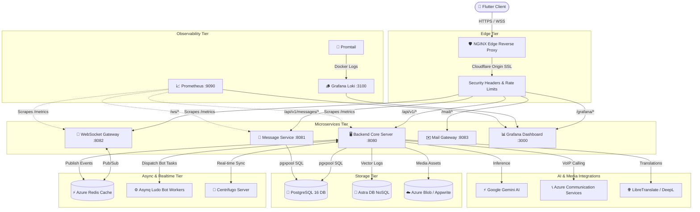
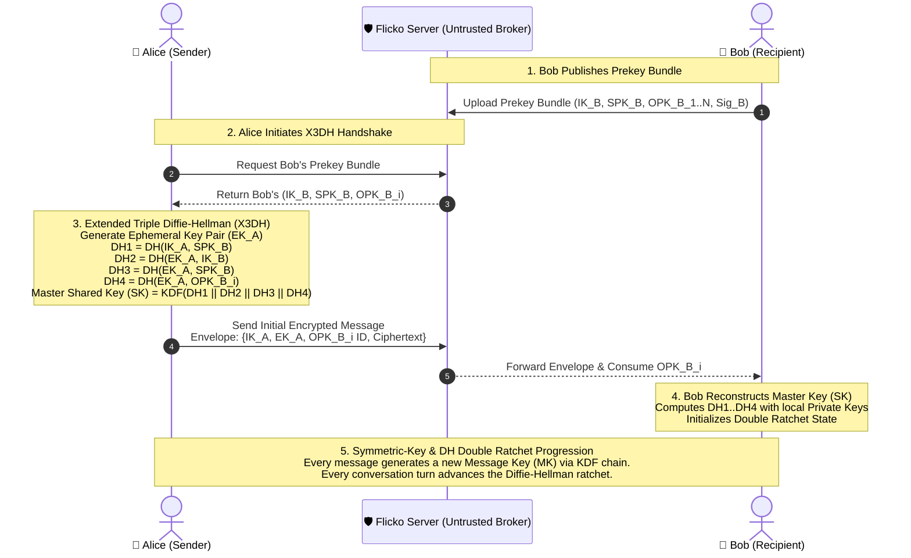

<div align="center">

  

  <br/><br/>

  <h1>Flicko</h1>
  <p><strong>Next-Generation Real-Time Communication, Multimedia Collaboration & Gaming Platform</strong></p>

  <p>
    <a href="https://golang.org"></a>
    <a href="https://flutter.dev"></a>
    <a href="https://www.postgresql.org"></a>
    <a href="https://redis.io"></a>
    <a href="https://www.docker.com"></a>
    <a href="LICENSE"></a>
  </p>

  <p align="center">
    <a href="#-project-overview"><b>Overview</b></a> •
    <a href="#-key-features"><b>Features</b></a> •
    <a href="#-tech-stack"><b>Tech Stack</b></a> •
    <a href="#-system-architecture"><b>Architecture</b></a> •
    <a href="#-security-architecture--cryptographic-threat-model"><b>Security</b></a> •
    <a href="#-project-structure"><b>Project Structure</b></a> •
    <a href="#-installation--setup"><b>Setup</b></a> •
    <a href="#-api-documentation"><b>API Docs</b></a> •
    <a href="#-engineering-decisions"><b>Decisions</b></a> •
    <a href="#-testing--quality-assurance"><b>Testing</b></a> •
    <a href="#-limitations--future-roadmap"><b>Roadmap</b></a>
  </p>

  <hr />

</div>

## 📖 Project Overview

**Flicko** is a high-performance, real-time multimedia communication, social collaboration, and gaming ecosystem designed from the ground up for modern cross-platform experiences. Inspired by the flexibility of Discord, the security of Signal, and the interactivity of modern streaming and gaming hubs, Flicko unifies voice/video channels, end-to-end encrypted direct messaging, synchronized collaborative activities, turn-based multiplayer games, full-fidelity music streaming, autonomous AI assistance, and an extensible bot platform into a cohesive, production-grade application.

The platform is engineered around a **high-throughput, distributed microservices backend written in Go** and a **responsive, fluid cross-platform client built with Flutter (Dart)**. It leverages strict Row-Level Security (RLS) in PostgreSQL, low-latency pub/sub via Redis and Centrifugo, WebRTC and Azure Communication Services (ACS) for VoIP, and an intelligent AI pipeline powered by Google Gemini (Gemini 2.5 Flash) and DeepL.

```
                  ┌─────────────────────────────────────────────────────────┐
                  │                      FLICKO CLIENT                      │
                  │   Flutter 3.x (iOS / Android / Desktop / Web)           │
                  └────────────┬──────────────────────────────┬──────────────┘
                               │ HTTPS / REST                 │ WSS (Gateway / Centrifugo)
                               ▼                              ▼
                  ┌─────────────────────────────────────────────────────────┐
                  │               EDGE / REVERSE PROXY (NGINX)              │
                  │   Cloudflare Origin TLS • WAF • Rate Limiting • Security │
                  └────────────┬──────────────────────────────┬──────────────┘
                               │                              │
         ┌─────────────────────┼──────────────────────────────┼─────────────────────┐
         ▼                     ▼                              ▼                     ▼
┌──────────────────┐  ┌──────────────────┐  ┌──────────────────┐  ┌──────────────────┐
│   CORE BACKEND   │  │   MSG-SERVICE    │  │    WS-GATEWAY    │  │   MAIL-GATEWAY   │
│   (Go REST API)  │  │ (Stateless CRUD) │  │  (Conn Manager)  │  │  (SMTP & Queues) │
└────────┬─────────┘  └────────┬─────────┘  └────────┬─────────┘  └────────┬─────────┘
         │                     │                     │                     │
         └─────────────────────┼─────────────────────┴─────────────────────┘
                               │
            ┌──────────────────┴──────────────────┐
            ▼                                     ▼
┌───────────────────────────────┐     ┌───────────────────────────────┐
│     PRIMARY PERSISTENCE       │     │     REALTIME & CACHE TIER     │
│  • PostgreSQL 16 (Azure / RLS)│     │  • Azure Redis / Redis 7      │
│  • Astra DB (NoSQL Vector)    │     │  • Centrifugo Pub/Sub Engine  │
│  • Azure Blob / Appwrite      │     │  • Asynq Task Worker Queue    │
└───────────────────────────────┘     └───────────────────────────────┘
```

---

## ✨ Key Features

### 1. 💬 Real-Time Guilds & Rich Messaging
* **Hierarchical Server Architecture**: Multi-tenant servers (guilds) with configurable categories, custom roles, permission inheritance, channel-level permission overwrites, and join screening rules.
* **Specialized Channel Types**: Text channels, Voice rooms, Stage channels (with hand-raising and speaker management), Forum post threads with upvoting, and Announcement channels with cross-server publishing.
* **Rich Text & Media Engine**: Markdown formatting, custom & animated emoji packs, sticker library, multi-file attachments with presigned upload workflows, inline link embeds, message pinning, replies, and reactions.
* **Operational Control**: Bulk message purge, member timeouts, audit logging, and typing indicators.

### 2. 🔐 End-to-End Encrypted (E2EE) Direct Messaging
* **Signal Protocol Implementation**: Built with Extended Triple Diffie-Hellman (**X3DH**) key agreement and the **Double Ratchet** algorithm.
* **Cryptographic Identity Management**: Device-specific identity keys, signed prekeys, one-time prekey replenishment pools, and cryptographic attestations.
* **Multi-Device Synchronization**: Per-device message envelope routing (`dm_envelopes_per_device`), cryptographic backup chunking, escrow policies, and secure device-to-device session handoffs.
* **Voice/Video SFU E2EE**: Key exchange endpoints for end-to-end encrypted selective forwarding unit channels.

### 3. 🎙️ High-Fidelity Voice, Video & VoIP
* **VoIP & WebRTC Media Engine**: Powered by Azure Communication Services (ACS) and WebRTC for crystal-clear, low-latency 1-on-1 and group voice/video calling.
* **Screen Sharing & Audio Routing**: Hardware-accelerated screen casting, dynamic audio ducking, background foreground tasks (`flutter_foreground_task`), and audio session management.
* **Integrated Soundboard**: Real-time sound clip playback with MyInstants directory integration, custom sound upload, and multi-user low-latency audio broadcasting.

### 4. 🧠 Autonomous Aura AI Suite
* **Aura Interactive Companion**: Multimodal AI conversational partner powered by Google Gemini (Gemini 2.5 Flash / 2.0 Flash) with Deepgram speech-to-text and text-to-speech audio streaming.
* **Catch-Me-Up (AI Message Summarization)**: Token-budgeted, rolling-window conversation summarization powered by Google Gemini that catches users up on missed messages across active channels.
* **AI Auto-Translation**: On-the-fly multi-language channel message translation powered by LibreTranslate and DeepL fallback.
* **AI Content Moderation**: Real-time message safety analysis powered by Google Gemini, automatically filtering toxic content, hate speech, and harassment.
* **NoSQL Vector History**: Chat histories and context vectors persisted to DataStax Astra DB.

### 5. 🎮 Native Gaming Hub & Multiplayer Ludo
* **Deterministic Game Engine**: Turn-based, server-authoritative multiplayer Ludo engine with dice roll validation, safe-zone collision handling, and pile capturing mechanics.
* **Asynq Bot AI Workers**: Automated computer opponents executed asynchronously via Asynq Redis workers for non-blocking move computation.
* **Matchmaking & Competitive Ladder**: Real-time matchmaking queue, Elo rating calculations, per-server leaderboards, and detailed user match analytics.

### 6. 🎵 Sonic Music Streaming & Synchronized Activities
* **Sonic Music Player**: High-fidelity YouTube Explode audio streaming with synced lyric scrolling (`flutter_lyric`), ID3 metadata tag editing (`metadata_god`, `audiotagger`), offline caching, and playlist management.
* **Watch Together**: Synchronized video playback rooms with state replication (`play`, `pause`, `seek`) across all participating users.
* **Music Party**: Communal listening rooms where all channel members enjoy synchronized audio queues.
* **Collaborative Canvas**: Real-time multi-user drawing and whiteboarding sessions.

### 7. 🤖 Extensible Bot Ecosystem & Developer Platform
* **8 Built-in Core Bots**:
  * 🛡️ `Moderation Bot`: Kick, ban, timeout, and warning management.
  * ⚙️ `AutoMod Bot`: Regex filtering, spam prevention, and automated infractions.
  * 👋 `Welcome Bot`: Customizable join/leave greetings and autorole assignment.
  * 🏆 `Leveling Bot`: Non-linear XP curve mathematical models, rank cards, and level-up rewards.
  * 🎶 `Music Bot`: Queue management, voice channel audio playback, and track skipping.
  * 🎫 `Ticket Bot`: Support ticket channel generation, claim workflows, and transcript logging.
  * 📊 `Poll Bot`: Multi-option interactive voting and live percentage tallying.
  * ⭐ `Starboard Bot`: Community-curated message highlight feeds based on reaction thresholds.
* **External Bot Platform**: Custom bot application registry, OAuth2 bot authorization, shard coordinator, slash command router (`/commands/invoke`), and Gateway WebSocket event streaming.

### 8. 💎 Monetization, Store & Gamification
* **Server Boosting**: Multi-tiered guild perks, boost badges, and custom server boost credit allocation.
* **Razorpay Payment Integration**: End-to-end checkout orders, signature verification, and automated billing receipts.
* **Cosmetics & Personalization**: Kinetic animated nameplates, custom avatar decorations, entrance warp drip animations, voice skins, cosmetic fusion, and gacha unboxing.

### 9. 🛡️ Enterprise Security & Privacy Controls
* **MFA (Multi-Factor Authentication)**: TOTP enrollment with QR code generation and emergency backup codes.
* **Session & Device Auditing**: Trusted device inspection, remote revocation, and IP-geo login tracking.
* **GDPR Compliance**: Asynchronous data export packaging and scheduled account deletion pipelines.
* **Defense-in-Depth Protection**: Distributed sliding-window Redis rate limiting, strict auth throttlers, SSRF validation guards, XSS input sanitizers, CSRF mitigation, and Slowloris request timeouts.

---

## 🛠️ Tech Stack

### Client Layer (Mobile / Desktop / Web)
| Category | Technology | Description |
| :--- | :--- | :--- |
| **Framework** | Flutter 3.3+ / Dart 3.3+ | Multiplatform UI engine compiling to native ARM64/x86_64 and Web |
| **State Management** | Flutter Riverpod 3.x / Code Gen | Reactive dependency injection and declarative state containers |
| **Navigation** | GoRouter 17.x | Declarative, URL-driven routing with auth redirection guards |
| **Networking** | Dio 5.x & Http 1.2+ | Interceptor-driven HTTP client with retry logic and telemetry |
| **Realtime Pub/Sub** | Centrifuge Dart & WebSockets | Binary/JSON WebSocket streaming for gaming, chat, and presence |
| **Media & Audio** | Just Audio, Audio Service, WebRTC | Low-latency audio playback, background audio service, and WebRTC calling |
| **Local Storage** | SQLite with SQLCipher & Secure Storage | AES-256 encrypted local persistence and keychain storage |
| **Crash & Tracing** | Sentry Flutter 9.x | Real-time crash diagnostics and performance tracing |

### Backend Microservices Layer
| Service / Component | Technology | Description |
| :--- | :--- | :--- |
| **Core Backend (`backend`)** | Go 1.25, Gorilla Mux | Monolithic control plane: Auth, Guilds, Bots, Gaming Hub, AI, E2EE |
| **Message Service (`msg-service`)** | Go 1.25, pgx/v5 | High-throughput stateless message CRUD, CDC indexing, and channel operations |
| **WebSocket Gateway (`ws-gateway`)** | Go 1.25, Gorilla WS | Scalable connection manager handling client presence and event fanout |
| **Mail Gateway (`mail-gateway`)** | Go 1.25, SMTP | Microservice for asynchronous transactional email delivery |
| **Background Jobs (`jobs`)** | Go 1.25, Asynq | Cron cleanup workers, email batches, and analytical aggregators |
| **Asynchronous Queues** | Asynq (Redis-backed) | Distributed queue for Ludo bot AI calculations and background processing |
| **Logging & Metrics** | Uber Zap, OpenTelemetry, Prometheus | Structured JSON logging, OTLP distributed traces, and Prometheus metrics |

### Data, Cache & Cloud Services
| Tier | Technology | Description |
| :--- | :--- | :--- |
| **Primary Relational DB** | PostgreSQL 16+ (Azure Database) | Master transactional store with strict Row-Level Security (RLS) policies |
| **In-Memory Cache & Pub/Sub** | Redis 7+ (Azure Cache for Redis) | Distributed session caching, rate-limit buckets, and internal event pub/sub |
| **NoSQL / Vector Store** | DataStax Astra DB | Scalable Cassandra-based vector store for Aura AI conversation histories |
| **Media & Blob Storage** | Azure Blob Storage / Appwrite Storage | Media asset storage, audio hosting, and presigned direct uploads |
| **AI Inference Engines** | Google Gemini (2.5-Flash / 2.0-Flash) | High-speed multimodal cloud inference for Aura AI, summaries & moderation |
| **Localization** | Tolgee (Self-hosted) | Centralized i18n translation key management |

---

## 🏛️ System Architecture

Flicko adopts a hybrid microservice architecture balancing high-throughput stateless operations with low-latency stateful gateway connections.

### High-Level Topology



### Gateway Protocol Frame Format

All communication across the WebSocket gateway follows a standardized JSON frame envelope:

```json
{
  "op": 0,
  "d": {
    "id": "01JMZ1234567890ABCDEF",
    "channel_id": "8923471029384712",
    "author_id": "3847102938471029",
    "content": "Hello Flicko! 🚀",
    "nonce": "c4ca4238a0b92382",
    "timestamp": 1771680000000
  },
  "s": 42,
  "t": "MESSAGE_CREATE",
  "n": "c4ca4238a0b92382",
  "traceparent": "00-4bf92f3577b34da6a3ce929d0e0e4736-00f067aa0ba902b7-01"
}
```

* **`op` (OpCode)**: Operation code (`0` Dispatch, `1` Heartbeat, `2` Identify, `3` PresenceUpdate, `4` TypingStart, `5` MessageCreate, `6` MessageAck, `7` Error, `8` ChannelSub, `9` ChannelUnsub, `10` Ready).
* **`d` (Data)**: The contextual event payload.
* **`s` (Sequence)**: Monotonically increasing sequence number for session resumptions.
* **`t` (Type)**: Named dispatch event string identifier.
* **`n` (Nonce)**: Client-generated idempotency key echoed back on acknowledgement.
* **`traceparent`**: W3C distributed tracing context header.

---

## 🔐 Security Architecture & Cryptographic Threat Model

Flicko is built upon a **zero-trust security paradigm** designed to protect user privacy against untrusted networks, database compromises, and server memory introspection.

### 1. Signal Protocol Implementation (X3DH & Double Ratchet)

Direct 1-on-1 conversations operate strictly under the **Signal Protocol specification**, providing **End-to-End Encryption (E2EE)** with **Forward Secrecy (FS)** and **Post-Compromise Security (PCS)**.



#### Cryptographic Primitives
* **Identity & Curve**: Curve25519 (X25519 for Diffie-Hellman key exchange, Ed25519 for digital signatures).
* **Key Derivation Function**: HKDF-SHA256 with domain-separated salt and info parameters.
* **Symmetric Encryption**: AES-256-GCM (and ChaCha20-Poly1305 fallback) with 12-byte random nonces and 16-byte authentication tags.
* **Forward Secrecy**: Message keys (`MK`) are discarded immediately after message encryption/decryption and cannot be reconstructed from subsequent keys.

---

### 2. PostgreSQL Row-Level Security (RLS) Policy Matrix

Flicko enforces database-level authorization directly within PostgreSQL via Row-Level Security. Even if an application bug bypasses API middleware, the database engine prevents unauthorized data access:

| Table | Operation | Policy Definition (`USING` / `WITH CHECK`) | Security Invariant |
| :--- | :--- | :--- | :--- |
| `users` | `SELECT` | `true` (Public profiles) | Anyone can view basic user cards |
| `users` | `UPDATE` | `auth.uid() = id` | Users can only modify their own profile |
| `guilds` | `SELECT` | `EXISTS (SELECT 1 FROM guild_members WHERE guild_id = id AND user_id = auth.uid())` | Server metadata hidden from non-members |
| `guild_members` | `ALL` | `guild_id IN (SELECT guild_id FROM guild_members WHERE user_id = auth.uid())` | Membership lists restricted to fellow guild members |
| `channels` | `SELECT` | `EXISTS (SELECT 1 FROM guild_members WHERE guild_id = channels.guild_id AND user_id = auth.uid()) AND has_channel_permission(id, auth.uid(), 'VIEW_CHANNEL')` | Channels hidden unless user has explicit `VIEW_CHANNEL` permission |
| `messages` | `SELECT` | `has_channel_permission(channel_id, auth.uid(), 'READ_MESSAGE_HISTORY')` | Message history restricted by channel read permissions |
| `messages` | `INSERT` | `has_channel_permission(channel_id, auth.uid(), 'SEND_MESSAGES') AND author_id = auth.uid()` | Prevents message spoofing and posting to locked channels |
| `messages` | `UPDATE/DELETE` | `author_id = auth.uid() OR has_guild_permission(guild_id, auth.uid(), 'MANAGE_MESSAGES')` | Only authors or guild moderators can edit/delete messages |
| `direct_messages` | `SELECT/INSERT` | `auth.uid() IN (sender_id, recipient_id)` | E2EE metadata strictly isolated to the two conversation participants |
| `e2ee_prekeys` | `SELECT` | `true` (Public prekey bundles only) | Allows initiating X3DH sessions |
| `e2ee_prekeys` | `INSERT/UPDATE` | `user_id = auth.uid()` | Users can only manage their own prekey pool |

---

### 3. Secret Zeroization & Cryptographic Memory Protection

To mitigate vulnerabilities arising from memory scraping, core dumps, or unauthorized process inspection:

```
┌─────────────────────────────────────────────────────────────────────────────┐
│                    IN-MEMORY SECRET LIFECYCLE MANAGEMENT                    │
├──────────────────────────┬──────────────────────────────────────────────────┤
│ Mechanism                │ Implementation & Protection Rationale            │
├──────────────────────────┼──────────────────────────────────────────────────┤
│ Constant-Time Zeroization│ Sensitive byte slices (decrypted plaintexts,     │
│                          │ ephemeral ratchet keys, master encryption keys)  │
│                          │ are zeroized in memory immediately after use     │
│                          │ using `subtle.ConstantTimeCopy` / explicit wipes.│
├──────────────────────────┼──────────────────────────────────────────────────┤
│ Key ID Rotation Prefix   │ Master encryption keys are identified by a       │
│ (`ENCRYPTION_KEY`)       │ SHA-256 key prefix (`keyIDHex`). Allows seamless │
│                          │ re-encryption without service downtime.          │
├──────────────────────────┼──────────────────────────────────────────────────┤
│ Short-Lived Access Tokens│ JWT access tokens expire strictly in 15 minutes. │
│                          │ Refresh tokens are hashed and stored in Redis    │
│                          │ with an immediate revocation blacklist on logout.│
├──────────────────────────┼──────────────────────────────────────────────────┤
│ Timing-Attack Immunity   │ All cryptographic verification steps (HMAC,      │
│                          │ token comparisons, password hashes via Argon2id) │
│                          │ strictly use `crypto/subtle.ConstantTimeCompare`.│
└──────────────────────────┴──────────────────────────────────────────────────┘
```

---

## 📂 Project Structure

```
Flicko/
├── backend/                       # 🖥️ Core Go Backend Application
│   ├── cmd/
│   │   ├── eval-summary/          # AI summary evaluation scripts
│   │   └── server/                # Main application entry point (main.go)
│   ├── internal/
│   │   ├── activities/            # Watch Together & Music Party domain engines
│   │   ├── bots/                  # 8 Built-in Bots, Gateway, & Sharding Coordinator
│   │   ├── cache/                 # Redis client & cache wrappers
│   │   ├── commands/              # Slash command registry and router
│   │   ├── config/                # Environment configuration loader
│   │   ├── database/              # PostgreSQL & Astra DB client pools
│   │   ├── events/                # Internal EventBus, Postgres LISTEN/NOTIFY bridge
│   │   ├── gaming/                # Turn-based game modules & coordinator
│   │   ├── handlers/              # HTTP REST handlers (Auth, E2EE, Bots, AI, etc.)
│   │   ├── middleware/            # Rate limiting, Auth, CSRF, SSRF, XSS sanitizers
│   │   ├── models/                # Domain entity structs & DTOs
│   │   ├── repo/                  # Database repository access layer
│   │   ├── services/              # Business logic (E2EE, Audio, AI, Channels, etc.)
│   │   ├── storage/               # Azure Blob Storage & Appwrite connectors
│   │   └── telemetry/             # OpenTelemetry tracer initialization
│   ├── migrations/                # Database SQL migration scripts (001 to 082)
│   ├── Dockerfile                 # Production Go container image
│   └── go.mod                     # Go backend dependencies
│
├── services/                      # 📦 Monorepo Go Microservices
│   ├── ws-gateway/                # WebSocket Connection Manager (:8080)
│   │   ├── cmd/gateway/           # WS gateway entry point
│   │   └── internal/              # Connection pools, forwarder, pubsub
│   ├── msg-service/               # Stateless REST Message Service (:8081)
│   │   ├── cmd/server/            # Message service entry point
│   │   └── internal/              # Batcher, abuse detection, search, repo
│   ├── jobs/                      # Background task workers (Asynq / Cron)
│   ├── shared/                    # Common Go packages (Auth, Protocol, Redis, Logger)
│   └── Makefile                   # Build, test, and vet automation for services
│
├── mobile/                        # 📱 Flutter Cross-Platform Client
│   ├── lib/
│   │   ├── core/                  # Configuration, theme, router, errors, services
│   │   │   ├── config/            # App environment variables & base URLs
│   │   │   ├── constants/         # Flicko color tokens, asset constants
│   │   │   ├── router/            # GoRouter configuration & route definitions
│   │   │   ├── services/          # Audio, Presence, Notification, Haptics services
│   │   │   └── theme/             # Modern Dark & Light Discord/Glassmorphism theme
│   │   ├── data/                  # Dio/HTTP clients, repository implementations
│   │   ├── features/              # Feature-First Modular Clean Architecture
│   │   │   ├── activities/        # Watch Together & Music Party screens
│   │   │   ├── ai_assistant/      # Aura AI chat, voice interface, and summary
│   │   │   ├── auth/              # Login, register, MFA, password reset screens
│   │   │   ├── calling/           # WebRTC / Azure ACS VoIP voice & video calls
│   │   │   ├── direct_messages/   # 1-on-1 DMs and Group DM chat interfaces
│   │   │   ├── e2ee/              # Cryptographic key verification and settings
│   │   │   ├── gaming/ & ludo/    # Multiplayer Ludo board, animations, and matchmaking
│   │   │   ├── server/            # Guild creation, discovery, member management
│   │   │   ├── server_channels/   # Chat, Voice, Stage, Forum, and Thread screens
│   │   │   ├── server_settings/   # Roles, Audit log, AutoMod, Bots, Webhooks
│   │   │   ├── sonic_music/       # Full music streaming player, lyrics, playlists
│   │   │   └── store/             # Cosmetics, Nameplates, Avatars, Razorpay Billing
│   │   └── main.dart              # Flutter application entry point
│   ├── android/                   # Android native configuration (Gradle, Manifest)
│   ├── ios/                       # iOS native configuration (Xcode, Info.plist)
│   ├── integration_test/          # Patrol & E2E integration test suites
│   ├── test/                      # Unit & Widget test suites
│   └── pubspec.yaml               # Flutter package dependencies
│
├── mail-gateway/                  # ✉️ Transactional Email Microservice
│   ├── cmd/server/                # Mail-gateway entry point
│   ├── internal/                  # SMTP client, queue worker, auth middleware
│   ├── templates/                 # Discord-styled responsive HTML email templates
│   └── Dockerfile                 # Mail gateway container image
│
├── nginx/                         # 🛡️ Edge Reverse Proxy & TLS Configuration
│   ├── conf.d/                    # Virtual host configurations & upstream mappings
│   └── nginx.conf                 # Master NGINX server block & caching rules
│
├── monitoring/                    # 📊 Observability & Monitoring Configs
│   ├── grafana/                   # Pre-provisioned dashboards & datasources
│   ├── prometheus.yml             # Prometheus scraping targets & intervals
│   ├── alerts.yml                 # Alertmanager firing rules
│   ├── loki-config.yml            # Grafana Loki log aggregation config
│   └── promtail-config.yml        # Docker log scraping agent config
│
├── scripts/                       # 🚀 DevOps, Maintenance & Automation Scripts
│   ├── dev-start.sh               # Local development bootstrapper
│   ├── deploy.sh                  # Production deployment workflow
│   ├── check-health.sh            # End-to-end service health verification
│   ├── generate-jwt-keys.sh       # Ed25519 cryptographic key generator
│   └── k6-load-test.js            # k6 performance & stress testing scenarios
│
├── docker-compose.dev.yml         # Local development support services (Redis, Prometheus, Meili)
├── docker-compose.prod.yml        # Full production stack compose specification
├── setup.sh                       # Interactive terminal setup wizard
├── start-dev.sh                   # Rapid local background process starter
└── stop-dev.sh                    # Clean teardown script for background processes
```

---

## 🚀 Installation & Setup

### Prerequisites
* **Go**: `1.22+` (Go `1.25` recommended)
* **Flutter SDK**: `3.3.0+`
* **Docker & Docker Compose**: `v2.20+`
* **PostgreSQL**: `16+`
* **Redis**: `7.0+`
* **Make / Bash**: For service compilation and running dev scripts

---

### Method 1: Automated Interactive Wizard (Recommended)

Run the built-in, rich interactive setup wizard:

```bash
chmod +x setup.sh
./setup.sh
```

The setup script checks required binaries, configures environment keys, prepares database connections, and verifies system dependencies.

---

### Method 2: Manual Local Development Setup

#### 1. Configure Environment
Copy the example environment template and configure secrets:

```bash
cp .env.example .env
```

Generate secure encryption and JWT keys:
```bash
# Generate 32-byte (64 hex characters) ENCRYPTION_KEY
openssl rand -hex 32

# Generate Ed25519 JWT key pair (if using asymmetric JWTs)
chmod +x scripts/generate-jwt-keys.sh
./scripts/generate-jwt-keys.sh
```

#### 2. Start Supporting Infrastructure
Launch Redis, Prometheus, Meilisearch, and Grafana using the development compose file:

```bash
docker compose -f docker-compose.dev.yml up -d
```

#### 3. Build & Launch Backend Services
You can start all Go services simultaneously using `start-dev.sh`:

```bash
chmod +x start-dev.sh stop-dev.sh
./start-dev.sh
```

Alternatively, build and run them individually:
```bash
# Build microservices
cd services && make build && cd ..

# Run Main Backend
cd backend && go run ./cmd/server/main.go

# Run WebSocket Gateway (in a separate terminal)
cd services/ws-gateway && go run ./cmd/gateway/main.go

# Run Message Service (in a separate terminal)
cd services/msg-service && go run ./cmd/server/main.go
```

#### 4. Run the Flutter Mobile App
Navigate to the `mobile` directory, fetch packages, and start the app on your emulator or physical device:

```bash
cd mobile

# Fetch Flutter dependencies
flutter pub get

# Generate freezed & riverpod models (if needed)
dart run build_runner build --delete-conflicting-outputs

# Start the mobile client
flutter run
```

---

### Method 3: Production Deployment (Docker Compose)

The production configuration runs behind NGINX with three isolated bridge networks (`flicko_edge`, `flicko_internal`, `flicko_monitor`), enforcing resource constraints and health checks:

```bash
# 1. Prepare production environment
cp .env.production.example .env.prod

# 2. Build and start containers
docker compose -f docker-compose.prod.yml up -d --build

# 3. Verify health across all nodes
./scripts/check-health.sh
```

---

## 📡 API Documentation

All REST routes are prefixed with `/api/v1`. Authenticated endpoints require a standard `Authorization: Bearer <jwt_token>` header.

### 1. Authentication & Security (`/api/v1/auth`)
| Method | Endpoint | Description | Auth Required |
| :--- | :--- | :--- | :--- |
| `POST` | `/auth/register` | Register a new user account with email & password | No |
| `POST` | `/auth/login` | Authenticate user and receive JWT access token | No |
| `POST` | `/auth/entra-id` | Microsoft Entra ID SSO login | No |
| `POST` | `/auth/verify-email` | Verify email address using token | No |
| `POST` | `/auth/mfa/enroll` | Initialize TOTP 2FA enrollment (returns QR secret) | **Yes** |
| `POST` | `/auth/mfa/verify` | Confirm TOTP code and enable MFA | **Yes** |
| `POST` | `/auth/mfa/disable` | Disable MFA using password or backup code | **Yes** |
| `GET` | `/auth/devices` | List all active trusted devices | **Yes** |
| `DELETE`| `/auth/devices/{id}`| Revoke a specific trusted device session | **Yes** |

### 2. End-to-End Encryption (`/api/v1/e2ee`)
| Method | Endpoint | Description | Auth Required |
| :--- | :--- | :--- | :--- |
| `PUT` | `/e2ee/identity` | Register or update device Identity Key | **Yes** |
| `GET` | `/e2ee/bundle/{userId}` | Fetch X3DH cryptographic prekey bundle for a user | **Yes** |
| `PUT` | `/e2ee/signed-prekey` | Publish a newly signed prekey | **Yes** |
| `PUT` | `/e2ee/one-time-prekeys`| Upload a batch of one-time prekeys | **Yes** |
| `POST` | `/e2ee/envelopes` | Push encrypted Double Ratchet message envelope | **Yes** |
| `POST` | `/e2ee/envelopes/pull` | Pull pending encrypted envelopes for device | **Yes** |
| `POST` | `/e2ee/sfu/key-exchange`| Exchange voice/video SFU group session keys | **Yes** |

### 3. AI Suite & Aura Assistant (`/api/v1/aura`, `/api/v1/ai`)
| Method | Endpoint | Description | Auth Required |
| :--- | :--- | :--- | :--- |
| `POST` | `/aura/chat` | Send conversational prompt to Aura Assistant | **Yes** |
| `POST` | `/aura/tts` | Convert text to speech audio stream | **Yes** |
| `GET` | `/aura/gifs` | Fetch context-aware GIF suggestions | **Yes** |
| `POST` | `/channels/{id}/summary`| Generate token-budgeted channel Catch-Me-Up summary | **Yes** |
| `POST` | `/messages/{id}/translate`| Translate message to user's target locale | **Yes** |

### 4. Activities & Gaming Hub (`/api/v1/activities`, `/api/v1/game`)
| Method | Endpoint | Description | Auth Required |
| :--- | :--- | :--- | :--- |
| `GET` | `/activities/catalog` | List all available interactive activities | **Yes** |
| `POST` | `/activities/launch` | Launch a new Watch Together / Music Party session | **Yes** |
| `POST` | `/activities/{id}/sync/play`| Broadcast synchronized media play state | **Yes** |
| `POST` | `/activities/{id}/sync/seek`| Broadcast synchronized media seek timestamp | **Yes** |
| `POST` | `/game/ludo/create` | Initialize a multiplayer Ludo game room | **Yes** |
| `POST` | `/game/ludo/roll` | Execute server-validated dice roll | **Yes** |
| `POST` | `/game/ludo/move` | Execute piece movement across board | **Yes** |
| `GET` | `/game/stats/{userId}` | Retrieve user Elo ratings and game statistics | **Yes** |

### 5. Bot Platform & Developer API (`/api/v1/applications`, `/api/v1/commands`)
| Method | Endpoint | Description | Auth Required |
| :--- | :--- | :--- | :--- |
| `POST` | `/applications` | Create a new developer bot application | **Yes** |
| `GET` | `/applications` | List registered developer applications | **Yes** |
| `POST` | `/applications/{id}/bot/reset-token` | Reset bot token | **Yes** |
| `GET` | `/commands` | List registered global slash commands | **Yes** |
| `POST` | `/commands/invoke` | Execute a slash command invocation | **Yes** |
| `GET` | `/gateway/bot` | Gateway shard recommendation endpoint | **Yes** |

### 6. Creator Economy & Billing (`/api/v1/creator`, `/api/v1/premium`)
| Method | Endpoint | Description | Auth Required |
| :--- | :--- | :--- | :--- |
| `POST` | `/creator/posts` | Create a creator community post | **Yes** |
| `GET` | `/creator/feed` | Fetch algorithmic creator feed | **Yes** |
| `POST` | `/premium/orders` | Create a Razorpay checkout order | **Yes** |
| `POST` | `/premium/verify` | Verify Razorpay payment signature | **Yes** |
| `GET` | `/premium/cosmetics` | Browse cosmetic shop catalog | **Yes** |
| `POST` | `/profile/cosmetics/apply`| Equip avatar decoration / kinetic nameplate | **Yes** |

---

## 💡 Engineering Decisions

```
┌──────────────────────────────────────────────────────────────────────────────────┐
│                           KEY ARCHITECTURAL DECISIONS                            │
├───────────────────────┬──────────────────────────────────────────────────────────┤
│ Choice                │ Rationale & Impact                                       │
├───────────────────────┼──────────────────────────────────────────────────────────┤
│ Go for Microservices  │ Low memory footprint (~150MB per service), goroutine-per-│
│                       │ connection concurrency model, and sub-millisecond JSON   │
│                       │ serialization latency at thousands of CCU.               │
├───────────────────────┼──────────────────────────────────────────────────────────┤
│ Flutter Client        │ Single shared codebase for iOS, Android, Desktop, & Web; │
│                       │ custom Skia/Impeller canvas rendering for complex games  │
│                       │ (Ludo) and smooth 120 FPS animations without bridge lag. │
├───────────────────────┼──────────────────────────────────────────────────────────┤
│ Multi-Tier Database   │ PostgreSQL handles relational ACID transactions and RLS; │
│                       │ Redis handles high-frequency ephemeral presence & limits;│
│                       │ Astra DB handles scalable vector history logs.           │
├───────────────────────┼──────────────────────────────────────────────────────────┤
│ Signal E2EE Protocol  │ Eliminates server-side trust for DMs; ensures forward    │
│ (X3DH + DoubleRatchet)│ secrecy and break-in recovery with per-device key states.│
├───────────────────────┼──────────────────────────────────────────────────────────┤
│ Google Gemini AI      │ Scalable multimodal AI using Gemini 2.5 Flash for rapid  │
│ (Gemini 2.5 Flash)    │ unread message summarization, Aura companion, and safety │
│                       │ content moderation with high token efficiency.           │
└───────────────────────┴──────────────────────────────────────────────────────────┘
```

1. **Decoupled WebSocket Gateway (`ws-gateway`) & REST Layer (`msg-service`)**:
   * Holding tens of thousands of long-lived WebSocket connections requires memory optimization (minimizing buffer allocations), whereas REST CRUD requires CPU optimization (JSON serialization and database queries). Decoupling these ensures that high REST traffic does not degrade WebSocket heartbeat connections.

2. **Distributed Redis Sliding-Window Rate Limiting**:
   * Instead of in-memory token buckets that reset on pod restarts or fail behind load balancers, rate limits use Redis atomic multi-key EVAL scripts across global API tiers with dedicated strict limits for security-critical endpoints (MFA, password resets, account deletion).

3. **Asynchronous Background Bot AI via Asynq Queues**:
   * To prevent heavy computer opponent calculations in Ludo from blocking HTTP request lifecycles, bot moves are scheduled as delayed tasks in Redis via Asynq and processed by dedicated background workers.

4. **Multi-Tier Network Isolation at the Docker Layer**:
   * Containers reside in dedicated bridge networks (`flicko_edge`, `flicko_internal`, `flicko_monitor`). Databases and backend services are inaccessible directly from the internet; only NGINX exposes ports 80 and 443.

---

## 🧪 Testing & Quality Assurance

Flicko includes automated test suites spanning Go unit/contract tests, Flutter widget/unit tests, and end-to-end integration tests.

### Running Backend Tests
Execute all unit and race condition tests across Go modules:

```bash
# Run tests across all microservices with the race detector
cd services
make test

# Run backend unit & integration tests
cd ../backend
go test -v -race -cover ./...
```

### Running Mobile Tests
Execute unit, widget, and mock verification tests:

```bash
cd mobile

# Run Flutter unit and widget tests
flutter test

# Run Patrol / Integration tests on a connected device
flutter test integration_test/app_launch_test.dart
```

### Security & Static Code Analysis
The codebase integrates security scanners and linting checks:
* **Gitleaks**: Secret leakage scanning (`.gitleaks.toml`).
* **GolangCI-Lint**: Go static code analysis (`.golangci.yml`).
* **OSV Scanner**: Dependency vulnerability audits (`.osv-scanner.toml`).
* **Prettier**: Consistent formatting across JSON, YAML, and Markdown.

---

## 🗺️ Limitations & Future Roadmap

### Current Limitations
* **SFU Group Call Scaling**: High-concurrency video conferences (>50 active video feeds in a single room) currently depend on external Azure ACS or LiveKit instances.
* **Full E2EE Group Channels**: E2EE is fully implemented for 1-on-1 direct messages and voice SFU key exchange; multi-member guild channels currently operate via standard TLS + database RLS.

### Future Roadmap

#### 🔐 Cryptography & Advanced Privacy
* [ ] **Messaging Layer Security (MLS)**: Implement the IETF MLS protocol (RFC 9420) for scalable, tree-based end-to-end encrypted multi-user group channels.
* [ ] **Post-Quantum Cryptography (PQC)**: Hybrid Kyber-1024 + X25519 key encapsulation (ML-KEM) to guarantee quantum-resistant E2EE forward secrecy.
* [ ] **Hardware Security Keys (WebAuthn / Passkeys)**: FIDO2-compliant biometric authentication and physical YubiKey MFA verification.

#### 🧠 Next-Gen AI & Multimodal Intelligence
* [ ] **Bidirectional Voice-to-Voice AI**: Real-time streaming conversational audio companion using Gemini 2.5 Flash Native Audio preview with sub-250ms voice latency.
* [ ] **Automated Stream Clipping & Video Highlights**: AI-assisted key moment detection, transcript extraction, and short-form video clip generation for gaming sessions.
* [ ] **Context-Aware Semantic Search**: Multi-modal vector search across voice transcripts, uploaded documents, and message attachments using Astra DB.

#### 🎮 Gaming Hub, Streaming & Rich Activities
* [ ] **Wasm Activity Sandbox**: Sandboxed WebAssembly runtime allowing third-party developers to publish embedded HTML5 games and interactive collaborative widgets.
* [ ] **Expanded Gaming Arcade (Chess, Uno, Poker)**: Deterministic, server-authoritative turn-based engines with matchmaking and global Elo leaderboards.
* [ ] **4K 60FPS Screen Sharing with System Audio**: Hardware-accelerated desktop/window screen sharing with low-latency synchronized stereo audio passthrough.
* [ ] **Spatial Audio Engine**: Directional 3D positional audio rendering in voice rooms based on virtual room seats and participant screen coordinates.

#### 🌐 Distributed Infrastructure & Federation
* [ ] **Decentralized Server Federation**: Optional Matrix / ActivityPub protocol bridge enabling cross-instance identity sync and decentralized messaging.
* [ ] **Multi-Region Geo-Replication**: Global read-replica database distribution with edge-routed WebSocket gateways for sub-20ms latency worldwide.
* [ ] **Open Bot Gateway API & Webhook SDK**: Public gRPC/REST Bot Gateway with granular OAuth2 bot scopes, ephemeral slash commands, and interactive UI components (Buttons, Select Menus, Modals).

#### 📱 Native Client Enhancements
* [ ] **Picture-in-Picture (PiP) & Floating Mini-Player**: Background video playback and active voice channel controls while navigating other apps on iOS, Android, and Desktop.
* [ ] **Global Push-to-Talk & Desktop System Tray**: System-wide customizable keyboard hotkeys, native OS menubar integrations, and hardware mute sync.

---

<div align="center">

  

  <br/><br/>

  <h3>Built with ❤️ by the Flicko Team</h3>

  <p>
    <a href="https://github.com/flicko-org"><b>GitHub</b></a> •
    <a href="https://flicko.dev"><b>Website</b></a> •
    <a href="https://flicko.dev/docs"><b>Documentation</b></a> •
    <a href="LICENSE"><b>MIT License</b></a>
  </p>

  <p><sub>© 2026 Flicko. All rights reserved.</sub></p>

</div>
