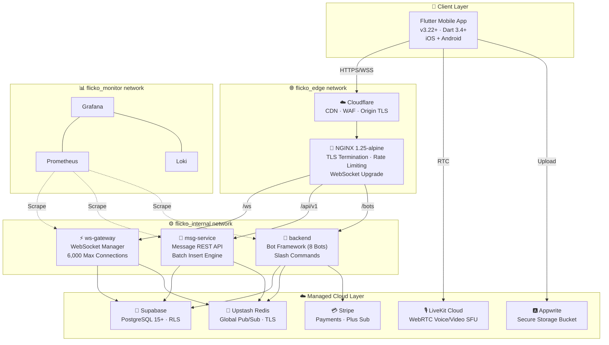

<p align="center">
  
</p>

<h1 align="center">Flicko</h1>

<p align="center">
  <strong>A full-featured, production-ready, open-source Discord alternative</strong>
  <br />
  <em>Real-time messaging · Voice & Video · Bot framework · Self-hostable on a single VPS</em>
</p>

<p align="center">
  
  
  
  
  
  
  
  
</p>

<p align="center">
  <a href="#-quick-start"><strong>Quick Start »</strong></a> ·
  <a href="docs/README.md"><strong>Full Docs »</strong></a> ·
  <a href="docs/architecture/system-overview.md"><strong>Architecture »</strong></a> ·
  <a href="docs/features/feature-index.md"><strong>Features »</strong></a> ·
  <a href="docs/CONTRIBUTING.md"><strong>Contributing »</strong></a>
</p>

---

<p align="center">
  
</p>

## 📖 Table of Contents

- [✨ What is Flicko?](#-what-is-flicko)
- [🏗️ System Architecture](#️-system-architecture)
- [🚀 Features](#-features)
- [⚡ Quick Start](#-quick-start)
- [🔒 Secrets & Environment Management](#-secrets--environment-management)
- [🛠️ Complete Tech Stack](#️-complete-tech-stack)
- [📁 Project Structure](#-project-structure)
- [🐳 Production Deployment](#-production-deployment)
- [🔒 Security Architecture](#-security-architecture)
- [📊 Monitoring & Observability](#-monitoring--observability)
- [🤖 Bot System Deep Dive](#-bot-system-deep-dive)
- [💾 Database Architecture](#-database-architecture)
- [🧪 Testing](#-testing)
- [📖 Documentation](#-documentation)
- [🤝 Contributing](#-contributing)
- [🎥 Demo](#-demo)
- [📊 Project Stats](#-project-stats)
- [📜 License](#-license)

---

## ✨ What is Flicko?

Flicko is a **complete, open-source communication platform** — think Discord, but fully self-hostable and built from scratch. It delivers a production-grade experience with real-time messaging over WebSockets, voice & video channels powered by LiveKit WebRTC, an extensible 8-bot moderation framework, direct messaging, rich media uploads via Appwrite Storage, server management with granular role-based permissions, and a premium subscription tier with Stripe integration.

The entire platform runs on a **single 8 GB VPS** serving **3,000–5,000 concurrent users**, orchestrated through Docker Compose with 10 containers across 3 isolated networks, monitored by a full Prometheus + Grafana + Loki observability stack.

> **This is not a toy project.** Flicko has **94 database migrations**, **95 core backend service files**, **86 production-ready screens**, **50+ Riverpod providers**, **45 Go unit test suites**, **26 granular permission types**, and **121 professionally written documentation files**. Every feature is fully implemented end-to-end, from mobile UI to database queries.

### Why Flicko?

| | Flicko | Discord | Revolt | Guilded |
|---|---|---|---|---|
| **Open Source** | ✅ MIT License | ❌ Proprietary | ✅ AGPL | ❌ Proprietary |
| **Self-Hostable** | ✅ Single VPS | ❌ | ✅ Complex setup | ❌ |
| **Mobile App** | ✅ Flutter (iOS + Android) | ✅ | ❌ Web only | ✅ |
| **Bot Framework** | ✅ 8 built-in bots | ❌ Third-party only | ❌ | ❌ |
| **Voice/Video** | ✅ LiveKit WebRTC | ✅ | ❌ | ✅ |
| **Media Storage** | ✅ Appwrite Storage | ❌ Proprietary | ✅ S3/Local | ❌ Proprietary |
| **Mod Tools** | ✅ AutoMod + Manual | ✅ | ⚠️ Basic | ✅ |
| **Single VPS Deploy** | ✅ 8 GB RAM | N/A | ⚠️ 16+ GB | N/A |
| **Secrets Management**| ✅ Doppler | ❌ | ❌ | ❌ |

---

Flicko follows a **microservices architecture** with three Go backend services, a Flutter mobile client, and managed cloud services: **Supabase** for database and auth, **Appwrite** for secure media storage, **Upstash** for global Redis pub/sub, and **LiveKit** for real-time WebRTC.



### ☁️ Managed Cloud Layer
Flicko leverages specialized cloud providers to ensure 99.9% availability and high performance:
- **Supabase**: Handles main PostgreSQL persistence, Auth (JWT), and the Edge Function gateway.
- **Appwrite Storage**: Our core media storage engine, chosen for its robust client-side SDK and secure bucket permissions. [See Setup](#-appwrite-storage-setup).
- **Upstash Redis**: Provides global state sync for WebSockets and distributed rate-limiting.
- **LiveKit Cloud**: Manages a global SFU network for low-latency voice and video channels.
- **Stripe**: Powers the Flicko Plus subscription engine and payment lifecycle.

#### 🅰️ Appwrite Storage Setup
To enable media uploads (images, voice notes, attachments):
1. **Project**: Create a project in [Appwrite Console](https://cloud.appwrite.io).
2. **Bucket**: Create a Storage Bucket with ID `flicko-media`.
3. **Permissions**: Enable "File Security" and grant `read` access to `Any` and `write` access to `users`.
4. **Environment**: Add `FLICKO_APPWRITE_PROJECT_ID`, `FLICKO_APPWRITE_ENDPOINT`, and `FLICKO_APPWRITE_BUCKET_ID` to your Doppler project or `.env` file.

### Why Three Services?

| Decision | Rationale |
|----------|-----------|
| **ws-gateway is separate** | Holds thousands of stateful WebSocket connections. REST API deployments don't drop active connections. Can be scaled independently based on concurrent user count. |
| **msg-service is separate** | Pure stateless REST API — horizontally scalable with `least_conn` load balancing. Batch insertion engine operates independently from real-time delivery. |
| **backend is monolithic** | Bot system uses in-process pub/sub event bus. Splitting 8 bots into microservices would add network overhead without benefit at this scale (< 10K users). |
| **Three Docker networks** | `flicko_edge` (internet-facing), `flicko_internal` (services, no internet), `flicko_monitor` (observability, no internet). Prevents lateral movement if a container is compromised. |

### Request Lifecycle

Every API request passes through **12 processing stages**:

```
Client → Cloudflare WAF → NGINX Rate Limit → Request ID → CORS →
Timeout (30s) → Body Limit (10MB) → Input Sanitization → CSRF Check →
Header Redaction → Redis Rate Limit → JWT Auth → Handler → Service → DB
```

---

## 🚀 Features

Flicko ships with **30+ fully implemented, production-quality features** across 7 domains:

### 💬 Communication

| Feature | Status | Implementation |
|---------|--------|---------------|
| **Real-time messaging** | ✅ | WebSocket via ws-gateway, Redis Pub/Sub fan-out |
| **Message editing & deletion** | ✅ | Soft-delete with `deleted_at`, edit history tracking |
| **Threads & replies** | ✅ | Parent message references, thread channels |
| **Typing indicators** | ✅ | Debounced WebSocket events with 8s timeout |
| **Read receipts** | ✅ | Per-user per-channel last-read tracking |
| **Reactions & emoji** | ✅ | Unicode + custom emoji, per-message reaction counts |
| **Message pinning** | ✅ | Pin/unpin with `MANAGE_MESSAGES` permission |
| **Message search** | ✅ | Full-text search with PostgreSQL `tsvector` |
| **GIF search** | ✅ | GIPHY API integration via Supabase Edge Function |
| **Polls** | ✅ | Multi-option polls with real-time vote updates |
| **Code blocks** | ✅ | Syntax highlighting in message renderer |

### 🎙️ Voice & Video

| Feature | Status | Implementation |
|---------|--------|---------------|
| **Voice channels** | ✅ | LiveKit WebRTC SFU with Opus codec |
| **Video chat** | ✅ | LiveKit video rooms with adaptive bitrate |
| **Screen sharing** | ✅ | Desktop/app sharing via LiveKit |
| **Push-to-talk** | ✅ | Client-side audio gating |
| **Voice activity detection** | ✅ | LiveKit VAD with speaking indicators |
| **DM voice/video calls** | ✅ | 1-on-1 calls via LiveKit |

### 🏰 Server Management

| Feature | Status | Implementation |
|---------|--------|---------------|
| **Server CRUD** | ✅ | Create, edit, delete, transfer ownership |
| **Invite system** | ✅ | Unique codes with max uses, expiry, vanity URLs |
| **Channel categories** | ✅ | Nested channels with drag-to-reorder |
| **Role management** | ✅ | 26 permission types with bitfield calculations |
| **Channel permission overwrites** | ✅ | Per-role and per-user channel overrides |
| **Server templates** | ✅ | Gaming, Study Group, Community presets |
| **Server boosting** | ✅ | Boost tiers with enhanced features |
| **Custom emoji & stickers** | ✅ | Upload and use per-server |
| **Audit log** | ✅ | All admin actions recorded with timestamps |
| **Server discovery** | ✅ | Browse and search public servers |

### 🤖 Bot System (8 Built-In Bots)

| Bot | Key Commands | Description |
|-----|-------------|-------------|
| **🛡️ Moderation** | `/ban`, `/kick`, `/mute`, `/warn`, `/purge` | Manual moderation with escalating warnings |
| **🤖 AutoMod** | Automatic | 8 content filters (invites, links, caps, spam, emoji, mentions, blacklist, duplicates) |
| **👋 Welcome** | Configurable | Custom join/leave messages, auto-role assignment |
| **📊 Leveling** | `/rank`, `/leaderboard` | XP per message, level-up announcements, role rewards |
| **🎵 Music** | `/play`, `/skip`, `/queue`, `/np` | Music playback in voice channels |
| **🎫 Ticket** | `/ticket` | Support ticket creation with categories |
| **📊 Poll** | `/poll` | In-channel polls with multi-option voting |
| **⭐ Starboard** | Automatic | Star reaction tracking, hall-of-fame channel |

### 👥 Social & Profiles

| Feature | Status | Implementation |
|---------|--------|---------------|
| **Friend requests** | ✅ | Send, accept, decline, block lifecycle |
| **Direct messages** | ✅ | 1-on-1 DMs with reactions and typing |
| **Group DMs** | ✅ | Up to 10 participants |
| **Online presence** | ✅ | Online, Idle, DnD, Offline with WebSocket tracking |
| **User profiles** | ✅ | Avatar, banner, bio, badges, status |
| **Activity feed** | ✅ | Mentions, friend requests, server events |
| **Push notifications** | ✅ | Supabase Edge Function delivery |
| **Account switching** | ✅ | Multi-account support |

### 💎 Premium & Media

| Feature | Status | Implementation |
|---------|--------|---------------|
| **Flicko Plus** subscription | ✅ | Stripe payment integration |
| **Image uploads** | ✅ | Appwrite Storage (Secure buckets) |
| **Video uploads** | ✅ | Appwrite Storage (High-speed chunks) |
| **Avatar & banner** | ✅ | Appwrite Storage (Profile bucket) |
| **File attachments** | ✅ | Appwrite Storage with progress tracking |
| **Direct WebRTC Upload** | ✅ | Client-side SDK upload to Appwrite |
| **Animated avatars** | ✅ | Premium-only GIF avatar support |

### 📈 Parity Governance & Ops

| Feature | Status | Implementation |
|---------|--------|---------------|
| **Discord Parity Tracking** | ✅ | Status of missing, planned, and completed modules |
| **Schema Versions Governance** | ✅ | Target release windows and versioned DB rollouts |
| **Live Metric Observability** | ✅ | Dynamic parity validation and metrics APIs |

---

## ⚡ Quick Start

### Prerequisites

| Tool | Version | Check |
|------|---------|-------|
| **Flutter SDK** | ≥ 3.22 | `flutter --version` |
| **Go** | ≥ 1.25 | `go version` |
| **Docker** | ≥ 24.0 | `docker --version` |
| **Git** | ≥ 2.30 | `git --version` |

### Installation

```bash
# 1. Clone the repository
git clone https://github.com/Santosh-Prasad-Verma/Flicko.git
cd Flicko

# 2. Modern: Configure Secrets with Doppler (Highly Recommended)
# Doppler is our primary secrets manager. Ensure Doppler CLI is installed.
doppler setup --project flicko --config dev
doppler run -- ./setup.sh 

# 3. Development: Start the ecosystem
# Terminal 1: Backend Gateway
doppler run -- cd services && go run ./ws-gateway/cmd/gateway  

# Terminal 2: Message Service
doppler run -- cd services && go run ./msg-service/cmd/server  

# Terminal 3: Mobile App
cd mobile
flutter pub get
doppler run -- flutter run
```

---

## 🔒 Secrets & Environment Management

Flicko leverages **Doppler** for centralized, encrypted secrets management across development, staging, and production. This ensures that sensitive credentials (Supabase keys, Stripe secrets, Appwrite project IDs) are never committed to version control and are easily synced across team members.

- **Development**: Environment variables are injected into the Flutter and Go processes at runtime via `doppler run`.
- **Production**: Doppler connects to the VPS deployment via a service token, providing real-time secret updates to the Docker Compose stack.
- **Security**: Local `.env` files are only used as fallback; primary truth resides in Doppler's encrypted vaults.

```bash
# Example: Running the backend with Doppler
doppler run -- go run ./cmd/server/main.go
```

## 📁 Project Structure

Flicko is organized as a polyglot monorepo, separating the core bot monolithic backend, high-performance microservices, and the cross-platform mobile application.

| Directory | Type | Responsibility |
|:---|:---:|:---|
| [`mobile/`](mobile/) | Flutter | Premium UI/UX, WebRTC client, persistent state |
| [`backend/`](backend/) | Go | Monolith bot system, RBAC, slash commands |
| [`services/`](services/) | Go | Microservices (WebSocket Gateway, Message API) |
| [`supabase/`](supabase/) | SQL/TS | migrations, RLS policies, Edge Functions |
| [`nginx/`](nginx/) | Config | Reverse proxy, TLS, Rate limiting |
| [`docs/`](docs/) | Markdown | Extensive architecture & feature documentation |

<details>
<summary>📂 <strong>Click to view full directory breakdown</strong></summary>

```
Flicko/
│
├── 📱 mobile/                          # Flutter mobile application
│   ├── lib/                            # Application source code
│   │   ├── features/                   # Modular feature-first architecture
│   │   ├── core/                       # Shared models, services, & logic
│   │   └── main.dart                   # App entry point
│   ├── MOBILE_STATUS.md                # Project completion status
│   └── pubspec.yaml                    # Flutter dependencies
│
├── 🔩 backend/                         # Go monolith — Bot system & commands
│   ├── internal/
│   │   ├── bots/                       # 8 built-in bots + registry
│   │   ├── middleware/                 # 10-layer security middleware
│   │   └── services/                   # 95 service files (business logic)
│   └── migrations/                     # 3 SQL migration files
│
├── 🔌 services/                        # Go microservices (production split)
│   ├── ws-gateway/                     # WebSocket gateway service
│   ├── msg-service/                    # Message REST API service
│   └── shared/                         # Shared Go packages
│
├── 🐘 supabase/                        # Supabase configuration
│   ├── migrations/                     # 94 SQL migration files
│   │   ├── 001_initial_schema.sql      # Users, servers, channels, messages
│   │   ├── 034_advanced_rls.sql        # RLS policies (13.3 KB)
│   │   └── ...91 more migrations
│   └── functions/                      # Supabase Edge Functions
│
├── 📧 mail-gateway/                    # Email service (Go)
├── 🔀 nginx/                           # NGINX reverse proxy config
├── 📊 monitoring/                      # Prometheus, Grafana, Loki configs
└── docker-compose.prod.yml              # Production stack
```
</details>

---

## 🛠️ Complete Tech Stack

### Backend

| Technology | Version | Purpose |
|-----------|---------|---------|
| **Go** | 1.25.7 | Primary backend language — all 3 services |
| **Chi Router** | 5.x | Lightweight, idiomatic HTTP router |
| **pgx/v5** | 5.x | PostgreSQL driver with connection pooling |
| **go-redis/v9** | 9.x | Redis client with TLS support |
| **golang-jwt/v5** | 5.x | JWT token creation and validation |
| **Zap** | 1.27 | Structured JSON logging (zero-allocation) |
| **gorilla/websocket** | 1.5 | WebSocket implementation |
| **livekit-server-sdk** | — | LiveKit room/token management |

### Frontend

| Technology | Version | Purpose |
|:---|:---:|:---|
|  | 3.22+ | Cross-platform mobile framework |
|  | 3.4+ | Primary language for mobile |
|  | 3.x | Reactive state management & DI |
|  | 17.2 | Declarative routing |
|  | 2.x | WebRTC voice/video integration |
|  | 12.6 | Payment integration |
|  | 2.5 | Authentication & Database |
|  | 23.x | Secure Media Storage |

### Database & Storage

| Technology | Purpose |
|-----------|---------|
| **Supabase (PostgreSQL 15+)** | Primary database with RLS, Edge Functions, Realtime |
| **94 SQL migrations** | Schema versioning with up/down migrations |
| **Row-Level Security** | Database-level authorization policies |
| **Upstash Redis** | Pub/Sub, session cache, rate limiting, DLQ |
| **Supabase Storage** | Secure file storage for attachments and user data |
| **Appwrite Storage** | Secure media storage with bucket-level permissions |
| **Backblaze B2** | Long-term backup storage |

### Infrastructure & DevOps

| Technology | Purpose |
|-----------|---------|
| **Docker + Docker Compose** | 9-container production orchestration |
| **NGINX 1.25** | Reverse proxy, TLS, rate limiting, gzip |
| **Cloudflare** | CDN, WAF, DDoS protection, DNS |
| **Prometheus** | Metrics collection (15s scrape interval) |
| **Grafana** | Dashboard visualization and alerting |
| **Loki** | Log aggregation with LogQL |
| **GitHub Actions** | CI/CD pipeline |
| **Husky + lint-staged** | Pre-commit formatting and linting |

---

<details>
<summary>📂 <strong>Click to view full directory breakdown</strong></summary>

```
Flicko/
│
├── 📱 mobile/                          # Flutter mobile application
│   ├── lib/                            # Application source code
│   │   ├── features/                   # Modular feature-first architecture
│   │   ├── core/                       # Shared models, services, & logic
│   │   └── main.dart                   # App entry point
│   ├── MOBILE_STATUS.md                # Project completion status
│   └── pubspec.yaml                    # Flutter dependencies
│
├── 🔩 backend/                         # Go monolith — Bot system & commands
│   ├── internal/
│   │   ├── bots/                       # 8 built-in bots + registry
│   │   ├── middleware/                 # 10-layer security middleware
│   │   └── services/                   # 95 service files (business logic)
│   └── migrations/                     # 3 SQL migration files
│
├── 🔌 services/                        # Go microservices (production split)
│   ├── ws-gateway/                     # WebSocket gateway service
│   ├── msg-service/                    # Message REST API service
│   └── shared/                         # Shared Go packages
│
├── 🐘 supabase/                        # Supabase configuration
│   ├── migrations/                     # 94 SQL migration files
│   │   ├── 001_initial_schema.sql      # Users, servers, channels, messages
│   │   ├── 034_advanced_rls.sql        # RLS policies (13.3 KB)
│   │   └── ...91 more migrations
│   └── functions/                      # Supabase Edge Functions
│
├── 📧 mail-gateway/                    # Email service (Go)
├── 🔀 nginx/                           # NGINX reverse proxy config
├── 📊 monitoring/                      # Prometheus, Grafana, Loki configs
└── docker-compose.prod.yml              # Production stack
```
</details>
│
├── 📧 mail-gateway/                    # Email service (Go)
├── 🔀 nginx/                           # NGINX reverse proxy config (232 lines)
├── 📊 monitoring/                      # Prometheus, Grafana, Loki configs
├── 🔧 scripts/                         # Deploy, setup, health check scripts
├── 📄 docs/                            # 121 documentation files
├── docker-compose.prod.yml             # Production stack (455 lines, 9 containers)
├── docker-compose.dev.yml              # Development stack
├── .env.example                        # Environment template (169 variables)
├── setup.sh                            # Interactive setup wizard (9.7 KB)
└── package.json                        # Root: Husky, Prettier, lint-staged
```

📖 **Full annotated tree:** [docs/architecture/folder-structure.md](docs/architecture/folder-structure.md)

---

## 🐳 Production Deployment

Flicko is designed for self-hosted deployment on a **single 8 GB RAM VPS** using Docker Compose.

### Deployment Steps

```bash
# 1. Initial server setup (once — installs Docker, firewall, fail2ban, SSH hardening)
sudo ./scripts/server-setup.sh

# 2. Clone and configure
git clone https://github.com/Santosh-Prasad-Verma/Flicko.git
cd Flicko
cp .env.production.example .env
# Fill in production credentials

# 3. Generate JWT keys
./scripts/generate-jwt-keys.sh

# 4. Obtain Cloudflare Origin TLS certificates
# Save as secrets/origin.pem and secrets/origin-key.pem

# 5. Deploy
docker compose -f docker-compose.prod.yml up -d --build

# 6. Verify
./scripts/check-health.sh
curl https://api.flicko.dev/api/v1/healthz/ready
```

### Container Resource Allocation

| Container | RAM Limit | CPU Limit | Network | Purpose |
|-----------|-----------|-----------|---------|---------|
| **NGINX** | 128 MB | 0.25 | `flicko_edge` | TLS termination, rate limiting, caching |
| **ws-gateway** | 1 GB | 1.0 | `flicko_internal` | 6,000 WebSocket connections |
| **msg-service** | 512 MB | 0.5 | `flicko_internal` | REST API, batch message insertion |
| **backend** | 512 MB | 0.5 | `flicko_internal` | Bot framework, slash commands |
| **Prometheus** | 512 MB | 0.25 | `flicko_monitor` | Metrics TSDB (15s scrape) |
| **Grafana** | 256 MB | 0.25 | `flicko_monitor` | Dashboards & alerting |
| **Loki** | 512 MB | 0.25 | `flicko_monitor` | Log aggregation |
| **Node Exporter** | 64 MB | 0.1 | `flicko_monitor` | Host system metrics |
| **NGINX Exporter** | 32 MB | 0.05 | `flicko_monitor` | NGINX request metrics |
| **Total** | **~3.5 GB** | **~3.15** | **3 networks** | *Leaves ~4.5 GB for OS + buffers* |

### Docker Security Hardening

All Go service containers run with:
- `read_only: true` — Read-only container filesystem
- `no-new-privileges: true` — Prevents privilege escalation
- `USER nonroot:nonroot` — Non-root process
- Multi-stage builds — Only compiled binary in final image (no source code)
- Alpine 3.19 base — Minimal attack surface (~5 MB)

### Recommended VPS Providers

| Provider | Plan | RAM / CPU | Monthly Cost |
|----------|------|-----------|-------------|
| **Hetzner** | CX31 | 8 GB / 2 vCPU | ~€8.50 |
| **DigitalOcean** | Droplet | 8 GB / 2 vCPU | ~$48 |
| **Azure** | B2s | 4 GB / 2 vCPU | Free with $100 student credit |

📖 **Full deployment guide:** [docs/deployment/overview.md](docs/deployment/overview.md)

---

## 🔒 Security Architecture

Flicko implements **defense-in-depth** across 5 independent security layers:

```
Layer 0: Cloudflare (Edge)
    ├── DDoS auto-mitigation (unlimited, unmetered)
    ├── WAF rules (SQL injection, XSS, bot detection)
    ├── JavaScript challenge + CAPTCHA for suspicious traffic
    └── Origin TLS (encrypted Cloudflare ↔ NGINX)

Layer 1: NGINX (Reverse Proxy)
    ├── TLS termination with Cloudflare Origin certificates
    ├── Rate limiting — 4 independent zones:
    │    ├── api_limit:    30 requests/second
    │    ├── ws_limit:      5 connections/second
    │    ├── upload_limit:  2 requests/second
    │    └── auth_limit:    5 requests/minute
    ├── Request body limit: 25 MB max
    └── Slowloris protection: 10s read/send timeouts

Layer 2: Go Application
    ├── JWT authentication (HMAC-SHA256 / Ed25519)
    ├── CSRF protection (X-CSRF-Token, ≥16 chars)
    ├── XSS input sanitization on all inputs
    ├── File upload validation (MIME type + size)
    ├── Redis-backed distributed rate limiting
    ├── RBAC with 26 permission types (bitfield)
    ├── Sensitive header redaction in all logs
    └── AES-256-GCM encryption at rest

Layer 3: Database (PostgreSQL)
    ├── Row-Level Security (RLS) policies
    ├── Connection encryption (sslmode=require)
    ├── Supavisor connection pooling
    └── CHECK constraints on all inputs

Layer 4: Infrastructure (Docker)
    ├── 3 isolated Docker networks (edge/internal/monitor)
    ├── Read-only container filesystems
    ├── Non-root container processes
    ├── Memory + CPU resource limits
    └── fail2ban + SSH key-only authentication
```

### Permission System (26 Types)

Flicko uses **Discord-style bitfield permissions** with channel-level overwrites:

| Category | Permissions |
|----------|------------|
| **Channel** | View Channel, Manage Channel, Delete Channel |
| **Server** | View Server, Manage Server, Delete Server, Manage Members, Manage Roles |
| **Message** | View Messages, Post Messages, Delete Messages, Edit Messages |
| **Moderation** | Ban Members, Mute Members, Moderate |
| **Bot** | Execute Commands, Manage Bots |
| **Voice** | Stream Video, View Streams |

Permissions are enforced at **two independent layers**: application middleware (Go) and database (PostgreSQL RLS policies with `calculate_permissions()` functions).

📖 **Full security documentation:** [docs/security/overview.md](docs/security/overview.md)

---

## 📊 Monitoring & Observability

The production stack includes a complete observability pipeline:

| Component | Purpose | Metrics/Logs Collected |
|-----------|---------|----------------------|
| **Prometheus** | Metrics TSDB | `ws_connections_total`, `msg_batch_latency`, `go_goroutines`, CPU, RAM, disk |
| **Grafana** | Dashboards | System overview, WebSocket health, API latency, NGINX traffic |
| **Loki** | Log aggregation | JSON structured logs from all Go services + NGINX access logs |
| **Node Exporter** | Host metrics | CPU per core, memory, disk I/O, network, file descriptors |
| **NGINX Exporter** | Proxy metrics | Requests/sec, status codes, upstream latency |

All Go services output **structured JSON logs** via Zap:
```json
{
  "level": "info",
  "msg": "message created",
  "user_id": "abc-123",
  "channel_id": "def-456",
  "request_id": "req-789",
  "ts": "2026-04-11T00:00:00Z"
}
```

📖 **Full monitoring guide:** [docs/deployment/monitoring.md](docs/deployment/monitoring.md)

---

## 🤖 Bot System Deep Dive

Flicko includes **8 built-in bots** registered at startup via the Bot Registry pattern:

```go
// backend/cmd/server/main.go — Bot initialization
registry := bots.NewRegistry(db, redis, logger)
registry.Register(bots.NewModerationBot(services))
registry.Register(bots.NewAutoModBot(services))
registry.Register(bots.NewWelcomeBot(services))
registry.Register(bots.NewLevelingBot(services))
registry.Register(bots.NewMusicBot(services))
registry.Register(bots.NewTicketBot(services))
registry.Register(bots.NewPollBot(services))
registry.Register(bots.NewStarboardBot(services))
registry.StartAll()
```

### AutoMod Engine (8 Content Filters)

The AutoMod bot (`automod_service.go` — 14.2 KB, the largest service file) processes every message through configurable filters:

| Filter | Detection Method | Action |
|--------|-----------------|--------|
| **Invite Links** | Regex: `discord.gg/`, `invite.gg/`, etc. | Delete + warn |
| **External Links** | URL pattern matching with allowlist | Delete + warn |
| **Excessive Caps** | % uppercase threshold (configurable, default 70%) | Delete + warn |
| **Emoji Spam** | Emoji count per message | Delete + warn |
| **Mass Mentions** | @mention count limit | Delete + warn |
| **Duplicate Messages** | Content hash comparison in time window | Delete + warn |
| **Word Blacklist** | Glob pattern matching | Delete + warn |
| **Spam Detection** | Rate-based (similar messages in short window) | Delete + mute |

### Warning Escalation

| Warning Count | Automatic Action |
|--------------|-----------------|
| 1 | Warning recorded, DM sent to user |
| 3 | Automatic 1-hour mute |
| 5 | Automatic kick from server |
| 7+ | Automatic permanent ban |

📖 **Full bot documentation:** [docs/features/bot-system.md](docs/features/bot-system.md)

---

## 💾 Database Architecture

**94 Supabase migrations** define the complete schema:

### Core Tables

| Table | Purpose | Key Columns |
|-------|---------|-------------|
| `users` | User accounts | id, username, email, avatar_url, banner_url, theme |
| `servers` | Server (guild) metadata | id, name, owner_id, icon_url, description |
| `channels` | Text/voice/category channels | id, server_id, type, name, position, parent_id |
| `messages` | Chat messages | id, channel_id, author_id, content, reply_to_id |
| `members` | Server membership | server_id, user_id, nickname, joined_at |
| `roles` | Role definitions | server_id, name, color, position, permissions (bigint) |
| `invites` | Server invite codes | code, server_id, max_uses, uses, expires_at |
| `friends` | Friend relationships | user_id, friend_user_id, status |
| `reactions` | Message reactions | message_id, user_id, emoji |
| `voice_states` | Voice channel state | user_id, channel_id, self_mute, self_deaf |
| `threads` | Thread channels | parent_channel_id, parent_message_id, archived |

### Bot System Tables

| Table | Purpose |
|-------|---------|
| `bots`, `bot_guilds` | Bot registry and per-server enablement |
| `mod_settings` | Moderation configuration (log channel, DM settings) |
| `automod_settings` | AutoMod filter toggles and thresholds |
| `welcome_settings` | Welcome/goodbye message templates |
| `level_settings`, `user_xp` | XP configuration and user progress |
| `ticket_settings`, `tickets` | Support ticket system |
| `starboard_settings`, `starboard_entries` | Star reaction tracking |

📖 **Full database documentation:** [docs/database/overview.md](docs/database/overview.md) · [ERD Diagram](docs/diagrams/database-erd.md)

---

## 🧪 Testing

### Go Backend (42 Test Files)

```bash
# Run all tests
cd backend && go test -v ./...

# Run with coverage report
cd backend && go test -coverprofile=coverage.out ./...
go tool cover -html=coverage.out -o coverage.html

# Run specific test suite
cd backend && go test -v -run TestAutoModService ./internal/services/
```

### Mobile App (Flutter Test)

```bash
cd mobile && flutter test --coverage
```

### Health Checks

```bash
# Docker container health
docker compose -f docker-compose.prod.yml ps

# Application health endpoints
curl https://api.flicko.dev/api/v1/health
curl https://api.flicko.dev/api/v1/healthz/ready

# Script-based check
./scripts/check-health.sh
```

📖 **Full testing guide:** [docs/testing/overview.md](docs/testing/overview.md)

---

## 📖 Documentation

The `/docs` directory contains **121 professionally written markdown files** across 12 categories:

| Section | Files | Description |
|---------|-------|-------------|
| 📘 [Getting Started](docs/getting-started/overview.md) | 6 | Prerequisites, installation, configuration (169 env vars), quick start, troubleshooting |
| 🏗️ [Architecture](docs/architecture/system-overview.md) | 9 | System design, tech stack, folder structure, data flow, auth flow, API design, state management |
| ✨ [Features](docs/features/feature-index.md) | 10 | Feature index + 9 deep-dives (messaging, voice, bots, servers, moderation, DMs, social, media, premium) |
| 🔌 [API Reference](docs/api/api-overview.md) | 8 | Endpoints, authentication, error codes, rate limiting + 4 endpoint groups |
| 🐘 [Database](docs/database/overview.md) | 7 | Schema, ERD, models, relationships, indexes, migrations, seeding |
| ⚙️ [Backend](docs/backend/overview.md) | 8 | Services (95 files), middleware (10 layers), controllers, models, utils, error handling |
| 📱 [Frontend](docs/frontend/overview.md) | 7 | Components (20 dirs), routes (30+ screens), state management (50+ providers), styling |
| 🐳 [Deployment](docs/deployment/overview.md) | 6 | Docker (9 containers), monitoring, CI/CD, cloud options, environment setup |
| 🔒 [Security](docs/security/overview.md) | 5 | 5-layer defense, auth, RBAC (26 permissions), data protection, vulnerabilities |
| 🧪 [Testing](docs/testing/overview.md) | 5 | Unit tests (42 files), integration tests, E2E, coverage targets |
| 🛠️ [Development](docs/development/coding-standards.md) | 5 | Coding standards, git workflow, dev environment, scripts, debugging |
| 📐 [Diagrams](docs/diagrams/README.md) | 7 | 6 Mermaid diagrams: system architecture, DB ERD, API flow, auth flow, deployment, components |

📖 **Documentation index:** [docs/README.md](docs/README.md)

---

## 🤝 Contributing

We welcome contributions of all kinds! Please read our [Contributing Guide](docs/CONTRIBUTING.md) and [Code of Conduct](docs/CODE_OF_CONDUCT.md) before getting started.

### Development Workflow

```bash
# 1. Fork the repository and clone
git clone https://github.com/YOUR_USERNAME/Flicko.git
cd Flicko && npm install

# 2. Create a feature branch
git checkout -b feature/your-amazing-feature

# 3. Make changes and ensure quality
npm run format                          # Prettier formatting (root)
cd backend && gofmt -w . && go test ./... # Go formatting + tests
cd mobile && flutter analyze && flutter test # Flutter linting + tests

# 4. Commit with conventional commit messages
git commit -m "feat: add voice channel muting support"

# 5. Push and open a Pull Request
git push origin feature/your-amazing-feature
```

### Commit Convention

| Prefix | Usage |
|--------|-------|
| `feat:` | New feature |
| `fix:` | Bug fix |
| `docs:` | Documentation update |
| `refactor:` | Code refactoring |
| `test:` | Adding or updating tests |
| `chore:` | Dependencies, CI, tooling |

---

## 🎥 Demo

*Coming Soon: A full video walkthrough of the Flicko communication ecosystem.*

Until then, explore the UI via our high-fidelity mockups in the [Design Assets](docs/architecture/design-assets.md) section.

---

## 📊 Project Stats

| Metric | Count |
|:---|:---:|
| **Go backend service files** | 95 |
| **Mobile app screens** | 86 |
| **Supabase SQL migrations** | 94 |
| **Documentation files** | 121 |
| **Built-in bots** | 8 |
| **Permission types** | 26 |
| **Riverpod providers** | 50+ |
| **Go unit test suites** | 45 |
| **Middleware layers** | 10 |
| **Docker containers (prod)** | 9 |
| **Docker networks** | 3 (isolated) |
| **Feature count** | 30+ |
| **Lines in `docker-compose.prod.yml`** | 455 |
| **Lines in `main.go` (backend)** | 321 |
| **AutoMod service (largest file)** | 14.2 KB |
| **LiveKit SFU integration** | ✅ Production ready |

---

## 📜 License

This project is licensed under the **MIT License** — see the [LICENSE](LICENSE) file for details.

---

<p align="center">
  
</p>

<p align="center">
  <strong>Flicko — Open-source communication, reimagined.</strong>
</p>

<p align="center">
  <sub>
    Made with ❤️ by <a href="https://github.com/Santosh-Prasad-Verma">Santosh Prasad Verma</a> &amp; <a href="https://github.com/Santosh-Prasad-Verma/Flicko/graphs/contributors">contributors</a>
  </sub>
</p>

<p align="center">
  <a href="#-quick-start">Quick Start</a> ·
  <a href="docs/README.md">Documentation</a> ·
  <a href="docs/features/feature-index.md">Features</a> ·
  <a href="docs/CONTRIBUTING.md">Contribute</a> ·
  <a href="docs/CHANGELOG.md">Changelog</a>
</p>
