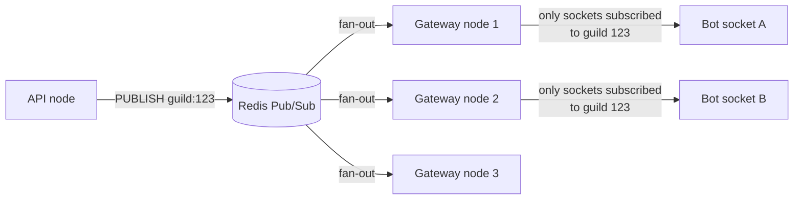
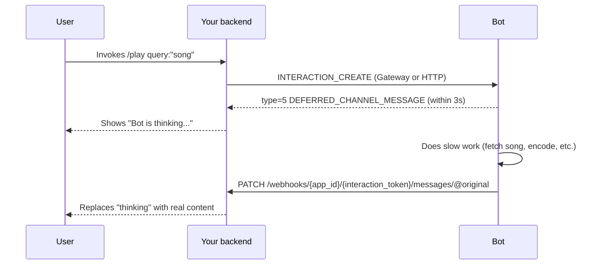
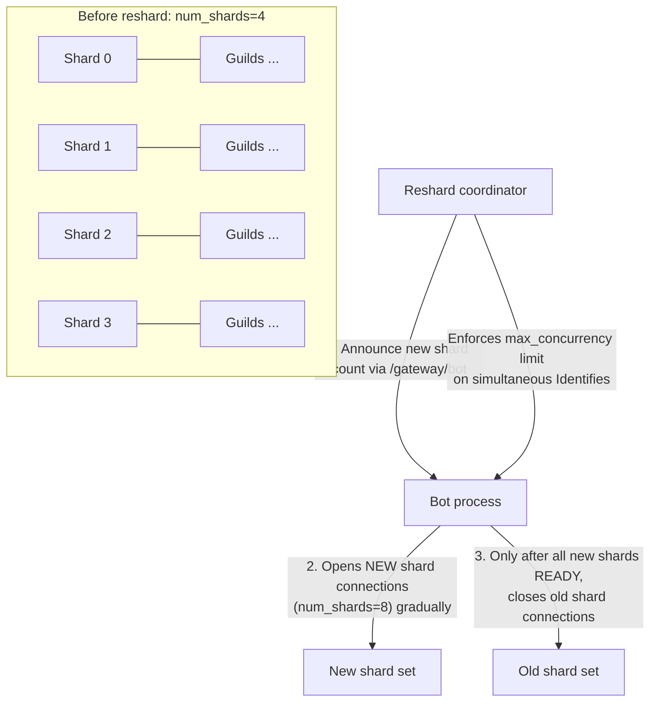
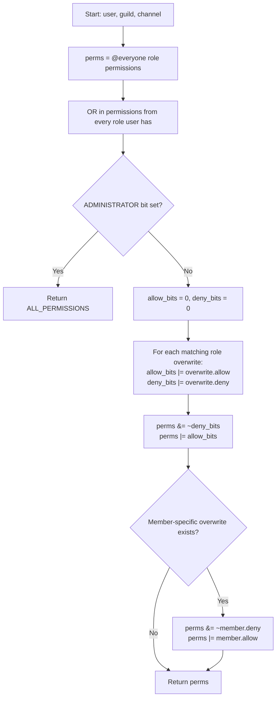
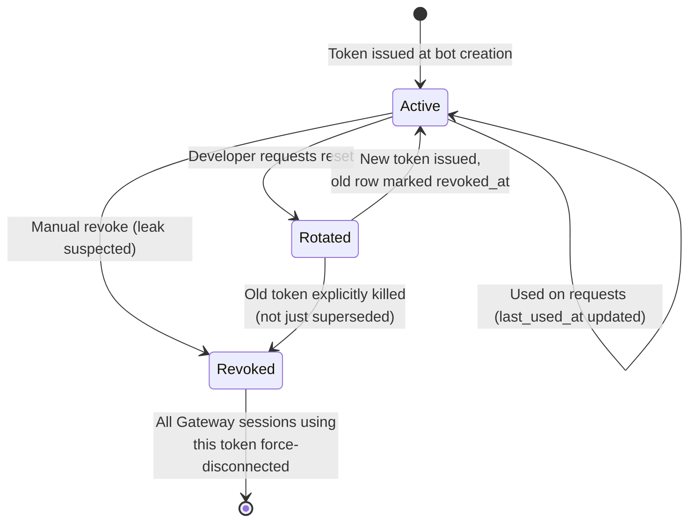
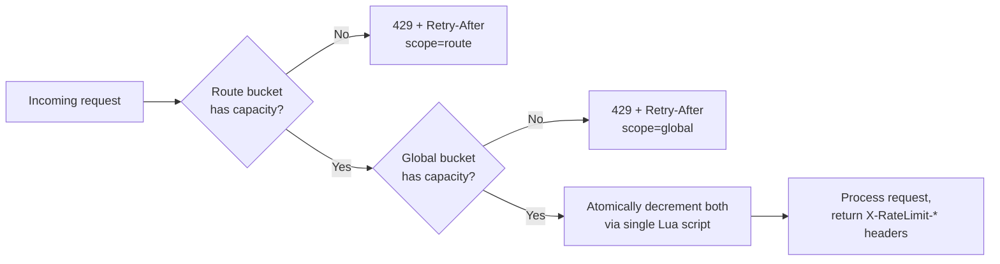

# Bot Integration Plan & Spec Review

## 1. Review / Critique

### 1.1 Token design (§4.1)

* **No key rotation story**: The HMAC secret is a single server-side value. If it's ever rotated (which it should be, periodically), every existing token becomes invalid simultaneously — there's no key ID segment to allow gradual rollover. *Fix*: add a 4th segment (or a prefix byte) identifying which signing key was used, so you can support N valid keys concurrently during rotation.
* **No cheap revocation check**: You store `revoked_at` in `bot_tokens` but every request needs a lookup by `token_hash` to check it — and there's no index on `token_hash` in the DDL (only `idx_bot_tokens_application`). This is a real bug: without that index, revocation checks do a sequential scan. *Fix*: Add `CREATE INDEX idx_bot_tokens_hash ON bot_tokens(token_hash);` and cache "not revoked" results in Redis with a short TTL, invalidated on revoke.
* **No forced expiry / rotation UX**: Bot tokens are described as long-lived like API keys, but there's no mechanism for a developer to rotate a leaked token without regenerating everything (client secret, etc.) or for you to force-expire tokens older than N months. Worth adding a `POST /applications/{id}/bot/reset-token` endpoint that revokes the old row and issues a new one, and surfacing "last used" timestamps so developers can spot dead/leaked tokens.
* **Base64 encoding integer**: Encoding an integer as base64 is unusual — snowflakes are already compact; base64-encoding `bot_user_id` mainly obscures it trivially, not securely. That's fine as an optimization (avoids a DB lookup to know who is even asking), but the spec should be explicit that this segment is not a security boundary — segment 3 (the HMAC) is what does real work. Otherwise implementers might assume segment 1 is somehow protected.

### 1.2 Permission resolution algorithm (§7.3)

There's a real order-dependency bug in the pseudocode:

```text
for overwrite in channel.overwrites where overwrite.role_id in role_ids:
    perms &= ~overwrite.deny
    perms |= overwrite.allow
```

If a member has two roles with conflicting overwrites on the same channel — Role A denies `SEND_MESSAGES`, Role B allows it — the result depends on iteration order, which is almost certainly not what you want (it should be deterministic, e.g. "allow wins over deny across roles" is Discord's actual rule). The fix is to aggregate before applying:

```text
allow_bits = 0
deny_bits  = 0
for overwrite in channel.overwrites where overwrite.role_id in role_ids:
    allow_bits |= overwrite.allow
    deny_bits  |= overwrite.deny
perms &= ~deny_bits
perms |= allow_bits
```

This makes the result independent of set iteration order and matches how most people intuitively expect "any role that explicitly allows it" to win over a deny from a different role.

### 1.3 Permission caching (§7.3)

* **Invalidate-then-write race**: If you invalidate the Redis cache after committing the DB write (the natural order), there's a window where another request reads, recomputes, and re-populates the cache with stale data if that read started before your write committed but finished after. *Standard mitigation*: either (a) invalidate the cache key before the write commits and again after (double-invalidate), or (b) use a version counter per guild (`perm_version:{guild_id}`) embedded in the cache key, incremented on every permission-relevant mutation, so old cache entries are simply never looked up again rather than needing active deletion.
* **Cache key granularity**: `(user_id, channel_id)` is reasonable, but role and overwrite changes are guild-wide events — you'd need to enumerate every member × every channel in that guild to invalidate precisely, which is expensive at scale. The version-counter approach above sidesteps this entirely: bump `perm_version:{guild_id}` once, and every `(user_id, channel_id)` key for that guild becomes implicitly stale without you touching them.

### 1.4 Gateway sharding (§5.4)

* **Resharding is a hard cutover**: `shard_id = (guild_id >> 22) % num_shards` means changing `num_shards` reshuffles almost every guild's shard assignment. The spec doesn't address how you roll this out without a full simultaneous disconnect/reconnect storm across your entire bot ecosystem (this is exactly why Discord requires large bots to negotiate resharding windows). Worth explicitly specifying a `max_concurrency` / staggered-reconnect strategy, similar to Discord's session-start rate limit.
* **No session-start rate limiting mentioned**: Without limiting how many `Identify` payloads a single application can send per rolling window, a bot restarting all its shards at once (e.g., after a deploy) can hammer the Gateway with concurrent auth handshakes. Should specify something like "N concurrent identifies per 5 seconds per application," returned via a `/gateway/bot` discovery endpoint that tells the bot its recommended shard count and remaining session starts.

### 1.5 REST rate limiting (§6.3)

* **Bucket grouping example is questionable**: The spec says all `PATCH /channels/{id}` calls "share one bucket regardless of which channel ID." That's actually the opposite of what you want for a multi-guild bot: a bot managing 10,000 channels across 500 guilds shouldn't have its channel-edit throughput capped as if it were one channel. Discord's actual model buckets by route plus major parameter (`channel_id`/`guild_id` are "major params"), precisely so that editing channel A doesn't consume the rate budget for channel B. This should be corrected — the rule as written would make busy multi-guild bots functionally unusable.

### 1.6 OAuth2 invite flow (§4.2)

* **No CSRF state parameter** in the documented invite URL or flow — a bare redirect-based OAuth flow without state is vulnerable to CSRF where an attacker tricks an owner into authorizing a grant they didn't initiate for a guild they didn't intend. Should be mandatory, not optional.
* **No re-consent on permission escalation**: If a developer later requests more permission bits for an already-installed bot, nothing in the spec forces a fresh consent screen — the existing `oauth2_grants` row could just be silently updated. This is a privilege-escalation gap; any increase in requested permissions should require the flow to run again with the new bitmask shown explicitly.
* **Missing uniqueness constraint**: Nothing stops duplicate `oauth2_grants` rows for the same `(application_id, guild_id)` on re-invite; should be an upsert keyed on that pair.

### 1.7 Interactions (§8.2)

* **No acknowledgment/timeout model specified**: Real slash-command systems need a fast initial ACK (few seconds) with the option to defer and send a follow-up later (e.g., for commands that call slow external APIs). The spec mentions "the bot has a few seconds to POST back a response" but doesn't define deferred responses, follow-up messages via the interaction token, token expiry (typically ~15 minutes), or ephemeral (caller-only) responses. This is a significant functional gap, not just a nuance — most non-trivial bots need it on day one.
* **Replay protection**: Signature verification is specified, but nothing prevents replaying a captured valid signed payload. Should mandate a timestamp-in-signature freshness window (e.g., reject if timestamp is more than ~5 minutes old), which the pseudocode's timestamp + body signing supports but the spec doesn't call out as a check the bot must perform.

### 1.8 Data model gaps

* `commands` has no unique constraint on `(application_id, guild_id, name)` — duplicate command names can be registered silently.
* `channel_overwrites` has no unique constraint on `(channel_id, role_id)` — repeated toggles from the UI (§11.2) could insert duplicate rows instead of updating one.
* No audit log table anywhere, despite §11 describing multiple destructive/sensitive actions (kick, ban, role grant, bot removal) that any real moderation surface needs to log with actor + timestamp.

### 1.9 Voice (§9)

* **Token verification** for the SFU handoff is asserted ("signed token") but never specified — what's it signed with, what does it authorize (which channel, which duration), and how does the SFU validate it independently of the Gateway node that issued it? Worth a short JWT-style spec (claims: `guild_id`, `channel_id`, `user_id`, `exp`).
* **No ICE restart / reconnect path** for bots — voice bots are long-running and network blips are common; only the initial join is specified.

---

## 2. Implementation

Four representative pieces: the permission resolver (fixed per §1.2/§1.3), the Redis rate limiter, the OAuth2 authorize/callback pair, and interaction signature verification with replay protection.

### 2.1 Permission resolver (with version-tagged cache)

```python
import redis
import time

r = redis.Redis()

ADMINISTRATOR = 1 << 11

def perm_version(guild_id: int) -> int:
    v = r.get(f"perm_version:{guild_id}")
    return int(v) if v else 0

def bump_perm_version(guild_id: int):
    # Called on any role/overwrite mutation for this guild
    r.incr(f"perm_version:{guild_id}")

def resolve_permissions(db, user_id: int, guild_id: int, channel_id: int) -> int:
    version = perm_version(guild_id)
    cache_key = f"perms:{guild_id}:{channel_id}:{user_id}:v{version}"

    cached = r.get(cache_key)
    if cached is not None:
        return int(cached)

    perms = db.get_everyone_role_permissions(guild_id)
    role_ids = db.get_member_role_ids(guild_id, user_id)
    for role in db.get_roles(role_ids):
        perms |= role.permissions

    if perms & ADMINISTRATOR:
        result = ALL_PERMISSIONS = (1 << 63) - 1
    else:
        allow_bits = 0
        deny_bits = 0
        for ow in db.get_role_overwrites(channel_id, role_ids):
            allow_bits |= ow.allow
            deny_bits |= ow.deny
        perms &= ~deny_bits
        perms |= allow_bits

        member_ow = db.get_member_overwrite(channel_id, user_id)
        if member_ow:
            perms &= ~member_ow.deny
            perms |= member_ow.allow

        result = perms

    r.set(cache_key, result, ex=300)  # short TTL as a safety net even without invalidation
    return result
```

### 2.2 Redis token-bucket rate limiter (per-route + global, per §1.5 fix)

Lua script for atomicity (single round trip, no race between check and decrement):

```lua
-- KEYS[1] = route bucket key, KEYS[2] = global bucket key
-- ARGV[1] = route limit, ARGV[2] = route window (seconds)
-- ARGV[3] = global limit, ARGV[4] = global window (seconds)
-- ARGV[5] = now (epoch ms)

local function take(key, limit, window_ms, now)
    local bucket = redis.call("GET", key)
    local remaining, reset_at

    if not bucket then
        remaining = limit - 1
        reset_at = now + window_ms
        redis.call("SET", key, remaining .. ":" .. reset_at, "PX", window_ms)
        return {1, remaining, reset_at}
    end

    local sep = string.find(bucket, ":")
    local rem = tonumber(string.sub(bucket, 1, sep - 1))
    local reset = tonumber(string.sub(bucket, sep + 1))

    if now >= reset then
        remaining = limit - 1
        reset_at = now + window_ms
        redis.call("SET", key, remaining .. ":" .. reset_at, "PX", window_ms)
        return {1, remaining, reset_at}
    end

    if rem <= 0 then
        return {0, 0, reset}
    end

    redis.call("SET", key, (rem - 1) .. ":" .. reset, "PX", reset - now)
    return {1, rem - 1, reset}
end

local route_result  = take(KEYS[1], tonumber(ARGV[1]), tonumber(ARGV[2]) * 1000, tonumber(ARGV[5]))
if route_result[1] == 0 then
    return {0, "route", route_result[2], route_result[3]}
end

local global_result = take(KEYS[2], tonumber(ARGV[3]), tonumber(ARGV[4]) * 1000, tonumber(ARGV[5]))
if global_result[1] == 0 then
    return {0, "global", global_result[2], global_result[3]}
end

return {1, "ok", route_result[2], route_result[3]}
```

Route bucket key, per the corrected §1.5 grouping — includes the major parameter, not just the route shape:

```python
def route_bucket_key(bot_id: int, method: str, path_template: str, major_param: int) -> str:
    # e.g. bucket:123456:PATCH:/channels/{id}:987654321
    return f"bucket:{bot_id}:{method}:{path_template}:{major_param}"

def global_bucket_key(bot_id: int) -> str:
    return f"bucket:{bot_id}:global"

def enforce_rate_limit(bot_id, method, path_template, major_param):
    now_ms = int(time.time() * 1000)
    result = redis_client.eval(
        RATE_LIMIT_SCRIPT,
        2,
        route_bucket_key(bot_id, method, path_template, major_param),
        global_bucket_key(bot_id),
        ROUTE_LIMITS[path_template]["limit"],
        ROUTE_LIMITS[path_template]["window"],
        50, 1,  # global: 50 req/sec
        now_ms,
    )
    allowed, scope, remaining, reset_at = result
    if not allowed:
        raise RateLimited(scope=scope, retry_after=(reset_at - now_ms) / 1000)
    return remaining, reset_at
```

### 2.3 OAuth2 authorize + callback (with state CSRF protection, per §1.6)

```python
from fastapi import FastAPI, Request, HTTPException
import secrets

app = FastAPI()

@app.get("/oauth2/authorize")
def authorize(client_id: int, scope: str, permissions: int, request: Request):
    state = secrets.token_urlsafe(32)
    request.session["oauth_state"] = state
    request.session["oauth_permissions"] = permissions
    request.session["oauth_client_id"] = client_id

    app_row = db.get_application(client_id)
    guilds = db.get_manageable_guilds(request.user.id)  # MANAGE_GUILD only

    return render_consent_screen(
        app=app_row,
        requested_perms=decode_permission_bits(permissions),  # human-readable list
        guilds=guilds,
        state=state,
    )

@app.post("/oauth2/authorize/confirm")
def confirm(request: Request, guild_id: int, state: str):
    if state != request.session.get("oauth_state"):
        raise HTTPException(400, "Invalid state — possible CSRF")

    client_id = request.session["oauth_client_id"]
    permissions = request.session["oauth_permissions"]

    if not user_has_permission(request.user.id, guild_id, "MANAGE_GUILD"):
        raise HTTPException(403, "Missing MANAGE_GUILD on target guild")

    app_row = db.get_application(client_id)

    with db.transaction():
        db.upsert_oauth2_grant(
            application_id=client_id,
            guild_id=guild_id,
            authorized_by_user_id=request.user.id,
            permissions=permissions,      # re-consent on escalation handled by upsert diff check
            scopes="bot applications.commands",
        )
        db.upsert_guild_member(guild_id, app_row.bot_user_id)
        role_id = db.get_or_create_bot_role(guild_id, app_row.id, permissions)
        db.assign_role(guild_id, app_row.bot_user_id, role_id)

    gateway.dispatch(guild_id, "GUILD_MEMBER_ADD", db.get_member(guild_id, app_row.bot_user_id))
    request.session.pop("oauth_state", None)
    return {"status": "authorized"}
```

### 2.4 Interaction signature verification with replay protection (per §1.7)

```python
import time
import nacl.signing
import nacl.exceptions

REPLAY_WINDOW_SECONDS = 300

def verify_interaction_request(public_key_hex: str, signature_hex: str, timestamp: str, body: bytes) -> bool:
    now = int(time.time())
    try:
        ts = int(timestamp)
    except ValueError:
        return False

    if abs(now - ts) > REPLAY_WINDOW_SECONDS:
        return False  # too old (or clock-skewed far future) — reject as possible replay

    verify_key = nacl.signing.VerifyKey(bytes.fromhex(public_key_hex))
    try:
        verify_key.verify(timestamp.encode() + body, bytes.fromhex(signature_hex))
        return True
    except nacl.exceptions.BadSignatureError:
        return False
```

```python
@app.post("/bot/interactions")
async def handle_interaction(request: Request):
    signature = request.headers["X-Signature-Ed25519"]
    timestamp = request.headers["X-Signature-Timestamp"]
    body = await request.body()

    if not verify_interaction_request(BOT_PUBLIC_KEY, signature, timestamp, body):
        raise HTTPException(401, "Invalid request signature")

    payload = json.loads(body)
    if payload["type"] == 1:  # PING
        return {"type": 1}   # PONG

    return await dispatch_to_command_handler(payload)
```

---

## 3. Deep Dive

### 3.1 Redis pub/sub fan-out across Gateway nodes

Gateway nodes are stateful — each holds a set of live WebSockets, but events (a new message, a role update) originate from whichever API node handled the write, which has no direct connection to the sockets that need to hear about it. The standard pattern:



#### Mechanics:
1. Every Gateway node, on receiving an Identify, subscribes to Redis channels for every guild that connection cares about — typically one channel per guild the bot is in, or (at scale) a smarter partitioning like "one channel per shard" if the node already knows which guilds route to which shard.
2. When any API node mutates state that produces a dispatch event, it publishes a small message: `{"guild_id": 123, "type": "MESSAGE_CREATE", "payload": {...}}` to `PUBLISH guild:123 ...`.
3. Every Gateway node subscribed to `guild:123` receives it and forwards to whichever local sockets are actually connected for that guild.
4. Sequence numbers (`s` in the payload envelope) are assigned per-session, not per-guild, so each Gateway node stamps the sequence itself as it hands the event to a specific socket — this is also where the resume buffer (§5.3) gets populated.

*Subtlety*: per-guild channels don't scale past some tens of thousands of guilds. In practice, you bucket by shard instead — publish to `PUBLISH shard:{shard_id}`.

### 3.2 Token bucket algorithm, precisely

For the global bucket (50 req/s), a smoother algorithm like GCRA is worth the extra complexity:

```lua
-- GCRA: emission_interval = window / limit
-- Redis stores "theoretical arrival time" (TAT) per key
local function gcra(key, limit, window_ms, now)
    local emission_interval = window_ms / limit
    local tat = tonumber(redis.call("GET", key)) or now
    tat = math.max(tat, now)

    if tat - now > window_ms then
        return {0, tat - now}  -- rejected, retry_after = tat - now
    end

    local new_tat = tat + emission_interval
    redis.call("SET", key, new_tat, "PX", window_ms)
    return {1, 0}
end
```

### 3.3 Signature verification — full mechanics

1. **Canonical byte concatenation**: The signed message is `timestamp_bytes + raw_body_bytes`. This must be the raw, unparsed request body bytes.
2. **Constant-time comparison**: Signature verification libraries handle this internally, but if you hand-roll any part, use a constant-time compare.
3. **Public key storage and rotation**: Keep the previous key valid for a short grace window so in-flight interactions signed under the old key aren't rejected mid-rotation.

---

## 4. Alternative Approaches

### 4.1 Gateway model vs. HTTP interaction model (§8.2)

| | Gateway (WebSocket) delivery | HTTP endpoint delivery |
|---|---|---|
| **Infra for bot dev** | Must run a persistent process, handle reconnects/resume | Can be a stateless serverless function |
| **Latency** | Generally lower (already-open socket) | Extra TLS handshake per cold invocation unless warm |
| **Scaling story for you** | You must hold a live connection per bot process | You're just an outbound HTTP client — no connection state |
| **Failure mode** | Bot must implement resume logic correctly or misses events | Simpler retry semantics — 5xx just means "the webhook failed" |
| **Best fit** | Bots that already need Gateway for other things (messages, voice) | Pure slash-command bots, or bots on serverless platforms |

### 4.2 Sharding strategies

* **Consistent hashing** (via a hash ring) — makes resharding cheaper because adding a shard only remaps `1/num_shards` of guilds instead of potentially all of them, unlike naive modulo.
* **Guild-count-based dynamic sharding** — discovery endpoint `/gateway/bot` returning `{shards: N}`.

### 4.3 Session resumption alternatives (§5.3)

* **Longer buffer + explicit backpressure** — extend the buffer TTL.
* **Client-side full state, server stateless resume** — force a fresh full sync on any reconnect.

### 4.4 Permission caching alternatives (§7.3)

* **Compute-on-read with version-tagged cache** (implemented in §2.1).
* **Materialized permission table** recomputed by a background worker on changes.

### 4.5 Token design alternatives (§4.1)

* **Opaque token + Redis-backed session store** (no embedded HMAC at all).
* **Signed JWT** — put `bot_id`, `issued_at`, and a key ID into a standard JWT structure.

---

## 5. Missing Pieces

* **Deferred interaction responses & follow-ups**: ability to ACK immediately and send follow-ups later.
* **Ephemeral responses**: visibility limited to the invoking user.
* **Message components**: buttons, select menus, modal popups.
* **Autocomplete**: suggestions as the user types options.
* **Localized command descriptions**: support multiple languages.
* **Audit log table**: log moderator actions.
* **Idempotency keys** on mutating REST calls.
* **Incoming Webhooks** for simple integrations.

---

## 6. Diagrams

### 6.1 Full interaction lifecycle (deferred + follow-up)



### 6.2 Sharding + resharding architecture



### 6.3 Permission resolution flowchart



### 6.4 Token lifecycle state diagram



### 6.5 Rate limiter bucket state


