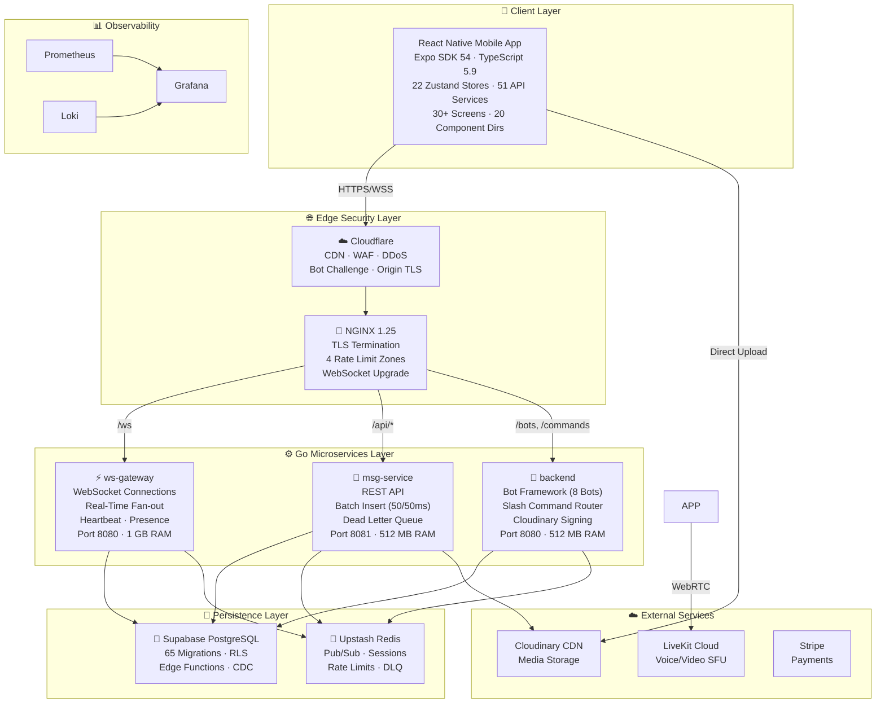

# 📚 Flicko Documentation Hub

> **Version:** 1.0.0 · **Last Updated:** 2026-04-14 · **Total Docs:** 89 files · **Maintained by:** Flicko Team

---

## Welcome to Flicko

Flicko is a **full-featured, production-ready, open-source Discord alternative** built as a real-time communication platform for communities. It provides text messaging over WebSockets, voice and video channels powered by LiveKit WebRTC, a comprehensive server management system with granular role-based permissions (26 permission types), an extensible bot framework with 8 built-in bots covering moderation, auto-moderation, welcome messages, leveling, music, tickets, polls, and starboard functionality, direct messaging with group DM support, rich media uploads via Cloudinary CDN, and a premium subscription tier integrated with Stripe. The entire backend is written in Go and split across three microservices — `ws-gateway` for real-time WebSocket connections, `msg-service` for the REST API and batch message insertion, and `backend` for the bot framework and slash command routing. The mobile client is built with React Native and Expo SDK 54, targeting both iOS and Android from a single TypeScript codebase. All data is persisted in PostgreSQL via Supabase (with 65 SQL migrations defining the schema), cached and pub/sub'd through Upstash Redis, and served behind an NGINX reverse proxy with Cloudflare CDN and WAF protection.

This documentation is written for **four primary audiences**. New developers joining the Flicko project will find comprehensive onboarding guides that walk through every prerequisite, installation step, and first-run verification. Backend engineers working on the Go services will find detailed documentation of all 95 service files, the 10-layer middleware stack, the 22 database model structs, the event bus architecture, and the bot registration system. Mobile developers working on the React Native frontend will find documentation of all 51 API service files, 22 Zustand state stores, 20 component directories, and the file-based routing system with 30+ screens. DevOps engineers responsible for deployment will find complete Docker Compose documentation for the 9-container production stack, NGINX configuration guides, monitoring setup with Prometheus + Grafana + Loki, and cloud provider recommendations with resource budgets.

To navigate this documentation effectively, start with the **Documentation Map** table below to find the exact file you need. If you're new to the project, follow the **Quick Navigation by Role** section which provides ordered reading lists tailored to your specific role. Every documentation file includes cross-references to related documents at the bottom, so you can follow the natural reading flow through interconnected topics. The **Glossary** section at the end of this document defines all Flicko-specific terminology so you can quickly look up any unfamiliar terms.

---

## Architecture at a Glance

Before diving into the documentation, here is the complete system architecture showing how all components connect:

This diagram shows the complete request path from a user's mobile device through the edge security layer (Cloudflare WAF and NGINX reverse proxy), into one of three specialized Go microservices, and down to the persistence layer. The `ws-gateway` service maintains long-lived WebSocket connections for real-time message delivery, presence tracking, and typing indicators. The `msg-service` handles all REST API requests including message creation (with a batch insertion engine that groups messages into 50-message batches every 50 milliseconds for database efficiency), channel management, and media upload signing. The `backend` service runs the 8-bot framework with an in-process event bus for slash command routing and automated moderation. All three services share the same PostgreSQL database (via Supabase) and Redis instance (via Upstash), and are deployed in isolated Docker networks to prevent lateral movement in case of container compromise.

---

## Documentation Map

The complete inventory of all 87 documentation files organized by category. Use the **Who Should Read** column to quickly find documents relevant to your role, and the **Reading Time** column to plan your learning sessions.

### Root Documentation (4 files)

| #   | File Path                                       | Description                                                                                                                                                                                                                                                                                                                                                                       | Who Should Read | Reading Time |
| --- | ----------------------------------------------- | --------------------------------------------------------------------------------------------------------------------------------------------------------------------------------------------------------------------------------------------------------------------------------------------------------------------------------------------------------------------------------- | --------------- | ------------ |
| 1   | [`docs/README.md`](README.md)                   | The master documentation hub you are currently reading. Contains the complete file index, architecture overview, role-based navigation guides, project health dashboard, and glossary of all Flicko-specific terminology. This is the starting point for every new team member.                                                                                                   | Everyone        | 15 min       |
| 2   | [`docs/CHANGELOG.md`](CHANGELOG.md)             | Complete version history following Keep A Changelog format. Documents every feature addition, bug fix, security patch, and database migration across all releases. References specific migration numbers and commit hashes for traceability.                                                                                                                                      | Everyone        | 10 min       |
| 3   | [`docs/CONTRIBUTING.md`](CONTRIBUTING.md)       | Comprehensive contribution guide covering development environment setup for Flicko's 3-service architecture, how to add new API endpoints, how to create database migrations following Flicko's naming conventions, how to extend the bot system with new slash commands, code style guides for both Go and TypeScript, PR templates, and testing requirements before submission. | Contributors    | 20 min       |
| 4   | [`docs/CODE_OF_CONDUCT.md`](CODE_OF_CONDUCT.md) | Community standards and expectations based on the Contributor Covenant, adapted for the Flicko project. Defines acceptable behavior, enforcement procedures, and reporting mechanisms for maintaining a welcoming and inclusive community.                                                                                                                                        | Everyone        | 5 min        |

### Getting Started (6 files)

| #   | File Path                                                                  | Description                                                                                                                                                                                                                                                                                                                                                                                                                                                    | Who Should Read        | Reading Time |
| --- | -------------------------------------------------------------------------- | -------------------------------------------------------------------------------------------------------------------------------------------------------------------------------------------------------------------------------------------------------------------------------------------------------------------------------------------------------------------------------------------------------------------------------------------------------------- | ---------------------- | ------------ |
| 5   | [`getting-started/overview.md`](getting-started/overview.md)               | Platform overview explaining what Flicko is, its core concepts (servers, channels, DMs, voice, bots, subscriptions, roles), detailed description of all three Go microservices with their responsibilities and communication patterns, and a feature completion matrix showing implementation status of every feature.                                                                                                                                         | Everyone               | 20 min       |
| 6   | [`getting-started/prerequisites.md`](getting-started/prerequisites.md)     | Detailed prerequisite guide with exact version requirements for Go 1.25, Node.js 18+, React Native, PostgreSQL 15+, Redis 7+, Docker 24+, and cloud accounts (Supabase, Upstash, Cloudinary, LiveKit). Includes installation commands for macOS, Linux, and Windows, verification commands, and troubleshooting for each prerequisite.                                                                                                                         | New Developers         | 15 min       |
| 7   | [`getting-started/installation.md`](getting-started/installation.md)       | Step-by-step installation walkthrough covering repository cloning, monorepo structure explanation, environment configuration for all 169 variables across all services, database setup with 65 migrations, Redis configuration, building and running all three Go services, mobile app setup with Expo, and a comprehensive verification checklist.                                                                                                            | New Developers         | 25 min       |
| 8   | [`getting-started/configuration.md`](getting-started/configuration.md)     | Complete environment variable reference for every `.env` file across all services. Documents all 169 variables organized by service and category (database, Redis, JWT, Cloudinary, LiveKit, Stripe, Supabase) with types, defaults, valid values, and detailed explanations of what each variable controls in the system.                                                                                                                                     | All Developers, DevOps | 20 min       |
| 9   | [`getting-started/quick-start.md`](getting-started/quick-start.md)         | Fast-path setup guide for experienced developers. Covers both Docker Compose deployment (all services in one command) and manual development setup. Includes walkthroughs for creating your first server, sending your first message, and inviting your first user.                                                                                                                                                                                            | Experienced Developers | 10 min       |
| 10  | [`getting-started/troubleshooting.md`](getting-started/troubleshooting.md) | Comprehensive troubleshooting guide organized by error category: Go build errors, database connection failures, Redis connection issues, Docker container problems, mobile app Metro bundler errors, CORS and networking issues, JWT authentication failures, Cloudinary upload errors, WebSocket connection drops, voice channel problems, bot command failures, and migration errors. Each issue includes root cause, step-by-step fix, and prevention tips. | All Developers         | 15 min       |

### Architecture (9 files)

| #   | File Path                                                                              | Description                                                                                                                                                                                                                                                                                                                                                                                                                                       | Who Should Read            | Reading Time |
| --- | -------------------------------------------------------------------------------------- | ------------------------------------------------------------------------------------------------------------------------------------------------------------------------------------------------------------------------------------------------------------------------------------------------------------------------------------------------------------------------------------------------------------------------------------------------- | -------------------------- | ------------ |
| 11  | [`architecture/system-overview.md`](architecture/system-overview.md)                   | Complete system architecture documentation covering design philosophy (why Go, why microservices, why React Native), service decomposition analysis, comprehensive Mermaid diagrams with all connections labeled, request lifecycle from mobile tap to database response, data consistency model across 3 services, scalability design, inter-service communication patterns, and failure mode analysis for every component.                      | All Developers, Architects | 25 min       |
| 12  | [`architecture/tech-stack.md`](architecture/tech-stack.md)                             | Deep dive into every technology and library used across all services. Covers Go 1.25 with goroutine patterns, Gorilla Mux routing, pgx/v5 database driver, go-redis/v9, golang-jwt/v5, Zap structured logging, React Native 0.81, Expo SDK 54, TypeScript 5.9, Zustand state management, React Query, Docker multi-stage builds, NGINX configuration, and all 30+ npm dependencies with explanations of why each was chosen.                      | All Developers             | 20 min       |
| 13  | [`architecture/folder-structure.md`](architecture/folder-structure.md)                 | Complete annotated directory tree of the entire project with every file and folder documented. For each major directory: purpose, naming conventions, organization pattern, dependencies, dependents, and examples of how to correctly add new files following Flicko conventions. Covers backend (95 services), shared (51 services, 22 stores), mobile (30+ screens, 20 component dirs), supabase (65 migrations), and infrastructure.          | All Developers             | 20 min       |
| 14  | [`architecture/data-flow.md`](architecture/data-flow.md)                               | Documents every data flow in the system with Mermaid sequence diagrams: REST message sending, WebSocket real-time delivery, voice channel joining, user authentication (registration/login/refresh/logout), Cloudinary file uploads, bot slash command processing, server creation with default channels and roles, subscription activation, friend request lifecycle, and DM conversation initiation.                                            | Backend, Mobile Developers | 20 min       |
| 15  | [`architecture/database-design.md`](architecture/database-design.md)                   | Database architecture covering table design philosophy, normalization decisions, indexing strategy, the complete entity-relationship model for both core tables (users, servers, channels, messages, members, roles, invites) and bot system tables (mod_settings, automod_settings, welcome_settings, level_settings, ticket_settings, starboard_settings), constraint definitions, and data lifecycle management.                               | Backend Developers, DBAs   | 20 min       |
| 16  | [`architecture/authentication-flow.md`](architecture/authentication-flow.md)           | Complete authentication architecture covering Supabase Auth as identity provider, JWT token system (access + refresh tokens with TTLs), HMAC-SHA256 and Ed25519 signing, token validation in Go middleware, session management on mobile (Expo SecureStore), biometric authentication, OAuth provider integration (Google, GitHub, Discord, Apple), CSRF protection, and token refresh flow with automatic retry.                                 | Backend, Security          | 15 min       |
| 17  | [`architecture/api-design.md`](architecture/api-design.md)                             | API design principles covering RESTful conventions, URL structure (`/api/v1/` prefix), request/response JSON format, authentication header requirements, CSRF token handling, pagination patterns, error response schema, rate limiting headers, content negotiation, and versioning strategy. Includes code snippets showing actual handler implementations.                                                                                     | Backend, Mobile Developers | 15 min       |
| 18  | [`architecture/state-management.md`](architecture/state-management.md)                 | Frontend state management architecture covering all 22 Zustand stores with their responsibilities, the React Query integration for server state, store composition patterns, persistence strategy (SecureStore for auth, AsyncStorage for preferences), optimistic updates for messaging, and real-time state synchronization via WebSocket events.                                                                                               | Mobile Developers          | 15 min       |
| 19  | [`architecture/third-party-integrations.md`](architecture/third-party-integrations.md) | Documentation of all external service integrations: Supabase (PostgreSQL + Auth + Edge Functions + Realtime), Upstash Redis (Pub/Sub + caching + rate limiting), Cloudinary (signed uploads + CDN + transforms), LiveKit (voice/video SFU + WebRTC), Stripe (subscription payments), GIPHY (GIF search via Edge Function), and Sentry (crash reporting). Each integration includes setup instructions, API usage patterns, and fallback behavior. | All Developers             | 15 min       |

### Features (10 files)

| #   | File Path                                                            | Description                                                                                                                                                                                                                                                                                                                                                    | Who Should Read    | Reading Time |
| --- | -------------------------------------------------------------------- | -------------------------------------------------------------------------------------------------------------------------------------------------------------------------------------------------------------------------------------------------------------------------------------------------------------------------------------------------------------- | ------------------ | ------------ |
| 20  | [`features/feature-index.md`](features/feature-index.md)             | Master index of all 30+ features with implementation status, responsible service, key files, and database tables for each. Organized by domain: Communication, Voice/Video, Server Management, Bot System, Social, Media, and Premium.                                                                                                                         | Everyone           | 10 min       |
| 21  | [`features/real-time-messaging.md`](features/real-time-messaging.md) | Deep dive into the real-time messaging system covering WebSocket connection lifecycle, Redis Pub/Sub fan-out, message batching engine, typing indicators, read receipts, reactions, threads, message editing with history, soft-delete, search with PostgreSQL tsvector, and the complete message event payload structure.                                     | Backend, Mobile    | 20 min       |
| 22  | [`features/voice-and-video.md`](features/voice-and-video.md)         | Voice and video channel architecture covering LiveKit WebRTC SFU integration, room creation and token generation, voice state tracking across services, push-to-talk, voice activity detection, screen sharing, video adaptive bitrate, DM voice/video calls, and the complete voice state machine.                                                            | Backend, Mobile    | 15 min       |
| 23  | [`features/bot-system.md`](features/bot-system.md)                   | Comprehensive bot framework documentation covering the Bot Registry pattern, event bus architecture, slash command router, all 8 built-in bots with every command documented, bot permission model, how to create new bots, event types and payloads, and the bot database schema.                                                                             | Backend Developers | 20 min       |
| 24  | [`features/server-management.md`](features/server-management.md)     | Server lifecycle documentation covering CRUD operations, invite system (codes, max uses, expiry), channel categories with reordering, the 26-permission RBAC system with bitfield calculations, channel permission overwrites, server templates, server boosting, custom emoji, audit logging, and server discovery.                                           | Backend, Mobile    | 15 min       |
| 25  | [`features/moderation.md`](features/moderation.md)                   | Moderation system documentation covering manual mod commands (/ban, /kick, /mute, /warn, /purge), the AutoMod engine with 8 content filters (invites, links, caps, emoji, mentions, duplicates, blacklist, spam), warning escalation system (1→warn, 3→mute, 5→kick, 7→ban), temporary punishments with auto-expiry, mod audit logging, and the report system. | Backend Developers | 15 min       |
| 26  | [`features/direct-messaging.md`](features/direct-messaging.md)       | DM system documentation covering 1-on-1 conversations, group DMs (up to 10 participants), DM reactions, typing indicators, voice/video calls in DMs, DM search, user blocking, and the conversation database model.                                                                                                                                            | Backend, Mobile    | 12 min       |
| 27  | [`features/social-features.md`](features/social-features.md)         | Social system documentation covering friend request lifecycle (send/accept/decline/block), online presence tracking (online/idle/DnD/offline), activity feed, notification center, push notifications via Supabase Edge Functions, user profiles with avatars and banners, and multi-account switching.                                                        | Backend, Mobile    | 12 min       |
| 28  | [`features/media-and-uploads.md`](features/media-and-uploads.md)     | Media system documentation covering the Cloudinary direct upload flow (backend signature generation → client-side upload → CDN delivery), file validation (MIME type + size), image transformations, avatar/banner uploads, message attachments, GIF search via GIPHY, custom sticker uploads, and upload progress tracking.                                   | Backend, Mobile    | 12 min       |
| 29  | [`features/subscriptions.md`](features/subscriptions.md)             | Premium subscription documentation covering Flicko Plus features (custom emoji, animated avatars, higher upload limits, enhanced audio), Stripe integration, subscription state management, premium feature gating, and the subscription purchase flow.                                                                                                        | Backend, Mobile    | 10 min       |

### API Reference (8 files)

| #   | File Path                                                    | Description                                                                                                                                                 | Who Should Read | Reading Time |
| --- | ------------------------------------------------------------ | ----------------------------------------------------------------------------------------------------------------------------------------------------------- | --------------- | ------------ |
| 30  | [`api/api-overview.md`](api/api-overview.md)                 | API overview covering base URL structure, versioning, authentication requirements, request/response format, pagination, filtering, and common headers.      | Backend, Mobile | 10 min       |
| 31  | [`api/authentication.md`](api/authentication.md)             | API authentication documentation covering Bearer token usage, CSRF token requirements, token acquisition, and refresh flow.                                 | Backend, Mobile | 8 min        |
| 32  | [`api/error-codes.md`](api/error-codes.md)                   | Complete error code reference with HTTP status codes, error code strings, human-readable messages, and resolution steps for every error the API can return. | Backend, Mobile | 10 min       |
| 33  | [`api/rate-limiting.md`](api/rate-limiting.md)               | Rate limiting documentation covering the 3-tier system (Cloudflare → NGINX → Redis), rate limit headers, per-endpoint limits, and backoff strategies.       | Backend, Mobile | 8 min        |
| 34  | [`api/endpoints/bots.md`](api/endpoints/bots.md)             | Bot API endpoint documentation with request/response examples for all bot management operations.                                                            | Backend         | 10 min       |
| 35  | [`api/endpoints/video.md`](api/endpoints/video.md)           | Video API endpoint documentation for voice/video room management and token generation.                                                                      | Backend         | 8 min        |
| 36  | [`api/endpoints/cloudinary.md`](api/endpoints/cloudinary.md) | Cloudinary signature endpoint documentation for direct upload flow.                                                                                         | Backend, Mobile | 8 min        |
| 37  | [`api/endpoints/health.md`](api/endpoints/health.md)         | Health check endpoint documentation covering `/health`, `/healthz/live`, and `/healthz/ready`.                                                              | DevOps          | 5 min        |

### Database (7 files)

| #   | File Path                                                | Description                                                                                                                                                             | Who Should Read | Reading Time |
| --- | -------------------------------------------------------- | ----------------------------------------------------------------------------------------------------------------------------------------------------------------------- | --------------- | ------------ |
| 38  | [`database/overview.md`](database/overview.md)           | Database architecture overview covering Supabase PostgreSQL, connection pooling via Supavisor, schema organization, and data lifecycle management.                      | Backend, DBAs   | 10 min       |
| 39  | [`database/schema.md`](database/schema.md)               | Complete schema documentation with CREATE TABLE statements for every table, column types, constraints, defaults, and CHECK constraints.                                 | Backend, DBAs   | 20 min       |
| 40  | [`database/models.md`](database/models.md)               | All 22 Go model struct definitions with field mappings, JSON tags, validation rules, and relationships to database tables.                                              | Backend         | 15 min       |
| 41  | [`database/relationships.md`](database/relationships.md) | Entity relationship documentation covering all foreign keys, join tables, cascading deletes, and the complete ER diagram.                                               | Backend, DBAs   | 10 min       |
| 42  | [`database/indexes.md`](database/indexes.md)             | Index documentation covering all database indexes, their purpose, query patterns they optimize, and performance impact.                                                 | Backend, DBAs   | 10 min       |
| 43  | [`database/migrations.md`](database/migrations.md)       | Migration system documentation covering all 65 Supabase migrations and 3 backend migrations, naming conventions, rollback procedures, and how to create new migrations. | Backend, DBAs   | 12 min       |
| 44  | [`database/seeding.md`](database/seeding.md)             | Database seeding documentation for development and testing environments.                                                                                                | Backend         | 5 min        |

### Backend (8 files)

| #   | File Path                                                | Description                                                                                                                                                                                                                                                                                   | Who Should Read | Reading Time |
| --- | -------------------------------------------------------- | --------------------------------------------------------------------------------------------------------------------------------------------------------------------------------------------------------------------------------------------------------------------------------------------- | --------------- | ------------ |
| 45  | [`backend/overview.md`](backend/overview.md)             | Comprehensive backend architecture covering all 3 Go services, their entry points, package structure, dependency injection, the 321-line main.go initialization sequence, and inter-service communication.                                                                                    | Backend         | 25 min       |
| 46  | [`backend/middleware.md`](backend/middleware.md)         | Complete middleware stack documentation covering all 10 layers in execution order: Request ID → CORS → Timeout → Body Limit → Sanitization → CSRF → Header Redaction → Rate Limit → JWT Auth → Authorization. Each layer documented with code snippets, configuration, and bypass conditions. | Backend         | 20 min       |
| 47  | [`backend/controllers.md`](backend/controllers.md)       | Handler registry documentation covering all 7 handler files, route registration patterns, request parsing, response formatting, and the handler-service-repository pattern used throughout the codebase.                                                                                      | Backend         | 15 min       |
| 48  | [`backend/services.md`](backend/services.md)             | Complete inventory of all 95 service files organized by domain, with file sizes, function signatures, and dependency graphs. Covers auth, messaging, servers, channels, members, roles, permissions, voice, DMs, friends, moderation, bots, and infrastructure services.                      | Backend         | 30 min       |
| 49  | [`backend/models.md`](backend/models.md)                 | All 22 Go model struct definitions with full field documentation, database column mappings, JSON serialization tags, and validation logic.                                                                                                                                                    | Backend         | 15 min       |
| 50  | [`backend/utils.md`](backend/utils.md)                   | Utility package documentation covering all shared Go packages (auth, config, errors, id, logger, metrics, protocol, ratelimit, redis, validate) and frontend utilities (validation, error handling, timestamps, logging, rate limiting).                                                      | Backend         | 12 min       |
| 51  | [`backend/server-setup.md`](backend/server-setup.md)     | Backend server configuration and initialization documentation covering the Config struct, environment variable validation, the 10-step initialization sequence, and graceful shutdown handling.                                                                                               | Backend, DevOps | 12 min       |
| 52  | [`backend/error-handling.md`](backend/error-handling.md) | Error handling strategy covering the handler→service→database error chain, structured JSON error responses, HTTP status code mapping, panic recovery in bot handlers, and structured logging with Zap.                                                                                        | Backend         | 12 min       |

### Frontend (7 files)

| #   | File Path                                                      | Description                                                                                                                                                                                                                                    | Who Should Read | Reading Time |
| --- | -------------------------------------------------------------- | ---------------------------------------------------------------------------------------------------------------------------------------------------------------------------------------------------------------------------------------------- | --------------- | ------------ |
| 53  | [`frontend/overview.md`](frontend/overview.md)                 | Frontend architecture overview covering React Native with Expo, TypeScript configuration, the provider stack (GestureHandler → ErrorBoundary → SafeArea → QueryClient → AuthGate → Theme → Navigation), and the monorepo shared code strategy. | Mobile          | 15 min       |
| 54  | [`frontend/components.md`](frontend/components.md)             | Component library documentation covering all 20 component directories with their contents, props interfaces, usage patterns, and composition patterns.                                                                                         | Mobile          | 15 min       |
| 55  | [`frontend/pages-routes.md`](frontend/pages-routes.md)         | File-based routing documentation covering all 30+ screens organized by route groups: (auth), (tabs), server, dm, settings, voice, profile, search, notifications, and flicko-plus.                                                             | Mobile          | 12 min       |
| 56  | [`frontend/state-management.md`](frontend/state-management.md) | State management documentation covering all 22 Zustand stores, React Query integration, persistence strategy, optimistic updates, and real-time WebSocket state synchronization.                                                               | Mobile          | 12 min       |
| 57  | [`frontend/styling-guide.md`](frontend/styling-guide.md)       | Design system documentation covering the Colors.ts design tokens (dark/light/AMOLED themes), spacing scale, border radius, typography (GG Sans font family), shadow elevations, and animation durations.                                       | Mobile          | 10 min       |
| 58  | [`frontend/forms-validation.md`](frontend/forms-validation.md) | Form handling and validation documentation covering client-side validation utilities, error display patterns, form submission flows, and integration with backend validation.                                                                  | Mobile          | 8 min        |
| 59  | [`frontend/api-integration.md`](frontend/api-integration.md)   | API integration documentation covering all 51 service files, the Supabase client setup, authentication header injection, error handling, and React Query hook patterns.                                                                        | Mobile          | 12 min       |

### Deployment (6 files)

| #   | File Path                                                            | Description                                                                                                                                                                                                                                                                      | Who Should Read | Reading Time |
| --- | -------------------------------------------------------------------- | -------------------------------------------------------------------------------------------------------------------------------------------------------------------------------------------------------------------------------------------------------------------------------- | --------------- | ------------ |
| 60  | [`deployment/overview.md`](deployment/overview.md)                   | Deployment strategy overview covering the single-VPS Docker Compose model, resource allocation for 8 GB RAM, the 3-network isolation architecture, and deployment steps from fresh server to running production stack.                                                           | DevOps          | 15 min       |
| 61  | [`deployment/docker.md`](deployment/docker.md)                       | Docker configuration documentation covering the 455-line production compose file, all 9 containers with resource limits, 3 isolated networks, multi-stage Dockerfile patterns, security hardening (read-only FS, non-root, no-new-privileges), volumes, and management commands. | DevOps          | 20 min       |
| 62  | [`deployment/environment-setup.md`](deployment/environment-setup.md) | Production environment setup guide covering .env configuration, Supabase connection pooler setup, Upstash Redis TLS, JWT key generation, and Cloudflare Origin certificate installation.                                                                                         | DevOps          | 10 min       |
| 63  | [`deployment/ci-cd.md`](deployment/ci-cd.md)                         | CI/CD pipeline documentation covering the GitHub Actions workflow, Docker image builds, pre-commit hooks with Husky + lint-staged, and recommended pipeline extensions for production.                                                                                           | DevOps          | 10 min       |
| 64  | [`deployment/cloud-deployment.md`](deployment/cloud-deployment.md)   | Cloud provider comparison and VPS setup guide covering Hetzner, DigitalOcean, Linode, and Azure with student credits. Documents the server-setup.sh script capabilities.                                                                                                         | DevOps          | 8 min        |
| 65  | [`deployment/monitoring.md`](deployment/monitoring.md)               | Monitoring stack documentation covering Prometheus metrics collection, Grafana dashboards, Loki log aggregation, Node Exporter host metrics, NGINX Exporter request metrics, alerting rules, log format specifications, and LogQL query examples.                                | DevOps          | 15 min       |

### Security (5 files)

| #   | File Path                                                    | Description                                                                                                                                                                                                                                      | Who Should Read   | Reading Time |
| --- | ------------------------------------------------------------ | ------------------------------------------------------------------------------------------------------------------------------------------------------------------------------------------------------------------------------------------------ | ----------------- | ------------ |
| 66  | [`security/overview.md`](security/overview.md)               | Security architecture covering the 5-layer defense-in-depth model (Cloudflare → NGINX → Application → Database → Infrastructure), threat model with mitigations, and security audit history with findings and fix status.                        | Security, DevOps  | 15 min       |
| 67  | [`security/authentication.md`](security/authentication.md)   | Authentication security documentation covering Supabase Auth integration, JWT token system (access/refresh TTLs), token validation in Go, session management, CSRF protection, biometric auth, OAuth providers, and security hardening measures. | Backend, Security | 15 min       |
| 68  | [`security/authorization.md`](security/authorization.md)     | Authorization documentation covering the 26-permission RBAC system, bitfield permission calculations, channel-level overwrites, three authorization middleware functions, and PostgreSQL RLS policies with permission calculation functions.     | Backend, Security | 15 min       |
| 69  | [`security/data-protection.md`](security/data-protection.md) | Data protection documentation covering AES-256-GCM encryption at rest, TLS for all connections, bcrypt password hashing, PII handling policies, log security with header redaction, and data retention policies.                                 | Security, DevOps  | 10 min       |
| 70  | [`security/vulnerabilities.md`](security/vulnerabilities.md) | Known limitations and vulnerability documentation covering lack of E2E encryption, simplified CSRF validation, per-IP rate limiting limitations, RLS edge cases, development mode relaxations, and dependency vulnerability management.          | Security          | 8 min        |

### Testing (5 files)

| #   | File Path                                                      | Description                                                                                                                                                          | Who Should Read | Reading Time |
| --- | -------------------------------------------------------------- | -------------------------------------------------------------------------------------------------------------------------------------------------------------------- | --------------- | ------------ |
| 71  | [`testing/overview.md`](testing/overview.md)                   | Testing strategy overview covering all 42 Go test files, TypeScript Jest tests, the table-driven test pattern, test execution commands, and coverage goals by layer. | All Developers  | 12 min       |
| 72  | [`testing/unit-tests.md`](testing/unit-tests.md)               | Unit test documentation covering Go test patterns with testify, test file inventory by domain, and TypeScript Jest configuration.                                    | All Developers  | 10 min       |
| 73  | [`testing/integration-tests.md`](testing/integration-tests.md) | Integration test documentation covering cross-service tests, mail gateway tests, and health check verification.                                                      | Backend         | 8 min        |
| 74  | [`testing/e2e-tests.md`](testing/e2e-tests.md)                 | End-to-end testing documentation covering current status and recommended frameworks (Detox, Maestro, k6).                                                            | QA, Mobile      | 5 min        |
| 75  | [`testing/test-coverage.md`](testing/test-coverage.md)         | Test coverage documentation with current coverage levels, coverage report generation, and coverage targets by layer.                                                 | All Developers  | 5 min        |

### Development (5 files)

| #   | File Path                                                            | Description                                                                                                                                                                                                                | Who Should Read        | Reading Time |
| --- | -------------------------------------------------------------------- | -------------------------------------------------------------------------------------------------------------------------------------------------------------------------------------------------------------------------- | ---------------------- | ------------ |
| 76  | [`development/coding-standards.md`](development/coding-standards.md) | Coding standards for both Go and TypeScript covering formatting, naming conventions, patterns (dependency injection, table-driven tests, functional components), file naming conventions, and import organization.         | All Developers         | 10 min       |
| 77  | [`development/git-workflow.md`](development/git-workflow.md)         | Git workflow covering branching strategy, conventional commit messages, pre-commit hooks with Husky, and PR review process.                                                                                                | All Developers         | 8 min        |
| 78  | [`development/dev-environment.md`](development/dev-environment.md)   | Local development environment setup covering IDE configuration (VS Code, GoLand), hot reload capabilities per service, and useful development commands.                                                                    | All Developers         | 10 min       |
| 79  | [`development/scripts.md`](development/scripts.md)                   | Complete scripts reference covering setup.sh, dev-start.sh, deploy.sh, server-setup.sh, generate-jwt-keys.sh, check-health.sh, and all npm scripts.                                                                        | All Developers, DevOps | 10 min       |
| 80  | [`development/debugging.md`](development/debugging.md)               | Debugging guide covering Go structured log parsing with jq, Delve debugger setup, pprof profiling, React Native debugger, Flipper tool, database debugging via Supabase Dashboard, and network debugging (WebSocket, API). | All Developers         | 12 min       |

### Diagrams (7 files)

| #   | File Path                                                            | Description                                                                                                                                                                                                                                                                                                                                          | Who Should Read | Reading Time |
| --- | -------------------------------------------------------------------- | ---------------------------------------------------------------------------------------------------------------------------------------------------------------------------------------------------------------------------------------------------------------------------------------------------------------------------------------------------- | --------------- | ------------ |
| 81  | [`diagrams/README.md`](diagrams/README.md)                           | Diagram index listing all 6 Mermaid diagrams with descriptions and rendering instructions.                                                                                                                                                                                                                                                           | Everyone        | 3 min        |
| 82  | [`diagrams/system-architecture.md`](diagrams/system-architecture.md) | Full system architecture Mermaid diagram with all services, data stores, external services, monitoring, and network isolation.                                                                                                                                                                                                                       | Architects      | 8 min        |
| 83  | [`diagrams/database-erd.md`](diagrams/database-erd.md)               | Entity-relationship diagram covering both core tables (users, servers, channels, messages, members, roles, invites, reactions, friends, voice_states, threads) and bot system tables (bots, bot_guilds, mod_settings, automod_settings, welcome_settings, level_settings, user_xp, ticket_settings, tickets, starboard_settings, starboard_entries). | Backend, DBAs   | 10 min       |
| 84  | [`diagrams/api-flow.md`](diagrams/api-flow.md)                       | HTTP request lifecycle sequence diagram showing all 12 processing stages from client to database, plus WebSocket connection establishment flow.                                                                                                                                                                                                      | Backend         | 8 min        |
| 85  | [`diagrams/auth-flow.md`](diagrams/auth-flow.md)                     | Authentication flow sequence diagrams for login, token refresh, and app launch session restoration.                                                                                                                                                                                                                                                  | Backend, Mobile | 8 min        |
| 86  | [`diagrams/deployment-diagram.md`](diagrams/deployment-diagram.md)   | Production infrastructure diagram with Docker host layout, container resource allocation, network topology, and external service connections.                                                                                                                                                                                                        | DevOps          | 8 min        |
| 87  | [`diagrams/component-tree.md`](diagrams/component-tree.md)           | React Native component hierarchy showing the provider stack, navigation structure, route groups, and all 20 component directories.                                                                                                                                                                                                                   | Mobile          | 8 min        |

---

## Quick Navigation by Role

### 👋 New Developer (First Day)

Follow this reading order to get productive as quickly as possible:

1. **[Getting Started: Overview](getting-started/overview.md)** — Understand what Flicko is, what the three services do, and how they connect. This gives you the mental model you need before touching any code.
2. **[Getting Started: Prerequisites](getting-started/prerequisites.md)** — Install everything you need. Verify each tool before proceeding to avoid debugging installation issues during setup.
3. **[Getting Started: Installation](getting-started/installation.md)** — Clone, configure, build, and run the entire platform locally. This is the longest step but is well-documented with verification checkpoints.
4. **[Architecture: Folder Structure](architecture/folder-structure.md)** — Learn where everything lives in the codebase. This is essential before making any changes.
5. **[Architecture: System Overview](architecture/system-overview.md)** — Understand the architectural decisions behind the 3-service split and how data flows through the system.
6. **[Development: Coding Standards](development/coding-standards.md)** — Learn the code conventions before writing your first line of code.
7. **[Contributing](CONTRIBUTING.md)** — Understand the PR process, commit conventions, and testing requirements.

### 🔧 Backend Developer

1. **[Backend: Overview](backend/overview.md)** — Master the 3-service architecture, entry points, and initialization sequence.
2. **[Backend: Services](backend/services.md)** — Browse all 95 service files to find what already exists before adding new functionality.
3. **[Backend: Middleware](backend/middleware.md)** — Understand the 10-layer middleware stack that every request passes through.
4. **[Backend: Controllers](backend/controllers.md)** — Learn the handler registration pattern for adding new API endpoints.
5. **[Database: Schema](database/schema.md)** — Know the database tables, columns, and constraints.
6. **[Database: Migrations](database/migrations.md)** — Learn how to create new migrations following the established naming convention.
7. **[Architecture: Data Flow](architecture/data-flow.md)** — Trace complete request flows through the system.
8. **[Testing: Unit Tests](testing/unit-tests.md)** — Learn the table-driven test pattern used across all 42 test files.

### 📱 Mobile Developer

1. **[Frontend: Overview](frontend/overview.md)** — Understand the React Native + Expo architecture and provider stack.
2. **[Frontend: Pages & Routes](frontend/pages-routes.md)** — Learn the file-based routing system and all 30+ screens.
3. **[Frontend: Components](frontend/components.md)** — Browse the 20 component directories to know what UI building blocks exist.
4. **[Frontend: State Management](frontend/state-management.md)** — Understand all 22 Zustand stores and React Query patterns.
5. **[Frontend: Styling Guide](frontend/styling-guide.md)** — Learn the design token system (colors, spacing, typography).
6. **[Frontend: API Integration](frontend/api-integration.md)** — Understand how the 51 service files connect to the backend.
7. **[Architecture: Authentication Flow](architecture/authentication-flow.md)** — Understand the auth state machine.

### 🚀 DevOps Engineer

1. **[Deployment: Overview](deployment/overview.md)** — Understand the single-VPS deployment model and resource budget.
2. **[Deployment: Docker](deployment/docker.md)** — Master the 9-container, 3-network Docker Compose setup.
3. **[Deployment: Monitoring](deployment/monitoring.md)** — Set up and use Prometheus + Grafana + Loki.
4. **[Deployment: Environment Setup](deployment/environment-setup.md)** — Configure production environment variables.
5. **[Deployment: CI/CD](deployment/ci-cd.md)** — Understand the GitHub Actions pipeline.
6. **[Security: Overview](security/overview.md)** — Understand all 5 security layers.
7. **[Development: Scripts](development/scripts.md)** — Know all operational scripts available.

### 🔐 Security Reviewer

1. **[Security: Overview](security/overview.md)** — Start with the 5-layer defense-in-depth model and threat matrix.
2. **[Security: Authentication](security/authentication.md)** — Review JWT implementation and session management.
3. **[Security: Authorization](security/authorization.md)** — Audit the 26-permission RBAC system and RLS policies.
4. **[Security: Data Protection](security/data-protection.md)** — Review encryption, PII handling, and log security.
5. **[Security: Vulnerabilities](security/vulnerabilities.md)** — Review known limitations and mitigations.
6. **[Backend: Middleware](backend/middleware.md)** — Audit the complete middleware security stack.
7. **[Deployment: Docker](deployment/docker.md)** — Review container security hardening.

---

## Project Health Dashboard

| System            | Status         | Test Coverage   | Key Metric           | Last Updated |
| ----------------- | -------------- | --------------- | -------------------- | ------------ |
| **ws-gateway**    | ✅ Operational | —               | 6K max connections   | 2026-04-11   |
| **msg-service**   | ✅ Operational | —               | 50 msg/batch         | 2026-04-11   |
| **backend**       | ✅ Operational | 42 test files   | 8 bots active        | 2026-04-11   |
| **Database**      | ✅ Operational | —               | 65 migrations        | 2026-04-11   |
| **Redis**         | ✅ Operational | —               | TLS encrypted        | 2026-04-11   |
| **NGINX**         | ✅ Operational | —               | 4 rate limit zones   | 2026-04-11   |
| **Monitoring**    | ✅ Operational | —               | 15s scrape interval  | 2026-04-11   |
| **Mobile App**    | ✅ Building    | Jest configured | 30+ screens          | 2026-04-11   |
| **CI/CD**         | ✅ Active      | —               | Docker build on push | 2026-04-11   |
| **Documentation** | ✅ Complete    | —               | 87 files             | 2026-04-11   |

---

## Glossary of Flicko-Specific Terms

| Term                         | Definition                                                                                                                                                                                                                                    |
| ---------------------------- | --------------------------------------------------------------------------------------------------------------------------------------------------------------------------------------------------------------------------------------------- |
| **Server**                   | A Flicko community space (equivalent to a Discord "server" or "guild"). Contains channels, roles, and members. Stored in the `servers` table and managed by the `backend` service. Not to be confused with the Go HTTP server process.        |
| **Channel**                  | A communication space within a server. Can be `text` (for messages), `voice` (for audio/video), `announcement` (for broadcasts), or `category` (a folder for organizing other channels). Stored in the `channels` table with a `type` column. |
| **DM (Direct Message)**      | A private conversation between two users (or up to 10 in group DMs) that exists outside of any server. Stored in `dm_conversations` and `dm_messages` tables.                                                                                 |
| **ws-gateway**               | The Go microservice responsible for managing WebSocket connections. It handles real-time message delivery, presence tracking, typing indicators, and heartbeat keepalives. Runs on port 8080 with a 1 GB memory limit.                        |
| **msg-service**              | The Go microservice responsible for the REST API. Handles message creation with a batch insertion engine (groups 50 messages every 50ms before writing to the database), channel management, and media upload signing. Runs on port 8081.     |
| **backend**                  | The Go monolith service that runs the 8-bot framework, slash command router, and Cloudinary signing endpoints. Uses an in-process event bus for bot communication.                                                                            |
| **Bot Registry**             | The pattern used to register and manage all 8 built-in bots. Each bot implements a `Bot` interface and is registered with the central registry at startup via `registry.Register()`.                                                          |
| **Slash Command**            | A text command prefixed with `/` (e.g., `/ban @user reason`) that triggers bot actions. Commands are parsed by the `commands.Router` which dispatches to the appropriate bot handler.                                                         |
| **AutoMod**                  | The automated moderation engine that processes every message through 8 configurable content filters (invite links, external links, excessive caps, emoji spam, mass mentions, duplicate messages, word blacklist, spam detection).            |
| **Permission Bitfield**      | A 64-bit integer where each bit represents one of the 26 permission types. Multiple permissions are combined with bitwise OR, and checked with bitwise AND. Server owners have all bits set (`0xFFFFFFFFFFFFFFFF`).                           |
| **Channel Overwrite**        | A per-channel permission override that allows specific roles or users to have different permissions in a specific channel than their server-wide role grants. Stored in a separate table and applied on top of base permissions.              |
| **RLS (Row-Level Security)** | PostgreSQL's built-in mechanism for restricting which rows a user can access. Flicko uses RLS policies (defined in migration 034) as a second authorization layer independent of the Go middleware.                                           |
| **Supavisor**                | Supabase's connection pooler that runs on port 6543. Flicko connects through Supavisor rather than directly to PostgreSQL (port 5432) to efficiently manage database connections across all three services.                                   |
| **Dead Letter Queue (DLQ)**  | A Redis-backed queue in `msg-service` where messages that fail to insert into the database are stored for later retry. Prevents message loss during database outages.                                                                         |
| **Batch Insertion Engine**   | The `msg-service` component that collects individual message writes and groups them into batches of 50 messages, flushing every 50 milliseconds. This reduces database round-trips from ~50/sec to ~1/sec under load.                         |
| **Event Bus**                | The in-process pub/sub system in the `backend` service that routes events (message creation, member join, reaction add, etc.) to registered bot handlers. Each bot subscribes to specific event types.                                        |
| **Hub**                      | The central connection manager in `ws-gateway` that maintains a map of all active WebSocket connections, handles subscription management (which connections are watching which channels), and broadcasts events to relevant connections.      |
| **Flicko Plus**              | The premium subscription tier powered by Stripe. Unlocks custom emoji uploads, animated avatars, higher upload size limits, enhanced voice audio quality, and server boosting perks.                                                          |
| **GG Sans**                  | The custom font family used in the mobile app (Discord's typeface). Loaded from `mobile/assets/fonts/` with variants: Regular, Medium, SemiBold, and Bold.                                                                                    |
| **Blurple**                  | The brand accent color `#5865F2`, used for primary buttons, links, and interactive elements across the mobile app. Defined in `mobile/constants/Colors.ts` as `accentPrimary`.                                                                |
| **flicko_edge**              | The Docker network (172.20.0.0/24) that faces the internet. Only the NGINX container connects to this network.                                                                                                                                |
| **flicko_internal**          | The Docker network (172.20.1.0/24) marked as `internal: true` where the three Go services run. Containers on this network cannot initiate outbound internet connections.                                                                      |
| **flicko_monitor**           | The Docker network (172.20.2.0/24) marked as `internal: true` where the Prometheus, Grafana, Loki, and exporter containers run. Isolated from both the internet and the application services except for metrics scraping.                     |

---

## Related Documentation

- [Getting Started: Overview](getting-started/overview.md) — Start here if you're new to the project, covers platform concepts and architecture fundamentals
- [Architecture: System Overview](architecture/system-overview.md) — Deep technical dive into the 3-service architecture with design rationale and failure mode analysis
- [Contributing](CONTRIBUTING.md) — Everything you need to know to submit your first pull request, from environment setup to code review
- [Features: Feature Index](features/feature-index.md) — Master list of all 30+ features with implementation status and responsible services
- [Development: Discord Parity Execution Tickets](development/discord-parity-execution-tickets.md) — Audit-mapped epic/story/API-schema execution backlog with implementation sequencing
- [Development: Discord Parity Execution Tickets CSV](development/discord-parity-execution-tickets.csv) — Import-ready flat backlog of the same execution tickets

## Quick Reference

| Item                          | Value                                |
| ----------------------------- | ------------------------------------ |
| **Total documentation files** | 89                                   |
| **Documentation categories**  | 12                                   |
| **Go backend services**       | 3 (ws-gateway, msg-service, backend) |
| **Backend service files**     | 95                                   |
| **Frontend API services**     | 51                                   |
| **Zustand state stores**      | 22                                   |
| **Database migrations**       | 65 (Supabase) + 3 (backend)          |
| **Go unit test files**        | 42                                   |
| **Built-in bots**             | 8                                    |
| **Permission types**          | 26                                   |
| **Docker containers (prod)**  | 9                                    |
| **Docker networks**           | 3                                    |
| **Environment variables**     | 169                                  |
| **Mobile app screens**        | 30+                                  |

---

_Last Updated: 2026-04-14 | Version: 1.0.0 | Maintained by: Flicko Team_
