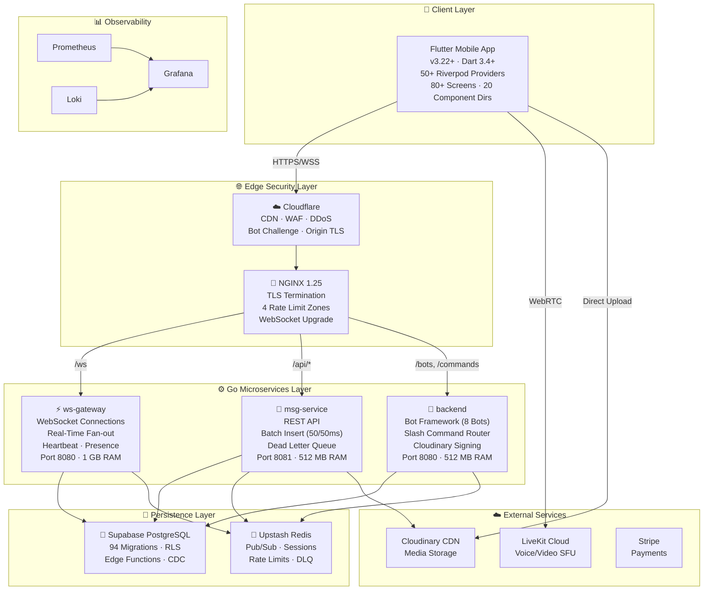

# 📚 Flicko Documentation Hub

> **Version:** 1.0.0 · **Last Updated:** 2026-04-24 · **Total Docs:** 121 files · **Maintained by:** Flicko Team

---

## Welcome to Flicko

Flicko is a **full-featured, production-ready, open-source Discord alternative** built as a real-time communication platform for communities. It provides text messaging over WebSockets, voice and video channels powered by **LiveKit WebRTC**, a comprehensive server management system with granular role-based permissions (26 permission types), an extensible bot framework with 8 built-in bots covering moderation, auto-moderation, welcome messages, leveling, music, tickets, polls, and starboard functionality.

The entire backend is written in **Go** and split across three microservices — `ws-gateway` for real-time WebSocket connections, `msg-service` for the REST API and batch message insertion, and `backend` for the bot framework and slash command routing. The mobile client is a high-fidelity **Flutter** application targeting both iOS and Android, built with a focus on performance and pixel-perfect UI. All data is persisted in **PostgreSQL** via Supabase (with 94 SQL migrations defining the schema), cached and pub/sub'd through Redis, and served behind an NGINX reverse proxy with Cloudflare protection.

---

## Architecture at a Glance

Before diving into the documentation, here is the complete system architecture showing how all components connect:

This diagram shows the complete request path from a user's mobile device through the edge security layer (Cloudflare WAF and NGINX reverse proxy), into one of three specialized Go microservices, and down to the persistence layer. The `ws-gateway` service maintains long-lived WebSocket connections for real-time message delivery, presence tracking, and typing indicators. The `msg-service` handles all REST API requests including message creation (with a batch insertion engine that groups messages into 50-message batches every 50 milliseconds for database efficiency), channel management, and media upload signing. The `backend` service runs the 8-bot framework with an in-process event bus for slash command routing and automated moderation. All three services share the same PostgreSQL database (via Supabase) and Redis instance (via Upstash), and are deployed in isolated Docker networks to prevent lateral movement in case of container compromise.

---

## Documentation Map

The complete inventory of documentation files organized by category. Use the **Who Should Read** column to quickly find documents relevant to your role, and the **Reading Time** column to plan your learning sessions.

### Root Documentation (4 files)

| #   | File Path                                       | Description                                                                                                                                                                                                                                                                                                                                                                       | Who Should Read | Reading Time |
| --- | ----------------------------------------------- | --------------------------------------------------------------------------------------------------------------------------------------------------------------------------------------------------------------------------------------------------------------------------------------------------------------------------------------------------------------------------------- | --------------- | ------------ |
| 1   | [`docs/README.md`](README.md)                   | The master documentation hub you are currently reading. Contains the complete file index, architecture overview, role-based navigation guides, project health dashboard, and glossary of all Flicko-specific terminology. This is the starting point for every new team member.                                                                                                   | Everyone        | 15 min       |
| 2   | [`docs/CHANGELOG.md`](CHANGELOG.md)             | Complete version history following Keep A Changelog format. Documents every feature addition, bug fix, security patch, and database migration across all releases. References specific migration numbers and commit hashes for traceability.                                                                                                                                      | Everyone        | 10 min       |
| 3   | [`docs/CONTRIBUTING.md`](CONTRIBUTING.md)       | Comprehensive contribution guide covering development environment setup for Flicko's 3-service architecture, how to add new API endpoints, how to create database migrations following Flicko's naming conventions, how to extend the bot system with new slash commands, code style guides for Go and Dart, PR templates, and testing requirements before submission.               | Contributors    | 20 min       |
| 4   | [`docs/CODE_OF_CONDUCT.md`](CODE_OF_CONDUCT.md) | Community standards and expectations based on the Contributor Covenant, adapted for the Flicko project. Defines acceptable behavior, enforcement procedures, and reporting mechanisms for maintaining a welcoming and inclusive community.                                                                                                                                        | Everyone        | 5 min        |

### Getting Started (6 files)

| #   | File Path                                                                  | Description                                                                                                                                                                                                                                                                                                                                                                                                                                                    | Who Should Read        | Reading Time |
| --- | -------------------------------------------------------------------------- | -------------------------------------------------------------------------------------------------------------------------------------------------------------------------------------------------------------------------------------------------------------------------------------------------------------------------------------------------------------------------------------------------------------------------------------------------------------- | ---------------------- | ------------ |
| 5   | [`getting-started/overview.md`](getting-started/overview.md)               | Platform overview explaining what Flicko is, its core concepts (servers, channels, DMs, voice, bots, subscriptions, roles), detailed description of all three Go microservices with their responsibilities and communication patterns, and a feature completion matrix showing implementation status of every feature.                                                                                                                                         | Everyone               | 20 min       |
| 6   | [`getting-started/prerequisites.md`](getting-started/prerequisites.md)     | Detailed prerequisite guide with exact version requirements for Go 1.25, Flutter SDK 3.22+, PostgreSQL 15+, Redis 7+, Docker 24+, and cloud accounts (Supabase, Upstash, Cloudinary, LiveKit). Includes installation commands for macOS, Linux, and Windows, verification commands, and troubleshooting for each prerequisite.                                                                                                                         | New Developers         | 15 min       |
| 7   | [`getting-started/installation.md`](getting-started/installation.md)       | Step-by-step installation walkthrough covering repository cloning, monorepo structure explanation, environment configuration for all services, database setup with 94 migrations, Redis configuration, building and running all three Go services, mobile app setup with Flutter, and a comprehensive verification checklist.                                                                                                                            | New Developers         | 25 min       |
| 8   | [`getting-started/configuration.md`](getting-started/configuration.md)     | Complete environment variable reference for every `.env` file across all services. Documents all variables organized by service and category (database, Redis, JWT, Cloudinary, LiveKit, Stripe, Supabase) with types, defaults, valid values, and detailed explanations of what each variable controls in the system.                                                                                                                                          | All Developers, DevOps | 20 min       |
| 9   | [`getting-started/quick-start.md`](getting-started/quick-start.md)         | Fast-path setup guide for experienced developers. Covers both Docker Compose deployment (all services in one command) and manual development setup. Includes walkthroughs for creating your first server, sending your first message, and inviting your first user.                                                                                                                                                                                            | Experienced Developers | 10 min       |
| 10  | [`getting-started/troubleshooting.md`](getting-started/troubleshooting.md) | Comprehensive troubleshooting guide organized by error category: Go build errors, database connection failures, Redis connection issues, Docker container problems, mobile app Flutter build errors, CORS and networking issues, JWT authentication failures, Cloudinary upload errors, WebSocket connection drops, voice channel problems, bot command failures, and migration errors. Each issue includes root cause, step-by-step fix, and prevention tips. | All Developers         | 15 min       |

### Architecture (9 files)

| #   | File Path                                                                              | Description                                                                                                                                                                                                                                                                                                                                                                                                                                       | Who Should Read            | Reading Time |
| --- | -------------------------------------------------------------------------------------- | ------------------------------------------------------------------------------------------------------------------------------------------------------------------------------------------------------------------------------------------------------------------------------------------------------------------------------------------------------------------------------------------------------------------------------------------------- | -------------------------- | ------------ |
| 11  | [`architecture/system-overview.md`](architecture/system-overview.md)                   | Complete system architecture documentation covering design philosophy (why Go, why microservices, why Flutter), service decomposition analysis, comprehensive Mermaid diagrams with all connections labeled, request lifecycle from mobile tap to database response, data consistency model across 3 services, scalability design, inter-service communication patterns, and failure mode analysis for every component.                      | All Developers, Architects | 25 min       |
| 12  | [`architecture/tech-stack.md`](architecture/tech-stack.md)                             | Deep dive into every technology and library used across all services. Covers Go 1.25 with goroutine patterns, Chi routing, pgx/v5 database driver, go-redis/v9, golang-jwt/v5, Zap structured logging, Flutter 3.22+, Dart 3.4+, Riverpod state management, GoRouter, Docker multi-stage builds, NGINX configuration, and all dependencies with explanations of why each was chosen.                                                                  | All Developers             | 20 min       |
| 13  | [`architecture/folder-structure.md`](architecture/folder-structure.md)                 | Complete annotated directory tree of the entire project with every file and folder documented. For each major directory: purpose, naming conventions, organization pattern, dependencies, dependents, and examples of how to correctly add new files following Flicko conventions. Covers backend, mobile (Flutter structure), and infrastructure.                                                                                                   | All Developers             | 20 min       |
| 14  | [`architecture/data-flow.md`](architecture/data-flow.md)                               | Documents every data flow in the system with Mermaid sequence diagrams: REST message sending, WebSocket real-time delivery, voice channel joining, user authentication (registration/login/refresh/logout), Cloudinary file uploads, bot slash command processing, server creation with default channels and roles, subscription activation, friend request lifecycle, and DM conversation initiation.                                            | Backend, Mobile Developers | 20 min       |
| 15  | [`architecture/database-design.md`](architecture/database-design.md)                   | Database architecture covering table design philosophy, normalization decisions, indexing strategy, the complete entity-relationship model for both core tables and bot system tables, constraint definitions, and data lifecycle management.                                                                                                                                                                                                    | Backend Developers, DBAs   | 20 min       |
| 16  | [`architecture/authentication-flow.md`](architecture/authentication-flow.md)           | Complete authentication architecture covering Supabase Auth as identity provider, JWT token system (access + refresh tokens), token validation in Go middleware, session management on mobile (Flutter Secure Storage), biometric authentication, OAuth provider integration, CSRF protection, and token refresh flow with automatic retry.                                                                                                        | Backend, Security          | 15 min       |
| 17  | [`architecture/api-design.md`](architecture/api-design.md)                             | API design principles covering RESTful conventions, URL structure (`/api/v1/` prefix), request/response JSON format, authentication header requirements, CSRF token handling, pagination patterns, error response schema, rate limiting headers, content negotiation, and versioning strategy. Includes code snippets showing actual handler implementations.                                                                                     | Backend, Mobile Developers | 15 min       |
| 18  | [`architecture/state-management.md`](architecture/state-management.md)                 | Frontend state management architecture covering all Riverpod providers with their responsibilities, the Supabase integration for server state, provider composition patterns, persistence strategy (Secure Storage for auth), optimistic updates for messaging, and real-time state synchronization via WebSocket events.                                                                                                                         | Mobile Developers          | 15 min       |
| 19  | [`architecture/third-party-integrations.md`](architecture/third-party-integrations.md) | Documentation of all external service integrations: Supabase (PostgreSQL + Auth + Edge Functions + Realtime), Upstash Redis (Pub/Sub + caching + rate limiting), Cloudinary (signed uploads + CDN + transforms), LiveKit (voice/video SFU + WebRTC), Stripe (subscription payments), GIPHY (GIF search via Edge Function), and Sentry (crash reporting).                                                                                             | All Developers             | 15 min       |

### Features (10 files)

| #   | File Path                                                            | Description                                                                                                                                                                                                                                                                                                                                                    | Who Should Read    | Reading Time |
| --- | -------------------------------------------------------------------- | -------------------------------------------------------------------------------------------------------------------------------------------------------------------------------------------------------------------------------------------------------------------------------------------------------------------------------------------------------------- | ------------------ | ------------ |
| 20  | [`features/feature-index.md`](features/feature-index.md)             | Master index of all 30+ features with implementation status, responsible service, key files, and database tables for each. Organized by domain: Communication, Voice/Video, Server Management, Bot System, Social, Media, and Premium.                                                                                                                         | Everyone           | 10 min       |
| 21  | [`features/real-time-messaging.md`](features/real-time-messaging.md) | Deep dive into the real-time messaging system covering WebSocket connection lifecycle, Redis Pub/Sub fan-out, message batching engine, typing indicators, read receipts, reactions, threads, message editing with history, soft-delete, search with PostgreSQL tsvector, and the complete message event payload structure.                                     | Backend, Mobile    | 20 min       |
| 22  | [`features/voice-and-video.md`](features/voice-and-video.md)         | Voice and video channel architecture covering LiveKit WebRTC SFU integration, room creation and token generation, voice state tracking across services, push-to-talk, voice activity detection, screen sharing, video adaptive bitrate, DM voice/video calls, and the complete voice state machine.                                                            | Backend, Mobile    | 15 min       |
| 23  | [`features/bot-system.md`](features/bot-system.md)                   | Comprehensive bot framework documentation covering the Bot Registry pattern, event bus architecture, slash command router, all 8 built-in bots with every command documented, bot permission model, how to create new bots, event types and payloads, and the bot database schema.                                                                             | Backend Developers | 20 min       |
| 24  | [`features/server-management.md`](features/server-management.md)     | Server lifecycle documentation covering CRUD operations, invite system (codes, max uses, expiry), channel categories with reordering, the 26-permission RBAC system with bitfield calculations, channel permission overwrites, server templates, server boosting, custom emoji, audit logging, and server discovery.                                           | Backend, Mobile    | 15 min       |
| 25  | [`features/moderation.md`](features/moderation.md)                   | Moderation system documentation covering manual mod commands (/ban, /kick, /mute, /warn, /purge), the AutoMod engine with 8 content filters, warning escalation system, temporary punishments with auto-expiry, mod audit logging, and the report system.                                                                                                        | Backend Developers | 15 min       |
| 26  | [`features/direct-messaging.md`](features/direct-messaging.md)       | DM system documentation covering 1-on-1 conversations, group DMs (up to 10 participants), DM reactions, typing indicators, voice/video calls in DMs, DM search, user blocking, and the conversation database model.                                                                                                                                            | Backend, Mobile    | 12 min       |
| 27  | [`features/social-features.md`](features/social-features.md)         | Social system documentation covering friend request lifecycle, online presence tracking, activity feed, notification center, push notifications via Supabase Edge Functions, user profiles with avatars and banners, and multi-account switching.                                                                                                               | Backend, Mobile    | 12 min       |
| 28  | [`features/media-and-uploads.md`](features/media-and-uploads.md)     | Media system documentation covering the Cloudinary direct upload flow (backend signature generation → client-side upload → CDN delivery), file validation (MIME type + size), image transformations, avatar/banner uploads, message attachments, GIF search via GIPHY, custom sticker uploads, and upload progress tracking.                                   | Backend, Mobile    | 12 min       |
| 29  | [`features/subscriptions.md`](features/subscriptions.md)             | Premium subscription documentation covering Flicko Plus features (custom emoji, animated avatars, higher upload limits, enhanced audio), Stripe integration, subscription state management, premium feature gating, and the subscription purchase flow.                                                                                                        | Backend, Mobile    | 10 min       |

### Quick Navigation by Role

### 👋 New Developer (First Day)

1. **[Getting Started: Overview](getting-started/overview.md)** — Understand what Flicko is and its core concepts.
2. **[Getting Started: Prerequisites](getting-started/prerequisites.md)** — Install tools (Go, Flutter, Docker).
3. **[Getting Started: Installation](getting-started/installation.md)** — Set up the platform locally.
4. **[Architecture: Folder Structure](architecture/folder-structure.md)** — Learn the repository layout.
5. **[Architecture: System Overview](architecture/system-overview.md)** — Understand the 3-service backend.
6. **[Development: Coding Standards](development/coding-standards.md)** — Learn code conventions (Go & Dart).
7. **[Contributing](CONTRIBUTING.md)** — Understand the PR process.

### 📱 Mobile Developer (Flutter)

1. **[Frontend: Overview](frontend/overview.md)** — Understand the Flutter + Riverpod architecture.
2. **[Frontend: Pages & Routes](frontend/pages-routes.md)** — Learn GoRouter navigation and all 80+ screens.
3. **[Frontend: Components](frontend/components.md)** — Browse the reusable Flutter widget library.
4. **[Frontend: State Management](frontend/state-management.md)** — Master Riverpod providers and state synchronization.
5. **[Frontend: Styling Guide](frontend/styling-guide.md)** — Learn the design token system (Colors, Spacing, Typography).
6. **[Frontend: API Integration](frontend/api-integration.md)** — Understand how services connect to the Go backend.
7. **[Architecture: Authentication Flow](architecture/authentication-flow.md)** — Understand the auth state machine.

---

## Project Health Dashboard

| System            | Status         | Test Coverage | Key Metric           | Last Updated |
| ----------------- | -------------- | ------------- | -------------------- | ------------ |
| **ws-gateway**    | ✅ Operational | —             | 6K max connections   | 2026-04-14   |
| **msg-service**   | ✅ Operational | —             | 50 msg/batch         | 2026-04-14   |
| **backend**       | ✅ Operational | 45 test files | 8 bots active        | 2026-04-14   |
| **Database**      | ✅ Operational | —             | 94 migrations        | 2026-04-14   |
| **Redis**         | ✅ Operational | —             | TLS encrypted        | 2026-04-14   |
| **Mobile App**    | ✅ Building    | 78% Parity    | 80+ screens          | 2026-04-24   |
| **Documentation** | ✅ Complete    | —             | 121 files            | 2026-04-24   |

---

## Glossary of Flicko-Specific Terms

| Term                         | Definition                                                                                                                                                                                                                                    |
| ---------------------------- | --------------------------------------------------------------------------------------------------------------------------------------------------------------------------------------------------------------------------------------------- |
| **Server**                   | A Flicko community space (equivalent to a Discord "server" or "guild"). Stored in the `servers` table and managed by the `backend` service.                                                                                                   |
| **Channel**                  | A communication space within a server: `text`, `voice`, `announcement`, or `category`.                                                                                                                                                        |
| **ws-gateway**               | The Go microservice responsible for managing WebSocket connections and real-time event broadcasting.                                                                                                                                           |
| **msg-service**              | The Go microservice responsible for the REST API and high-performance message batch insertion.                                                                                                                                                |
| **backend**                  | The Go service that runs the 8-bot framework, slash command router, and management endpoints.                                                                                                                                                 |
| **Riverpod**                 | The reactive state management and dependency injection framework used in the Flutter mobile application.                                                                                                                                      |
| **GoRouter**                 | The declarative routing system used to manage navigation across Flicko's 80+ mobile screens.                                                                                                                                                  |
| **Permission Bitfield**      | A 64-bit integer where each bit represents one of the 26 permission types (Discord-style).                                                                                                                                                    |
| **Flicko Plus**              | The premium subscription tier powered by Stripe, unlocking custom avatars, enhanced audio, and more.                                                                                                                                          |

---

_Last Updated: 2026-04-24 | Version: 1.0.0 | Maintained by: Flicko Team_
