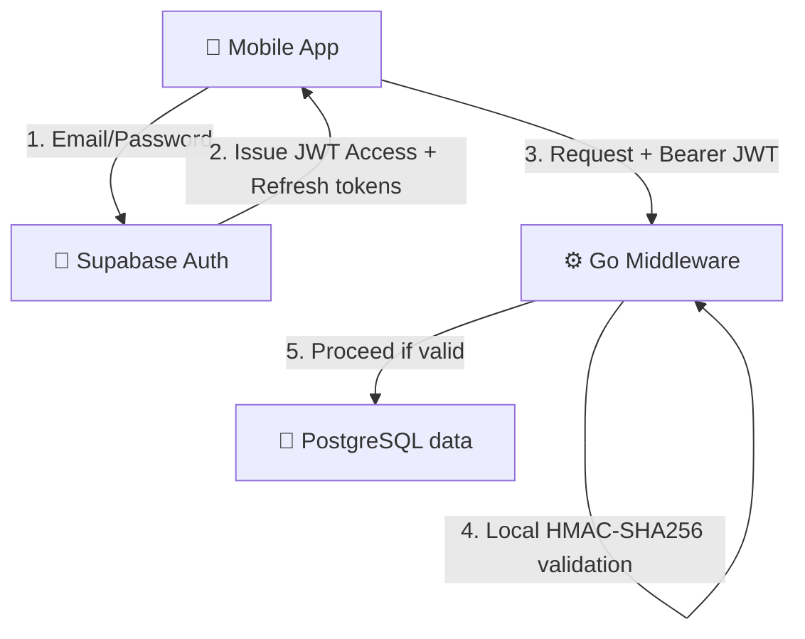
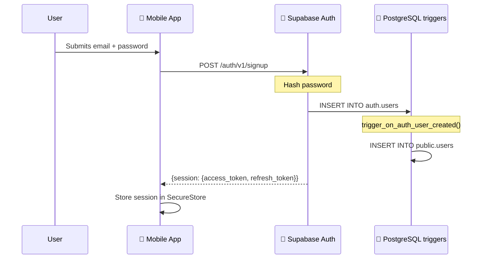
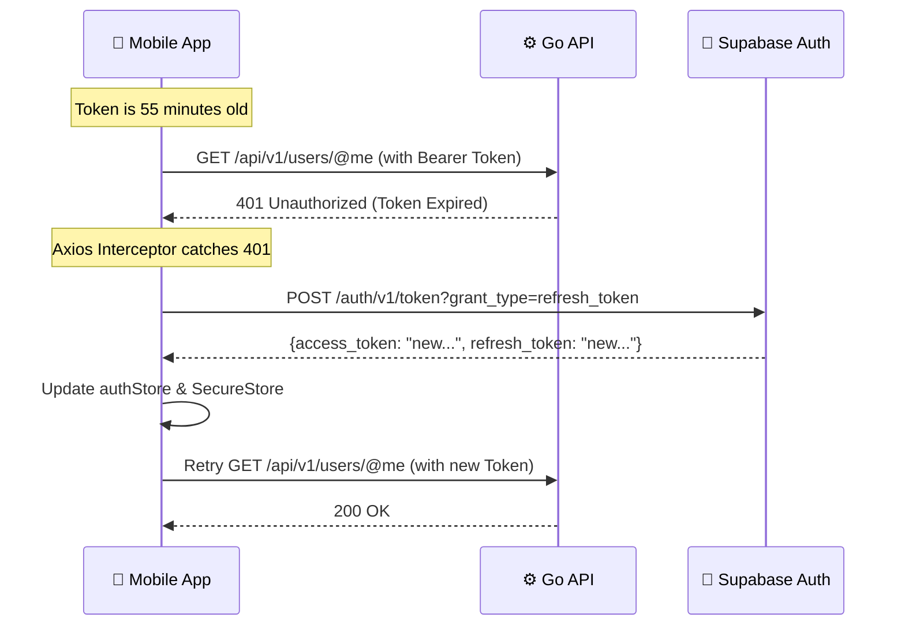

# Authentication Flow

> **Reading time:** ~15 minutes · **Audience:** Backend, Security, Mobile Developers · **Last Updated:** 2026-04-11

This document explains the complete authentication architecture of Flicko. It covers identity provision via Supabase Auth, JWT validation in the Go middleware, session management on the mobile app, and security measures like token refresh and CSRF protection.

---

## Table of Contents

- [Authentication Architecture](#authentication-architecture)
- [Identity Provider: Supabase Auth](#identity-provider-supabase-auth)
- [Token System Overview](#token-system-overview)
- [Backend JWT Validation](#backend-jwt-validation)
- [Mobile Session Management](#mobile-session-management)
- [Authentication Flows](#authentication-flows)
- [Biometric Authentication](#biometric-authentication)
- [Security Hardening](#security-hardening)

---

## Authentication Architecture

Flicko delegates identity provision (passwords, OAuth, email verification) to Supabase Auth, but enforces authentication locally in the Go backend. This hybrid approach gives us the security of a managed identity provider without the latency of making an API call to Supabase for every request.



---

## Identity Provider: Supabase Auth

Supabase Auth is built on top of GoTrue (Netlify's open-source auth engine) and integrates deeply with PostgreSQL Row-Level Security.

**Handled by Supabase:**
- User registration (Email/Password)
- Secure password hashing (Argon2id)
- OAuth Providers (Google, GitHub, Discord, Apple)
- Email verification and magic links
- Password reset flows
- JWT issuance and signing
- Refresh token rotation

**Handled by Flicko:**
- JWT signature validation
- Token expiration checking
- RBAC permission checking (via database)
- User profile data (avatars, bio)

The `users` table in our `public` schema has a 1-to-1 relationship with Supabase's internal `auth.users` table:
`public.users.id` == `auth.users.id`

---

## Token System Overview

Flicko uses a dual-token architecture:

### 1. Access Token (JWT)
- **Format:** JSON Web Token (JWT)
- **Signature Algorithm:** HMAC-SHA256 (HS256)
- **Time-to-Live (TTL):** 1 hour (default)
- **Usage:** Sent in the `Authorization: Bearer <token>` header of every API and WebSocket request.
- **Storage (Mobile):** In-memory (Zustand authStore)

**JWT Payload Structure:**
```json
{
  "aud": "authenticated",
  "exp": 1712850000,
  "iat": 1712846400,
  "iss": "https://<project-ref>.supabase.co/auth/v1",
  "sub": "550e8400-e29b-41d4-a716-446655440000",
  "email": "user@example.com",
  "role": "authenticated"
}
```

### 2. Refresh Token
- **Format:** Opaque string
- **Time-to-Live (TTL):** Endless (until used or revoked)
- **Usage:** Sent only to Supabase Auth to obtain a new Access Token.
- **Storage (Mobile):** `expo-secure-store` (Encrypted at rest)

---

## Backend JWT Validation

To avoid calling Supabase on every request, the Go API validates the JWT signature purely mathematically using the `JWT_SECRET` environment variable.

The validation logic lives in `backend/internal/middleware/auth.go`:

```go
func ValidateJWT(next http.Handler) http.Handler {
    return http.HandlerFunc(func(w http.ResponseWriter, r *http.Request) {
        // 1. Extract Bearer token
        authHeader := r.Header.Get("Authorization")
        if authHeader == "" || !strings.HasPrefix(authHeader, "Bearer ") {
            respondError(w, 401, "Missing or invalid Authorization header")
            return
        }
        tokenString := authHeader[7:]

        // 2. Parse and validate signature
        token, err := jwt.Parse(tokenString, func(token *jwt.Token) (interface{}, error) {
            // Ensure signing method is HMAC (prevents 'none' algorithm bypass)
            if _, ok := token.Method.(*jwt.SigningMethodHMAC); !ok {
                return nil, fmt.Errorf("unexpected signing method: %v", token.Header["alg"])
            }
            return config.GetJWTSecret(), nil
        })

        // 3. Handle validation errors
        if err != nil || !token.Valid {
            respondError(w, 401, "Invalid or expired token")
            return
        }

        // 4. Extract subject (user ID)
        claims, ok := token.Claims.(jwt.MapClaims)
        if !ok {
            respondError(w, 401, "Invalid token claims")
            return
        }
        
        userIDStr, ok := claims["sub"].(string)
        if !ok {
            respondError(w, 401, "Missing subject claim")
            return
        }
        
        userID, err := uuid.Parse(userIDStr)
        if err != nil {
            respondError(w, 401, "Invalid subject UUID format")
            return
        }

        // 5. Inject user_id into request context
        ctx := context.WithValue(r.Context(), "user_id", userID)
        next.ServeHTTP(w, r.WithContext(ctx))
    })
}
```

---

## Mobile Session Management

State is managed by the `authStore.ts` Zustand store.

1. **App Launch:** The app checks `expo-secure-store` for an existing session JSON string.
2. **Restoration:** If found, Supabase SDK restores the session. If the Access Token is expired, the SDK automatically uses the Refresh Token to get a new one.
3. **Storage:** Only the session object (containing the refresh token) is written to encrypted storage.

```typescript
// Setup in shared/services/auth.service.ts
import * as SecureStore from 'expo-secure-store';
import { createClient } from '@supabase/supabase-js';

const ExpoSecureStoreAdapter = {
  getItem: (key: string) => {
    return SecureStore.getItemAsync(key);
  },
  setItem: (key: string, value: string) => {
    return SecureStore.setItemAsync(key, value);
  },
  removeItem: (key: string) => {
    return SecureStore.deleteItemAsync(key);
  },
};

export const supabase = createClient(SUPABASE_URL, SUPABASE_ANON_KEY, {
  auth: {
    storage: ExpoSecureStoreAdapter,
    autoRefreshToken: true,
    persistSession: true,
    detectSessionInUrl: false,
  },
});
```

---

## Authentication Flows

### Flow 1: Registration



### Flow 2: Token Refresh

Tokens expire after 1 hour. The Supabase JS SDK handles refreshing automatically, but the app must handle network errors during refresh.



---

## Biometric Authentication

To secure access to the app itself (e.g., when the device is unlocked but handed to someone else), Flicko supports biometric app locks.

**Implementation (`mobile/app/settings/security.tsx`):**
1. Check device capabilities using `LocalAuthentication.hasHardwareAsync()` and `isEnrolledAsync()`.
2. If enabled in settings, the app renders a blur view over the navigation stack when returning from the background.
3. Calls `LocalAuthentication.authenticateAsync()`.
4. If successful, dismisses the blur view.

*Note: Biometrics only unlock the UI; the actual API authentication still relies on the Bearer JWT.*

---

## Security Hardening

### 1. Algorithm Confusion Prevention
The Go middleware explicitly checks that `token.Method` is `*jwt.SigningMethodHMAC`. This prevents attacks where a malicious client modifies the JWT's `alg` header to `none` (bypassing signature validation) or `RS256` (forcing the server to treat the HMAC secret as an RSA public key).

### 2. TLS/SSL Only
All authentication tokens must traverse encrypted networks. NGINX rejects all HTTP traffic (`return 301 https://$host$request_uri;`), ensuring tokens are never sent in plaintext over the wire.

### 3. Rate Limiting Brute Force
Supabase handles login rate limiting (default: 5 requests per hour for password resets, 30 per hour for login). If an attacker bypasses the client, they hit the Supabase edge.

### 4. WebSocket Upgrade Auth
WebSockets cannot send HTTP headers easily from all clients. The `ws-gateway` connection flow requires an `OpIdentify` packet containing the JWT as the very first message. If the token is invalid or missing within 5 seconds, the server forcefully closes the TCP socket.

---

## Related Documentation

- [Security: Authorization](authorization.md) — What happens *after* identity is validated
- [Security: Middleware](middleware.md) — The 10-layer defense pipeline
- [Architecture: Data Flow](data-flow.md) — Component interactions
- [API: Authentication](../api/authentication.md) — How to format requests

---

*Last Updated: 2026-04-11 | Version: 1.0.0 | Maintained by: Flicko Team*
