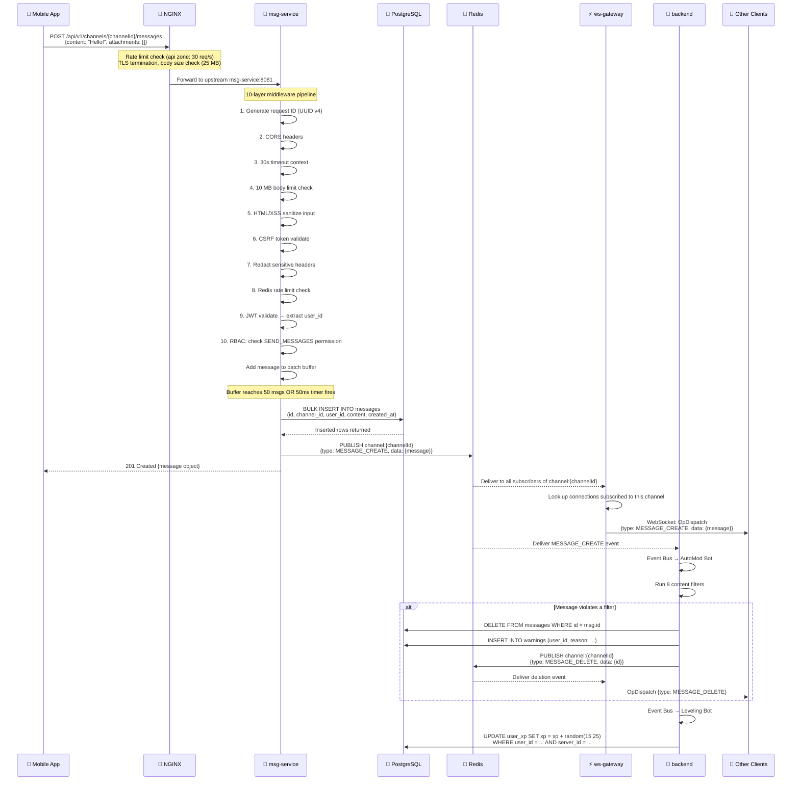
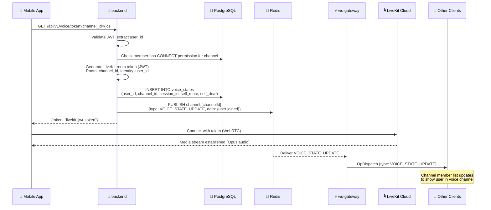
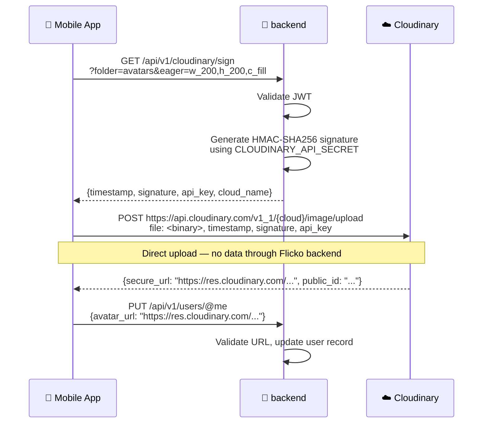
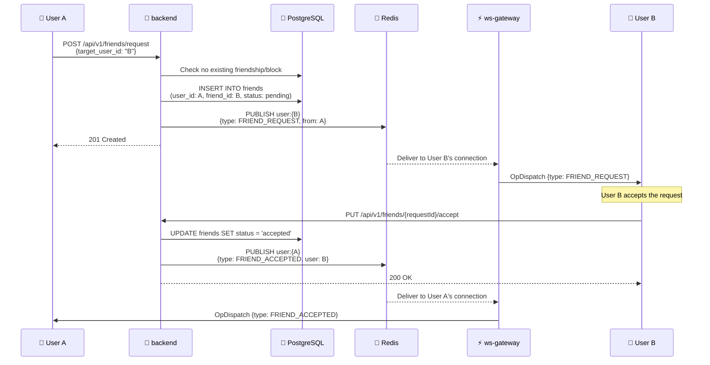
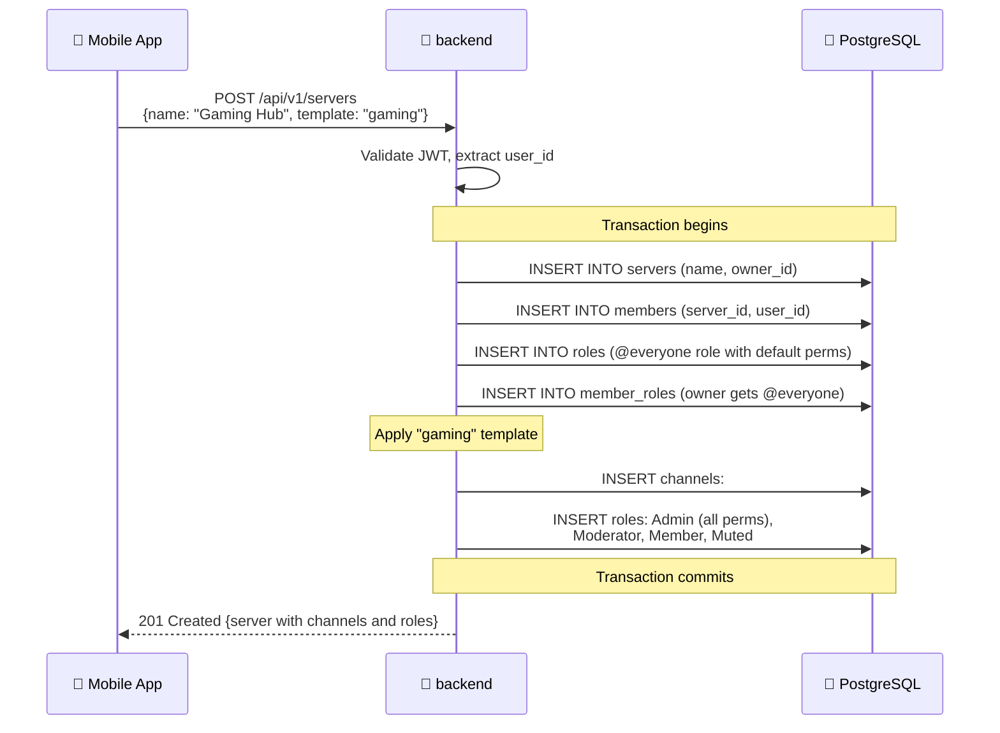
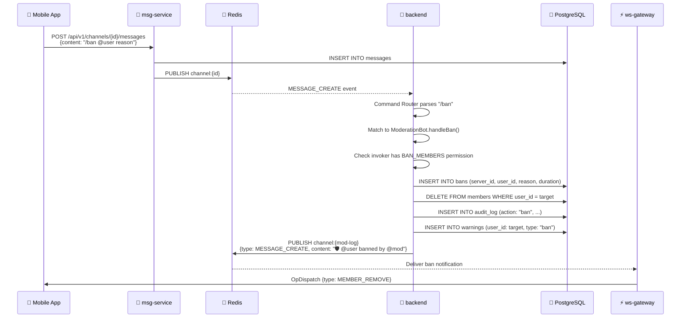
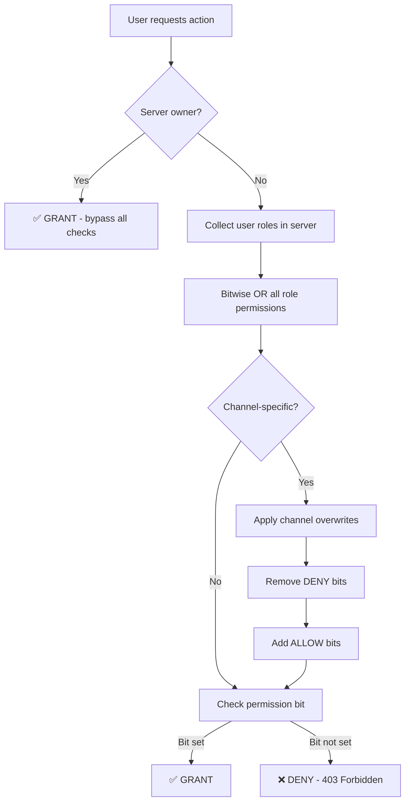
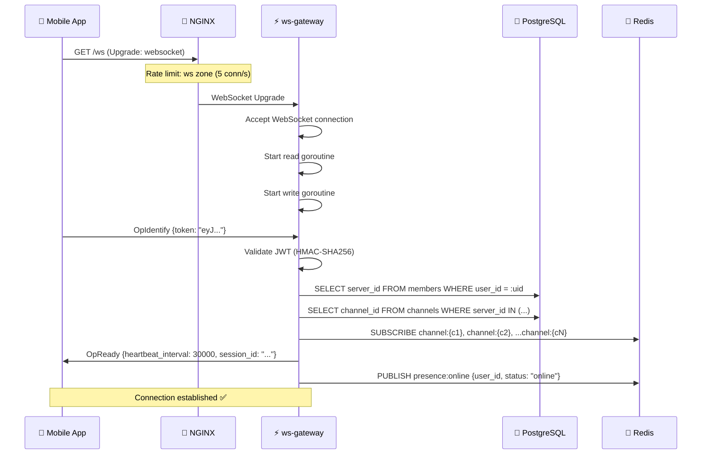

# Data Flow Architecture

> **Reading time:** ~20 minutes · **Audience:** All Developers · **Last Updated:** 2026-04-11

This document traces every major data flow through the Flicko system — from user action to database persistence to real-time delivery. Each flow shows the exact services, handlers, Redis channels, and database tables involved. Use this to understand how features work end-to-end and to debug issues at any point in the pipeline.

---

## Flow 1: User Sends a Message

This is the most common flow in Flicko, involving all three services.



**Key observations:**
- The message is persisted to PostgreSQL BEFORE it's delivered via WebSocket. This ensures no message loss even if ws-gateway crashes.
- AutoMod runs asynchronously — the sender gets a 201 response immediately. If AutoMod deletes the message, all clients receive a `MESSAGE_DELETE` event.
- The batcher groups up to 50 messages into a single INSERT, reducing database round-trips from ~50/sec to ~1/sec under load.

---

## Flow 2: User Joins a Voice Channel



---

## Flow 3: Direct Upload to Cloudinary



**Key design decision:** Media never passes through Flicko's backend servers. This prevents the Flicko VPS from being a bandwidth bottleneck and leverages Cloudinary's global CDN edge network. The backend only handles signature generation (~100 bytes of data per request).

---

## Flow 4: Friend Request Lifecycle



---

## Flow 5: Server Creation with Template



---

## Flow 6: Bot Slash Command Execution



---

## Flow 7: Permission Calculation

When checking if a user can perform an action (e.g., send a message in a specific channel), the permission system follows this calculation:

```
Step 1: Collect user's roles in the server
    SELECT r.permissions FROM roles r
    JOIN member_roles mr ON mr.role_id = r.id
    JOIN members m ON m.id = mr.member_id
    WHERE m.user_id = :user_id AND m.server_id = :server_id

Step 2: Combine role permissions with bitwise OR
    base_permissions = role1.perms | role2.perms | role3.perms

Step 3: Check if server owner (bypass all checks)
    IF user_id == server.owner_id → GRANT ALL

Step 4: Apply channel overwrites
    FOR each overwrite WHERE channel_id = :channel_id:
        base_permissions &= ~overwrite.deny    -- Remove denied bits
        base_permissions |= overwrite.allow     -- Add allowed bits

Step 5: Check specific permission bit
    has_permission = (base_permissions & REQUIRED_PERMISSION) != 0
```



---

## Flow 8: WebSocket Connection Establishment



---

## Related Documentation

- [Architecture: System Overview](system-overview.md) — Service responsibilities and communication patterns
- [Architecture: Database Design](database-design.md) — Tables and relationships referenced in these flows
- [Security: Middleware Pipeline](../security/middleware-pipeline.md) — Detailed breakdown of the 10-layer pipeline shown in Flow 1
- [Features: Real-Time Messaging](../features/real-time-messaging.md) — User-facing feature documentation for messaging

---

*Last Updated: 2026-04-11 | Version: 1.0.0 | Maintained by: Flicko Team*
