# Database Design

> **Reading time:** ~20 minutes · **Audience:** Backend, Database developers · **Last Updated:** 2026-04-11

Complete documentation of Flicko's database schema — all tables, columns, relationships, indexes, constraints, and Row-Level Security policies. The schema is defined through 65 Supabase migrations and 3 backend migrations.

---

## Entity-Relationship Diagram

```mermaid
erDiagram
    users ||--o{ members : "joins servers"
    users ||--o{ messages : "sends"
    users ||--o{ friends : "has friends"
    users ||--o{ dm_participants : "participates in DMs"
    users ||--o{ voice_states : "joins voice"
    users ||--o{ user_xp : "earns XP"

    servers ||--o{ channels : "contains"
    servers ||--o{ members : "has members"
    servers ||--o{ roles : "defines roles"
    servers ||--o{ invites : "generates"
    servers ||--o{ bots : "enables bots"
    servers ||--o{ mod_settings : "configures moderation"
    servers ||--o{ automod_settings : "configures automod"
    servers ||--o{ welcome_settings : "configures welcome"
    servers ||--o{ level_settings : "configures leveling"
    servers ||--o{ ticket_settings : "configures tickets"
    servers ||--o{ starboard_settings : "configures starboard"

    channels ||--o{ messages : "contains"
    channels ||--o{ voice_states : "hosts voice"
    channels ||--o{ permission_overwrites : "has overrides"
    channels ||--o{ threads : "has threads"

    messages ||--o{ reactions : "has reactions"
    messages |o--o| messages : "reply_to"
    messages |o--o| threads : "belongs to thread"

    members ||--o{ member_roles : "assigned"
    roles ||--o{ member_roles : "assigned to"

    dm_conversations ||--o{ dm_participants : "has"
    dm_conversations ||--o{ dm_messages : "contains"

    tickets ||--o{ ticket_settings : "configured by"
    starboard_entries ||--o{ starboard_settings : "configured by"

    users {
        uuid id PK
        text email
        text username
        text display_name
        text avatar_url
        text banner_url
        text bio
        text status
        text status_emoji
        timestamptz created_at
        timestamptz updated_at
    }

    servers {
        uuid id PK
        text name
        text description
        text icon_url
        text banner_url
        uuid owner_id FK
        text template
        timestamptz created_at
        timestamptz updated_at
    }

    channels {
        uuid id PK
        uuid server_id FK
        text type
        text name
        text topic
        int position
        uuid parent_id FK
        int slowmode_seconds
        bool nsfw
        timestamptz created_at
    }

    messages {
        uuid id PK
        uuid channel_id FK
        uuid user_id FK
        text content
        uuid reply_to_id FK
        uuid thread_id FK
        bool pinned
        timestamptz edited_at
        timestamptz deleted_at
        timestamptz created_at
    }

    members {
        uuid id PK
        uuid server_id FK
        uuid user_id FK
        text nickname
        timestamptz joined_at
    }

    roles {
        uuid id PK
        uuid server_id FK
        text name
        text color
        int position
        bigint permissions
        bool hoist
        bool mentionable
        timestamptz created_at
    }

    member_roles {
        uuid id PK
        uuid member_id FK
        uuid role_id FK
    }

    invites {
        uuid id PK
        uuid server_id FK
        uuid creator_id FK
        text code
        int max_uses
        int uses
        timestamptz expires_at
        timestamptz created_at
    }

    friends {
        uuid id PK
        uuid user_id FK
        uuid friend_id FK
        text status
        timestamptz created_at
    }

    reactions {
        uuid id PK
        uuid message_id FK
        uuid user_id FK
        text emoji
        timestamptz created_at
    }

    voice_states {
        uuid id PK
        uuid user_id FK
        uuid channel_id FK
        text session_id
        bool self_mute
        bool self_deaf
        bool suppress
        timestamptz joined_at
    }

    dm_conversations {
        uuid id PK
        bool is_group
        text name
        timestamptz created_at
        timestamptz updated_at
    }

    dm_participants {
        uuid id PK
        uuid conversation_id FK
        uuid user_id FK
        timestamptz joined_at
    }

    dm_messages {
        uuid id PK
        uuid conversation_id FK
        uuid sender_id FK
        text content
        timestamptz created_at
    }

    threads {
        uuid id PK
        uuid channel_id FK
        uuid message_id FK
        text name
        bool archived
        timestamptz created_at
    }

    permission_overwrites {
        uuid id PK
        uuid channel_id FK
        uuid target_id
        text target_type
        bigint allow_bits
        bigint deny_bits
    }

    warnings {
        uuid id PK
        uuid server_id FK
        uuid user_id FK
        uuid moderator_id FK
        text reason
        text type
        timestamptz created_at
    }

    user_xp {
        uuid id PK
        uuid user_id FK
        uuid server_id FK
        int xp
        int level
        timestamptz last_xp_at
    }

    tickets {
        uuid id PK
        uuid server_id FK
        uuid user_id FK
        uuid channel_id FK
        text status
        text subject
        timestamptz created_at
        timestamptz closed_at
    }

    starboard_entries {
        uuid id PK
        uuid server_id FK
        uuid message_id FK
        uuid starboard_message_id
        int star_count
        timestamptz created_at
    }

    mod_settings {
        uuid id PK
        uuid server_id FK
        uuid mod_log_channel_id FK
        bool dm_on_warn
        bool dm_on_ban
    }

    automod_settings {
        uuid id PK
        uuid server_id FK
        bool enabled
        jsonb filters
        jsonb whitelist
    }

    welcome_settings {
        uuid id PK
        uuid server_id FK
        uuid channel_id FK
        text join_message
        text leave_message
        uuid auto_role_id FK
    }

    level_settings {
        uuid id PK
        uuid server_id FK
        uuid announce_channel_id FK
        int xp_per_message
        int xp_cooldown_seconds
        jsonb role_rewards
    }

    ticket_settings {
        uuid id PK
        uuid server_id FK
        uuid category_id FK
        text opening_message
        bool enabled
    }

    starboard_settings {
        uuid id PK
        uuid server_id FK
        uuid channel_id FK
        int threshold
        text emoji
    }
```



---

## Core Tables

### users
**Migration:** 001_initial_schema.up.sql
**Row count estimate:** Scales with registered users (no hard limit)
**Primary key:** `id` (UUID, generated by Supabase Auth)

This table extends Supabase Auth's `auth.users` table with Flicko-specific profile data. The `id` column matches the Supabase Auth user ID (UUID), allowing JOINs between the auth system and application data. Profile fields (`avatar_url`, `banner_url`, `bio`, `status`) are updated via the user settings API.

### servers
**Migration:** 001_initial_schema.up.sql
**Indexes:** `idx_servers_owner_id` on `owner_id`
**Cascade:** Deleting a server cascades to `channels`, `members`, `roles`, `invites`, and all bot settings tables

When `owner_id` is changed (ownership transfer), the old owner loses administrative bypass but retains their membership. The `template` column stores which template was used at creation ("gaming", "study_group", "community", or null for custom).

### channels
**Migration:** 001_initial_schema.up.sql
**Indexes:** `idx_channels_server_id` on `server_id`, `idx_channels_parent_id` on `parent_id`
**CHECK constraint:** `type IN ('text', 'voice', 'announcement', 'category')`

The `parent_id` column creates a tree structure: category channels have `parent_id = NULL`, and other channels point to a category via `parent_id`. The `position` column enables drag-to-reorder; when reordering, the backend updates all affected positions in a single transaction.

### messages
**Migration:** 001_initial_schema.up.sql
**Indexes:** `idx_messages_channel_id_created_at` (composite), `idx_messages_user_id`, `idx_messages_thread_id`, full-text search index using `tsvector`
**Soft delete:** `deleted_at IS NOT NULL` means the message is deleted but retained for audit

The composite index on `(channel_id, created_at)` is the most critical index in the database — every message list query uses it. The full-text search index enables the `/search` API endpoint, powering the mobile app's global search feature.

### members
**Migration:** 001_initial_schema.up.sql
**Unique constraint:** `(server_id, user_id)` — a user can only be a member of a server once
**Cascade:** Used in permission calculations — if a member is deleted, their roles and voice states are also cleaned up

### roles
**Migration:** 001_initial_schema.up.sql
**The `permissions` column** stores 26 permission types as bits in a 64-bit integer (`bigint`):

| Bit | Permission | Hex Value |
|-----|-----------|-----------|
| 0 | VIEW_CHANNEL | 0x1 |
| 1 | SEND_MESSAGES | 0x2 |
| 2 | READ_MESSAGE_HISTORY | 0x4 |
| 3 | MANAGE_SERVER | 0x8 |
| 4 | MANAGE_CHANNELS | 0x10 |
| 5 | MANAGE_ROLES | 0x20 |
| 6 | MANAGE_MESSAGES | 0x40 |
| 7 | KICK_MEMBERS | 0x80 |
| 8 | BAN_MEMBERS | 0x100 |
| 9 | MANAGE_INVITES | 0x200 |
| 10 | MANAGE_WEBHOOKS | 0x400 |
| 11 | MANAGE_EMOJI | 0x800 |
| 12 | CONNECT (voice) | 0x1000 |
| 13 | SPEAK (voice) | 0x2000 |
| 14 | VIDEO | 0x4000 |
| 15 | MUTE_MEMBERS | 0x8000 |
| 16 | DEAFEN_MEMBERS | 0x10000 |
| 17 | MOVE_MEMBERS | 0x20000 |
| 18 | MODERATE | 0x40000 |
| 19 | CREATE_INVITES | 0x80000 |
| 20 | EMBED_LINKS | 0x100000 |
| 21 | ATTACH_FILES | 0x200000 |
| 22 | MENTION_EVERYONE | 0x400000 |
| 23 | USE_EXTERNAL_EMOJI | 0x800000 |
| 24 | ADD_REACTIONS | 0x1000000 |
| 25 | ADMINISTRATOR | 0x2000000 |

---

## Bot System Tables

All bot tables were created in migration `002_bot_system_tables.sql` (291 lines). Each bot has its own settings table, plus shared tables for cross-bot data.

### automod_settings
The `filters` JSONB column stores the 8 AutoMod filter configurations. Each filter has `enabled`, `action`, and filter-specific parameters. Example:
```json
{
  "invite_links": {"enabled": true, "action": "delete_warn"},
  "external_links": {"enabled": true, "allowlist": ["github.com", "stackoverflow.com"]},
  "excessive_caps": {"enabled": true, "threshold": 70},
  "emoji_spam": {"enabled": true, "max_per_message": 10},
  "mass_mentions": {"enabled": true, "max_mentions": 5},
  "duplicate_messages": {"enabled": true, "time_window": 60},
  "word_blacklist": {"enabled": true, "words": ["badword1", "badword2"]},
  "spam_detection": {"enabled": true, "similar_threshold": 3, "time_window": 10}
}
```

---

## Row-Level Security Policies

Migration `034_advanced_rls_policies.sql` (13.3 KB) establishes comprehensive RLS policies. Key policies:

**messages:** Users can only SELECT messages in channels they have `VIEW_CHANNEL` permission for. Users can only UPDATE their own messages. Users can only DELETE their own messages OR messages in channels where they have `MANAGE_MESSAGES` permission.

**members:** Users can see members of servers they belong to. Only server administrators can modify member records.

**dm_messages:** Users can only SELECT/INSERT messages in conversations they participate in. Enforced via a subquery on `dm_participants`.

---

## Permission Calculation Functions

Migration `035_permission_calculation_functions.sql` (6.9 KB) creates SQL functions used in RLS policies:

```sql
-- Calculate combined permissions for a user in a server
CREATE OR REPLACE FUNCTION calculate_permissions(p_user_id UUID, p_server_id UUID)
RETURNS BIGINT AS $$
    SELECT COALESCE(BIT_OR(r.permissions), 0)
    FROM roles r
    JOIN member_roles mr ON mr.role_id = r.id
    JOIN members m ON m.id = mr.member_id
    WHERE m.user_id = p_user_id AND m.server_id = p_server_id
$$ LANGUAGE sql STABLE;

-- Check if a user has a specific permission in a server
CREATE OR REPLACE FUNCTION has_permission(p_user_id UUID, p_server_id UUID, p_permission BIGINT)
RETURNS BOOLEAN AS $$
    SELECT (calculate_permissions(p_user_id, p_server_id) & p_permission) = p_permission
$$ LANGUAGE sql STABLE;

-- Check permission with channel overwrites
CREATE OR REPLACE FUNCTION check_channel_permission(
    p_user_id UUID, p_server_id UUID, p_channel_id UUID, p_permission BIGINT
) RETURNS BOOLEAN AS $$ ... $$ LANGUAGE sql STABLE;
```

---

## Related Documentation

- [Database: Schema](../database/schema.md) — Detailed column-level documentation
- [Database: Migrations](../database/migrations.md) — Migration history and procedures
- [Architecture: Data Flow](data-flow.md) — How data moves through these tables
- [Security: RLS Policies](../security/rls-policies.md) — Row-Level Security details

---

*Last Updated: 2026-04-11 | Version: 1.0.0 | Maintained by: Flicko Team*
