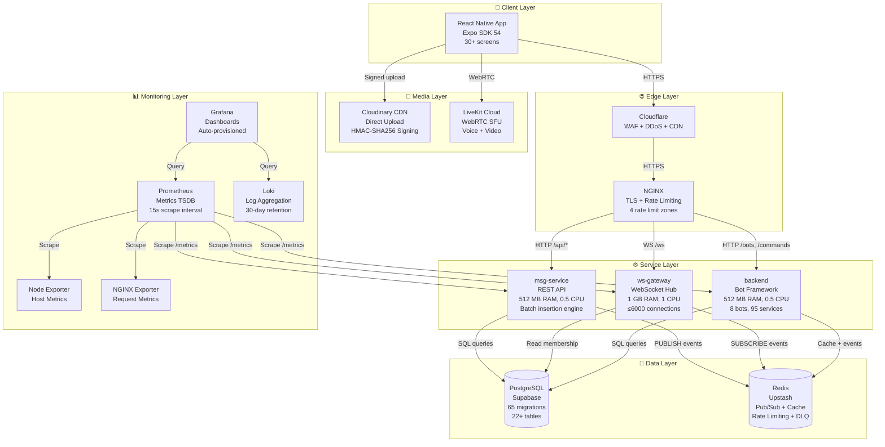
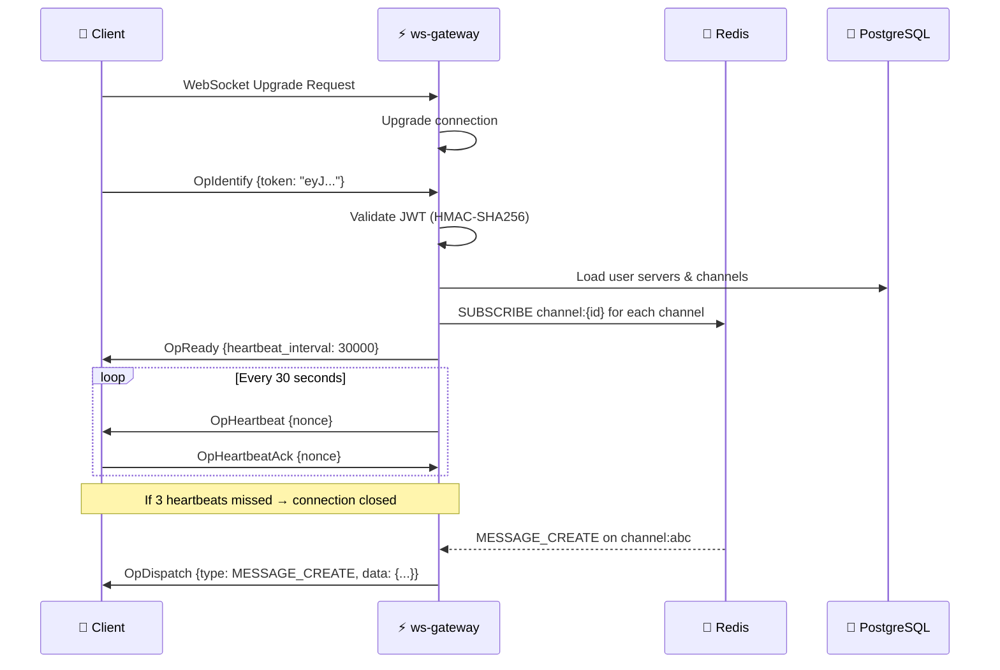
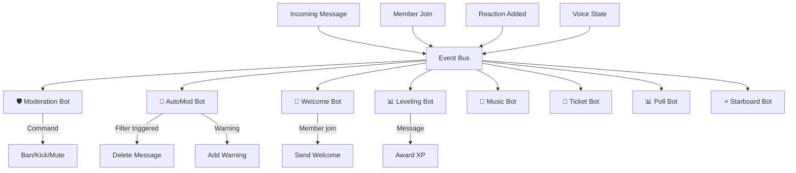

# System Architecture Overview

> **Reading time:** ~25 minutes · **Audience:** All Developers, Architects · **Last Updated:** 2026-04-11

This document provides a comprehensive technical analysis of Flicko's system architecture — the three-service microservice decomposition, inter-service communication patterns, data flow through the system, scalability design, failure modes, and the rationale behind every major architectural decision. Understanding this architecture is essential for contributing to any part of the codebase.

---

## Table of Contents

- [Architecture Philosophy](#architecture-philosophy)
- [High-Level System Diagram](#high-level-system-diagram)
- [Service Decomposition](#service-decomposition)
- [Inter-Service Communication](#inter-service-communication)
- [Data Flow Patterns](#data-flow-patterns)
- [Scalability Design](#scalability-design)
- [Failure Mode Analysis](#failure-mode-analysis)
- [Technology Selection Rationale](#technology-selection-rationale)

---

## Architecture Philosophy

Flicko's architecture follows three guiding principles:

1. **Single-VPS deployability** — The entire stack (3 Go services, NGINX, and a 5-component monitoring stack) runs on a single 8 GB RAM VPS. This constraint shapes every decision — from choosing Go's minimal memory footprint over Java/Node.js to using Redis Pub/Sub over a dedicated message broker like Kafka. The target is 3,000–5,000 concurrent users on hardware costing $20-40/month.

2. **Separation by connection type** — Services are split by their connection characteristics, not by business domain. `ws-gateway` handles long-lived WebSocket connections (stateful, memory-intensive, CPU-light), `msg-service` handles short-lived HTTP requests (stateless, I/O-bound), and `backend` handles event-driven bot processing (CPU-moderate, bursty). This allows each service to be tuned independently — the gateway gets more memory for connection state, the API gets more CPU for request processing.

3. **Shared-nothing communication** — Services never call each other directly. All inter-service communication flows through Redis Pub/Sub or the shared PostgreSQL database. This means any service can be restarted independently without affecting the others (except for a brief gap in functionality). There are no service-to-service HTTP calls, gRPC channels, or shared memory segments.

---

## High-Level System Diagram



---

## Service Decomposition

### Why Three Services?

The decision to split Flicko into three services (rather than a monolith or a finer-grained microservice mesh) was driven by the connection-type separation principle:

| Service | Connection Type | State Model | Resource Profile | Why Separate |
|---------|----------------|-------------|-----------------|-------------|
| **ws-gateway** | Long-lived WebSocket | Stateful (per-connection) | Memory-heavy (130 KB/conn) | WebSocket connections consume memory proportional to connection count. Isolating this allows memory tuning without affecting the API. |
| **msg-service** | Short-lived HTTP | Stateless | I/O-bound (DB + Redis) | REST requests are quick and stateless. This service can be scaled horizontally by adding replicas behind a load balancer. |
| **backend** | Event-driven | Stateful (bot state) | CPU-bursty (filter processing) | Bot processing (especially AutoMod's 8 filters) is CPU-intensive in bursts. Isolating prevents bots from stealing resources from user-facing APIs. |

A monolith would be simpler but would force a single memory/CPU profile for fundamentally different workloads. A finer decomposition (e.g., separate services per bot, per feature area) would add operational complexity without meaningful benefits at the target scale of 3,000–5,000 users.

### Service 1: ws-gateway

```
services/ws-gateway/
├── cmd/
│   └── gateway/
│       └── main.go              # Entry point, server initialization
├── internal/
│   ├── hub/
│   │   └── hub.go               # Central connection manager, channel subscriptions
│   ├── connection/
│   │   └── connection.go        # Per-client read/write goroutines, heartbeat
│   └── presence/
│       └── presence.go          # Online status tracking, broadcast
└── Dockerfile                   # Multi-stage build → Alpine-based ~15 MB image
```

**Responsibilities:**
- Accept and authenticate WebSocket upgrade requests
- Maintain bidirectional connections with clients using the binary Flicko protocol
- Subscribe to Redis Pub/Sub channels for every server the client belongs to
- Deliver real-time events (messages, typing, presence, voice state) to connected clients
- Send heartbeat pings every 30 seconds; disconnect after 3 missed pongs (90s timeout)
- Track online/offline status and broadcast presence changes

**Connection Lifecycle:**



**Memory Model:** Each WebSocket connection consumes approximately 130 KB:
- Goroutine stack: 8 KB initial (grows to ~64 KB under load)
- Read buffer: 1 KB (configurable via `WS_READ_BUFFER_SIZE`)
- Write buffer: 1 KB (configurable via `WS_WRITE_BUFFER_SIZE`)
- Connection metadata: ~5 KB (user ID, server subscriptions, session state)
- Redis subscription state: ~40 KB (channel subscription map)
- Total per connection: ~130 KB
- At 6,000 connections: ~780 MB (within the 1 GB limit)

### Service 2: msg-service

```
services/msg-service/
├── cmd/
│   └── server/
│       └── main.go              # Entry point, HTTP server setup
├── internal/
│   ├── batcher/
│   │   └── batcher.go           # Batch insertion engine (50 msgs/batch, 50ms flush)
│   └── handlers/
│       └── ...                  # HTTP request handlers
└── Dockerfile
```

**Responsibilities:**
- Serve all REST API endpoints (CRUD operations for messages, channels, servers, users)
- Validate JWT tokens and enforce RBAC permissions via middleware
- Batch-insert messages for write throughput optimization
- Sign Cloudinary upload parameters with HMAC-SHA256
- Publish message events to Redis Pub/Sub for real-time delivery
- Manage the dead letter queue (DLQ) for failed message insertions

**Batch Insertion Engine:**

The batcher is the most performance-critical component in msg-service. Instead of executing individual `INSERT INTO messages` statements for each message (which would be 50 round-trips/sec under moderate load), it buffers messages and executes bulk inserts:

```
Individual inserts:  Message → INSERT → DB response (50 round-trips/sec)
Batch inserts:       [Message, Message, ...50] → BULK INSERT → DB response (1 round-trip/sec)
```

The batcher uses two triggers for flushing:
1. **Size trigger:** When the buffer accumulates 50 messages, it flushes immediately
2. **Time trigger:** Every 50 milliseconds, regardless of buffer size, it flushes whatever has accumulated

This means message delivery latency is bounded by MAX(time_to_accumulate_50, 50ms) in the worst case, which is virtually imperceptible to users.

```go
// Simplified batcher logic (services/msg-service/internal/batcher/)
type Batcher struct {
    buffer   []Message
    mu       sync.Mutex
    maxSize  int           // Default: 50
    interval time.Duration // Default: 50ms
    db       *sql.DB
    redis    *redis.Client
}

func (b *Batcher) Add(msg Message) {
    b.mu.Lock()
    b.buffer = append(b.buffer, msg)
    if len(b.buffer) >= b.maxSize {
        go b.flush() // Size-triggered flush
    }
    b.mu.Unlock()
}

func (b *Batcher) Start() {
    ticker := time.NewTicker(b.interval)
    for range ticker.C {
        b.flush() // Time-triggered flush
    }
}

func (b *Batcher) flush() {
    b.mu.Lock()
    batch := b.buffer
    b.buffer = nil
    b.mu.Unlock()

    if len(batch) == 0 { return }

    // Bulk INSERT
    err := b.bulkInsert(batch)
    if err != nil {
        // Move failed messages to Dead Letter Queue
        b.moveToDeadLetterQueue(batch)
    }

    // Publish each message to Redis for real-time delivery
    for _, msg := range batch {
        b.redis.Publish(ctx, "channel:"+msg.ChannelID, msg)
    }
}
```

### Service 3: backend

```
backend/
├── cmd/
│   └── server/
│       └── main.go              # Entry point (321 lines), 10-step init sequence
├── internal/
│   ├── bots/                    # 8 bot implementations
│   │   ├── moderation.go        # Ban, kick, mute, warn, purge
│   │   ├── automod.go           # 8 content filters
│   │   ├── welcome.go           # Join/leave messages, auto-role
│   │   ├── leveling.go          # XP, levels, role rewards
│   │   ├── music.go             # Voice channel playback
│   │   ├── ticket.go            # Support ticket system
│   │   ├── poll.go              # In-channel polls
│   │   └── starboard.go         # Reaction-based highlights
│   ├── commands/
│   │   └── router.go            # Slash command dispatcher (197 lines)
│   ├── events/
│   │   └── bus.go               # In-process event bus
│   ├── handlers/                # HTTP handlers (Cloudinary, bot mgmt)
│   ├── middleware/               # 10-layer security pipeline
│   │   ├── auth.go              # JWT validation
│   │   ├── authorization.go     # RBAC permission checks (280 lines)
│   │   ├── rate_limiter.go      # Redis-backed rate limiting
│   │   └── security.go          # CORS, CSRF, XSS, body limit (228 lines)
│   ├── models/                  # 22 Go struct definitions
│   ├── services/                # 95 service files (business logic)
│   └── config/
│       └── config.go            # Environment loading (149 lines)
└── Dockerfile
```

**Bot System Architecture:**



---

## Inter-Service Communication

### Redis Pub/Sub (Primary)

All real-time event delivery between `msg-service` and `ws-gateway` flows through Redis Pub/Sub. Channel names follow the pattern `channel:{channel_id}` for server text channels and `dm:{conversation_id}` for direct messages.

**Message Flow:**
```
msg-service                  Redis                     ws-gateway
    │                         │                            │
    ├── PUBLISH channel:abc ──→│                            │
    │   {type: MSG_CREATE,    │──→ DELIVER to subscriber ──→│
    │    data: {...}}          │                            ├── Find connections
    │                         │                            ├── subscribed to channel:abc
    │                         │                            └── Send OpDispatch to each
```

**Why Pub/Sub instead of a message queue (Kafka/RabbitMQ)?**
- **Memory:** Pub/Sub uses no persistent storage — messages are fire-and-forget. This is appropriate for real-time delivery where missed messages can be fetched via the REST API.
- **Simplicity:** No topic/partition configuration, no consumer groups, no offset management.
- **Latency:** Redis Pub/Sub delivers in <1ms within the same data center.
- **Scale fit:** At 3,000–5,000 concurrent users, Pub/Sub throughput (~100K msg/sec) far exceeds Flicko's needs.

### PostgreSQL (Shared State)

All three services share the same PostgreSQL database for persistent state. This is a deliberate choice — at the target scale, the simplicity of a shared database outweighs the coupling concerns:

- **Simpler transactions:** Cross-entity operations (e.g., creating a server with default channels and roles) are single database transactions instead of distributed sagas.
- **Simpler queries:** Services can JOIN across tables without API calls.
- **Simpler deployments:** One schema migration pipeline instead of three.

The coupling risk is managed through Row-Level Security (RLS) policies that enforce access rules at the database level regardless of which service is querying.

---

## Data Flow Patterns

### Pattern 1: Message Creation (Write Path)

```
📱 App → NGINX → msg-service → [Batch Buffer] → PostgreSQL (INSERT)
                       │
                       └─→ Redis PUBLISH → ws-gateway → 📱 All clients in channel
                                                └─→ backend (AutoMod check)
```

### Pattern 2: Voice Channel Join

```
📱 App → NGINX → backend → Check permissions → Generate LiveKit token
                    │
                    ├─→ PostgreSQL (INSERT voice_state)
                    └─→ Redis PUBLISH → ws-gateway → 📱 All clients (voice state update)

📱 App → LiveKit Cloud (direct WebRTC connection for media)
```

### Pattern 3: Media Upload

```
📱 App → NGINX → backend /cloudinary/sign → Generate HMAC-SHA256 signature
                                                      │
📱 App → Cloudinary CDN (direct upload with signature) ← (response)
              │
              └─→ 📱 App sends message with Cloudinary URL → Standard message flow
```

### Pattern 4: Bot Slash Command

```
📱 App → NGINX → msg-service → PostgreSQL (INSERT message with "/command")
                       │
                       └─→ Redis PUBLISH → ws-gateway → 📱 All clients see command
                                    │
                                    └─→ backend Event Bus → Command Router
                                              │
                                              └─→ Bot Handler → Process command
                                                       │
                                                       └─→ PostgreSQL (action)
                                                       └─→ Redis PUBLISH (response message)
```

---

## Scalability Design

### Current Capacity (Single VPS, 8 GB RAM)

| Metric | Capacity | Bottleneck |
|--------|----------|-----------|
| Concurrent WebSocket connections | 6,000 | ws-gateway memory (1 GB) |
| REST API requests/sec | ~500 | msg-service CPU + DB connection pool |
| Messages/sec (sustained) | ~1,000 | Batch insert throughput |
| Voice channels (simultaneous) | ~100 | LiveKit Cloud capacity |
| Total registered users | Unlimited | PostgreSQL storage |

### Horizontal Scaling Path

When the single-VPS capacity is exceeded, Flicko can scale horizontally without architectural changes:

1. **ws-gateway** — Deploy multiple instances behind a load balancer with sticky sessions (so WebSocket connections stay on the same instance). Redis Pub/Sub naturally distributes events to all instances — each instance subscribes to the channels its connected users need.

2. **msg-service** — Deploy multiple stateless instances behind a round-robin load balancer. No sticky sessions needed. The batch insertion engine runs independently in each instance.

3. **backend** — Bot processing is server-scoped and idempotent. Multiple instances can process events in parallel. Duplicate processing is prevented by Redis-based deduplication locks.

4. **PostgreSQL** — Supabase supports read replicas for scaling read-heavy queries. Connection pooling via Supavisor is already in place.

5. **Redis** — Upstash supports scaling via regional replicas. The Pub/Sub pattern doesn't require persistence, so memory is the primary concern.

---

## Failure Mode Analysis

Understanding what happens when each component fails is critical for operational readiness:

| Component | Impact When Down | Recovery | Data Loss Risk |
|-----------|-----------------|----------|---------------|
| **ws-gateway** | Real-time features stop. Messages still persist via msg-service. | Restart; clients auto-reconnect. | None (messages in DB) |
| **msg-service** | Can't create/edit/delete content. Real-time features still work for existing messages. | Restart; stateless recovery. | DLQ messages may be lost if Redis also fails |
| **backend** | Bots stop. AutoMod disabled. Slash commands fail. | Restart; bots re-register. | None (bot state in DB) |
| **PostgreSQL** | Everything fails. All services need DB for auth validation. | Supabase auto-recovery. | None (Supabase backups) |
| **Redis** | Real-time delivery stops. Rate limiting disabled. | Restart; services auto-reconnect subscribers. | Recent messages in DLQ |
| **NGINX** | All external access blocked. Services still run internally. | Restart NGINX container. | None |
| **Cloudinary** | Media uploads fail. Existing media still accessible via CDN cache. | Wait for Cloudinary recovery. | None (uploads are retried by client) |
| **LiveKit** | Voice/video calls fail. Text messaging unaffected. | Wait for LiveKit recovery. | None (voice is ephemeral) |

---

## Technology Selection Rationale

| Decision | Choice | Alternatives Considered | Why This Choice |
|----------|--------|----------------------|----------------|
| Backend language | Go 1.25 | Node.js, Rust, Java | Go's goroutines handle thousands of concurrent WebSocket connections with minimal memory. Compile to single binary for simple deployment. |
| Frontend framework | React Native (Expo) | Flutter, Swift/Kotlin native | Single codebase for iOS and Android. Large ecosystem. Expo simplifies build/deploy. |
| Database | PostgreSQL (Supabase) | MongoDB, MySQL | Relational model fits Discord's data patterns (channels belong to servers, messages belong to channels). Supabase adds auth, RLS, Edge Functions. |
| Cache/Pub/Sub | Redis (Upstash) | Kafka, RabbitMQ, NATS | Minimal overhead for fire-and-forget Pub/Sub. Upstash provides serverless Redis without ops. |
| State management | Zustand | Redux, MobX, Jotai | Minimal boilerplate. 22 stores without boilerplate pain. |
| Voice/Video | LiveKit | Twilio, Agora, Vonage | Open-source SFU with self-hosting option. Native React Native SDK. |
| Media CDN | Cloudinary | AWS S3 + CloudFront | Direct upload with signature reduces backend load. Built-in image transformations. |
| Reverse proxy | NGINX | Traefik, Caddy, HAProxy | Battle-tested WebSocket support. Familiar configuration syntax. |
| Monitoring | Prometheus + Grafana + Loki | DataDog, New Relic | Self-hosted, free, pluggable. All three integrate natively. |
| Container orchestration | Docker Compose | Kubernetes, Nomad | Appropriate for single-VPS deployment. K8s would be over-engineering at this scale. |

---

## Related Documentation

- [Architecture: Folder Structure](folder-structure.md) — Complete directory tree with file annotations
- [Architecture: Data Flow](data-flow.md) — Detailed request flow diagrams for every feature
- [Architecture: Database Design](database-design.md) — ERD, table documentation, and relationship analysis
- [Architecture: Tech Stack](tech-stack.md) — Detailed documentation of every dependency
- [Deployment: Docker](../deployment/docker.md) — Production Docker Compose with resource allocation

---

*Last Updated: 2026-04-11 | Version: 1.0.0 | Maintained by: Flicko Team*
