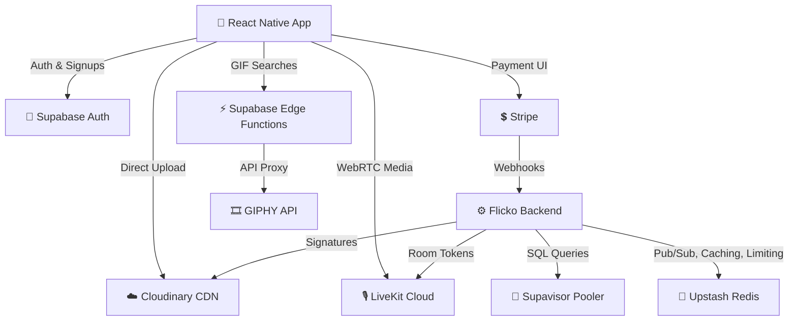

# Third-Party Integrations

> **Reading time:** ~15 minutes · **Audience:** Backend, DevOps, External API Specialists · **Last Updated:** 2026-04-11

Flicko relies on several specialized third-party platforms to handle infrastructure primitives that are difficult to build and scale reliably (webRTC SFUs, high-performance edge CDNs, payment processing). This document maps every external service to its exact role in the Flicko architecture.

---

## Table of Contents

- [Integration Map](#integration-map)
- [1. Supabase (Database & Identity)](#1-supabase-database--identity)
- [2. Upstash (Redis & Pub/Sub)](#2-upstash-redis--pubsub)
- [3. Cloudinary (Media CDN)](#3-cloudinary-media-cdn)
- [4. LiveKit Cloud (WebRTC SFU)](#4-livekit-cloud-webrtc-sfu)
- [5. Stripe (Payments)](#5-stripe-payments)
- [6. Cloudflare (Edge Network)](#6-cloudflare-edge-network)
- [7. GIPHY (External Content)](#7-giphy-external-content)

---

## Integration Map

---

## 1. Supabase (Database & Identity)

Supabase serves as the core foundational layer of Flicko, providing managed PostgreSQL, authentication, and connection pooling.

**Features Used:**
- **PostgreSQL 15+:** The primary relational data store.
- **GoTrue Auth:** Handles email/password registration, password resetting, social logins, and issues the JWTs that our Go backend validates.
- **Supavisor (IPv4 Connection Pooler):** Given Flicko's 3-service architecture, direct PG connections would quickly exhaust the 60-connection limit. We use the Supavisor Pooler URL (port 6543) so thousands of logical connections map to a few physical database connections.
- **Edge Functions:** Deno-backed serverless functions runs specific isolated tasks (e.g., GIPHY API proxy to hide API keys).

**Environment Variables Required:**
- `DATABASE_URL` (Must be the transaction pooler URL on port 6543)
- `SUPABASE_URL`
- `SUPABASE_SERVICE_ROLE_KEY` (Used ONLY by migration scripts)

---

## 2. Upstash (Redis & Pub/Sub)

Upstash provides serverless Redis with TLS encryption out-of-the-box, allowing us to connect securely over the public internet without managing VPNs or VPC peering.

**Features Used:**
- **Redis Pub/Sub:** The nervous system connecting `msg-service` to `ws-gateway`.
- **Distributed Rate Limiting:** The `backend` middleware uses Redis to ensure clients cannot bypass rate limits by hitting different NGINX workers.
- **Dead Letter Queue (DLQ):** Failed database inserts are temporarily held in Redis.

**Integration Note:** The `rediss://` scheme (note the extra 's') must be used to force a secure TLS connection in the Go `redis.Options`.

---

## 3. Cloudinary (Media CDN)

Cloudinary handles the storage, transformation, and edge-delivery of all user avatars, server banners, and message attachments.

**The "Direct Upload" Integration Flow:**
To save backend bandwidth, Flicko uses Cloudinary's Direct Upload capability.
1. The mobile app HTTP requests a cryptographic signature for upload.
2. The `msg-service` backend generates an HMAC-SHA256 signature using the `CLOUDINARY_API_SECRET`.
3. The mobile app POSTs the binary file + signature directly to Cloudinary's API.
4. Cloudinary returns a secure URL (e.g., `https://res.cloudinary.com/...`).
5. The mobile app embeds this URL into the message payload it sends to the Flicko API.

**Transformations:** Avatar images are requested with `c_fill,w_256,h_256` appended to the URL by the React Native client to force server-side cropping and save mobile bandwidth.

---

## 4. LiveKit Cloud (WebRTC SFU)

Building a highly concurrent audio/video Selective Forwarding Unit (SFU) from scratch is notoriously difficult. LiveKit provides an open-source SFU and a managed cloud offering.

**Integration Flow:**
1. A user attempts to join a Voice Channel.
2. The Go `backend` verifies their RBAC permissions.
3. The backend uses `livekit-server-sdk-go` to generate an Access Token (JWT) signed with the LiveKit Secret. The token grants access to a specific "room" (mapped 1:1 with the Flicko `channel_id`).
4. The mobile app uses `@livekit/react-native` to connect to LiveKit Cloud using this token.
5. All audio/video routing occurs purely within LiveKit Cloud infrastructure.

---

## 5. Stripe (Payments)

Stripe manages the billing and card processing for "Flicko Plus" subscriptions.

**Integration Components:**
- **React Native SDK:** Used to render the native Payment Sheet (Apple Pay/Google Pay/Card).
- **Backend Webhooks:** The Stripe API sends webhooks to `/api/v1/webhooks/stripe` when subscriptions succeed or expire. The Go backend verifies the Stripe webhook signature, then updates the user's `is_premium` flag in the database.

---

## 6. Cloudflare (Edge Network)

Cloudflare sits entirely outside the codebase as the DNS router and outer security shell.

**Features Used:**
- **Strict SSL:** We use Cloudflare Origin Certificates installed directly into the NGINX container ensuring end-to-end TLS encryption.
- **WAF Rules:** Blocks known malicious IPs and SQL injection attempts before they reach the VPS.
- **WebSocket Upgrade:** Proxies the `wss://` protocol efficiently to the `ws-gateway`.

---

## 7. GIPHY (External Content)

The GIPHY API is integrated into the message composer to allow users to search and send GIFs.

**Security Measure:**
If the React Native app queried GIPHY directly, we would have to bundle the GIPHY API Key into the mobile binary, where it could easily be extracted and abused. Instead, we deployed a Supabase Edge Function (`supabase/functions/gif-search/`). 
The mobile app hits the Edge Function (secured via Supabase Auth headers), and the Edge Function appends the secret API key and queries GIPHY.

---

## Related Documentation

- [Getting Started: Configuration](../getting-started/configuration.md) — All env vars required for these providers
- [Architecture: Data Flow](data-flow.md) — Sequence diagrams detailing auth and upload flows
- [Architecture: System Overview](system-overview.md) — How these integrate into the 3-service split

---

*Last Updated: 2026-04-11 | Version: 1.0.0 | Maintained by: Flicko Team*
