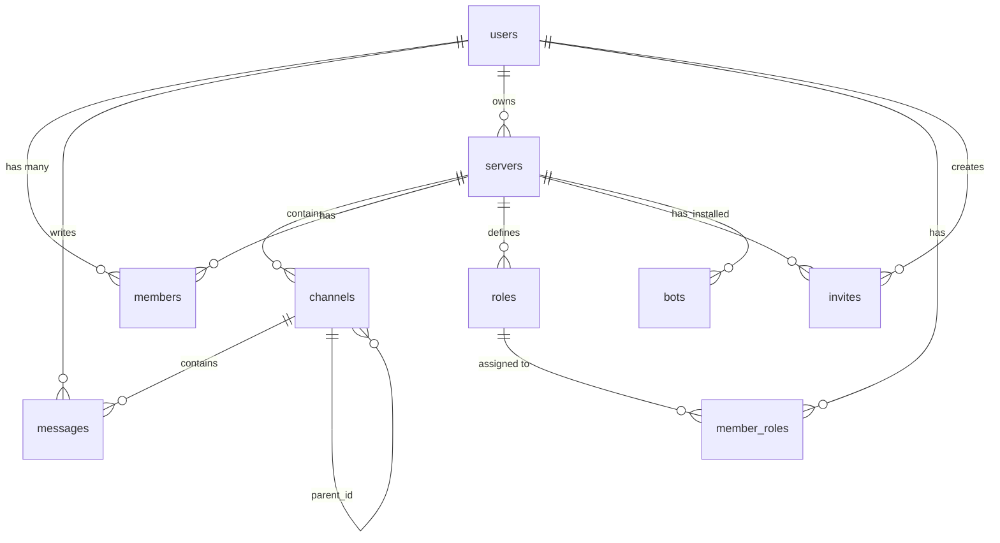

# Database Relationships
> *Last Updated: 2026-04-11 · Version: 1.0.0*

## Foreign Key Relationships

## Cascade Rules
| Relationship | On Delete |
|-------------|-----------|
| servers → users (owner) | RESTRICT (can't delete user who owns servers) |
| channels → servers | CASCADE |
| messages → channels | CASCADE |
| members → servers | CASCADE |
| members → users | CASCADE |
| roles → servers | CASCADE |
| invites → servers | CASCADE |
| bot_guilds → servers | CASCADE |
| All bot settings → servers | CASCADE |
