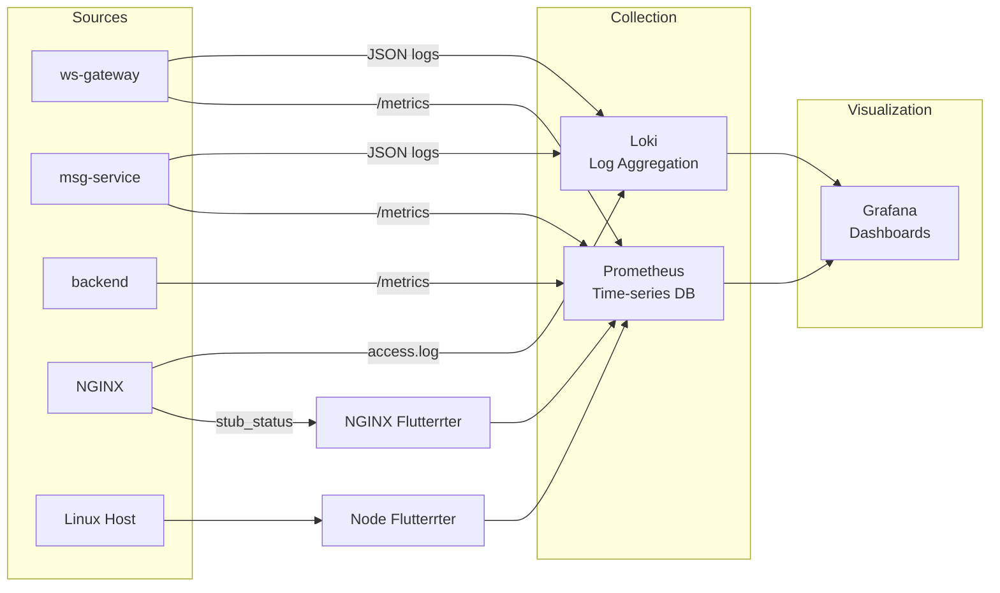

# Deployment: Monitoring & Observability

> *Last Updated: 2026-04-15 · Version: 1.1.0*

## Overview

Flicko includes a full observability stack for production monitoring. The stack is containerized and deployed alongside the application services via `docker-compose.prod.yml`.

---

## Monitoring Stack



---

## Prometheus

**Configuration:** `monitoring/prometheus.yml`

**Scrape targets:**
| Target | Endpoint | Interval |
|--------|----------|----------|
| ws-gateway | `ws-gateway:9100/metrics` | 15s |
| msg-service | `msg-service:9081/metrics` | 15s |
| Node Flutterrter | `node-exporter:9100/metrics` | 15s |
| NGINX Flutterrter | `nginx-exporter:9113/metrics` | 15s |

**Key metrics collected:**
- `ws_gateway_connections_total` — Active WebSocket connections
- `ws_gateway_messages_per_second` — Message throughput
- `msg_service_batch_insert_latency` — Database insert latency
- `go_goroutines` — Goroutine count per service
- `process_resident_memory_bytes` — Memory usage
- `node_cpu_seconds_total` — Host CPU usage
- `nginx_http_requests_total` — NGINX request count

**Alerting rules** (`monitoring/alerts.yml`):
- High memory usage (>80% of limit)
- WebSocket connection count approaching max
- Service health check failures
- High error rate (>1% of requests)

---

## Parity Epic SLO Pack (X5)

The parity execution stream tracks SLOs by epic so regressions are visible as features land.

| Epic Area | Primary SLI | Target SLO |
|---|---|---|
| P3 Moderation | 5xx ratio on moderation endpoints | < 1% over 30d |
| P4 Voice/Stage | P95 WS/voice message latency | < 500ms |
| P5 Premium | Premium API success rate | > 99.5% over 30d |
| P6 Apps/Interactions | App install + interaction endpoint success | > 99.5% over 30d |
| P8 Discovery/Insights | Discover/insights endpoint success | > 99.0% over 30d |

### Tracing requirements by epic

- Include `request_id`, `user_id`, and domain identifiers (`server_id`, `channel_id`, `app_id`, `session_id`) in logs/spans.
- Preserve correlation across gateway → service hops.
- Emit structured errors with operation names to support SLO burn analysis.

### Alert mapping

Current alert groups already backstop the parity SLO pack:
- `HighErrorRate` for availability SLOs.
- `HighMessageLatency` for real-time latency SLOs.
- `WSGatewayDown` and `DBPoolExhaustion` for hard dependency failures.

---

## Grafana

**Access:** `https://api.flicko.dev/grafana` (behind NGINX auth)

**Data sources (auto-provisioned):**
1. Prometheus — `http://prometheus:9090`
2. Loki — `http://loki:3100`

**Dashboards:**
- System overview (CPU, memory, disk, network)
- WebSocket gateway (connections, throughput, errors)
- API performance (latency percentiles, error rates)
- NGINX traffic (requests/sec, status codes, upstream latency)

---

## Loki (Log Aggregation)

**Configuration:** `monitoring/loki-config.yml`

All Go services output JSON structured logs (via `zap`). Loki ingests these via Docker's log driver and indexes by labels (service name, log level).

**Log format (from Go services):**
```json
{
    "level": "info",
    "ts": "2026-04-11T00:00:00.000Z",
    "msg": "message created",
    "user_id": "abc-123",
    "channel_id": "def-456",
    "message_id": "ghi-789",
    "request_id": "req-012"
}
```

**NGINX access log format** (from `nginx.conf`):
```json
{
    "time": "2026-04-11T00:00:00+00:00",
    "remote_addr": "1.2.3.4",
    "request": "POST /api/v1/messages HTTP/1.1",
    "status": 201,
    "body_bytes_sent": 256,
    "request_time": 0.015,
    "upstream_response_time": "0.012",
    "ws_upgrade": "",
    "request_id": "abc123"
}
```

**Querying logs in Grafana:**
```logql
{service="ws-gateway"} |= "error"
{service="msg-service"} | json | level="error" | line_format "{{.msg}}"
```

---

## Node Flutterrter

Flutterses Linux host metrics:
- CPU usage per core
- Memory usage and swap
- Disk I/O and space
- Network traffic (bytes in/out)
- File descriptors (critical for WebSocket server)
- System load average

---

## Health Checks

### Docker health checks (per container):
```yaml
healthcheck:
  test: ["CMD", "wget", "-q", "--spider", "http://localhost:8080/health"]
  interval: 15s
  timeout: 5s
  retries: 5
  start_period: 10s
```

### Application health endpoint:
```
GET /api/v1/health → 200 {"status": "healthy", "checks": {...}}
GET /api/v1/healthz/live → 200 (process alive)
GET /api/v1/healthz/ready → 200 (DB + Redis connected)
```

### External health check script:
```bash
./scripts/check-health.sh
```

---

## Log Rotation

**Configuration:** `scripts/logrotate-flicko.conf`

Prevents log files from filling disk:
- Daily rotation
- 14-day retention
- Compressed archives
- Applied to NGINX access/error logs and Docker container logs

---

## Related Docs
- [Deployment Overview](overview.md) — Architecture context
- [Docker](docker.md) — Container configuration
- [Backend Error Handling](../backend/error-handling.md) — Log format
