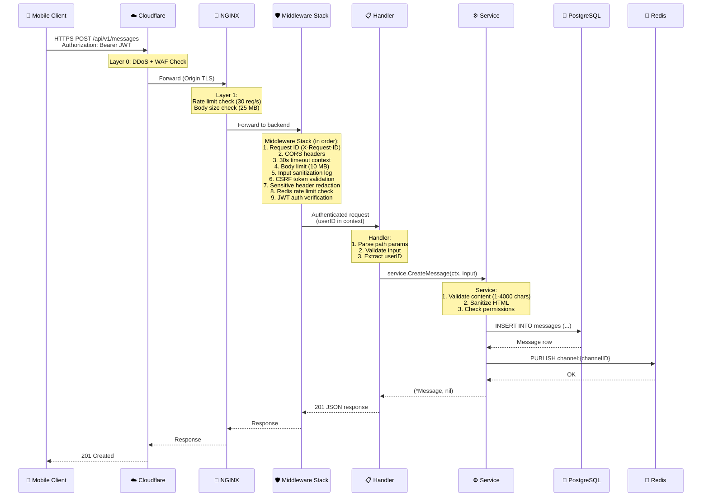
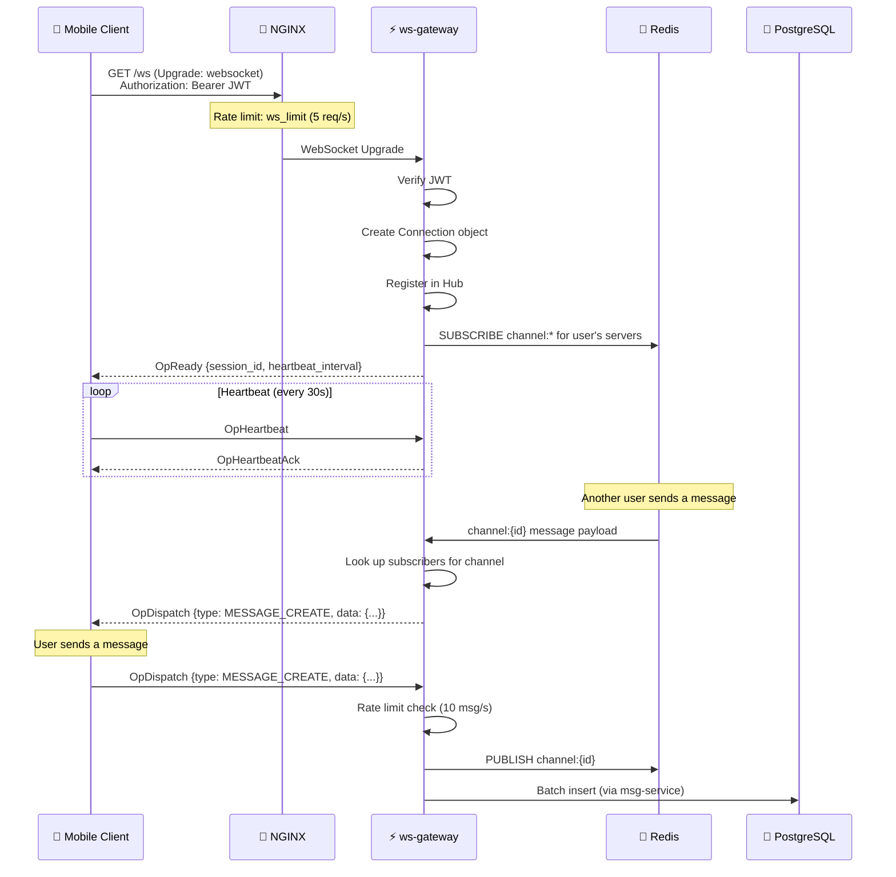

# API Request Flow Diagram

> *Last Updated: 2026-04-11 · Version: 1.0.0*

## HTTP Request Lifecycle

This diagram shows the complete path of an API request from client to database and back.

## WebSocket Connection Flow

