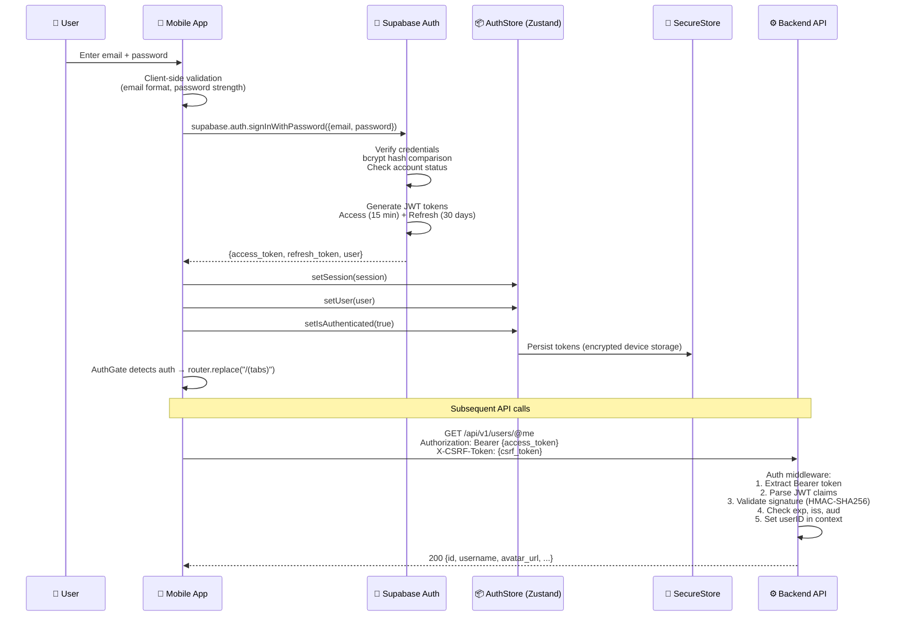
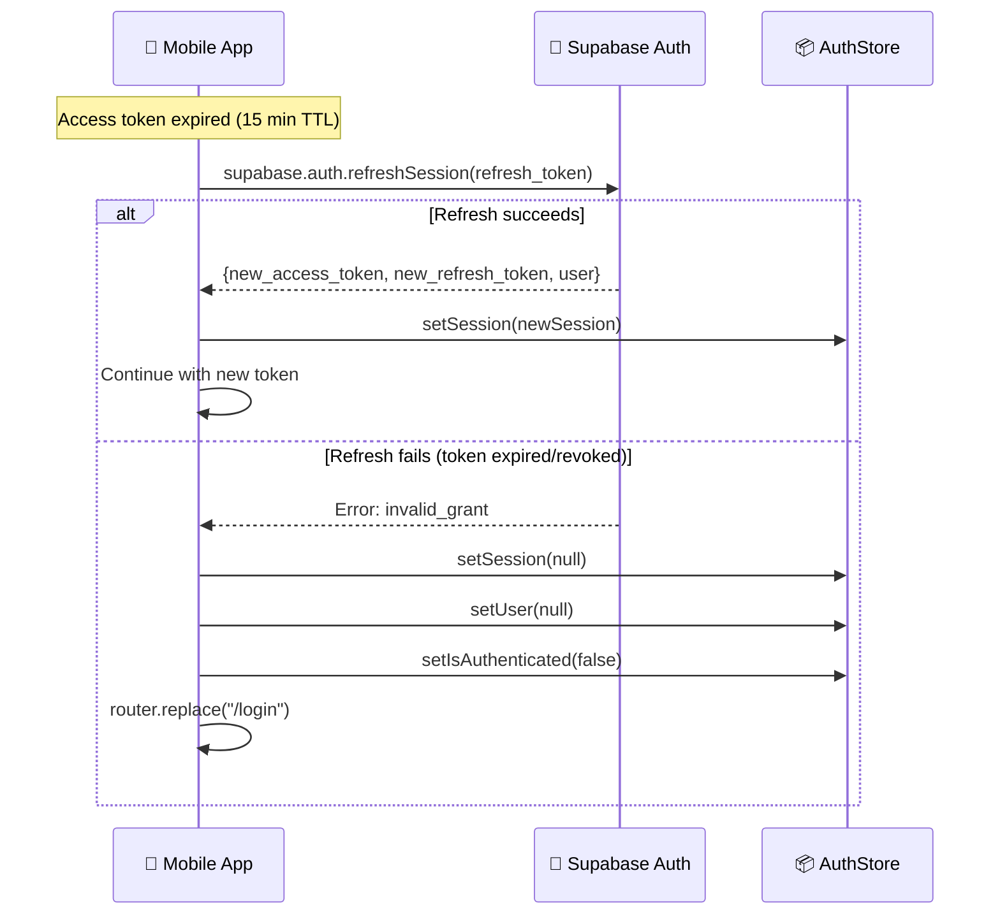
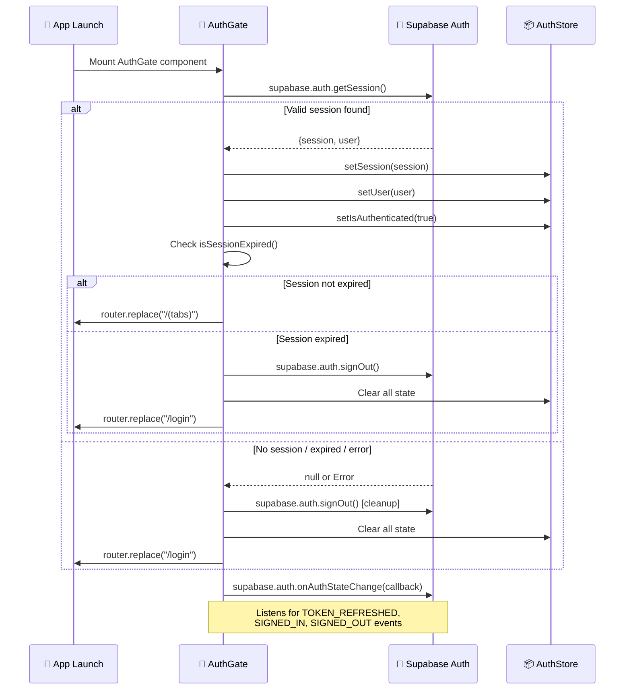

# Authentication Flow Diagram

> *Last Updated: 2026-04-11 · Version: 1.0.0*

## Login Flow

```mermaid
sequenceDiagram
    participant U as 👤 User
    participant APP as 📱 Mobile App
    participant SA as 🔐 Supabase Auth
    participant STORE as 📦 AuthStore (Zustand)
    participant SS as 🔑 SecureStore
    participant BE as ⚙️ Backend API

    U->>APP: Enter email + password
    APP->>APP: Client-side validation<br/>(email format, password strength)

    APP->>SA: supabase.auth.signInWithPassword({email, password})

    SA->>SA: Verify credentials<br/>bcrypt hash comparison<br/>Check account status
    SA->>SA: Generate JWT tokens<br/>Access (15 min) + Refresh (30 days)

    SA-->>APP: {access_token, refresh_token, user}

    APP->>STORE: setSession(session)
    APP->>STORE: setUser(user)
    APP->>STORE: setIsAuthenticated(true)
    STORE->>SS: Persist tokens (encrypted device storage)

    APP->>APP: AuthGate detects auth → router.replace("/(tabs)")

    Note over APP,BE: Subsequent API calls

    APP->>BE: GET /api/v1/users/@me<br/>Authorization: Bearer {access_token}<br/>X-CSRF-Token: {csrf_token}

    BE->>BE: Auth middleware:<br/>1. Extract Bearer token<br/>2. Parse JWT claims<br/>3. Validate signature (HMAC-SHA256)<br/>4. Check exp, iss, aud<br/>5. Set userID in context

    BE-->>APP: 200 {id, username, avatar_url, ...}
```

## Token Refresh Flow

```mermaid
sequenceDiagram
    participant APP as 📱 Mobile App
    participant SA as 🔐 Supabase Auth
    participant STORE as 📦 AuthStore

    Note over APP: Access token expired (15 min TTL)

    APP->>SA: supabase.auth.refreshSession(refresh_token)

    alt Refresh succeeds
        SA-->>APP: {new_access_token, new_refresh_token, user}
        APP->>STORE: setSession(newSession)
        APP->>APP: Continue with new token
    else Refresh fails (token expired/revoked)
        SA-->>APP: Error: invalid_grant
        APP->>STORE: setSession(null)
        APP->>STORE: setUser(null)
        APP->>STORE: setIsAuthenticated(false)
        APP->>APP: router.replace("/login")
    end
```

## App Launch Session Restoration

```mermaid
sequenceDiagram
    participant APP as 📱 App Launch
    participant AG as 🚪 AuthGate
    participant SA as 🔐 Supabase Auth
    participant STORE as 📦 AuthStore

    APP->>AG: Mount AuthGate component

    AG->>SA: supabase.auth.getSession()

    alt Valid session found
        SA-->>AG: {session, user}
        AG->>STORE: setSession(session)
        AG->>STORE: setUser(user)
        AG->>STORE: setIsAuthenticated(true)

        AG->>AG: Check isSessionExpired()

        alt Session not expired
            AG->>APP: router.replace("/(tabs)")
        else Session expired
            AG->>SA: supabase.auth.signOut()
            AG->>STORE: Clear all state
            AG->>APP: router.replace("/login")
        end

    else No session / expired / error
        SA-->>AG: null or Error
        AG->>SA: supabase.auth.signOut() [cleanup]
        AG->>STORE: Clear all state
        AG->>APP: router.replace("/login")
    end

    AG->>SA: supabase.auth.onAuthStateChange(callback)
    Note over AG,SA: Listens for TOKEN_REFRESHED,<br/>SIGNED_IN, SIGNED_OUT events
```
