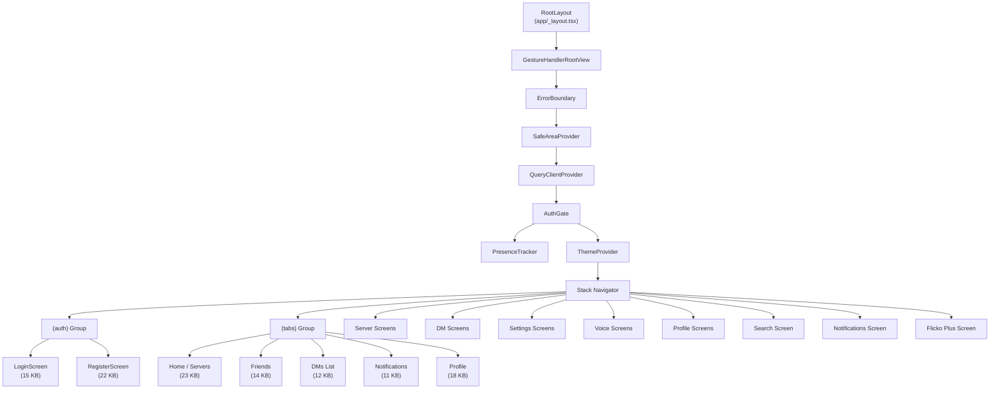
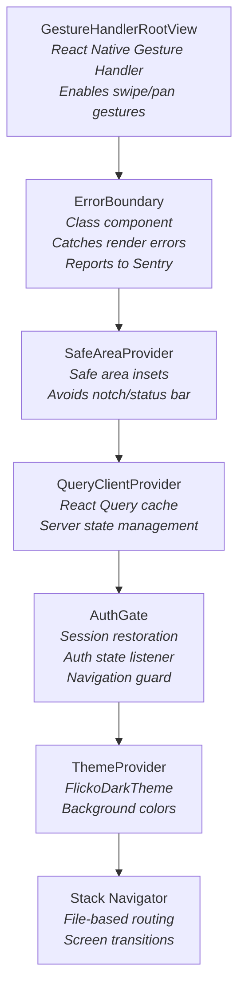

# Component Tree Diagram

> *Last Updated: 2026-04-11 · Version: 1.0.0*

## React Native Component Hierarchy

```mermaid
graph TD
    ROOT["RootLayout<br/>(app/_layout.tsx)"]

    ROOT --> GH["GestureHandlerRootView"]
    GH --> EB["ErrorBoundary"]
    EB --> SAP["SafeAreaProvider"]
    SAP --> QCP["QueryClientProvider"]
    QCP --> AG["AuthGate"]
    AG --> PT["PresenceTracker"]
    AG --> TP["ThemeProvider"]
    TP --> STACK["Stack Navigator"]

    STACK --> AUTH["(auth) Group"]
    STACK --> TABS["(tabs) Group"]
    STACK --> SERVER["Server Screens"]
    STACK --> DM["DM Screens"]
    STACK --> SETTINGS["Settings Screens"]
    STACK --> VOICE["Voice Screens"]
    STACK --> PROFILE["Profile Screens"]
    STACK --> SEARCH["Search Screen"]
    STACK --> NOTIF["Notifications Screen"]
    STACK --> PLUS["Flicko Plus Screen"]

    AUTH --> LOGIN["LoginScreen<br/>(15 KB)"]
    AUTH --> REG["RegisterScreen<br/>(22 KB)"]

    TABS --> HOME["Home / Servers<br/>(23 KB)"]
    TABS --> FRIENDS["Friends<br/>(14 KB)"]
    TABS --> DMS["DMs List<br/>(12 KB)"]
    TABS --> NOTIFS["Notifications<br/>(11 KB)"]
    TABS --> PROF["Profile<br/>(18 KB)"]
```

## Component Directories

```mermaid
graph TD
    COMP["mobile/components/"]

    COMP --> CADMIN["admin/<br/>Server Admin"]
    COMP --> CAUTH["auth/<br/>Login/Register Forms"]
    COMP --> CBOTS["bots/<br/>Bot Configuration"]
    COMP --> CCHAN["channels/<br/>Channel List, Create"]
    COMP --> CCOLLAB["collaboration/<br/>Drawing Canvas"]
    COMP --> CDM["dm/<br/>DM Conversations"]
    COMP --> CMEDIA["media/<br/>Image/Video Viewer"]
    COMP --> CMSG["messages/<br/>MessageList<br/>MessageInput<br/>MessageBubble"]
    COMP --> CMOD["moderation/<br/>Ban/Kick/Report"]
    COMP --> CMUSIC["music/<br/>Music Player"]
    COMP --> CNAV["navigation/<br/>Tab Bar, Sidebar"]
    COMP --> CONB["onboarding/<br/>Welcome Flow"]
    COMP --> CPOLL["polls/<br/>Poll Creator/Voter"]
    COMP --> CPROF["profile/<br/>Profile Card, Edit"]
    COMP --> CSERV["server/<br/>Server Header, Members"]
    COMP --> CSRVS["servers/<br/>Server Discovery"]
    COMP --> CSET["settings/<br/>Account, Appearance"]
    COMP --> CSHR["shared/<br/>Avatar, Badge, Divider"]
    COMP --> CUI["ui/<br/>Buttons, Inputs, Modals"]
    COMP --> CVOICE["voice/<br/>Voice Controls"]
```

## Provider Stack (Detailed)

```mermaid
graph TD
    A["GestureHandlerRootView<br/><i>React Native Gesture Handler</i><br/><i>Enables swipe/pan gestures</i>"]
    B["ErrorBoundary<br/><i>Class component</i><br/><i>Catches render errors</i><br/><i>Reports to Sentry</i>"]
    C["SafeAreaProvider<br/><i>Safe area insets</i><br/><i>Avoids notch/status bar</i>"]
    D["QueryClientProvider<br/><i>React Query cache</i><br/><i>Server state management</i>"]
    E["AuthGate<br/><i>Session restoration</i><br/><i>Auth state listener</i><br/><i>Navigation guard</i>"]
    F["ThemeProvider<br/><i>FlickoDarkTheme</i><br/><i>Background colors</i>"]
    G["Stack Navigator<br/><i>File-based routing</i><br/><i>Screen transitions</i>"]

    A --> B --> C --> D --> E --> F --> G
```
