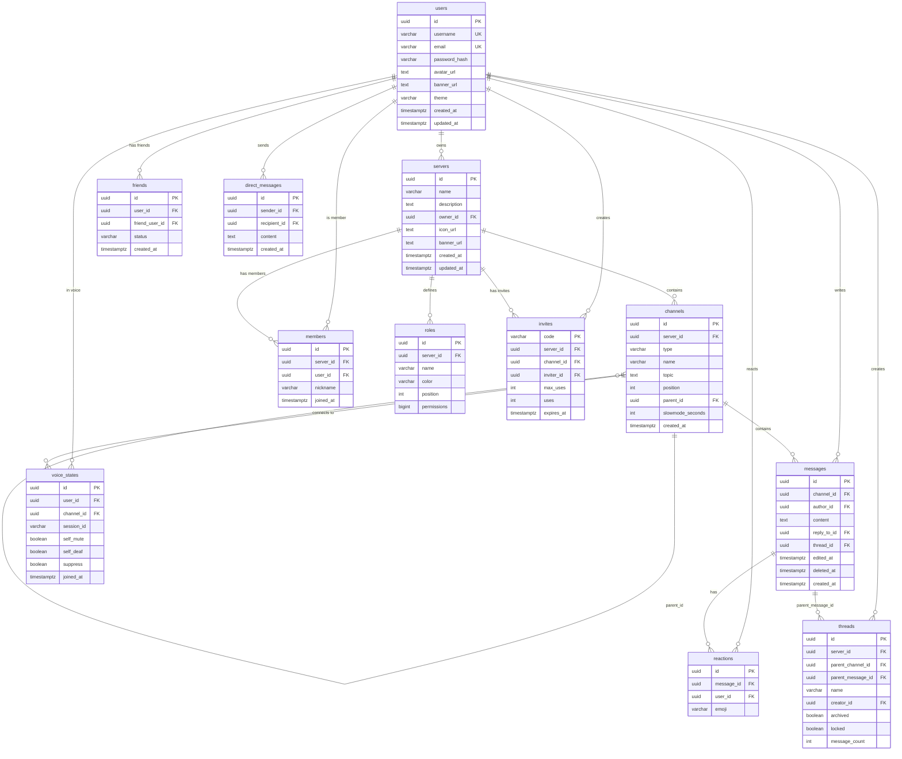

# Database Entity-Relationship Diagram

> *Last Updated: 2026-04-11 · Version: 1.0.0*

## Core Tables ERD

```mermaid
erDiagram
    users {
        uuid id PK
        varchar username UK
        varchar email UK
        varchar password_hash
        text avatar_url
        text banner_url
        varchar theme
        timestamptz created_at
        timestamptz updated_at
    }

    servers {
        uuid id PK
        varchar name
        text description
        uuid owner_id FK
        text icon_url
        text banner_url
        timestamptz created_at
        timestamptz updated_at
    }

    channels {
        uuid id PK
        uuid server_id FK
        varchar type
        varchar name
        text topic
        int position
        uuid parent_id FK
        int slowmode_seconds
        timestamptz created_at
    }

    messages {
        uuid id PK
        uuid channel_id FK
        uuid author_id FK
        text content
        uuid reply_to_id FK
        uuid thread_id FK
        timestamptz edited_at
        timestamptz deleted_at
        timestamptz created_at
    }

    members {
        uuid id PK
        uuid server_id FK
        uuid user_id FK
        varchar nickname
        timestamptz joined_at
    }

    roles {
        uuid id PK
        uuid server_id FK
        varchar name
        varchar color
        int position
        bigint permissions
    }

    invites {
        varchar code PK
        uuid server_id FK
        uuid channel_id FK
        uuid inviter_id FK
        int max_uses
        int uses
        timestamptz expires_at
    }

    reactions {
        uuid id PK
        uuid message_id FK
        uuid user_id FK
        varchar emoji
    }

    friends {
        uuid id PK
        uuid user_id FK
        uuid friend_user_id FK
        varchar status
        timestamptz created_at
    }

    direct_messages {
        uuid id PK
        uuid sender_id FK
        uuid recipient_id FK
        text content
        timestamptz created_at
    }

    voice_states {
        uuid id PK
        uuid user_id FK
        uuid channel_id FK
        varchar session_id
        boolean self_mute
        boolean self_deaf
        boolean suppress
        timestamptz joined_at
    }

    threads {
        uuid id PK
        uuid server_id FK
        uuid parent_channel_id FK
        uuid parent_message_id FK
        varchar name
        uuid creator_id FK
        boolean archived
        boolean locked
        int message_count
    }

    users ||--o{ servers : "owns"
    users ||--o{ members : "is member"
    users ||--o{ messages : "writes"
    users ||--o{ reactions : "reacts"
    users ||--o{ friends : "has friends"
    users ||--o{ direct_messages : "sends"
    users ||--o{ voice_states : "in voice"
    users ||--o{ invites : "creates"
    users ||--o{ threads : "creates"

    servers ||--o{ channels : "contains"
    servers ||--o{ members : "has members"
    servers ||--o{ roles : "defines"
    servers ||--o{ invites : "has invites"

    channels ||--o{ messages : "contains"
    channels ||--o{ channels : "parent_id"
    channels ||--o{ voice_states : "connects to"

    messages ||--o{ reactions : "has"
    messages ||--o{ threads : "parent_message_id"
```

## Bot System Tables ERD

```mermaid
erDiagram
    bots {
        uuid id PK
        varchar name UK
        varchar display_name
        text description
        varchar avatar_url
    }

    bot_guilds {
        uuid id PK
        uuid bot_id FK
        uuid server_id FK
        boolean enabled
    }

    mod_settings {
        uuid id PK
        uuid server_id FK
        uuid log_channel FK
        boolean dm_on_warn
        boolean dm_on_ban
    }

    automod_settings {
        uuid id PK
        uuid server_id FK
        boolean block_invites
        boolean block_links
        int caps_threshold
        int emoji_limit
        int mention_limit
        boolean block_duplicate
    }

    welcome_settings {
        uuid id PK
        uuid server_id FK
        uuid channel_id FK
        text welcome_message
        text goodbye_message
        boolean assign_role
        uuid auto_role_id FK
    }

    level_settings {
        uuid id PK
        uuid server_id FK
        int xp_per_message
        int xp_cooldown_seconds
        uuid announce_channel FK
        text level_up_message
    }

    user_xp {
        uuid id PK
        uuid user_id FK
        uuid server_id FK
        int xp
        int level
        int message_count
    }

    ticket_settings {
        uuid id PK
        uuid server_id FK
        uuid category_id FK
        text open_message
    }

    tickets {
        uuid id PK
        uuid server_id FK
        uuid channel_id FK
        uuid creator_id FK
        varchar status
    }

    starboard_settings {
        uuid id PK
        uuid server_id FK
        uuid channel_id FK
        int star_threshold
        varchar star_emoji
    }

    starboard_entries {
        uuid id PK
        uuid server_id FK
        uuid original_message_id FK
        uuid starboard_message_id
        int star_count
    }

    bots ||--o{ bot_guilds : "installed in"
    servers ||--o{ bot_guilds : "has bots"
    servers ||--o{ mod_settings : "has"
    servers ||--o{ automod_settings : "has"
    servers ||--o{ welcome_settings : "has"
    servers ||--o{ level_settings : "has"
    servers ||--o{ ticket_settings : "has"
    servers ||--o{ starboard_settings : "has"
    servers ||--o{ tickets : "has"
    servers ||--o{ starboard_entries : "has"
    users ||--o{ user_xp : "earns"
    users ||--o{ tickets : "creates"
```
