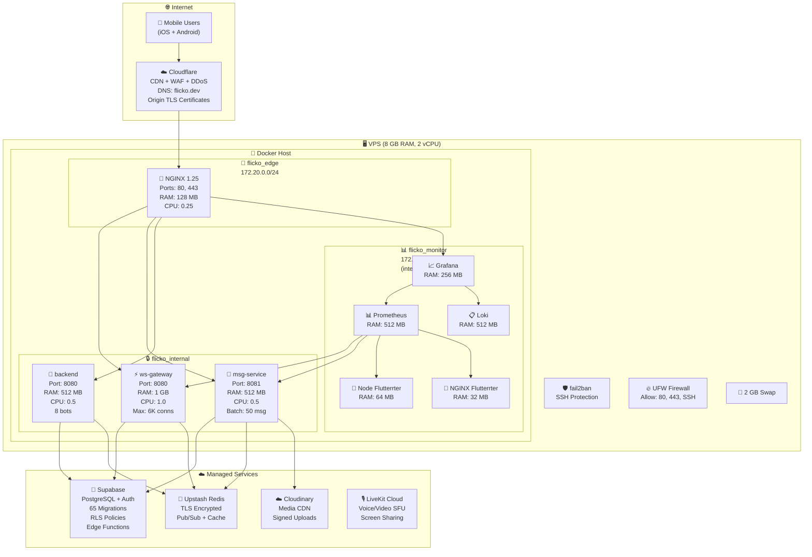

# Deployment Infrastructure Diagram

> *Last Updated: 2026-04-11 · Version: 1.0.0*

## Production Infrastructure



## Resource Budget

```
Total VPS RAM: 8,192 MB
────────────────────────────────────────
Container Allocation:
  NGINX .............. 128 MB
  ws-gateway ........ 1,024 MB
  msg-service ....... 512 MB
  backend ........... 512 MB
  Prometheus ........ 512 MB
  Grafana ........... 256 MB
  Loki .............. 512 MB
  Node Flutterrter ..... 64 MB
  NGINX Flutterrter .... 32 MB
────────────────────────────────────────
  Total Containers: 3,552 MB (~3.5 GB)
  OS + Buffers:     4,640 MB (~4.5 GB)
────────────────────────────────────────
```
