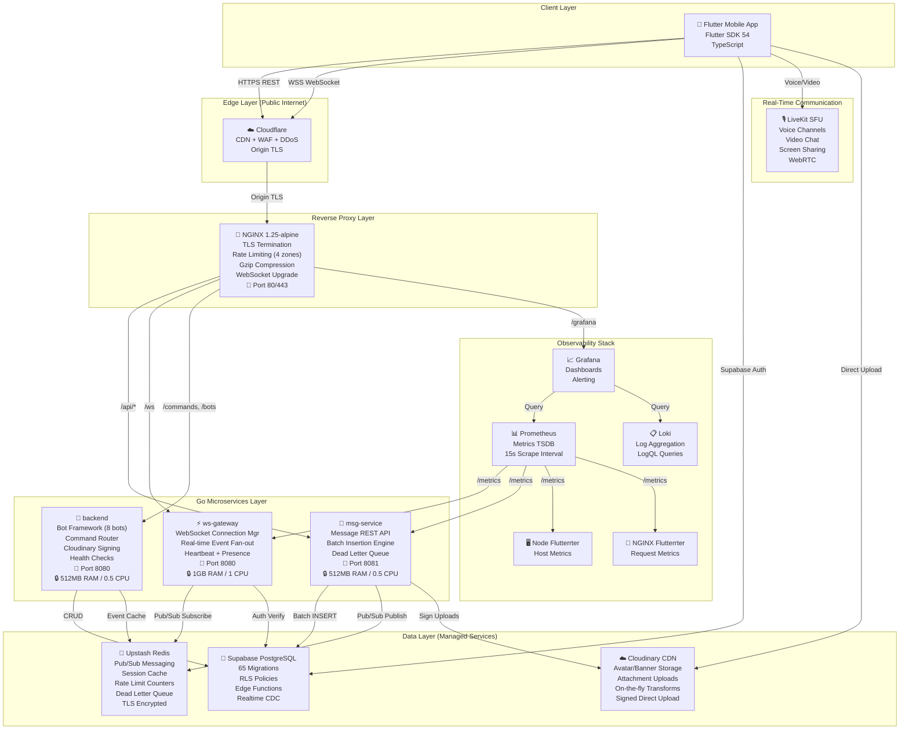
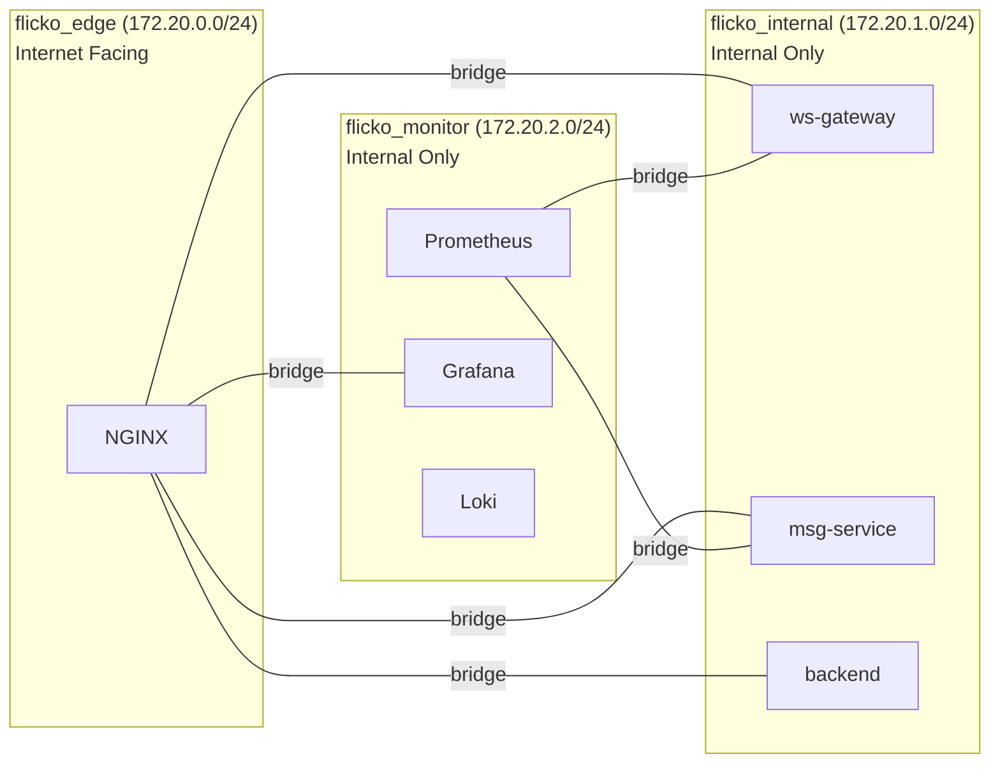

# System Architecture Diagram

> *Last Updated: 2026-04-11 · Version: 1.0.0*

## Complete System Architecture

```mermaid
graph TB
    subgraph Client["Client Layer"]
        MOBILE["📱 Flutter Mobile App<br/>Flutter SDK 54<br/>TypeScript"]
    end

    subgraph Edge["Edge Layer (Public Internet)"]
        CF["☁️ Cloudflare<br/>CDN + WAF + DDoS<br/>Origin TLS"]
    end

    subgraph ReverseProxy["Reverse Proxy Layer"]
        NGINX["🔀 NGINX 1.25-alpine<br/>TLS Termination<br/>Rate Limiting (4 zones)<br/>Gzip Compression<br/>WebSocket Upgrade<br/>📍 Port 80/443"]
    end

    subgraph GoServices["Go Microservices Layer"]
        WSG["⚡ ws-gateway<br/>WebSocket Connection Mgr<br/>Real-time Event Fan-out<br/>Heartbeat + Presence<br/>📍 Port 8080<br/>🔒 1GB RAM / 1 CPU"]
        MSG["📨 msg-service<br/>Message REST API<br/>Batch Insertion Engine<br/>Dead Letter Queue<br/>📍 Port 8081<br/>🔒 512MB RAM / 0.5 CPU"]
        BE["🤖 backend<br/>Bot Framework (8 bots)<br/>Command Router<br/>Cloudinary Signing<br/>Health Checks<br/>📍 Port 8080<br/>🔒 512MB RAM / 0.5 CPU"]
    end

    subgraph DataLayer["Data Layer (Managed Services)"]
        DB["🐘 Supabase PostgreSQL<br/>65 Migrations<br/>RLS Policies<br/>Edge Functions<br/>Realtime CDC"]
        REDIS["🔴 Upstash Redis<br/>Pub/Sub Messaging<br/>Session Cache<br/>Rate Limit Counters<br/>Dead Letter Queue<br/>TLS Encrypted"]
        CLOUD["☁️ Cloudinary CDN<br/>Avatar/Banner Storage<br/>Attachment Uploads<br/>On-the-fly Transforms<br/>Signed Direct Upload"]
    end

    subgraph RealTime["Real-Time Communication"]
        LK["🎙️ LiveKit SFU<br/>Voice Channels<br/>Video Chat<br/>Screen Sharing<br/>WebRTC"]
    end

    subgraph Monitoring["Observability Stack"]
        PROM["📊 Prometheus<br/>Metrics TSDB<br/>15s Scrape Interval"]
        GRAF["📈 Grafana<br/>Dashboards<br/>Alerting"]
        LOKI["📋 Loki<br/>Log Aggregation<br/>LogQL Queries"]
        NODE["🖥️ Node Flutterrter<br/>Host Metrics"]
        NGXEXP["📡 NGINX Flutterrter<br/>Request Metrics"]
    end

    %% Client connections
    MOBILE -->|HTTPS REST| CF
    MOBILE -->|WSS WebSocket| CF
    MOBILE -->|Supabase Auth| DB
    MOBILE -->|Voice/Video| LK
    MOBILE -->|Direct Upload| CLOUD

    %% Edge to proxy
    CF -->|Origin TLS| NGINX

    %% Proxy to services
    NGINX -->|/api/*| MSG
    NGINX -->|/ws| WSG
    NGINX -->|/commands, /bots| BE
    NGINX -->|/grafana| GRAF

    %% Service to data
    WSG -->|Pub/Sub Subscribe| REDIS
    WSG -->|Auth Verify| DB
    MSG -->|Batch INSERT| DB
    MSG -->|Pub/Sub Publish| REDIS
    MSG -->|Sign Uploads| CLOUD
    BE -->|CRUD| DB
    BE -->|Event Cache| REDIS

    %% Monitoring connections
    PROM -->|/metrics| WSG
    PROM -->|/metrics| MSG
    PROM -->|/metrics| NODE
    PROM -->|/metrics| NGXEXP
    GRAF -->|Query| PROM
    GRAF -->|Query| LOKI
```

## Network Isolation

```mermaid
graph LR
    subgraph flicko_edge["flicko_edge (172.20.0.0/24)<br/>Internet Facing"]
        N[NGINX]
    end

    subgraph flicko_internal["flicko_internal (172.20.1.0/24)<br/>Internal Only"]
        W[ws-gateway]
        M[msg-service]
        B[backend]
    end

    subgraph flicko_monitor["flicko_monitor (172.20.2.0/24)<br/>Internal Only"]
        P[Prometheus]
        G[Grafana]
        L[Loki]
    end

    N ---|bridge| W
    N ---|bridge| M
    N ---|bridge| B
    N ---|bridge| G
    P ---|bridge| W
    P ---|bridge| M
```
