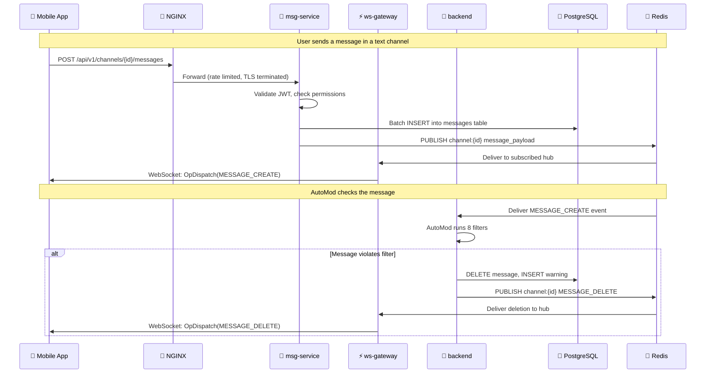

# Flicko Platform Overview

> **Reading time:** ~20 minutes · **Audience:** Everyone · **Last Updated:** 2026-04-11

This document provides a comprehensive introduction to the Flicko platform — what it is, who it's for, what concepts it uses, how its services are decomposed, and what features are fully implemented. Read this first if you are new to the project, as every other documentation file builds on the vocabulary and mental models established here.

---

## What Is Flicko?

Flicko is a **full-featured, production-ready, open-source real-time communication platform** designed as a self-hostable alternative to Discord. It provides the complete feature set that modern communities expect — text messaging, voice and video channels, server and channel management, role-based permissions, bot automation, media sharing, and premium subscriptions — all built from scratch with Go microservices, React Native, and PostgreSQL. The platform is designed to be deployed on a single 8 GB VPS, serving 3,000–5,000 concurrent users with full monitoring and observability included.

Unlike other open-source Discord alternatives that focus primarily on web clients, Flicko takes a **mobile-first approach** with a native iOS and Android application built using React Native and Expo SDK 54. The mobile app implements Discord's visual design language (GG Sans typography, dark/light/AMOLED themes, Discord-accurate color tokens) to provide a familiar and polished user experience. The app is organized into 30+ screens with file-based routing, 20 component directories for reusable UI elements, and 22 Zustand state stores for client-side state management.

The backend is written entirely in Go (version 1.25), chosen for its excellent concurrency primitives (goroutines and channels) which are essential for managing thousands of simultaneous WebSocket connections. The backend is split into three independent microservices — `ws-gateway` for real-time WebSocket connections, `msg-service` for RESTful API requests, and `backend` for the bot framework — each with its own Dockerfile, entry point, health check endpoint, and resource limits. This decomposition allows each service to be scaled, deployed, and monitored independently based on its specific workload characteristics.

---

## Core Concepts

Understanding these concepts is essential for working with any part of the Flicko codebase. Each concept maps directly to database tables, Go service files, and frontend components.

### Servers

A **Server** in Flicko is a community space that contains channels, roles, and members — equivalent to a Discord "guild." Every server has an owner (the user who created it), a name, an optional icon and banner image (stored on Cloudinary CDN), a description, and configuration settings for moderation, welcome messages, leveling, and bots. Servers are the top-level organizational unit in Flicko; nearly every other entity (channels, roles, members, invites, bot configurations) belongs to a specific server.

In the database, servers are stored in the `servers` table with columns for `id` (UUID primary key), `name`, `description`, `icon_url`, `banner_url`, `owner_id` (foreign key to `users`), and timestamps. The server lifecycle (creation, update, deletion, ownership transfer) is managed by the `server.go` service file (3.3 KB) in the backend, with the `server_service.go` service providing extended operations like server search and discovery.

```go
// backend/internal/models/server.go
type Server struct {
    ID          string    `json:"id" db:"id"`
    Name        string    `json:"name" db:"name"`
    Description string    `json:"description" db:"description"`
    IconURL     string    `json:"icon_url" db:"icon_url"`
    BannerURL   string    `json:"banner_url" db:"banner_url"`
    OwnerID     string    `json:"owner_id" db:"owner_id"`
    CreatedAt   time.Time `json:"created_at" db:"created_at"`
}
```

When a server is created, the system automatically creates a default "General" text channel, an "@everyone" role with basic permissions, and inserts a `members` row for the owner. Server templates ("Gaming," "Study Group," "Community") pre-populate additional channels and role configurations relevant to each template type. The server creation flow involves 4 database inserts within a transaction to ensure atomicity.

### Channels

A **Channel** is a communication space within a server. Flicko supports four channel types, each with different behavior and UI rendering on the mobile client:

| Type | Purpose | Real-Time | Backend Service |
|------|---------|-----------|----------------|
| **Text** | Standard text messaging with reactions, threads, pins | WebSocket + REST | ws-gateway + msg-service |
| **Voice** | Audio/video communication via LiveKit WebRTC | WebSocket (state) + WebRTC (media) | ws-gateway + LiveKit Cloud |
| **Announcement** | Broadcast-only channels (only privileged roles can post) | WebSocket + REST | ws-gateway + msg-service |
| **Category** | Organizational folders that group other channels (no messages) | N/A | msg-service |

Channels are stored in the `channels` table with columns for `id`, `server_id`, `type` (enum), `name`, `topic` (description), `position` (for ordering), `parent_id` (points to a category channel for nesting), `slowmode_seconds`, and `nsfw` flag. The `position` column enables drag-to-reorder on the mobile client; when a user reorders channels, the frontend sends the complete new position array, and the backend updates all affected rows in a single transaction.

```go
// Channel type constants used throughout the codebase
const (
    ChannelTypeText         = "text"
    ChannelTypeVoice        = "voice"
    ChannelTypeAnnouncement = "announcement"
    ChannelTypeCategory     = "category"
)
```

Channel permission overwrites allow server administrators to override base role permissions on a per-channel basis. For example, a "mods-only" channel can deny the `VIEW_CHANNEL` permission to the `@everyone` role while granting it to the "Moderator" role. These overwrites are stored in a separate `permission_overwrites` table with `channel_id`, `target_id` (role or user), `target_type` (role or member), `allow` (bigint bitfield), and `deny` (bigint bitfield) columns.

### Direct Messages (DMs)

**Direct Messages** are private conversations between two users (or up to 10 users in group DMs) that exist outside of any server context. DMs have their own set of database tables: `dm_conversations` tracks conversation metadata, `dm_participants` records the members of each conversation, and `dm_messages` stores the actual message content. The DM system supports all the same features as channel messages — text, reactions, typing indicators, read receipts, and attachments — plus voice and video calling via LiveKit.

DM conversations are initiated when a user sends a message to another user they have a friendship or shared server membership with. The conversation is created lazily on first message rather than requiring an explicit "create conversation" action. Group DMs are created by adding participants to an existing DM conversation, up to a maximum of 10 participants.

```typescript
// shared/services/dmService.ts — DM conversation management
export async function getOrCreateDMConversation(
  userId: string,
  participantId: string
): Promise<DMConversation> {
  // Check for existing conversation first
  const existing = await findExistingDM(userId, participantId);
  if (existing) return existing;

  // Create new conversation with both participants
  return await createDMConversation([userId, participantId]);
}
```

The DM service files in the backend include `dm_message_service.go` (6.1 KB) for message operations, `dm_reaction_service.go` (3.4 KB) for reactions, and the broader DM conversation management spread across multiple services.

### Voice System

The **Voice System** in Flicko uses LiveKit as its WebRTC Selective Forwarding Unit (SFU). Instead of implementing peer-to-peer audio/video (which doesn't scale beyond a handful of participants), LiveKit runs a central media server that receives audio/video streams from each participant and selectively forwards them to other participants. This architecture supports voice channels with many simultaneous speakers while keeping bandwidth usage manageable.

The voice flow works as follows: (1) User taps a voice channel in the mobile app, (2) the frontend requests a LiveKit room token from the backend via `GET /api/v1/video/token`, (3) the backend generates a signed JWT token using the LiveKit API secret with the user's identity and room name, (4) the mobile app connects to LiveKit Cloud using the `@livekit/react-native` SDK with the received token, (5) voice state changes (join, leave, mute, deaf) are tracked in the `voice_states` database table, and (6) all voice state changes are broadcast to other server members via WebSocket events so the UI can display who's in each voice channel.

```go
// backend/internal/services/voice_service.go
func (s *VoiceService) GenerateToken(ctx context.Context, userID, channelID string) (string, error) {
    // Verify user has permission to connect to this voice channel
    hasPermission, err := s.permService.CheckPermission(ctx, userID, channelID, models.PermissionConnect)
    if err != nil || !hasPermission {
        return "", fmt.Errorf("voice: permission denied")
    }

    // Generate LiveKit token
    at := lksdk.NewAccessToken(s.config.LiveKitAPIKey, s.config.LiveKitAPISecret)
    grant := &lksdk.VideoGrant{
        RoomJoin: true,
        Room:     channelID,
    }
    at.AddGrant(grant).SetIdentity(userID)

    return at.ToJWT()
}
```

### Bot System

The **Bot System** is Flicko's framework for automated actions and slash commands. It consists of 8 built-in bots, each implementing a `Bot` interface that provides commands, event subscriptions, and lifecycle management. All bots are registered with a central `BotRegistry` at startup, and the `commands.Router` (197 lines) parses user input to dispatch slash commands to the appropriate bot handler.

The bots communicate via an **in-process event bus** — when a message is created, a member joins, a reaction is added, or any other tracked event occurs, the event bus notifies all registered bot handlers that are subscribed to that event type. This architecture keeps bot processing within the same process as the `backend` service, avoiding network overhead for what is essentially internal event routing.

| Bot | File | Key Service File | Events Subscribed |
|-----|------|-----------------|-------------------|
| Moderation | `moderation.go` | `mod_service.go` | MessageCreate, MemberJoin |
| AutoMod | `automod.go` | `automod_service.go` (14.2 KB) | MessageCreate |
| Welcome | `welcome.go` | `welcome_service.go` | MemberJoin, MemberLeave |
| Leveling | `leveling.go` | `leveling_service.go` | MessageCreate |
| Music | `music.go` | — | VoiceStateUpdate |
| Ticket | `ticket.go` | `ticket_service.go` | — (command-only) |
| Poll | `poll.go` | — | ReactionAdd |
| Starboard | `starboard.go` | `starboard_service.go` | ReactionAdd, ReactionRemove |

```go
// backend/cmd/server/main.go — Bot registration at startup
registry := bots.NewRegistry(db, redis, logger)
registry.Register(bots.NewModerationBot(services))
registry.Register(bots.NewAutoModBot(services))
registry.Register(bots.NewWelcomeBot(services))
registry.Register(bots.NewLevelingBot(services))
registry.Register(bots.NewMusicBot(services))
registry.Register(bots.NewTicketBot(services))
registry.Register(bots.NewPollBot(services))
registry.Register(bots.NewStarboardBot(services))
registry.StartAll()
```

### Subscription System

**Flicko Plus** is the premium subscription tier powered by Stripe. Subscribers unlock enhanced features: custom emoji uploads, animated GIF avatars, higher file upload size limits, enhanced voice audio quality settings, server boosting perks, and soundboard access. The subscription state is managed by the `stripePaymentService.ts` (12 KB) on the frontend and the subscription-related services on the backend.

The subscription purchase flow involves: (1) user taps "Get Flicko Plus" on the `flicko-plus.tsx` screen (26 KB), (2) the app creates a Stripe checkout session via the backend, (3) the user completes payment in the Stripe sheet, (4) Stripe sends a webhook to the backend confirming payment, (5) the backend updates the user's subscription status in the database, and (6) the mobile app receives the updated user profile via WebSocket and immediately unlocks premium features.

### Server Members & Roles

**Members** represent the relationship between a user and a server. When a user joins a server (via invite code, server discovery, or direct link), a row is inserted into the `members` table with `server_id`, `user_id`, `nickname` (optional per-server display name), and `joined_at` timestamp. Members are assigned roles via the `member_roles` junction table.

**Roles** define permission sets within a server. Every server has a default `@everyone` role that all members automatically receive. Administrators can create custom roles with specific names, colors, positions (for hierarchy), and a 64-bit permission bitfield. Role position determines hierarchy — higher-position roles can manage lower-position roles but not vice versa.

The **26 permission types** are stored as individual bits in a 64-bit integer. When checking if a user can perform an action, the system:

1. Collects all roles assigned to the user in that server
2. Combines their permission bitfields with bitwise OR
3. Applies channel-level overwrites (allow/deny) if applicable
4. Checks if the required permission bit is set

```go
// Permission calculation — used in both Go middleware and PostgreSQL functions
func CalculatePermissions(memberRoles []Role, channelOverwrites []Overwrite) int64 {
    var permissions int64

    // Combine base role permissions
    for _, role := range memberRoles {
        permissions |= role.Permissions
    }

    // Apply channel overwrites (deny first, then allow)
    for _, overwrite := range channelOverwrites {
        permissions &= ^overwrite.Deny   // Remove denied permissions
        permissions |= overwrite.Allow    // Add allowed permissions
    }

    return permissions
}
```

---

## System Components

Flicko's backend is decomposed into three Go microservices. Understanding what each service owns and how they communicate is critical for placing new code correctly.

### Service 1: ws-gateway (WebSocket Gateway)

**Purpose:** Manages persistent WebSocket connections for real-time message delivery, presence tracking, typing indicators, and voice state updates. This is the only service that maintains long-lived connections with clients.

**Location:** `services/ws-gateway/`

**Entry Point:** `services/ws-gateway/cmd/gateway/main.go`

**Port:** 8080 (proxied by NGINX at `/ws`)

**Resource Limits:** 1 GB RAM, 1.0 CPU (the most resource-intensive service due to connection state)

**Key Packages:**
- `internal/hub/` — Central connection manager. Maintains a map of all active WebSocket connections, handles channel subscriptions, and broadcasts events to relevant connections. When a message is published to a Redis Pub/Sub channel, the hub looks up all connections subscribed to that channel and sends the message payload to each one.
- `internal/connection/` — Per-client connection handler. Manages the read/write goroutines for each WebSocket connection, handles heartbeat (ping/pong) with a 30-second interval, and processes incoming messages from the client.
- `internal/presence/` — Online status manager. Tracks which users are currently connected and their status (online, idle, DnD). Broadcasts presence update events when users connect, disconnect, or change status.

**What it depends on:**
- Redis (Upstash) — Subscribes to channel-keyed Pub/Sub messages for real-time delivery. Also uses Redis for storing connection metadata.
- PostgreSQL (Supabase) — Reads user and server membership data to validate connections and determine which channels a user should receive events for.

**What happens if it goes down:** All real-time features stop working — no new messages appear, typing indicators freeze, presence shows everyone as offline. REST API operations (via msg-service) continue to work, so messages are still persisted in the database and will appear when ws-gateway recovers.

### Service 2: msg-service (Message REST API)

**Purpose:** Handles all RESTful API requests — message CRUD, channel management, server APIs, user operations, and media upload signing. This is the primary HTTP API that the mobile app communicates with for non-real-time operations.

**Location:** `services/msg-service/`

**Entry Point:** `services/msg-service/cmd/server/main.go`

**Port:** 8081 (proxied by NGINX at `/api/*`)

**Resource Limits:** 512 MB RAM, 0.5 CPU

**Key Packages:**
- `internal/batcher/` — The batch insertion engine. Instead of executing individual INSERT operations for every message, the batcher collects messages and groups them into batches of 50, flushing every 50 milliseconds. Under high load, this optimization reduces database round-trips from ~50/sec to ~1/sec. Messages that fail insertion are moved to a Redis-backed dead letter queue (DLQ) for later retry, preventing message loss during database outages.

**What it depends on:**
- PostgreSQL (Supabase) — Primary data store for all CRUD operations.
- Redis (Upstash) — Publishes message creation events to Pub/Sub channels (consumed by ws-gateway), supports the dead letter queue, and provides distributed rate limiting counters.
- Cloudinary — Signs direct upload parameters for client-side media uploads.

**What happens if it goes down:** The mobile app cannot create, edit, or delete messages, manage servers/channels, or upload media. However, already-delivered real-time messages continue to flow through ws-gateway.

### Service 3: backend (Bot Framework)

**Purpose:** Runs the 8-bot framework with an in-process event bus, provides slash command routing, and serves Cloudinary signing endpoints.

**Location:** `backend/`

**Entry Point:** `backend/cmd/server/main.go` (321 lines)

**Port:** 8080 (proxied by NGINX at `/bots`, `/commands`)

**Resource Limits:** 512 MB RAM, 0.5 CPU

**Key Packages:**
- `internal/bots/` — The 8 built-in bots (moderation, automod, welcome, leveling, music, ticket, poll, starboard). Each bot implements the `Bot` interface with `Commands()`, `OnEvent()`, `Start()`, and `Stop()` methods.
- `internal/commands/` — Slash command router (197 lines). Parses command strings from messages, matches them to registered bot commands, validates permissions, and dispatches to the appropriate handler.
- `internal/events/` — In-process event bus. Provides `Subscribe(eventType, handler)` and `Publish(eventType, payload)` methods for decoupled communication between the service and bots.
- `internal/handlers/` — HTTP handlers for bot management APIs and Cloudinary signing.
- `internal/middleware/` — The 10-layer security middleware stack applied to all protected routes.
- `internal/services/` — 95 service files containing all business logic.
- `internal/models/` — 22 Go struct definitions mapping to database tables.
- `internal/config/` — Environment variable loading and validation via `config.Load()`.

**What it depends on:**
- PostgreSQL (Supabase) — Reads and writes bot configuration, moderation data (warnings, bans, mutes), leveling data (XP, levels), and ticket data.
- Redis (Upstash) — Caches bot configuration, supports rate limiting for command cooldowns, and provides session management.

**What happens if it goes down:** All bot features stop — AutoMod doesn't filter messages, slash commands don't work, welcome messages aren't sent, and XP isn't awarded. Core messaging and voice features continue to work through ws-gateway and msg-service.

---

## How Everything Connects



The diagram above shows the most common flow in Flicko — a user sending a message. The flow involves all three services: `msg-service` persists the message and publishes a Redis event, `ws-gateway` delivers the message to all connected clients in real-time, and `backend` runs the AutoMod engine to check for policy violations. This three-way coordination happens within milliseconds thanks to Redis Pub/Sub providing near-instant event delivery between services.

---

## Feature Completion Matrix

| Feature | Status | Primary Service | Key Files | Database Tables |
|---------|--------|----------------|-----------|----------------|
| User registration/login | ✅ Complete | Supabase Auth | `auth.service.ts` | `auth.users` (Supabase managed) |
| JWT authentication | ✅ Complete | All 3 services | `middleware/auth.go`, `shared/auth/` | — (stateless) |
| Server CRUD | ✅ Complete | msg-service | `server.go` (3.3 KB) | `servers`, `members` |
| Channel management | ✅ Complete | msg-service | `channel_service.go` | `channels` |
| Real-time messaging | ✅ Complete | ws-gateway + msg-service | `hub/`, `batcher/` | `messages` |
| Message editing | ✅ Complete | msg-service | `message_service.go` | `messages` |
| Message deletion | ✅ Complete | msg-service | `message_service.go` | `messages` (soft delete) |
| Typing indicators | ✅ Complete | ws-gateway | `connection/` | — (WebSocket only) |
| Read receipts | ✅ Complete | ws-gateway | `connection/` | `read_states` |
| Reactions | ✅ Complete | msg-service | `reaction_service.go` | `reactions` |
| Threads | ✅ Complete | msg-service | `thread_service.go` | `threads`, `messages` |
| Message pinning | ✅ Complete | msg-service | `pin_service.go` | `messages` |
| Message search | ✅ Complete | msg-service | `search_service.go` | `messages` (tsvector) |
| Voice channels | ✅ Complete | backend + LiveKit | `voice_service.go` | `voice_states` |
| Video chat | ✅ Complete | backend + LiveKit | `voice_service.go` | `voice_states` |
| Screen sharing | ✅ Complete | backend + LiveKit | `screen_share_service.go` | — |
| Role management | ✅ Complete | backend | `role_service.go` | `roles`, `member_roles` |
| Permission system (26 types) | ✅ Complete | backend | `permission_service.go` | `roles`, `permission_overwrites` |
| Invite system | ✅ Complete | msg-service | `invite_service.go` (6.2 KB) | `invites` |
| Moderation bot | ✅ Complete | backend | `moderation.go`, `mod_service.go` | `mod_settings`, `warnings` |
| AutoMod (8 filters) | ✅ Complete | backend | `automod.go`, `automod_service.go` (14.2 KB) | `automod_settings` |
| Welcome bot | ✅ Complete | backend | `welcome.go` | `welcome_settings` |
| Leveling bot | ✅ Complete | backend | `leveling.go`, `leveling_service.go` | `level_settings`, `user_xp` |
| Music bot | ✅ Complete | backend | `music.go` | — |
| Ticket bot | ✅ Complete | backend | `ticket.go`, `ticket_service.go` | `ticket_settings`, `tickets` |
| Poll bot | ✅ Complete | backend | `poll.go` | — |
| Starboard bot | ✅ Complete | backend | `starboard.go`, `starboard_service.go` | `starboard_settings`, `starboard_entries` |
| Friend system | ✅ Complete | backend | `friend_service.go` (10.1 KB) | `friends` |
| Direct messages | ✅ Complete | backend | `dm_message_service.go` (6.1 KB) | `dm_conversations`, `dm_messages` |
| Presence tracking | ✅ Complete | ws-gateway | `presence/` | — (Redis) |
| Push notifications | ✅ Complete | Supabase Edge Fn | `supabase/functions/` | — |
| Cloudinary uploads | ✅ Complete | backend | `cloudinary.go` (4.3 KB) | — |
| GIF search (GIPHY) | ✅ Complete | Supabase Edge Fn | `supabase/functions/` | — |
| Flicko Plus (Stripe) | ✅ Complete | backend | `stripePaymentService.ts` (12 KB) | `subscriptions` |
| Docker deployment | ✅ Complete | Infrastructure | `docker-compose.prod.yml` (455 lines) | — |
| Monitoring (Prometheus/Grafana/Loki) | ✅ Complete | Infrastructure | `monitoring/` | — |

---

## Related Documentation

- [Getting Started: Prerequisites](prerequisites.md) — Install everything you need to run Flicko locally before reading the installation guide
- [Architecture: System Overview](../architecture/system-overview.md) — Deep technical architecture documentation with failure mode analysis and scalability design
- [Architecture: Folder Structure](../architecture/folder-structure.md) — Complete annotated directory tree showing where every file lives and why
- [Features: Feature Index](../features/feature-index.md) — Master list of all features organized by domain with links to detailed documentation
- [Backend: Overview](../backend/overview.md) — Deep dive into the Go backend with all 95 service files documented

## Quick Reference

| Item | Value |
|------|-------|
| **Platform type** | Discord-like real-time communication |
| **Backend language** | Go 1.25 |
| **Frontend framework** | React Native (Expo SDK 54) |
| **Database** | PostgreSQL 15+ (via Supabase) |
| **Service count** | 3 microservices |
| **Total features** | 30+ fully implemented |
| **Built-in bots** | 8 |
| **Permission types** | 26 (bitfield) |
| **Target deployment** | Single 8 GB VPS |

---

*Last Updated: 2026-04-11 | Version: 1.0.0 | Maintained by: Flicko Team*
