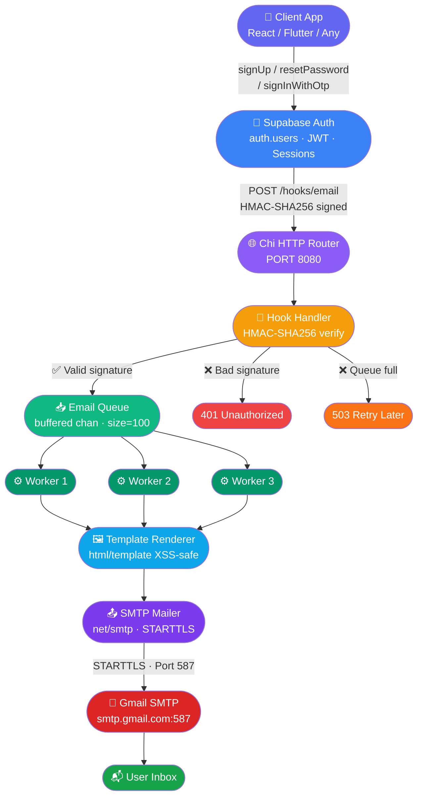
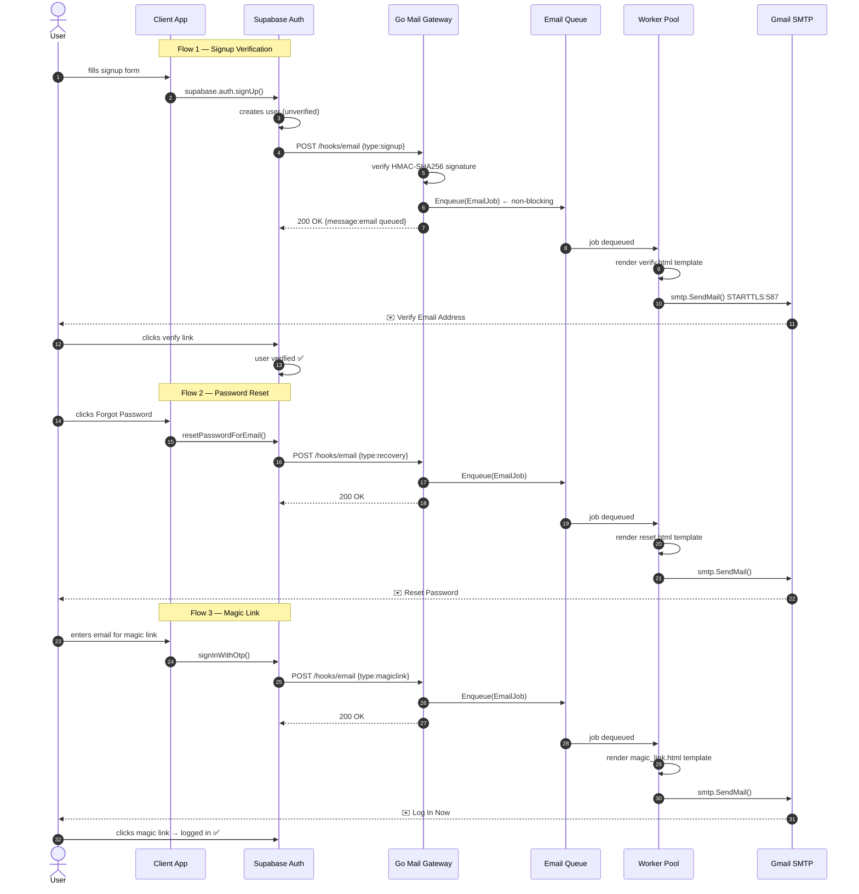

# ✅ Flicko Mail Gateway — Complete Implementation

A production-grade Go mail server that intercepts **Supabase Auth webhooks** and sends emails via **Gmail SMTP**. Replaces Supabase's 3/hr email limit with unlimited custom sending.

---

## File Structure

```
mail-gateway/
├── cmd/server/main.go               ✅ Entry point: wiring + graceful shutdown
├── internal/
│   ├── config/config.go             ✅ Env loading, fail-fast validation
│   ├── handler/
│   │   ├── hook_handler.go          ✅ HMAC-SHA256 webhook + routing + queue push
│   │   └── health_handler.go        ✅ GET /health — queue stats + uptime
│   ├── mailer/
│   │   ├── mailer.go                ✅ Mailer interface (swappable)
│   │   ├── smtp_mailer.go           ✅ Gmail SMTP via net/smtp, RFC 2822 MIME
│   │   └── mock_mailer.go           ✅ Test double with thread-safe recording
│   ├── models/
│   │   ├── hook_payload.go          ✅ Supabase webhook payload structs
│   │   ├── email_job.go             ✅ Queue job + EmailData structs
│   │   └── errors.go                ✅ Sentinel errors for validation
│   ├── middleware/ratelimit.go       ✅ 60 req/min per IP (httprate)
│   ├── queue/
│   │   ├── email_queue.go           ✅ Buffered chan — non-blocking enqueue
│   │   └── worker_pool.go           ✅ 3 workers, exponential backoff (1s/2s/4s)
│   └── templates/renderer.go        ✅ html/template loader (XSS-safe)
├── templates/
│   ├── verify.html                  ✅ Indigo — "Verify Email Address"
│   ├── reset.html                   ✅ Purple — "Reset Password"
│   └── magic_link.html              ✅ Green — "Log In Now"
├── tests/unit/
│   ├── handler_test.go              ✅ 9 handler test cases
│   └── queue_test.go                ✅ 9 queue test cases
├── .env.example                     ✅ All vars documented
├── Dockerfile                       ✅ Multi-stage Alpine build
├── Makefile                         ✅ run/build/test/docker targets
└── go.mod                           ✅ chi/v5, httprate, godotenv
```

---

## Verification Results

| Check | Result |
|---|---|
| `go build ./...` | ✅ Clean |
| `go vet ./...` | ✅ Clean |
| `go test ./tests/...` | ✅ All pass |
| Binary `bin/server` | ✅ Compiled |

---

## Key Features

| Feature | Details |
|---|---|
| **HMAC-SHA256 Auth** | Constant-time `hmac.Equal()` — timing-attack safe |
| **Email Queue** | Buffered `chan EmailJob` size=100, non-blocking enqueue |
| **Worker Pool** | 3 goroutines (configurable), `sync.WaitGroup` drain |
| **Retry + Backoff** | 3 attempts: 1s → 2s → 4s, log + discard on failure |
| **Graceful Shutdown** | SIGINT/SIGTERM → drain HTTP → close queue → wait workers |
| **Dev Mode** | `USE_MOCK_MAILER=true` logs emails without sending |
| **Rate Limit** | 60 req/min per IP on `/hooks/email` |
| **Health Check** | `GET /health` — queue depth, uptime, workers |

---

## Quick Start

```bash
# 1. Copy and fill env
cp .env.example .env
# Edit: SMTP_USERNAME, SMTP_PASSWORD, WEBHOOK_SECRET, SUPABASE_URL

# 2. Run server
GOTOOLCHAIN=local go run cmd/server/main.go

# 3. Expose with ngrok
ngrok http 8080

# 4. Set Supabase hook URL
# Supabase → Auth → Hooks → Add Hook → HTTP URL = https://xxx.ngrok.app/hooks/email

# 5. Test health
curl http://localhost:8080/health
```

---

## System Architecture



---

## API Routes

| Method | Path | Auth | Description |
|---|---|---|---|
| `POST` | `/hooks/email` | HMAC-SHA256 | Supabase webhook receiver |
| `GET` | `/health` | None | System health check |

---

## Email Flow Sequence



---

## Environment Variables

| Variable | Required | Description |
|---|---|---|
| `SMTP_USERNAME` | ✅ Yes | Gmail address |
| `SMTP_PASSWORD` | ✅ Yes | Gmail App Password (not your login password) |
| `WEBHOOK_SECRET` | ✅ Prod | From Supabase Auth → Hooks dashboard |
| `SUPABASE_URL` | ✅ Yes | Your Supabase project URL |
| `APP_URL` | Yes | Your frontend URL for redirects |
| `PORT` | No | Default: `8080` |
| `EMAIL_WORKER_POOL` | No | Default: `3` |
| `EMAIL_QUEUE_SIZE` | No | Default: `100` |
| `USE_MOCK_MAILER` | No | Set `true` in dev to skip real sends |

---

## Gmail App Password Setup

1. Go to [myaccount.google.com](https://myaccount.google.com)
2. **Security** → **2-Step Verification** → Turn ON
3. **Security** → **App Passwords**
4. Select app: "Mail" → Device: "Other" → name it `mail-gateway`
5. Copy the 16-character password → paste as `SMTP_PASSWORD`

---

## Deployment

Deploy to Railway, Fly.io, or any Docker host. Set env vars and point Supabase hook to your public URL:

```
https://your-deployment.up.railway.app/hooks/email
```

<!-- -------------------------------------------------------------------- -->
<!-- -------------------------------------------------------------------- -->
# 1. Copy and fill env
cp .env.example .env
# Edit: SMTP_USERNAME, SMTP_PASSWORD, WEBHOOK_SECRET, SUPABASE_URL
# 2. Run server  
GOTOOLCHAIN=local go run cmd/server/main.go
# 3. Expose with ngrok
ngrok http 8080
# 4. Set Supabase hook URL
# Supabase → Auth → Hooks → Add Hook → HTTP URL = https://xxx.ngrok.app/hooks/email
# 5. Test health
curl http://localhost:8080/health