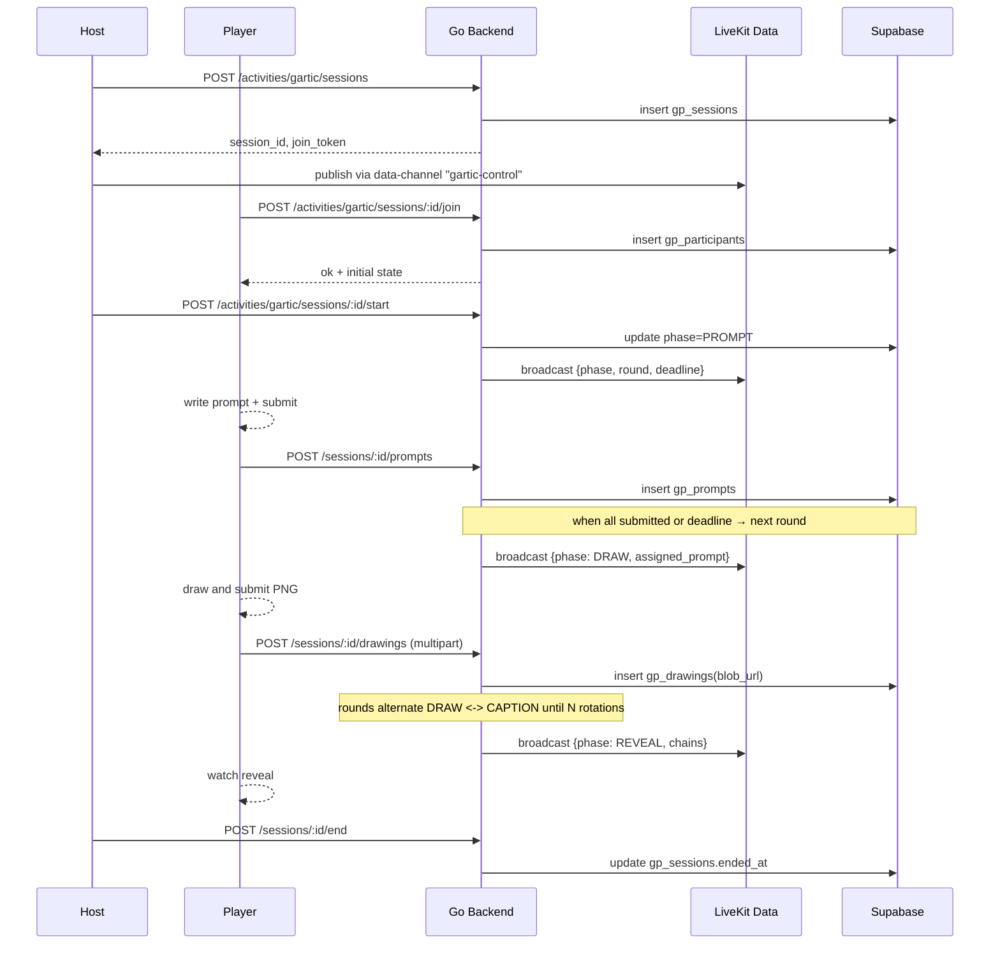

# Gartic Phone — App Flow

## 1. End-to-End



## 2. State Machine

```
[lobby] --start--> [prompt] --all_submitted--> [draw_1]
[draw_1] --all_submitted--> [caption_1]
[caption_1] --all_submitted--> [draw_2]
... continues until rounds == participants ...
[final_caption] --all_submitted--> [reveal]
[reveal] --finish--> [results]
[results] --close--> [archived]
[any] --host_abort--> [archived]
```

## 3. User Journeys

### J1 — Happy 4-player game
1. Host opens activities, picks Gartic Phone, presses Start.
2. Each player types a prompt within 30 s.
3. Each player draws their assigned prompt within 60 s.
4. Each player captions next drawing within 30 s.
5. Reveal carousel auto-plays all chains end to end.
6. Host can save chain as GIF or post to channel.

### J2 — Player disconnects mid-draw
1. Player loses network at 0:20 of draw phase.
2. Local canvas autosaves to Hive every 2 s.
3. On reconnect within 30 s: resume canvas; resubmit on done.
4. After 30 s: backend marks slot as forfeit, fills with placeholder "🤷 missed".
5. Game continues; player rejoins as spectator.

### J3 — First-time empty state
1. User taps Activities first time.
2. "Try Gartic Phone with 3 friends" hero card.
3. Tap → lobby with invite-link prefilled.

## 4. Edge Cases
- Offline submit: queue on device, drop after deadline.
- Host leaves: auto-promote longest-tenured participant; if all leave → session archived.
- Image upload fails: retry 3× exponential; if still fail, submit blank with apology message.
- Latency drift on deadline: server is source-of-truth; client clock synced to server timestamp at phase boundary.
- Concurrent submits: idempotent on `(session_id, round, user_id)`; second write returns first.
- Rate limit: 1 session start per user per 60 s.

## 5. Background / Async
- Triggered by: phase deadline cron worker every 1 s polls `gp_sessions WHERE deadline < now() AND phase != 'reveal'`.
- Idempotency key: `gartic:advance:<session_id>:<round>`.
- Failure policy: retry 3× then mark session ABANDONED, broadcast result.

## 6. Notifications
- Trigger: invitee receives "alice started Gartic Phone in #lounge" push.
- Channel: push + in-app.
- Copy: "Quick! 4 players already in. Tap to join."
- Deep link: `flicko://voice/<channel-id>/activity/gartic/<session-id>`.
- Batching: max 1 per channel per 5 min.
