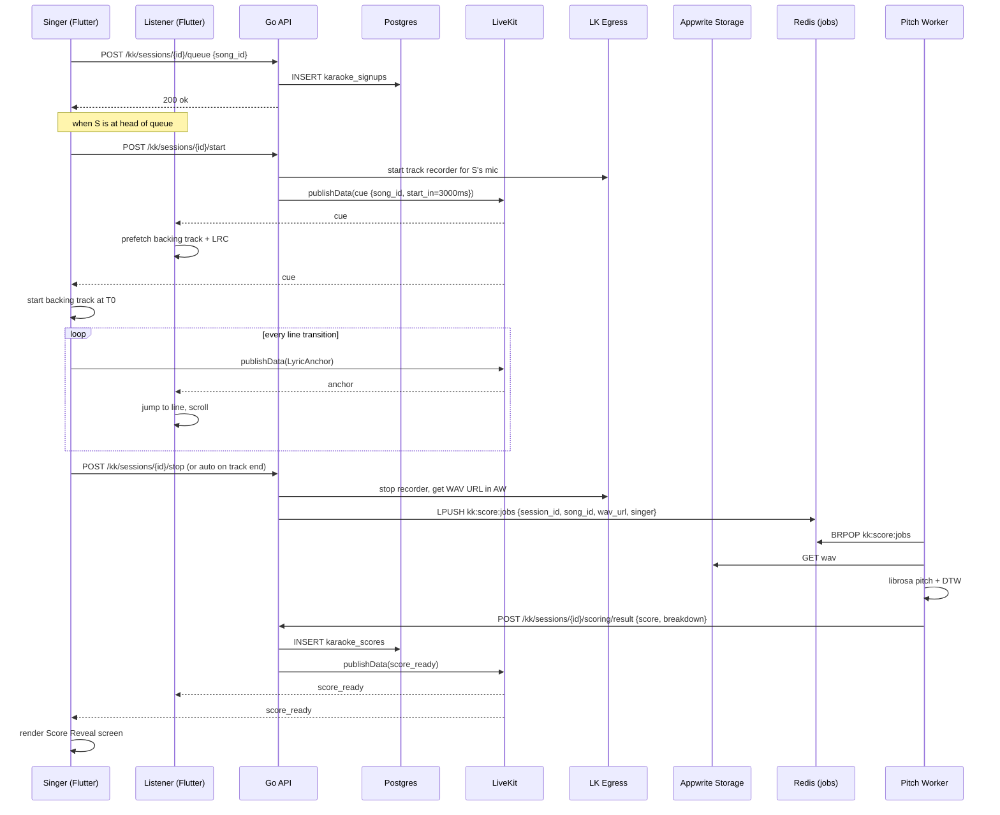
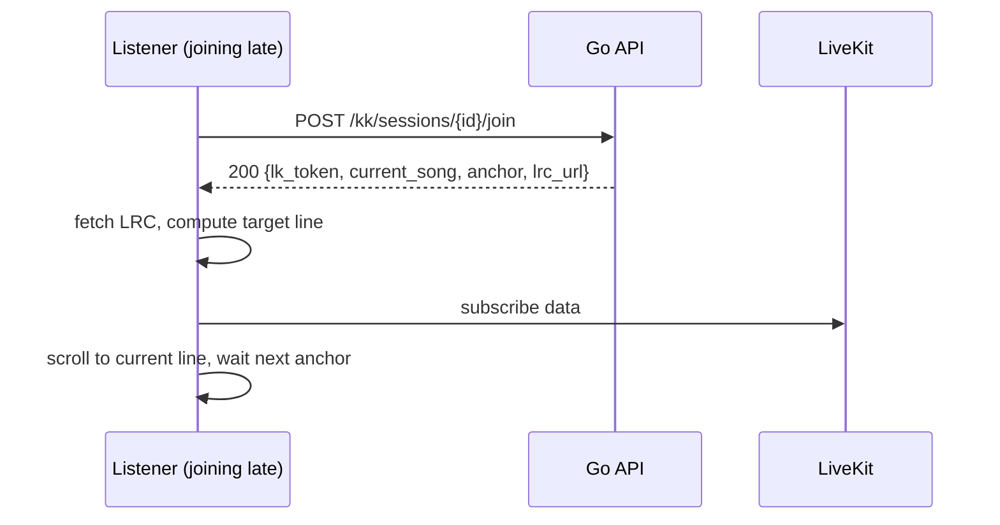

# Karaoke Night — App Flow

## Sequence: Sign Up, Sing, Score



## Sequence: Late Join Mid-Song



## State Machine — Session

```
DRAFT -> READY -> CUEING -> SINGING -> SCORING -> READY (next)
                              |
                              +--> SKIPPED -> READY
                              +--> CANCELLED -> READY
                                                |
                                                v
                                              ENDED
```

## State Machine — Singer Slot

```
SIGNED_UP -> CUED -> ACTIVE -> COMPLETED -> SCORE_PENDING -> SCORE_READY
                |             |
                |             +--> ABANDONED (mic drop)
                +--> WITHDRAWN
```

## State Machine — Score Job

```
QUEUED -> RUNNING -> SUCCEEDED
   |          |
   |          +--> FAILED -> RETRY (max 2)
   +--> EXPIRED (job > 60s)
```

## Edge Cases

### Mic Permission Denied
- Singer cannot start; UI shows "We need mic permission to capture your voice." with deep link to settings.
- Queue advances to next signer after 10 s if not resolved.

### Mic Silent for 5 s
- Treat as abandoned. Auto-stop, mark `ABANDONED`.
- Score still requested; `completeness` reflects portion sung.

### Backing Track Fails to Load on Listener
- Listener sees "Audio unavailable, lyrics still scrolling".
- Other listeners unaffected.

### Worker Crashes Mid-Job
- Job retried up to 2x; if final fail, score posted as `score=null`, breakdown omitted.
- UI shows "Couldn't score this take — try again next song".

### Worker Queue Backed Up (> 5 jobs)
- New songs allowed but score reveal delayed.
- Banner: "Scores are running ~30 s behind tonight."

### Singer Drops Mid-Song
- LK detects participant_left; auto-stop after 5 s.
- Listeners see "Singer dropped — moving on".

### LRC Mismatch with Backing Track
- Drift accumulates beyond 1 s → emergency anchor every line.
- Catalog admin notified via internal alert; song flagged.

### User Submits Track Without Rights
- Upload form requires checkbox attestation.
- Track lands in `pending_review` queue; admin must approve before catalog appears.

### Stealth Mode Singer
- Score saved but not broadcast; listener sees "Score hidden by singer".
- Leaderboard still counts (or not, per setting).

### Two Songs Queued by Same Singer in a Row
- Allowed; no rate limit on queueing for low-traffic v1.

### Singer's Backing Track Longer than 6 min
- Free-tier cap; UI shows "Tracks must be under 6 min." in song picker.

### Voice Channel Members > 25
- v1 cap; new members can listen but not sign up to sing until queue opens slot.

### LiveKit Audio Quality Drops
- Banner "Network is rough — quality may suffer". No app intervention; user adjusts.

### Concurrent Sessions in Same Voice Room
- Disallowed. Only one karaoke session per room.

### Egress Recording Fails
- Score impossible. Session continues; reveal shows "Couldn't capture audio for scoring."
