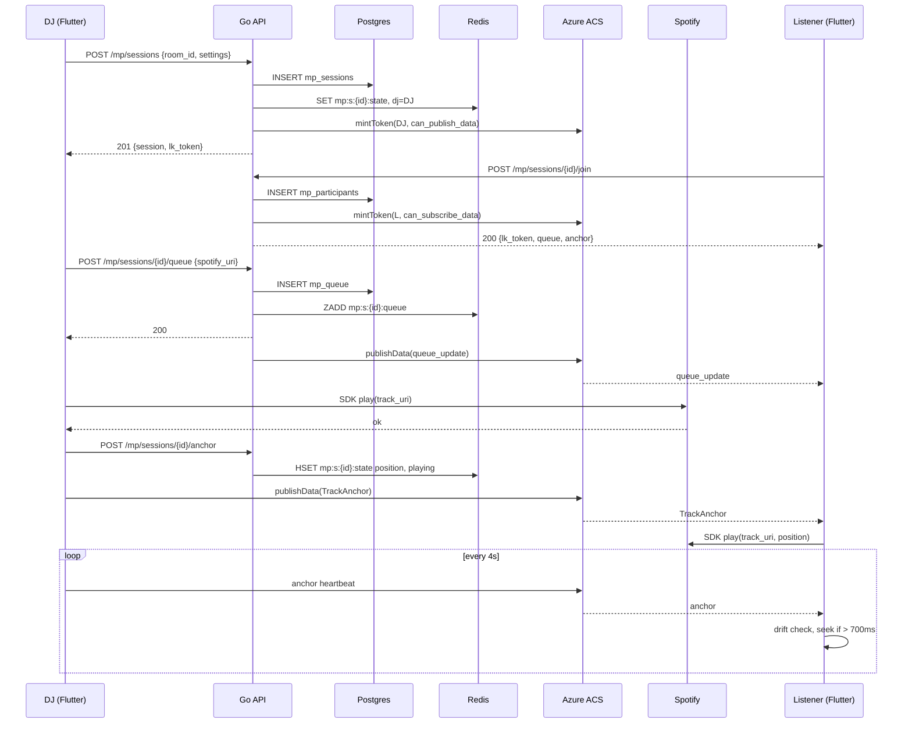
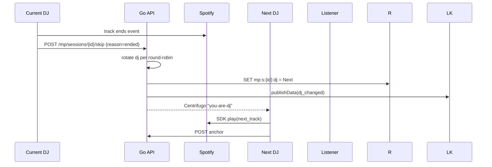
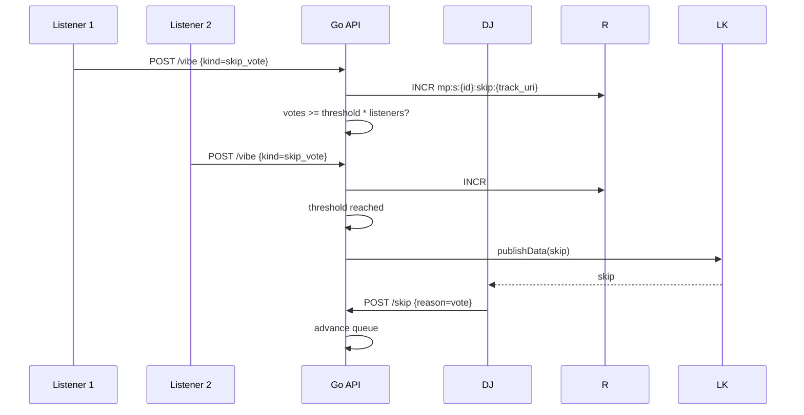

# Music Party — App Flow

## Sequence: Create Session, Add Tracks, Play



## Sequence: Round-Robin Rotation



## Sequence: Vote-Skip



## State Machine — Session

```
DRAFT -> READY -> PLAYING <-> PAUSED -> ENDED
                     ^
                     | track_change (atomic)
                     v
                  PLAYING (new track)
```

## State Machine — Queue Item

```
QUEUED -> PLAYING -> COMPLETED
   |          |
   |          +--> SKIPPED (dj or vote)
   +--> REMOVED (by adder or DJ)
```

## State Machine — DJ Slot

```
        +------- handoff ------+
        v                      |
   IDLE -> ACTIVE_DJ -> ROTATING
              |              |
              | leave        | next_dj_chosen
              v              v
           ROTATING       ACTIVE_DJ (new)
```

## Edge Cases

### Free-Tier Listener Joins
- Detect via Spotify `subscription_level`. If `free`, route to preview path.
- Server fetches `preview_url` from Spotify for queued track; client plays via `audioplayers`.
- Sync limited to "play same preview at start". No mid-track seek.

### DJ Premium Lapses Mid-Session
- Spotify SDK throws PREMIUM_REQUIRED.
- Server marks DJ ineligible, triggers immediate rotation.
- Listener-vote mode: surface a vote modal with eligible candidates.

### Spotify Outage
- After 3 consecutive 5xx, session enters `degraded` state.
- Banner: "Spotify is having issues. We'll reconnect automatically."
- Queue ops still allowed; playback paused until SDK responds.

### Track Unavailable in Listener Region
- Listener's SDK returns `restriction.reason=market`.
- Server logs `mp_track_skipped_total{reason=market}` and broadcasts skip after 3 listeners report.

### DJ Disconnect
- LK webhook + 5 s grace.
- Round-robin: advance to next listener.
- Manual: pause session, surface "DJ left — pick a new DJ" modal to remaining users; first taker becomes DJ.

### All Listeners Leave
- Session keeps DJ for 60 s with their track playing.
- After 60 s of zero listeners, end session.

### Network Drop on Listener
- SDK retains buffered audio; on reconnect, fetch `GET /anchor`, seek.

### Add to Queue While Skipping
- Queue ops use Redis `ZADD` with score `now()` to avoid race; final order recomputed on broadcast.

### Duplicate Track in Queue
- Allowed (people request the same banger). Show count badge "x2".

### Long Track (> 10 min)
- Allowed. Rotation modes still trigger on track-end.
- Skip-vote threshold reachable as usual.

### Voice Room Banned User Tries to Join
- 403 from `/join`; client shows "You don't have access to this room."

### Spotify Token Refresh During Playback
- Server refreshes 60 s before expiry; client SDK re-auths silently. No user-visible interruption.

### Preview File 404
- Some tracks lack `preview_url`. Free listener sees "Preview unavailable for this track" and silent gap. DJ continues.
