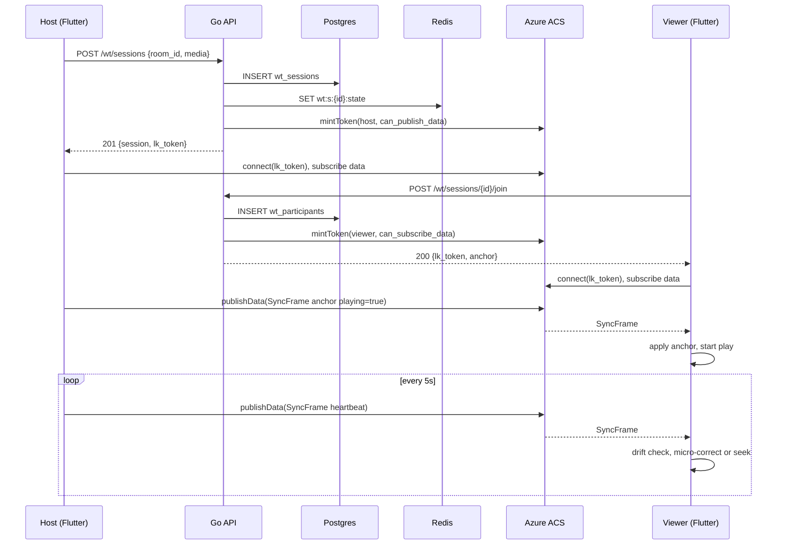
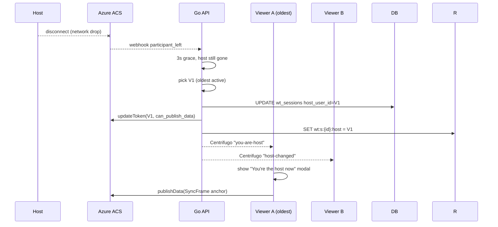

# Watch Together — App Flow

## Sequence: Create Session and First Play



## Sequence: Host Leaves, Viewer Promoted



## State Machine — Session

```
            +------------+
            |   DRAFT    |  (created, no media chosen)
            +-----+------+
                  | media set
                  v
            +-----+------+
   +--------|   READY    |
   |        +-----+------+
   | host   | host clicks play
   | quits  v
   |  +-----+------+      pause      +-----------+
   |  |  PLAYING   +<--------------->|  PAUSED   |
   |  +-----+------+                 +-----+-----+
   |        | end                          | end
   |        v                              v
   |  +-----+------+                 +-----+-----+
   +->|   ENDED    |<----------------+
      +------------+
```

Transitions are emitted as `wt_session_state_changed` events on Centrifugo.

## State Machine — Participant

```
JOINING -> SUBSCRIBED -> PLAYING -> (DRIFTING <-> SYNCED) -> LEFT
                              |
                              v
                          PROMOTED  (becomes host)
```

## Edge Cases

### Offline / Cellular Drop
- Local player keeps last frame, sync indicator goes amber.
- On reconnect, fetch GET `/sessions/:id/anchor`, apply seek.
- If gap > 60 s, show "You missed 1m 12s — catch up?" with [Skip] [Catch Up].

### Host Leaves Voluntarily
- Host taps [Hand off host], picks viewer.
- API updates `host_user_id`, refreshes LK token grants, broadcasts.
- Outgoing host's controls disable in 80 ms; new host's enable on token refresh ack.

### Host Crashes
- Webhook from Azure ACS; election runs after 3 s grace.
- If no eligible viewer (everyone left), session moves to ENDED.

### Sync Drift > 500 ms
- Viewer logs `wt_drift_corrected_total{magnitude=hard}`.
- Hard seek; show micro-toast "Resyncing..." for 600 ms.

### Sync Drift 150–500 ms
- Adjust playback rate ±5% for up to 4 s.
- If still drifting after 4 s, escalate to hard seek.

### Media Unavailable Mid-Session
- YouTube returns "video removed" → host gets modal, others see "Host needs to pick a new video."
- Host can paste new URL; anchor resets to 0.

### Late Joiner
- GET anchor with `wall_clock_ms`; client computes target position with RTT compensation.
- Buffer until first frame, then start.

### Banned User in Voice Room
- POST /join returns 403; client shows "You don't have access to this room."

### Region Mismatch
- Azure ACS Cloud auto-routes; if dial fails twice, fallback to Centrifugo path with banner "Reduced sync quality."

### Battery Saver Mode (Mobile)
- iOS / Android may throttle JS / video timers. Heartbeat raised to 2 s when app reports `lowPowerMode=true`.

### Multiple Sessions in Same Room
- Allowed up to 2 (e.g. movie + side meme). Activities Hub lists both with viewer counts.

### Host Tries to Pick DRM-Protected URL
- Allowlist check fails; explicit error "We can't play DRM content."
