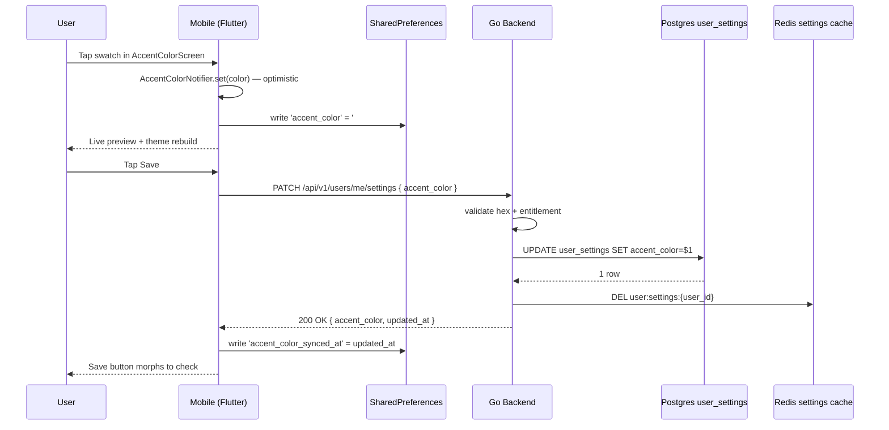

# Accent Colors — App Flow

## 1. End-to-End Journey



## 2. State Machine

```
[idle] -- pick swatch --> [dirty]
[dirty] -- pick another --> [dirty]
[dirty] -- tap Save --> [saving]
[saving] -- 200 --> [saved]
[saving] -- 4xx --> [validation_error]
[saving] -- timeout/5xx --> [retry_queued]
[retry_queued] -- on app foreground --> [saving]
[validation_error] -- pick valid --> [dirty]
[saved] -- back nav --> [idle]
```

## 3. User Journeys

### J1 — Happy path (free user, palette swatch)
1. User opens Settings → Appearance.
2. Sees current accent (purple) on the row.
3. Taps "Accent color".
4. Sees live preview of mention + CTA.
5. Taps a coral swatch — preview re-renders coral.
6. Taps Save. Network round-trip <300ms. Save morphs to check.
7. Returns to Appearance. Row dot is now coral. Mentions across app are coral.

### J2 — Plus user picks custom hex
1. User taps "Custom hex — Plus only".
2. Sheet opens; user types `#3ECF8E`.
3. Live preview tile updates after each valid 6-digit input.
4. Backend validates contrast (4.7:1 against dark surface — passes).
5. User taps Apply. Sheet closes; main screen reflects choice.

### J3 — Free user attempts custom hex
1. Taps "Custom hex".
2. Sheet opens in paywall mode: hex field disabled, banner explains Plus, CTA `[Get Plus]`.
3. User dismisses. Returns to swatch grid unchanged.

### J4 — Network failure on save
1. Same as J1 through step 6.
2. Backend returns 503.
3. Inline banner above grid: "Couldn't save — we'll try again."
4. `accent_color_provider` enqueues retry; selection is *kept* locally.
5. On next app foreground, retry fires; success → banner clears.

### J5 — Cross-device reconcile
1. User picks coral on phone (saves successfully).
2. Opens Flicko on tablet. Tablet still shows purple.
3. App foreground triggers `GET /users/me/settings`.
4. Tablet sees `accent_color: #FF6B6B`, updated_at newer than local.
5. Theme rebuilds to coral. No prompt; silent reconcile.

### J6 — Plus → Free downgrade with custom hex
1. User has `#3ECF8E` set under Plus.
2. Subscription lapses. On next foreground, app calls `/users/me/settings`.
3. Backend response includes `entitlements: { accent_color_custom_hex: false }` plus the still-stored hex.
4. Client checks: hex is not in palette and entitlement is false → snap to nearest palette swatch (`#3ECFAA`) and show one-time toast: "Your custom color isn't part of Free. We picked the closest match."

### J7 — Reset
1. User taps "Reset to Flicko purple".
2. Confirmation dialog (single tap to dismiss): "Reset accent to default?" with `[Reset]` and `[Cancel]`.
3. Tap Reset → optimistic set `#7C5CFF`, PATCH to backend, save state returned to default.

## 4. Edge Cases

- **Offline at first save:** PATCH fails immediately; retry queue persists in `SharedPreferences` as `pending_settings_patch` JSON. Replays on connectivity restore.
- **Permission denied:** N/A — every authed user can set their own accent.
- **Stale data after multi-device race:** last-write-wins by `updated_at`; client always trusts server on foreground.
- **Concurrent PATCH from two devices:** backend's UPDATE is atomic; whichever lands second wins; cache invalidation broadcasts no event since this is per-user.
- **Rate limit:** PATCH /settings is gated at 30 req/min per user (existing). Exceeding triggers banner "Slow down — try again in a moment." UI debounces to one save per second.
- **Network slow:** optimistic UI applied immediately; if save takes >2s, Save button shows progress spinner. Rolls back to previous color on definitive failure (5xx after 3 retries).
- **Bad hex from server:** If response carries an unparseable hex (regression), client falls back to default and logs Sentry breadcrumb `accent_color_invalid_from_server`.
- **System-level dynamic color:** Material You dynamic color (Android 12+) is overridden inside Flicko surfaces. Lock screen / system notifications still honor system theme.

## 5. Background / Async

- Settings retry worker runs on app foreground only (no headless work needed).
- Idempotency key: `user_id:setting:accent_color` — last value wins.
- Failure policy: exponential backoff `1s, 5s, 30s, 2m, 10m` then surface persistent banner.

## 6. Notifications

- None. This is silent. We do not push, email, or in-app notify on color change.
- Internal analytics event `accent_color.changed` fires once per successful save (not per swatch tap).
