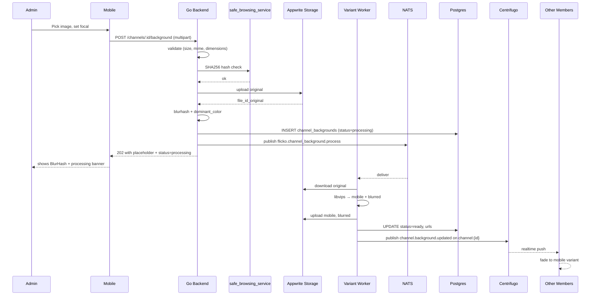

# Channel Backgrounds — App Flow

## 1. End-to-End Journey



## 2. State Machine (server-side row)

```
[absent] -- POST --> [validating]
[validating] -- ok --> [hash_checking]
[validating] -- bad --> [absent] (4xx)
[hash_checking] -- ok --> [original_uploading]
[hash_checking] -- banned --> [absent] (422)
[original_uploading] -- ok --> [processing]
[processing] -- worker done --> [ready]
[processing] -- worker fail (3 retries) --> [original_only]
[ready] -- DELETE --> [deleting]
[deleting] -- blobs gone --> [absent]
```

## 3. State Machine (client-side render)

```
[no_data] -- on enter channel --> [fetching]
[fetching] -- background exists --> [show_blurhash]
[fetching] -- no background --> [no_bg]
[show_blurhash] -- mobile loaded --> [show_image]
[show_blurhash] -- save_data --> [show_blurhash] (terminal)
[show_image] -- member toggled off --> [no_bg]
[show_image] -- background.deleted event --> [no_bg]
[show_image] -- background.updated event --> [show_blurhash]
```

## 4. User Journeys

### J1 — Happy path (admin upload)
1. Liam (mod) opens `#gaming-talk` → channel settings → Appearance.
2. Taps "Choose image", picks a 2.4 MB JPG of a neon arcade.
3. Drags focal reticle to the bright sign in the upper-third.
4. Taps Upload. Progress bar 0→100% in ~700 ms.
5. Backend returns 202, screen shows processing banner over BlurHash placeholder.
6. ~3 s later, realtime event fires; image fades in. Banner clears.
7. Liam returns to chat. Background visible at 30% opacity.

### J2 — Member tunes opacity
1. Maya finds the background too dark for legibility.
2. Taps `⋯` in top bar → "Background opacity".
3. Drags slider from 30% to 12%. Sample bubble updates live.
4. Closes sheet. Setting persisted to `user_settings.channel_bg_opacity_overrides[channel_id] = 0.12`.

### J3 — Member disables globally
1. Maya goes to Settings → Chat → "Channel backgrounds" → off.
2. App reloads channel; backgrounds gone everywhere. BlurHash also suppressed.
3. Settings synced via existing PATCH /users/me/settings.

### J4 — Image moderated
1. Admin uploads image whose SHA256 is on the banned list.
2. Backend returns 422 within 200 ms.
3. UI shows modal: "This image was blocked. Try another."
4. No row inserted; no Appwrite write.

### J5 — File too big
1. Admin picks 12 MB photo.
2. Client-side check rejects pre-upload. Toast: "That image is over 8 MB. Try compressing it."
3. No network call.

### J6 — Variant worker fails
1. Admin uploads OK, original lands in Appwrite, row created `status=processing`.
2. Worker errors 3× (libvips OOM on a pathological PNG).
3. Row marked `status=original_only`.
4. Clients fetch original (heavy) but show BlurHash on entry; image lazy-loads only when channel is in foreground >2 s.
5. Sentry alert fires; engineer investigates; can re-trigger via `/internal/admin/channel-bg/reprocess/:id`.

### J7 — Channel deleted
1. Admin deletes the channel.
2. CASCADE removes `channel_backgrounds` row.
3. AFTER DELETE trigger enqueues NATS `flicko.channel_background.delete_blobs` with file_ids.
4. Worker deletes 4 Appwrite files.

### J8 — Save-Data header
1. Member on metered connection sets system "Data Saver" on.
2. Flutter's `Connectivity` plugin reports `connectionStatus=mobile, savingData=true`.
3. `ChannelBackgroundLayer` renders BlurHash only; never fetches mobile/original.
4. Banner above message list (one-time, dismissible): "Backgrounds dimmed to save data."

## 4. Edge Cases

- **Offline upload:** queued in `pending_uploads` SQLite table; replays on reconnect.
- **Permission revoked mid-edit:** if admin loses MANAGE_CHANNEL between picking and uploading, server returns 403; client shows "You no longer have permission".
- **Concurrent uploads (two admins):** last write wins by `set_at`; Centrifugo broadcasts both updates so all members see the eventual final state.
- **Stale cache:** Redis key invalidated on every UPDATE/DELETE.
- **Rate limit:** 5 uploads per channel per hour; exceeding returns 429 with `retry_after` seconds.
- **Network slow:** progress bar visible; cancel button at any time aborts the multipart write.
- **Crashed mid-upload:** Appwrite cleanup job purges orphaned files older than 24h with no DB row.

## 5. Background / Async

- Variant generation: NATS `flicko.channel_background.process`, idempotency key `bg:variant:{file_id_original}`. Retries 3× exponential 30s/2m/10m.
- Blob cleanup: NATS `flicko.channel_background.delete_blobs`, idempotent on `file_id`.
- Storage scrub cron (`0 4 * * *`): deletes Appwrite files with no matching DB row OR DB rows with `status=ready` but missing variants.

## 6. Notifications

- Admin gets in-app toast on success ("Background updated"); no push.
- Members do not get notified — visual change is itself the signal.
- Audit log entry written: `audit_logs.action='channel.background_updated'` with `target_id=channel_id`.
