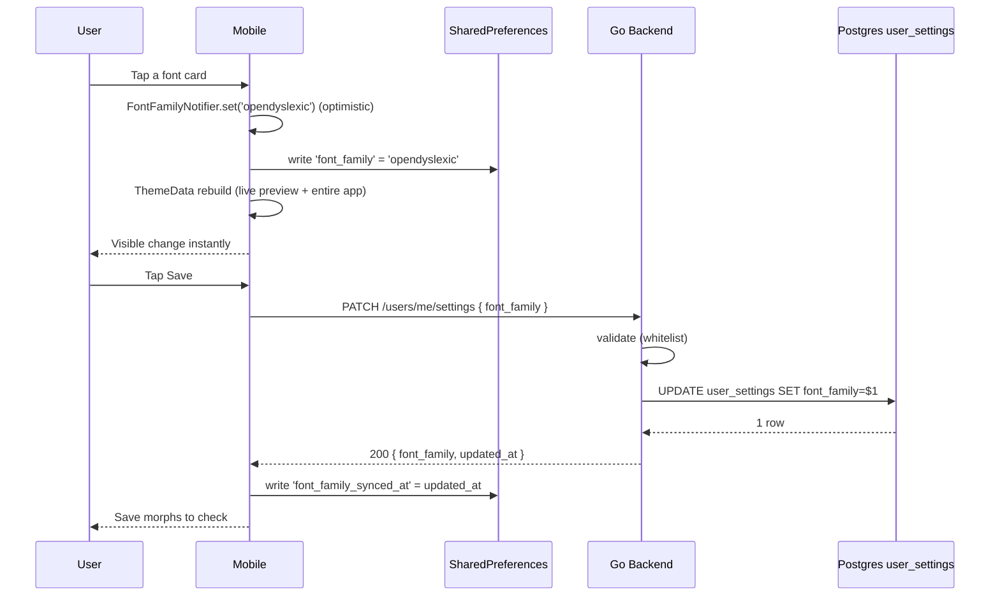

# Custom Fonts (Basic) — App Flow

## 1. End-to-End Journey



## 2. State Machine

```
[idle] -- pick card --> [dirty]
[dirty] -- pick another --> [dirty]
[dirty] -- tap Save --> [saving]
[saving] -- 200 --> [saved]
[saving] -- 422 (rare) --> [validation_error]
[saving] -- timeout/5xx --> [retry_queued]
[retry_queued] -- on app foreground --> [saving]
[validation_error] -- pick valid --> [dirty]
[saved] -- back --> [idle]
```

## 3. User Journeys

### J1 — Happy path (dyslexic user picks OpenDyslexic)
1. Sam opens Settings → Appearance.
2. Sees "Font: Inter" row.
3. Taps row.
4. Live preview at top renders sample chat in Inter.
5. Sam scrolls to "Accessible" section, taps OpenDyslexic.
6. Live preview rebuilds in OpenDyslexic. The whole picker UI also renders in OpenDyslexic (because `themeDataProvider` already updated optimistically).
7. Sam taps Save. Round-trip <250ms. Save morphs to check.
8. Returns to chat — every message is now in OpenDyslexic. Code blocks remain JetBrains Mono.

### J2 — Dev wants JetBrains Mono everywhere
1. Eli opens picker, taps JetBrains Mono.
2. Preview shows prose in mono — clear it really applies even outside code blocks.
3. Eli saves. App-wide rendering switches; UI labels (timestamps, badge text) all in mono.

### J3 — First-time onboarding
1. New account. After avatar + display-name, onboarding shows "Pick your reading font."
2. Three popular options visible (Inter, OpenDyslexic, Atkinson). "See more" link to picker.
3. User taps Atkinson, taps Continue.
4. App opens with Atkinson everywhere.

### J4 — Network failure on save
1. Same as J1 through step 7.
2. Backend returns 503.
3. Inline banner: "Couldn't save — we'll try again." Selection stays applied locally.
4. Retry queue persists in `SharedPreferences`. On next app foreground or connectivity restore, retries fire.
5. Banner clears on success.

### J5 — Cross-device reconcile
1. Sam picks OpenDyslexic on phone. Saved.
2. Opens Flicko on tablet (still has Inter).
3. App foreground triggers `GET /users/me/settings`.
4. Tablet sees `font_family: opendyslexic`, updated_at newer than local.
5. ThemeData rebuilds. Toast (one-time): "Switched to OpenDyslexic to match your phone."

### J6 — Server has a font the client doesn't know
1. Backend rolls out a hypothetical 8th font tomorrow.
2. Older client receives `font_family: "newfont"`.
3. Catalog lookup returns null → fall back to Inter; show one-time toast on next Settings open: "Your previous font isn't available — we picked Inter." Sentry breadcrumb logged.

### J7 — Reset
1. User taps "Reset to Inter".
2. Confirmation: "Reset font to Inter?" with `[Reset]` `[Cancel]`.
3. Reset → optimistic set + PATCH; rolls back to default if PATCH fails.

### J8 — System Bold Text on
1. iOS user enables Bold Text in system settings.
2. `MediaQuery.boldText` becomes true.
3. App reads bold variant of every bundled font automatically (Flutter handles via weight axis).
4. Picker samples render at weight 700.

## 4. Edge Cases

- **Offline at first save:** retry queue persists in `SharedPreferences` as `pending_settings_patch`; replays on connectivity restore.
- **Permission denied:** N/A — every authed user can change own font.
- **Concurrent PATCH from two devices:** last-write-wins by `updated_at`; deterministic.
- **Font asset missing in build (CI failure):** caught by `font_assets_present_test.dart` before release.
- **Glyph missing for user's locale:** Flutter font fallback chain renders missing characters from system font; banner appears on first Save if catalog flag `subset_coverage_warning_for_locale` is true.
- **Dynamic Type at extreme sizes:** picker scrolls; cards reflow vertically.
- **Reduced motion ON:** instant changes, no scale or crossfade.

## 5. Background / Async

- Settings retry worker (existing): runs on app foreground.
- Idempotency key: `user_id:setting:font_family` — last value wins.
- No queues, no schedule.

## 6. Notifications

- None. Silent.
- Internal analytics: `font.changed { from, to }` once per successful save.
