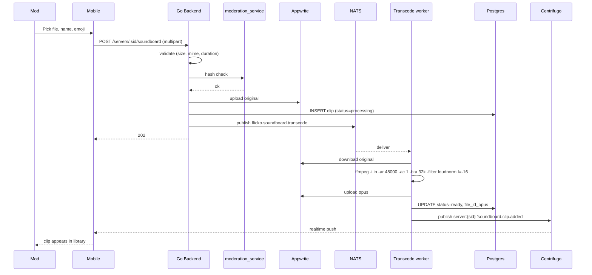

# Server Soundboard — App Flow

## 1. End-to-End Journey (play)

```mermaid
sequenceDiagram
    participant U as Priya
    participant M as Mobile
    participant API as Go Backend
    participant PERM as permissions_service
    participant CD as Redis cooldown
    participant DB as Postgres
    participant LK as LiveKit SFU
    participant P1 as Liam (peer)
    participant P2 as Maya (peer)

    U->>M: Tap "GG" chip
    M->>M: Optimistic chip press + haptic
    M->>API: POST /voice/rooms/:rid/soundboard/play {clip_id}
    API->>PERM: Check SOUNDBOARD_PLAY for user in server
    PERM-->>API: ok
    API->>CD: INCR sb:cd:{server}:{user}; check < limit; SET EXPIRE
    CD-->>API: 1 / 5
    API->>DB: SELECT clip (status=ready)
    DB-->>API: clip metadata
    API->>API: sign Appwrite URL (1h)
    API->>LK: PublishData(room=rid, payload)
    LK-->>P1: data event
    LK-->>P2: data event
    LK-->>M: data event (echo)
    P1->>P1: just_audio.play(opus_url)
    P2->>P2: just_audio.play(opus_url)
    M->>M: mute echo (don't play locally; played from optimistic press)
    API-->>M: 200 { started_at, next_play_in_ms: 5000 }
    M-->>U: cooldown ring on chip
```

## 2. End-to-End Journey (upload)



## 3. State Machines

### Clip lifecycle
```
[uploading] -- ok --> [processing]
[uploading] -- 4xx --> [absent]
[processing] -- worker ok --> [ready]
[processing] -- worker fail (3 retries) --> [failed]
[ready] -- mod disable --> [disabled]
[ready] -- delete --> [deleting]
[deleting] -- blob purged --> [absent]
[failed] -- mod retry --> [processing]
```

### Play state (per user)
```
[idle] -- tap --> [requesting]
[requesting] -- 200 --> [cooling_down]
[requesting] -- 429 --> [cooldown_message]
[requesting] -- 403 --> [forbidden]
[cooling_down] -- timer 0 --> [idle]
[cooldown_message] -- timer 0 --> [idle]
```

## 4. User Journeys

### J1 — Happy path play
1. Priya is in `voice-1`, listening to Liam.
2. Taps "GG" chip in soundboard sheet.
3. Backend authorizes in 30 ms. Cooldown set to 5 s.
4. LiveKit fans out data event in <80 ms.
5. Liam and Maya hear "GG" via their own `just_audio` instance; banner shows "🏆 GG by Priya".
6. Cooldown ring drains on Priya's chip.

### J2 — Cooldown hit
1. Priya taps "Bruh" 1 s after "GG".
2. UI immediately shows toast "Wait 4s before the next clip" — backend still called for canonical answer (rate-limit safe).
3. Backend returns 429 with `retry_after_ms: 4000`.
4. Chip stays greyed; ring continues from 4 → 0.

### J3 — Forbidden role
1. New member with `@new-members` role taps any chip.
2. Backend returns 403 `missing_permission`.
3. Sheet shows banner: "Your role can't play sounds here." with "Learn more" link to server rules.
4. No cooldown consumed.

### J4 — Mod uploads NSFW clip
1. Mod uploads a clip whose SHA256 matches a banned hash (or duration > 5s).
2. Backend rejects 422 instantly.
3. UI shows reason; clip not stored.

### J5 — Hearing-impaired member
1. Maya has hearing aids and prefers visual cues.
2. Her settings: `voice.visual_clip_indicator = always`.
3. Every play shows the in-call indicator with name + emoji + duration bar regardless of device output.

### J6 — Member reports a clip
1. Aarav joins server; the `🦴 dog whistle` clip plays loudly and seems abusive.
2. Long-press chip → "Report clip".
3. Form pre-fills clip id, server id; reason picker.
4. Submit → moderation team queue. Clip auto-disables if 3 reports in 24h from distinct users.

### J7 — Plus upgrade
1. Server hits 48-clip limit.
2. Mod sees "Get Plus → 96 slots" link in settings.
3. Tap deep-links to existing premium upsell.

### J8 — LiveKit SFU drops connection mid-play
1. Priya plays "Hype". Backend authorizes, publishes data.
2. SFU times out reaching Liam's peer.
3. Liam reconnects 2 s later; missed event; service exposes `recent_clips` GET so Liam can replay last 10 if curious. By default the old clip does not catch-up auto-play.

## 4. Edge Cases

- **Offline at play:** chip is dimmed when no LiveKit connection; tap shows "Reconnecting…".
- **Multiple plays at same instant:** server processes one, the other gets 429.
- **Voice is recording (LiveKit egress):** clip plays normally, audit log notes it.
- **Stale cooldown after Redis flush:** in-memory fallback caps at 5 s/user; degraded but safe.
- **Rate-limit globally per server:** max 10 plays/sec server-wide (prevents 100-member room from hitting LiveKit fan-out cliff). Excess plays return 429 `server_rate_limited`.
- **Clip duration overrun (file exceeds 5s due to transcode error):** worker truncates at 5.0s and logs `truncated=true`.
- **Permission revoked mid-session:** member's tap returns 403; chip greys.

## 5. Background / Async

- **Transcode worker:** NATS `flicko.soundboard.transcode`, idempotency `clip_id`. Retries 3× exp 30s/2m/10m. DLQ subject `flicko.soundboard.transcode.dlq`.
- **Storage scrub cron** (`0 4 * * *`): purge orphaned Appwrite blobs older than 24h with no DB row.
- **Auto-disable worker** (every 1m): mark clips with ≥3 reports in 24h `disabled=true`; notify mods.

## 6. Notifications

- No push on play (would be noise).
- Mods get in-app toast when an upload finishes processing: "🏆 GG is ready."
- Mods get push when a clip auto-disables from reports: "Clip {name} was hidden after 3 reports."
- Audit log entries: `audit_logs.action='soundboard.clip_played|uploaded|deleted|disabled'`.
