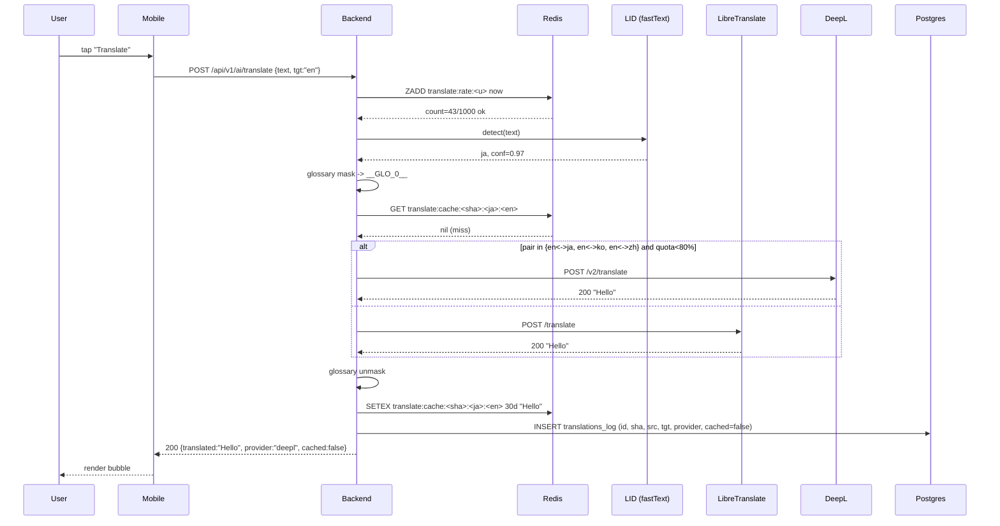
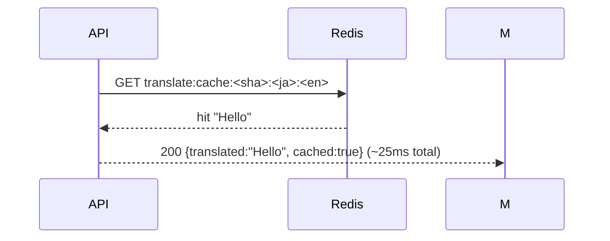
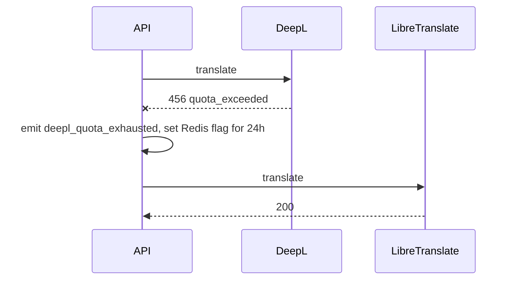
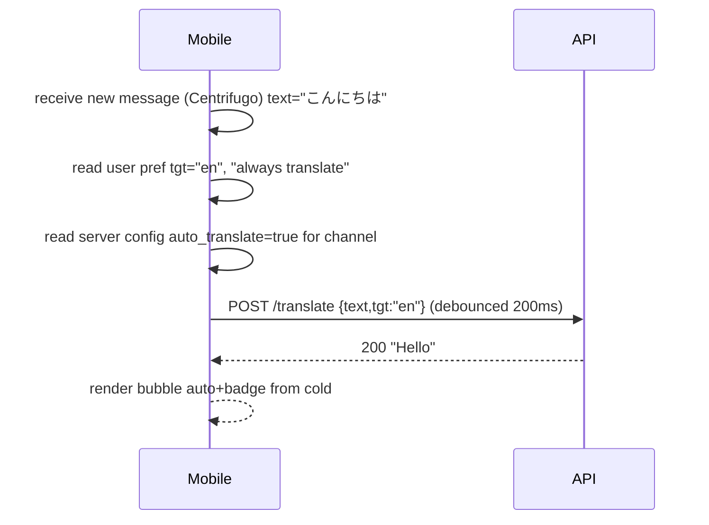

# Auto-Translate — Inline Per-Message Translation — App Flow

## 1. End-to-End Journey — Cache miss



## 2. Cache hit (different user, same text+pair)



## 3. Provider fallback (DeepL quota exhausted)



## 4. Auto-translate on incoming message (server has it ON)



## 5. State Machine — translate inline

```
[hidden]
  -- need_translate --> [button]
[button]
  -- tap            --> [loading]
  -- swipe-dismiss  --> [hidden]    (3 dismisses suppresses for 24h)
[loading]
  -- 200 ok         --> [shown]
  -- 4xx/5xx        --> [error]
  -- 429            --> [quota]
[shown]
  -- "show original"--> [hidden]
  -- thumbs         --> [shown]
[error]
  -- retry          --> [loading]
[quota]
  -- midnight       --> [button]
```

## 6. User Journeys

### J1 — Happy path
1. Yuki posts a Japanese message in `#general`.
2. Alice (en pref) sees the `Aa Translate` button.
3. Taps; bubble expands in 320ms (cache hit) or 720ms (miss).
4. Reads Hello! How are you? — taps 👍.

### J2 — Auto-translate on
1. Server admin toggles auto-translate in `#intl`.
2. All en-pref members see translation bubble auto-rendered with `auto` badge.
3. Member sets `ja` as fluent → bubble disappears for ja messages.

### J3 — Glossary
1. Admin opens glossary, adds `Frostmourne`.
2. Future messages with that exact word keep it untranslated.
3. Round-trip CI test verifies `__GLO_0__` placeholder isn't translated.

### J4 — Quota
1. User hits 1000 translations today.
2. Buttons disabled with tooltip; original text fully readable.

## 7. Edge Cases

- Detection conf < 0.5 → no auto-translate; user picks source from dropdown.
- Code blocks: never translated (LID returns `code` heuristic; entire code block passes through unchanged).
- Mentions `<@user_id>` are placeholder-protected like glossary.
- Messages edited after translation: cache key changes, retranslated on next view.
- Same text re-cached at edit; old key TTL'd out.
- 5000+ char message: client-side truncation hint "Translate first 5000 chars?"
- LibreTranslate health-check polled every 10s; if down 3× consecutive, route all to DeepL until healed.
- DeepL daily quota counted in Redis incr; threshold alert at 80%.

## 8. Background / Async

- **Cache warmer:** cron `0 */6 * * *` — for top-1k high-traffic foreign messages, pre-translate to top-3 user-langs (en, es, ja). Fills cache so first viewer hits.
  - Subject: `flicko.ai.translate.warm`
  - Idempotency: `translate:warm:<msg_id>:<tgt>`
- **Eviction:** Redis natural TTL 30d.
- **Quota reset:** DeepL counter is daily; reset at midnight UTC via cron.

## 9. Notifications

None. Translation is silent.
