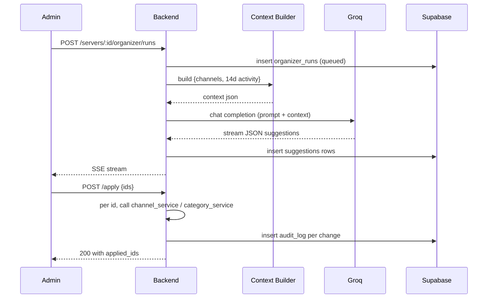

# AI Channel Organizer — APPFLOW



## State Machine
```
run: queued → running → completed
                     → failed
                     → canceled
suggestion: open → accepted / dismissed
```

## Edge Cases
- Server has 0 channels: nothing to do.
- Generation interrupted: partial suggestions saved, marked partial.
- Apply race vs concurrent admin edits: re-validate target ids before applying; skip stale.
- Reverted changes: keep audit; allow "revert run" within 24h.

## Background
- Runs are sync; no cron.

## Notifications
- "Organizer found 14 suggestions — review now" toast in admin notification center.
