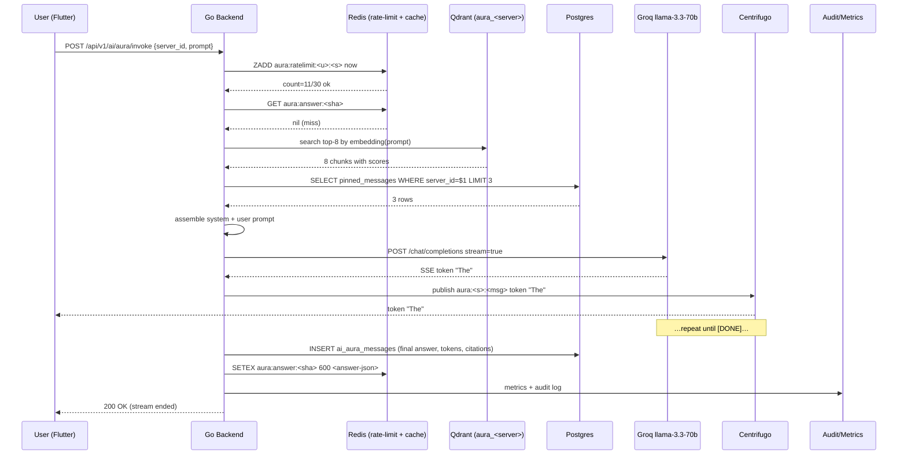
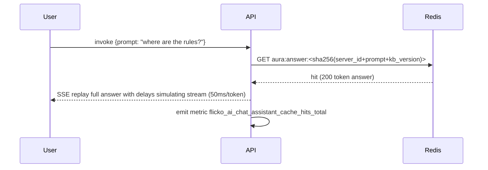
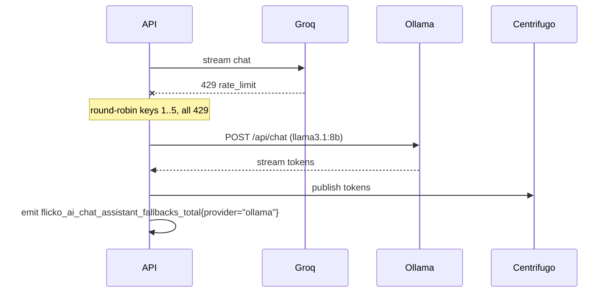
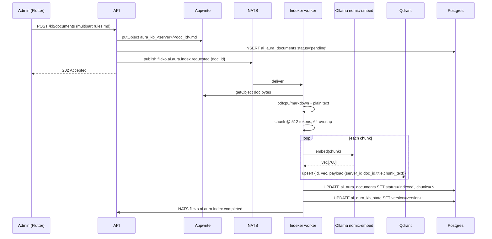

# Aura — Server-Aware AI Chat Assistant — App Flow

## 1. End-to-End Journey — Streaming Reply (cache miss)



## 2. End-to-End Journey — Cache hit (identical question within 10 min)



Cache key is salted with `kb_version` (incremented on doc add/remove/reindex) so stale answers expire instantly.

## 3. End-to-End Journey — Groq fail → Ollama fallback



If Ollama also fails the user sees the refusal copy "Aura is napping" and the request is dropped from the rate-limit ZSET (not consumed).

## 4. Indexing Pipeline (admin uploads new doc)



KB version bump invalidates all cache entries scoped to that server (next request misses, fresh answer).

## 5. State Machine — Single Aura Reply (mobile)

```
[idle]
  -- user sends @Aura prompt --> [posting]
[posting]
  -- 200 stream open       --> [streaming]
  -- 429                    --> [rate_limited]
  -- 5xx                    --> [error]
[streaming]
  -- token                 --> [streaming]
  -- "done" event          --> [done]
  -- stream broken         --> [resuming]
[resuming]
  -- reconnect ok          --> [streaming]
  -- 3 fails               --> [error]
[done]
  -- thumbs                --> [done] (ratings posted)
[refused]      (terminal — same UI as done but with refusal text)
[error]
  -- retry                 --> [posting]
```

## 6. User Journeys

### J1 — Happy path (member asks FAQ)
1. Member types `@` in `#general`. Autocomplete shows `✦ @Aura` first.
2. Selects, types `where are the rules?`, sends.
3. Skeleton shows "Aura is thinking…" for ~1s.
4. Tokens stream into card; takes 3.4s for 88 tokens.
5. Two citations [¹ rules.md] [² pinned-msg] appear.
6. Member taps `👍`.

### J2 — Refusal path (out-of-scope)
1. Member asks "what's bitcoin price?"
2. Retriever returns top-8 chunks all with score < 0.55 threshold.
3. Backend returns refusal template (no LLM call) — counts toward rate-limit.
4. UI shows refusal card with "Ask differently" + "Notify mods".

### J3 — Admin first-time setup
1. Server admin opens Server Settings → AI → Aura.
2. Toggle ON. Default persona shown.
3. Tap Knowledge base → empty state "Drop a doc".
4. Drag `rules.md` onto upload area; sees indexing 0→100% in ~6s.
5. Returns to channel, asks "where are the rules?" — passes.

### J4 — Rate-limited
1. User has invoked 30 times today.
2. 31st invocation → backend returns SSE error `rate_limited` with `retry_after`.
3. UI shows toast "Daily limit reached. Resets at midnight UTC."
4. `@Aura` chip still visible but composer button disabled with tooltip.

## 7. Edge Cases

- **Offline:** mention is queued in local `aura_outbox` Drift table; sent on reconnect. Cap of 3 queued mentions.
- **Permission revoked mid-stream:** server-side detects member kicked → cancels stream, sends `error code=forbidden`.
- **Prompt > 4k chars:** rejected at handler with `400 prompt_too_long`.
- **Doc deleted while answer streaming with that citation:** citation chip becomes a tombstone "(removed)" but reply text persists.
- **Concurrent edits:** Aura reply itself is immutable; user-edits to the original prompt do not retrigger Aura unless re-mentioned.
- **Network slow:** SSE keepalive ping every 15s; client treats >30s no event as dropped, switches to `[resuming]`.
- **Two members simultaneously @Aura same prompt:** both share the same answer-cache lookup (after first lands), second user sees ~50ms TTFT.
- **Server transferred ownership:** KB and settings persist; new owner inherits.
- **Server deleted:** Qdrant collection `aura_<server_id>` dropped; Postgres rows cascade.

## 8. Background / Async

- **KB reindex:**
  - Triggered by: doc add/edit/delete, manual "Reindex now" button, weekly cron `0 3 * * 0`
  - Idempotency key: `aura:reindex:<server_id>:<doc_id>:<sha256>`
  - Failure policy: retry 3× with exponential backoff (10s/60s/300s), then DLQ subject `flicko.ai.aura.index.dlq` + Sentry alert
- **Pinned message sync:**
  - Subject: `flicko.messages.pinned` (existing)
  - Handler in indexer worker: re-embed and upsert
- **Daily cleanup:**
  - Cron `0 4 * * *` removes `ai_aura_messages` older than 90d
  - Drops Redis `aura:ratelimit:*` keys with TTL 0

## 9. Notifications

- **Trigger:** member's question receives a reply (no notification — they're already looking).
- **Trigger:** indexing failed for admin's uploaded doc.
- **Channel:** in-app banner + push to admin
- **Copy:** "We couldn't index `rules.md`. The file may be corrupted or too large."
- **Deep link:** `flicko://server/<id>/aura/kb`
- **Batching rule:** max 1 indexing-failure notification per 5 minutes per admin
