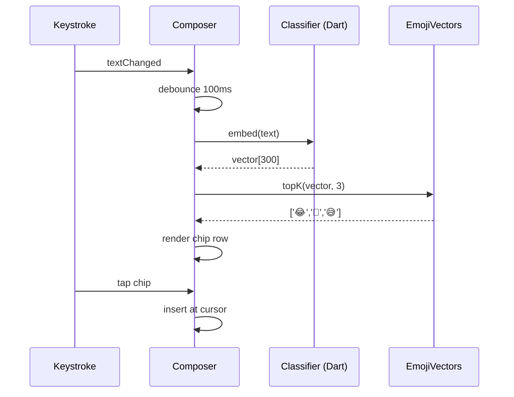

# AI Emoji Suggester — APPFLOW



## State Machine
```
[idle] → [embedding] → [showing] → [idle]
[idle] → [disabled] (setting off / model fail)
```

## Edge Cases
- Empty text: hide row.
- Suggestions identical to last keystroke: don't re-render.
- IME composition (CJK): suspend until composition ends.
- Voice-typed text: arrives as bursts; debounce 200ms when voice IME active.

## Background
- None.

## Notifications
- None.
