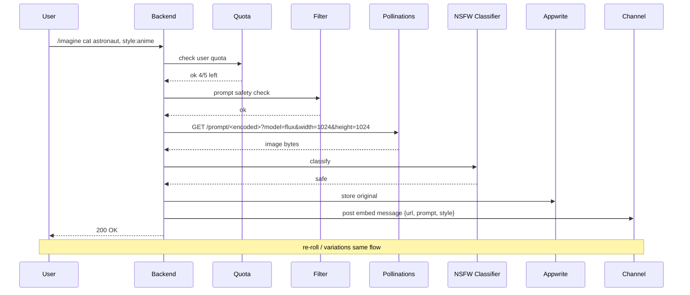

# AI Image Generation — APPFLOW



## State Machine
```
[queued] → [filtering] → [generating] → [moderating] → [posted]
                                       \→ [blocked]
                                       \→ [failed]
```

## Edge Cases
- Pollinations rate-limit: switch to SDXL fallback automatically.
- Prompt contains person name → block per-policy.
- Prompt has only emojis: minimum 3 words required.
- Image upload >10 MB: reject; reduce dimensions.
- User cancels mid-gen: best-effort cancel, no quota refund unless <1s.

## Background
- Async path via NATS for cold-start SDXL warm-up if Pollinations slow.
- Quota reset 00:00 user-local.

## Notifications
- "Image is ready" inline only (no push).
