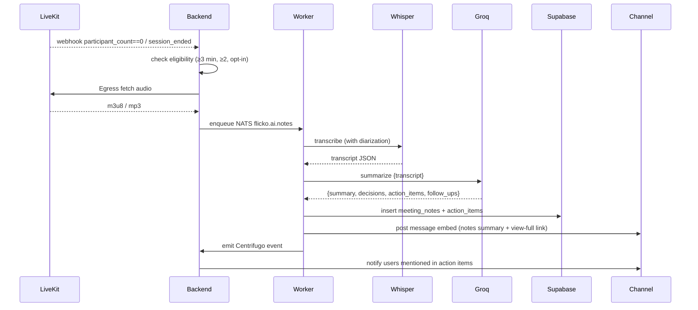

# AI Meeting Notes — APPFLOW



## State Machine
```
[triggered] → [fetching] → [transcribing] → [summarizing] → [published]
              \→ [failed] (any step)
              \→ [skipped] (ineligible)
```

## Edge Cases
- Multiple sessions back-to-back: debounce 60s.
- Session with one speaker for whole time: still produces notes, marked "monologue".
- Audio missing (Egress fail): post "transcript unavailable" with no summary.
- User leaves and rejoins: counts as one session if gap <2 min.

## Background
- Cleanup raw audio after summary published (privacy).
- Retain transcript and summary 90d default; admin can extend.

## Notifications
- "Meeting notes ready in #standup" → push for participants only.
- Mentioned users for action items get individual notifications.
