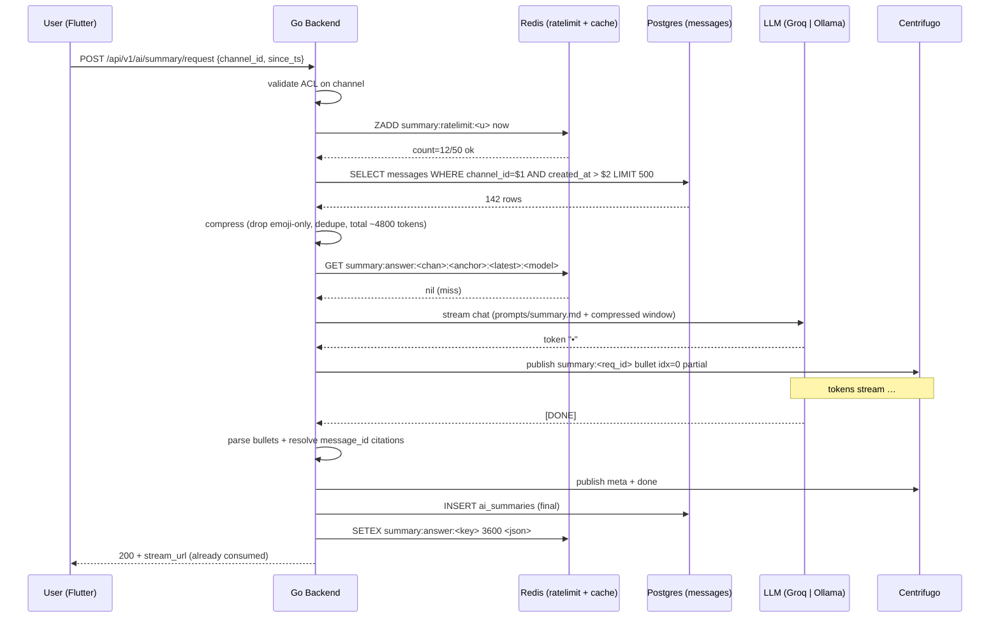
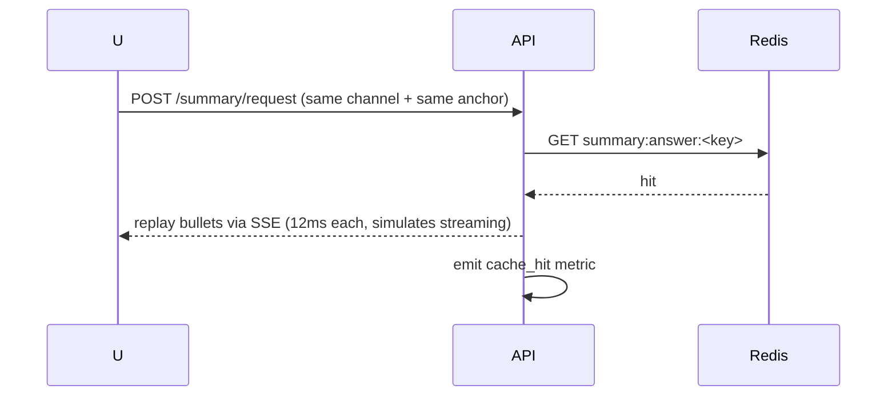
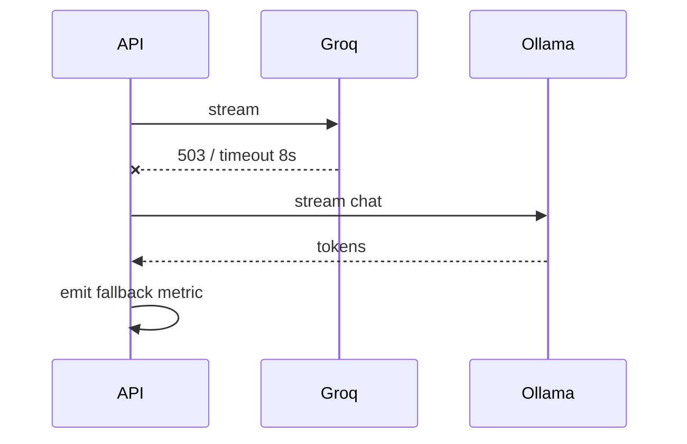
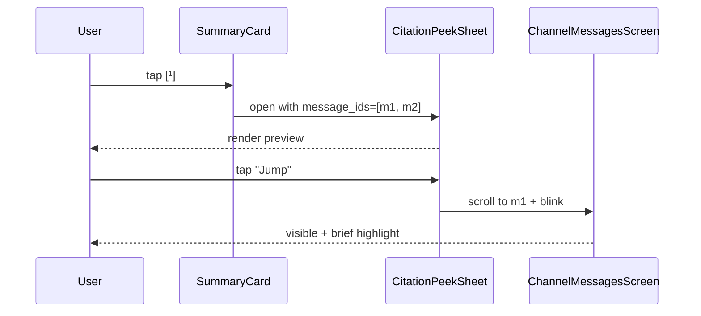

# Catch-Me-Up — AI Channel Summary — App Flow

## 1. End-to-End Journey — Cache miss



## 2. Cache hit (another member of same channel asks identical window 5 min later)



Cache key is shared across users for the same `(channel_id, anchor_msg_id, latest_msg_id, model)` tuple — second viewer has near-instant TTFB.

## 3. Fallback to Ollama



## 4. State Machine — UI

```
[hidden]
  -- unread >= 5  --> [pill_idle]
[pill_idle]
  -- tap          --> [requesting]
  -- scroll up    --> [dismissed]
  -- timeout 8s   --> [dismissed]
[requesting]
  -- 200 stream open --> [streaming]
  -- 429              --> [rate_limited]
  -- error            --> [error]
[streaming]
  -- bullet  --> [streaming]
  -- done    --> [done]
  -- error   --> [error]
[done]
  -- thumbs --> [done]
  -- ✕      --> [dismissed]
```

## 5. User Journeys

### J1 — Returning member after lunch
1. Alice opens Flicko 90 minutes after lunch.
2. `#general` shows 142 unread; pill `✦ Catch me up — 142 messages` floats above the unread bar.
3. Tap; pill morphs into card; first bullet appears in 1.1s.
4. After 4.5s the full 5-bullet card is rendered. She taps citation `[¹]` → bottom sheet → "Jump to thread".
5. Card stays visible until she scrolls up past the anchor.

### J2 — Long press partial summary
1. Bob long-presses a message from 6 hours ago in `#dev`.
2. Action sheet shows "Summarize from here".
3. Window starts at that message; runs as J1.

### J3 — Refused (too few)
1. Carl returns to `#niche-thread` which has 3 new messages.
2. No pill shown (threshold is 5). He scrolls and reads them.
3. If he forces summary via the channel header `⋯`, card shows "Not enough activity. Scroll up — there are only 3 messages."

### J4 — Rate-limited
1. Dave triggers his 51st summary today.
2. Pill becomes a static chip "Daily limit reached"; tap shows toast "Resets at midnight UTC."

## 6. Edge Cases

- **Permissions changed mid-window:** server middleware re-runs ACL on each request; if revoked, return `403`.
- **Messages deleted while summarizing:** parser drops missing citations; if a bullet has zero remaining citations, regenerate by asking LLM to re-cite from remaining message_ids (1 retry max).
- **User scrolls to anchor while loading:** card stays in the same DOM position relative to the unread separator; if user scrolls past it, the card scrolls with content normally.
- **Channel renamed mid-summary:** title in card updates on next render — anchor logic untouched.
- **Stream broken:** client polls `GET /summary/:id` after 5s of silence; if `outcome=done`, replay; else fallback to error UI.
- **User offline:** request never sent; pill shows offline indicator.
- **Channel marked NSFW:** model fallback to Ollama only — Groq has overly strict content policies; output still sanitized.
- **Channel is a voice channel:** pill never shows (voice-only).

## 7. Background / Async

- **Hot-summary cache warming:** every 5 min, a worker iterates top-50 channels by activity and pre-warms `summary:answer` for the rolling 24h anchor — yields 80% cache hit on demand.
  - Cron: `*/5 * * * *`
  - Subject: `flicko.ai.summary.warm`
  - Idempotency: `summary:warm:<channel_id>:<bucket-5min>`
  - Failure: skip channel, retry next bucket
- **Archive:** nightly job dumps `ai_summaries` rows older than 30d to R2 parquet; deletes from Postgres on success.

## 8. Notifications

- **Trigger:** opt-in "Daily catch-me-up" digest pushed at 09:00 local
  - Channel: push + in-app card on Home
  - Copy: `5 servers, 18 channels, here's what you missed`
  - Deep link: `flicko://digest/<date>`
  - Batching rule: 1 per day max
- v1 ships only the on-demand pill; daily digest is feature-flagged behind `feature.ai_summary_digest.enabled`

## 9. Sequence Diagram — Citation tap


