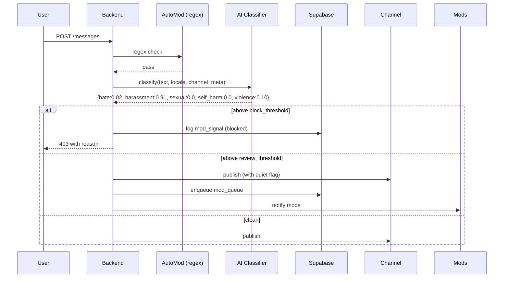

# AI Moderation — APPFLOW



## State Machine
```
message: [pending] → [classified] → [published] | [blocked] | [reviewing]
review: [open] → [approved] | [denied]
appeal: [open] → [overturned] | [upheld]
```

## Edge Cases
- Edits trigger reclassify; if borderline, hold edit.
- Forwarded messages: classify once at original.
- Slang/dialect false positive: per-language threshold tuning.
- Encrypted DMs: AI moderation never enabled (E2EE preserved).
- Mod marked safe: cache decision 30 days for that exact text hash to avoid re-flag.

## Background
- Threshold drift sweep weekly: alert mods if false-positive rate spikes.
- Re-train metadata report monthly.

## Notifications
- User: "Your message couldn't be sent because of our community guidelines. Appeal?"
- Mods: notification of new queue items, batched 5 min.
