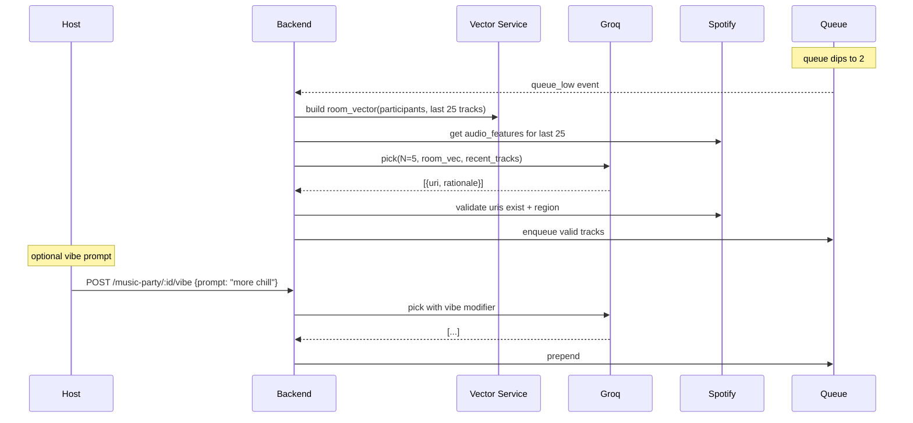

# AI Music Recommendations — APPFLOW



## State Machine
```
auto_queue: [off] ⇄ [on]
host can pin/unpin a vibe; AI picks bias toward pinned vibe
```

## Edge Cases
- All participants have empty taste vectors: fall back to genre seed from server tags.
- LLM returns inaccessible track for region: skip and retry.
- DMCA warning from Spotify: skip + log.
- Same track repeated: dedupe across last 50.

## Background
- Listening event ingest writes taste vectors hourly.
- Personal digest cron weekly Sunday 09:00 user-local.

## Notifications
- "Your weekly Flicko mix is ready" push.
