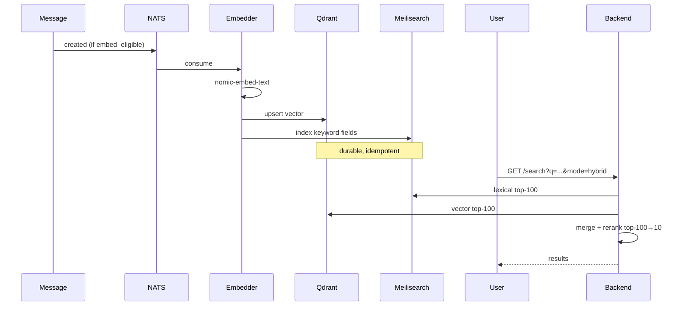

# AI Semantic Search — APPFLOW



## State Machine
```
embedding job: queued → embedding → indexed | failed
query: planning → fetching → reranking → returning
```

## Edge Cases
- Edited message: re-embed on edit.
- Deleted message: tombstone Qdrant + ME.
- Long message: split into 1k-token chunks; query merges chunks.
- Multilingual queries: nomic-embed-text v1.5 supports 100 langs.

## Background
- Embedder consumer durable name `semsearch-embedder`.
- Re-index sweeper if model version bumps.

## Notifications
- None.
