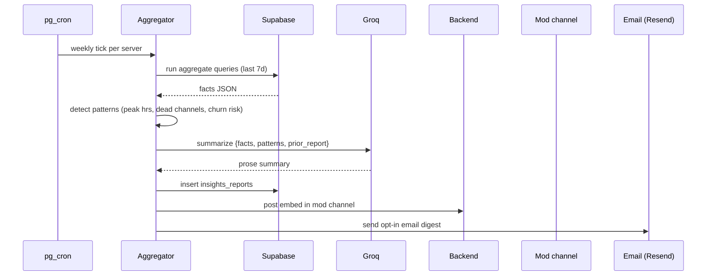

# AI Server Insights — APPFLOW



## State Machine
```
report: queued → aggregating → summarizing → published
       \→ skipped (too small)
       \→ failed
```

## Edge Cases
- New server <14d: skip historical compare; show "first report".
- Mostly-inactive server: section "How to revive your server" with checklist.
- Cluster of bots/spam: classifier ignores bot accounts.
- Time-zone aware scheduling.

## Background
- pg_cron `0 9 * * 1` (Monday 09:00 server-local).
- Manual trigger limit 1/day Plus.

## Notifications
- Mod channel: always.
- Admins DM: opt-in.
- Email digest: opt-in.
