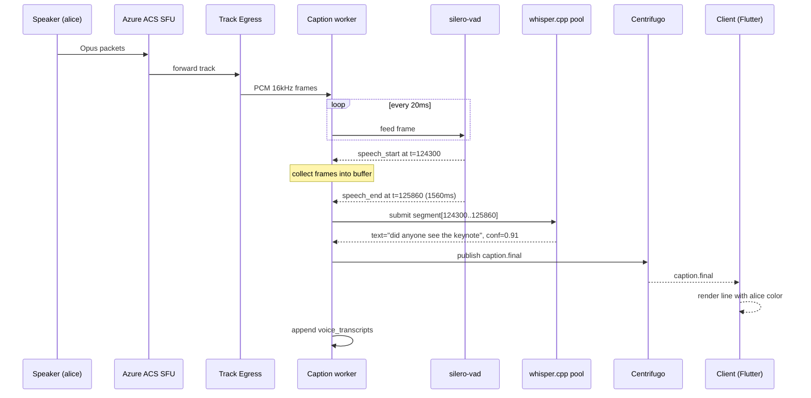
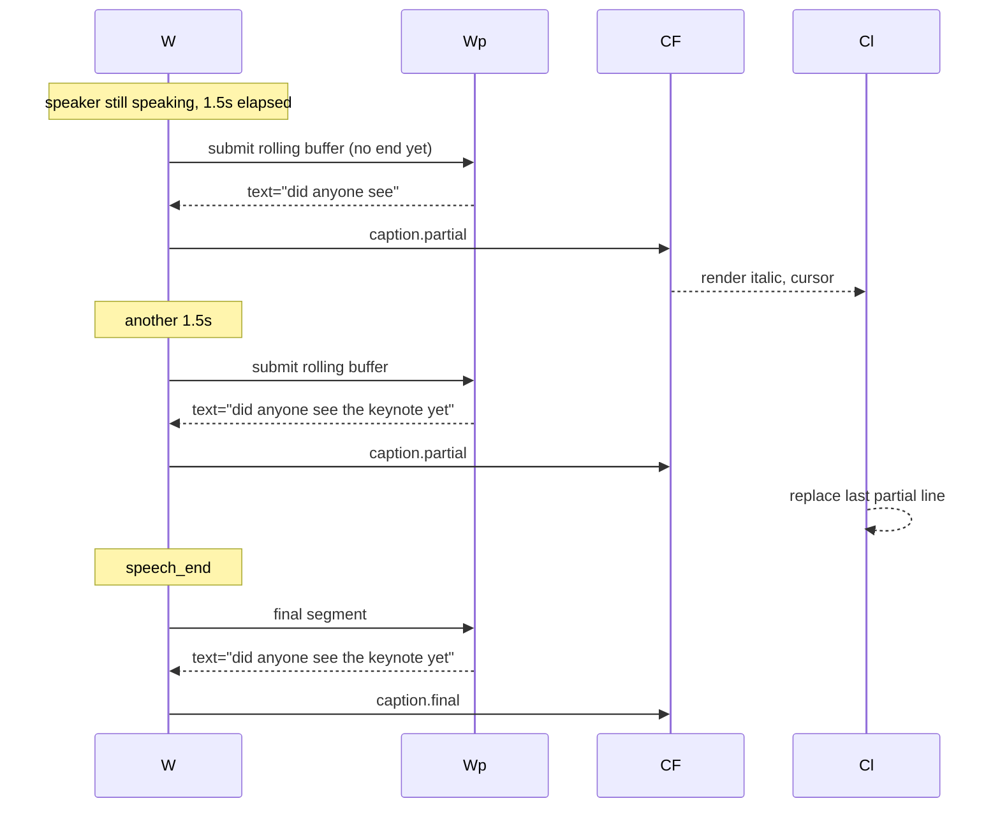
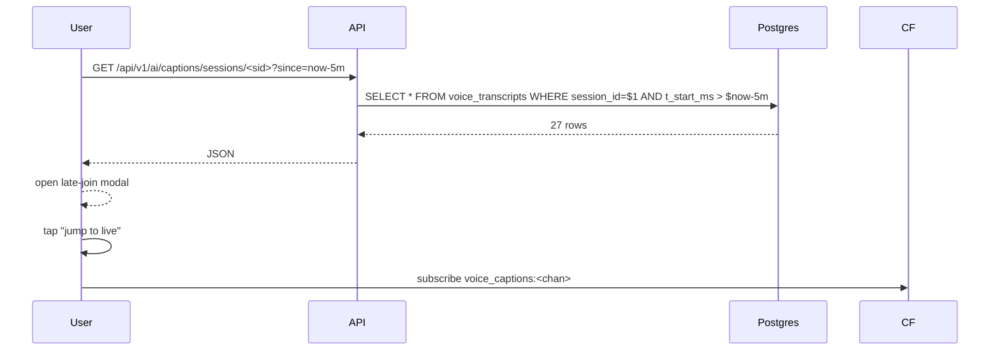
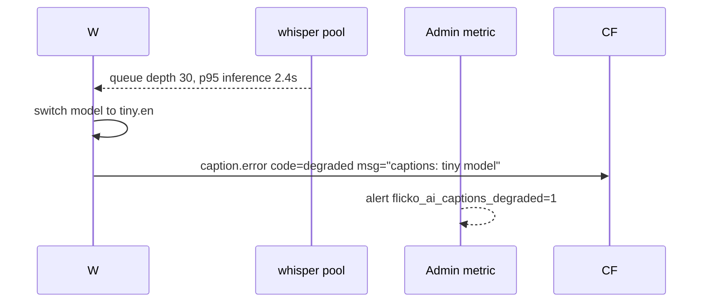

# Live Voice Captions — Whisper.cpp Transcription — App Flow

## 1. End-to-End Journey — Live caption



## 2. Streaming partials (long utterance)



## 3. Late-join flow



## 4. Worker overload + degradation



## 5. State Machine — Worker

```
[idle]
  -- session.started --> [warming]
[warming]
  -- model loaded     --> [listening]
[listening]
  -- speech_start     --> [collecting]
[collecting]
  -- speech_end / 15s --> [transcribing]
  -- session.ended    --> [draining]
[transcribing]
  -- text             --> [listening]
  -- failure          --> [error]
[draining]
  -- empty queue      --> [idle]
[error]
  -- retry            --> [listening]
```

## 6. User Journeys

### J1 — Deaf user joins voice channel
1. Alice joins `#lounge` voice. Toggle `CC` is ON by default (admin enabled, user pref ON).
2. Captions appear within 1s of someone speaking.
3. Reads conversation; sees Bob said "yeah it was wild".
4. Late-join modal showed last 5 min.

### J2 — Admin first-time enable
1. Admin opens channel settings → Captions → toggle ON.
2. Picks `small.en` model.
3. Joins channel; sees CC ON badge.
4. Members in channel get a system message "Captions enabled" with deep link to settings.

### J3 — Profanity reduction
1. User toggles "Reduce profanity" in caption settings.
2. Worker masks recognized profanity tokens with asterisks (post-processing).
3. Original transcript stored unmasked; only client-rendered version masked.

### J4 — Session export
1. Voice session ends.
2. Mod taps "Session ended" notification → Export.
3. Receives `.txt` with timestamps and speakers.

## 7. Edge Cases

- **Music bot playing:** worker pauses transcription when `bot:music` user is in channel (avoid lyrics chaos)
- **Two people talking simultaneously:** per-track isolation handles cleanly; both lines emit
- **User mutes mid-utterance:** worker finalizes the partial it has
- **Whisper hallucinates on silence:** VAD confidence gate ≥0.5 + minimum 200ms speech required
- **User joins after session ended:** export available for 30d
- **Network drops:** client buffers partials; on reconnect, reads `voice_transcripts` from missed window
- **Member's display name has emoji:** rendered as fallback name "alice" with emoji in semantic label

## 8. Background / Async

- **Session lifecycle:**
  - `flicko.voice.session.started` → spawn caption worker
  - `flicko.voice.session.ended` → drain & flush transcript to DB, publish notification
  - Cron `0 */6 * * *` → archive transcripts > 24h to R2 parquet, delete from primary
- **Worker auto-scale:** Kubernetes HPA on `flicko_ai_voice_transcription_active_channels`; one pod per ~32 channels (small.en)
- **Health check:** every 30s; replace pod if WER spikes > 25% over baseline

## 9. Notifications

- **Trigger:** session ended with captions enabled → DM to channel mod
- **Channel:** in-app + push
- **Copy:** "Voice session ended in #lounge. Transcript ready."
- **Deep link:** `flicko://channel/<id>/transcript/<session_id>`
- **Batching rule:** none (one per session is rare)
