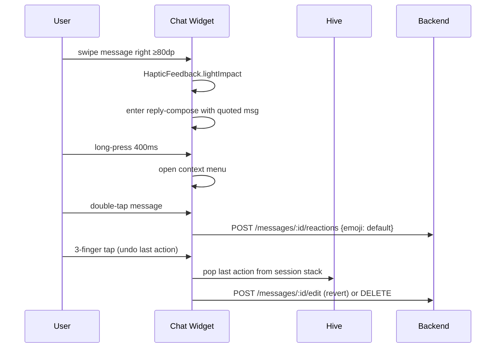

# Gesture Controls — App Flow

## 1. Sequence



## 2. State machine
```
[idle] → [pressed] → [drag-tracking] → {threshold? yes → trigger; no → snap-back}
[trigger] → [haptic] → [action]
[idle] → [longpress 400ms] → [context-menu]
```

## 3. Journeys
- J1 reply: scroll back, swipe right on a message → composer prefilled. Cancel = back gesture.
- J2 react: double-tap → default reaction (♥ or last used). Long-press to pick another.
- J3 undo: accidental delete → 3-finger tap restores within 5 s.
- J4 quick-jump: 2-finger swipe up = jump to oldest unread; down = latest.

## 4. Edge Cases
- Right-handed default; left-handed flips swipe direction (setting).
- iOS edge-swipe collision: ignore swipes starting <16 dp from screen edge.
- Reduced-motion: replace haptic + animation with subtle highlight only.
- A11y screen-reader on: gestures map to long-press menu items instead.
- Low-end Android (60Hz): debounce haptics so no buzz storm.

## 5. Background
- None. Pure client.

## 6. Notifications
- None.
