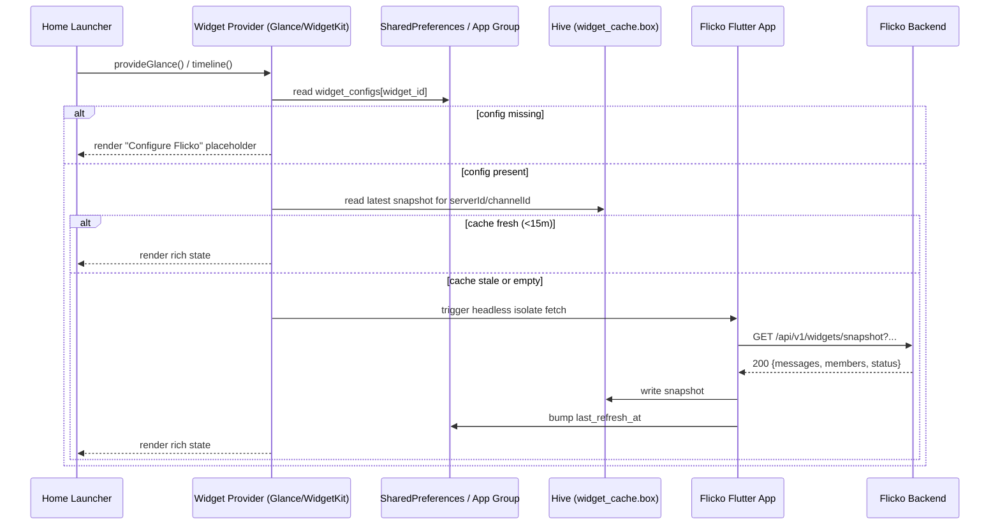
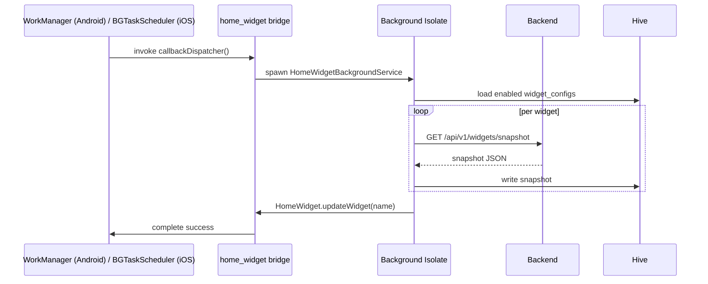
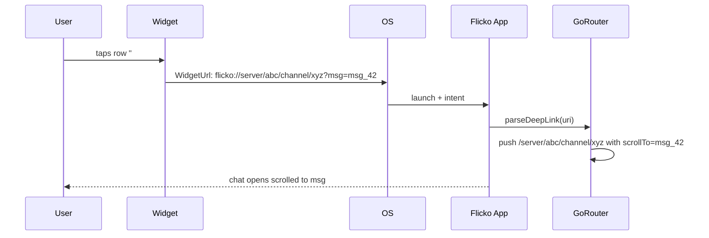

# Home Screen Widgets - APPFLOW

## 1. High-Level User Journey

```
[User installs Flicko]
        │
        ▼
[Onboarding completes]
        │
        ▼
[User long-presses home screen] ──► [Picks "Flicko" widget gallery]
        │                                       │
        ▼                                       ▼
[Widget added with default config]   [Configures size/server/channel]
        │
        ▼
[Widget renders snapshot from Hive cache]
        │
        ▼
[Background refresh every 15 min via WorkManager / BGAppRefreshTask]
        │
        ▼
[Tap a row in widget] ──► [Deep link opens Flicko at /server/:id/channel/:id]
```

## 2. Sequence Diagram - Initial Widget Render



## 3. Sequence Diagram - Background Refresh



## 4. State Machine - Widget Lifecycle

```
                     ┌──────────────┐
   add to home  ───► │ UNCONFIGURED │
                     └──────┬───────┘
                            │ user picks server/channel
                            ▼
                     ┌──────────────┐    network ok    ┌────────────┐
                     │  CONFIGURED  │ ───────────────► │   FRESH    │
                     └──────┬───────┘                  └─────┬──────┘
                            │                                │ 15m TTL
                            │ network err or not signed in   ▼
                            │                          ┌────────────┐
                            │                          │   STALE    │
                            │                          └─────┬──────┘
                            │                                │ refresh
                            ▼                                ▼
                     ┌──────────────┐                  ┌────────────┐
                     │  ERROR (auth │ ◄────────────────│ REFRESHING │
                     │  / 401 / no  │                  └────────────┘
                     │   network)   │
                     └──────┬───────┘
                            │ user opens app + reauths
                            ▼
                     ┌──────────────┐
                     │   RECOVERED  │
                     └──────────────┘
```

## 5. Tap Interaction Flow



## 6. Edge Cases

### 6.1 Offline (no network)
- Background isolate detects `SocketException`, marks `last_refresh_status=offline`.
- Widget continues rendering last cached snapshot with a small "offline" badge.
- Tap still deep-links into the app; the app shows offline-mode chat.

### 6.2 Auth expired (401)
- Snapshot endpoint returns 401.
- Background job stores `auth_required=true` flag.
- Widget renders "Sign in to Flicko" CTA. Tap opens `/auth/login`.

### 6.3 Server / channel deleted
- Backend returns 410 Gone.
- Widget config marks `dangling=true` and prompts reconfigure.

### 6.4 Low battery / Doze mode
- Android: WorkManager constraints (`requiresBatteryNotLow=false`, `requiresCharging=false`) but min interval bumped to 30 min when battery <15%.
- iOS: BGAppRefreshTask is throttled by the OS. Treat any window as best-effort.

### 6.5 Widget removed by user
- Provider receives `onDeleted(widgetId)`. App receives broadcast via home_widget; we delete the matching `widget_configs` row.

### 6.6 App not signed in at all
- Default placeholder widget shows logo + "Open Flicko to start". No backend calls attempted.

### 6.7 Glance / WidgetKit size class change
- Re-render triggered automatically. Layout selects a `Compact`, `Medium`, or `Large` template based on `GlanceModifier.size` / `WidgetFamily`.

### 6.8 OS-level dark/light mode flip
- Widget reads `Theme.of(context).colorScheme` (Glance) / `colorScheme` env (WidgetKit). No extra refresh needed.

### 6.9 Background callback not registered
- If Flutter engine cold-starts, `home_widget` re-registers `callbackDispatcher` via `@pragma('vm:entry-point')`. Failing that, widget shows cached data only.

### 6.10 Multiple widgets, same channel
- Snapshot is keyed by `channelId`, shared across widgets. Refresh dedupes by channel.

## 7. Refresh Cadence Summary

| Trigger              | Android                   | iOS                          |
|----------------------|---------------------------|------------------------------|
| Periodic             | WorkManager 15m           | BGAppRefreshTask, OS-paced   |
| App foreground sync  | on AppLifecycleState.resumed | same                       |
| New message push     | FCM data-only -> trigger update | APNs background -> update |
| Manual refresh tap   | tappable refresh icon     | tappable refresh icon        |
