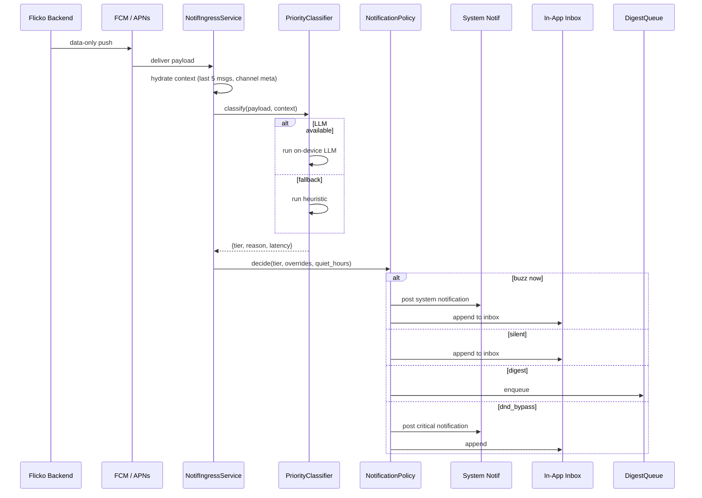
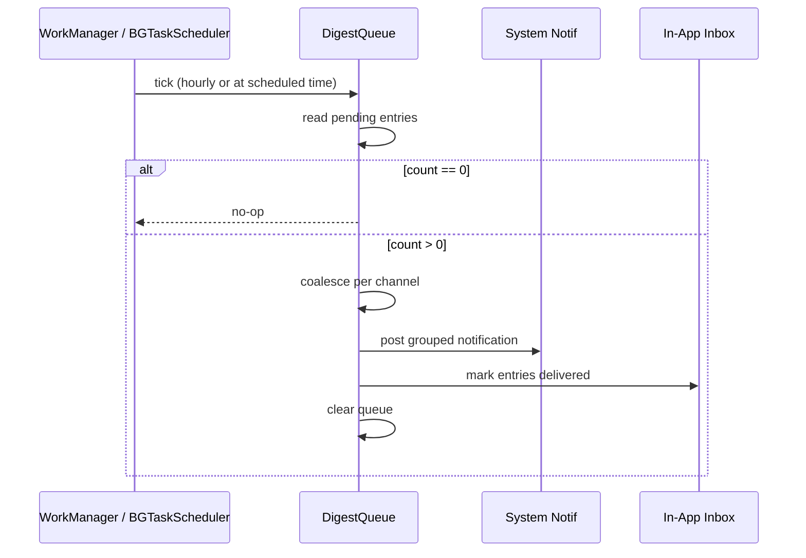
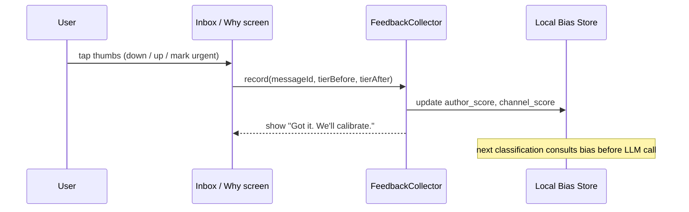
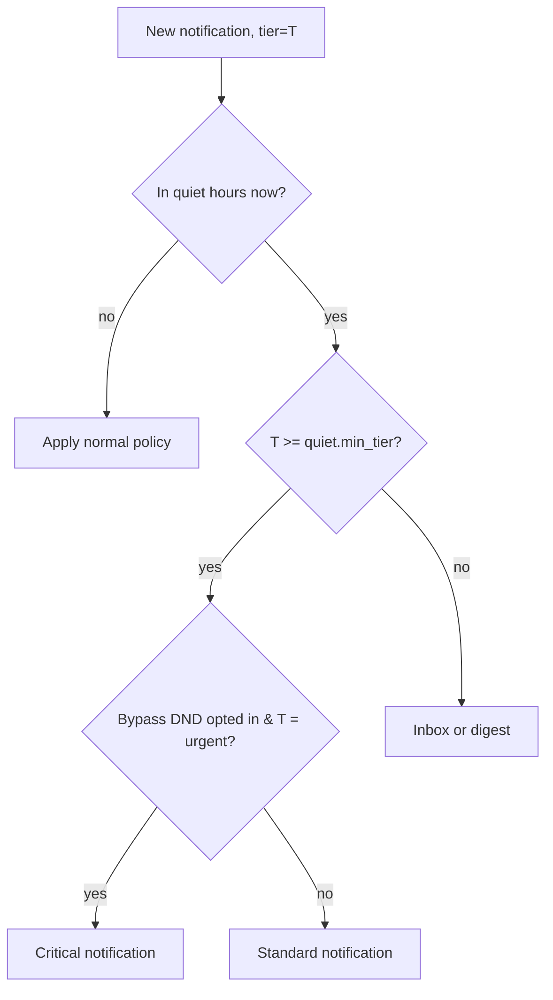
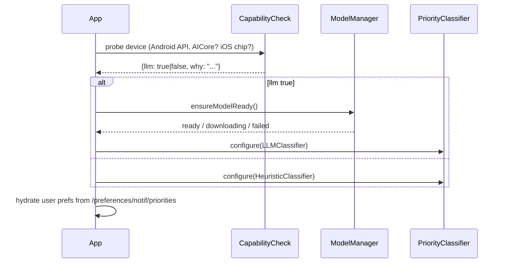

# Smart Notifications - APPFLOW

## 1. End-to-End Notification Flow



## 2. Digest Delivery Flow



## 3. Feedback Loop Flow



## 4. State Machine - Notification Lifecycle

```
                  ┌────────────┐
   push received ►│  RECEIVED  │
                  └─────┬──────┘
                        │ classify
                        ▼
                  ┌────────────┐
                  │ CLASSIFIED │
                  └─────┬──────┘
        ┌───────────────┼─────────────────┐
        ▼               ▼                 ▼
  ┌──────────┐    ┌──────────┐      ┌────────────┐
  │  BUZZED  │    │ INBOXED  │      │ QUEUED FOR │
  │ (urgent /│    │ (silent) │      │   DIGEST   │
  │ relevant)│    └──────────┘      └─────┬──────┘
  └────┬─────┘                            │
       │ tap                              │ digest tick
       ▼                                  ▼
  ┌──────────┐                       ┌──────────┐
  │  OPENED  │                       │ DELIVERED│
  └────┬─────┘                       │  (group) │
       │ feedback                    └─────┬────┘
       ▼                                   │
  ┌────────────┐                           │
  │CALIBRATED  │                           │
  └────────────┘                           │
                                           ▼
                                      ┌──────────┐
                                      │  OPENED  │
                                      └──────────┘
```

## 5. Quiet Hours Decision



## 6. Edge Cases

### 6.1 Model Not Downloaded Yet
- iOS: show download progress in Settings; classification falls back to heuristic.
- Android: AICore not provisioned -> heuristic permanently on this device.

### 6.2 Offline (Push Still Possible via FCM/APNs)
- Push payload is data-only; we have full context cached locally for the channel.
- Classification runs offline. If context is missing, default to `relevant` (cautious).

### 6.3 Watch Disconnect During Buzz Decision
- Policy doesn't depend on watch presence. Phone always classifies and delivers locally.

### 6.4 Low Battery (<15%)
- Classifier disabled; heuristic only. Banner in settings.

### 6.5 OS Killed Background Isolate
- Notifications missed during the kill are reclassified on next foreground from server state.

### 6.6 LLM Returns Invalid JSON
- Single-message fallback to heuristic. Counter increments; if >5% of recent classifications fail, switch heuristic-default for 24 h and surface a status banner.

### 6.7 Override Conflicts (channel says urgent, classifier says noise)
- Override wins. LLM tier kept in inbox metadata for debugging.

### 6.8 User Spams Feedback (gaming)
- Bias deltas clamped per author/channel/day. Excessive corrections do not invert tiers within one message.

### 6.9 Time-Zone Change
- Quiet hours are stored with explicit `tz`. On TZ change we keep the displayed wall-clock window unchanged.

### 6.10 Notification Burst (>20 in 60 s)
- Coalesce into a single "burst" notification with summary; individual entries still classified.

### 6.11 Critical-Alert Entitlement Denied (iOS)
- DND-bypass requested but unavailable; UI explains and offers to direct user to Settings.

### 6.12 Digest Window Skipped (device asleep)
- Next foreground triggers a catch-up digest with combined entries.

## 7. Initialization Sequence


