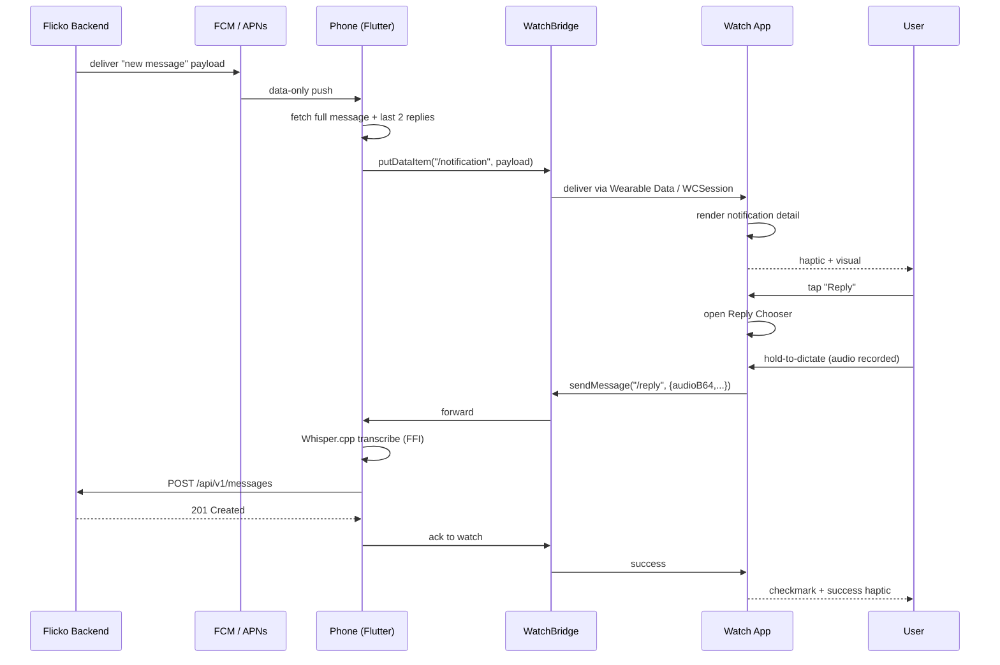
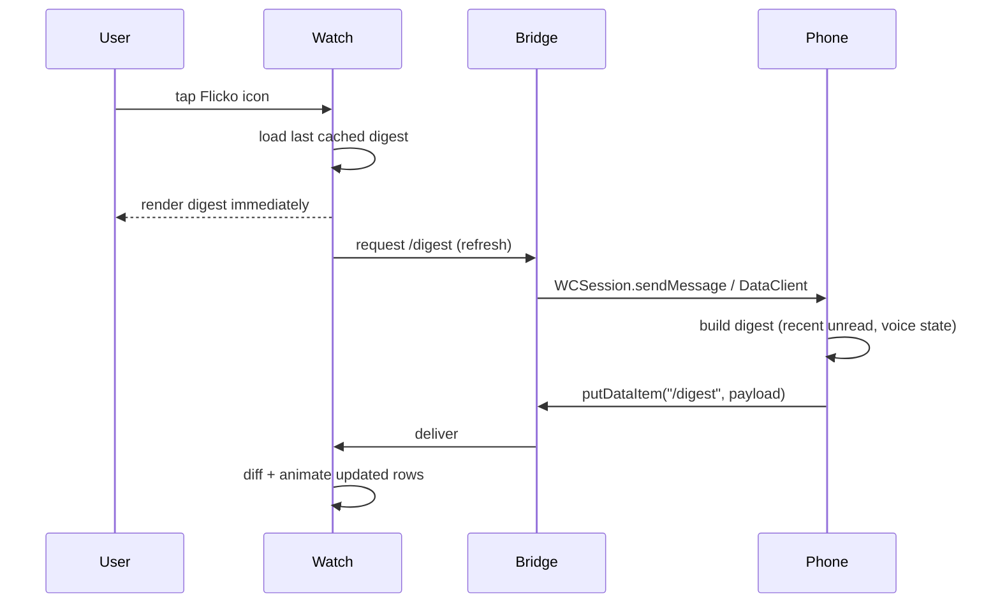
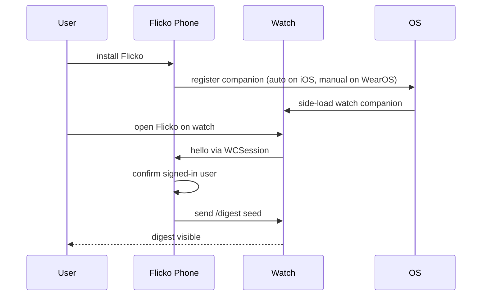

# Smartwatch Support - APPFLOW

## 1. End-to-End Notification Flow



## 2. Cold Launch Flow



## 3. Pairing / Onboarding Flow



## 4. State Machine - Reply Action

```
                ┌─────────┐
                │  IDLE   │
                └────┬────┘
                     │ tap reply
                     ▼
                ┌──────────────┐
                │ CHOOSING     │
                └──┬──────┬────┘
        emoji tap │      │ hold mic
                  ▼      ▼
        ┌─────────┐  ┌────────────┐
        │ REACTING│  │ RECORDING  │
        └────┬────┘  └─────┬──────┘
             │             │ release
             │             ▼
             │       ┌────────────┐
             │       │TRANSCRIBING│
             │       └─────┬──────┘
             │             │ ok / fail
             ▼             ▼
        ┌────────────────────────┐
        │       SENDING           │
        └────────┬───────────────┘
                 │
        ok ┌─────┴─────┐ err
           ▼           ▼
     ┌───────┐    ┌────────┐
     │  OK   │    │ ERROR  │
     └───┬───┘    └───┬────┘
         │            │ retry
         ▼            ▼
     IDLE         RECORDING
```

## 5. Edge Cases

### 5.1 Bluetooth Disconnect Mid-Reply
- Recording continues; on release we attempt `sendMessage`. If unreachable, we fall back to `transferUserInfo` (queued, durable on iOS) or `Wearable.getDataClient().putDataItem` with a queued path.
- Watch UI shows banner "Will send when phone is reachable" + queue badge on home.

### 5.2 Phone Off / Unreachable
- Digest shows last cached state with "synced 12m ago" footer.
- Action queue persists across watch restarts (capped at 20 items, oldest evicted).

### 5.3 Watch Battery <10%
- WatchOS: tiles refresh suspended automatically by OS.
- WearOS: we proactively skip tile refresh when `BatteryManager.BATTERY_PROPERTY_CAPACITY < 10`.

### 5.4 Watch-Disconnect During Voice Channel
- Active-voice complication grays out and shows "—" until reconnect.
- Phone foreground service keeps the actual call alive; watch is purely a glance.

### 5.5 Notification Received When Watch on Charger and Off-Wrist
- Honor system Do-Not-Disturb settings; we only deliver haptic when worn.
- Off-wrist detection on watchOS via `WKExtension.shared().isAutorotating`. WearOS: `WearableExtender` with `setHintAvoidBackgroundClipping`.

### 5.6 Mic Permission Denied
- Reply chooser shows lock icon over mic; tap explains "Allow microphone on the phone".
- Falls back to suggested replies and emoji.

### 5.7 Whisper Unavailable on Phone
- Phone bridge POSTs audio to `/api/v1/transcribe` server fallback. Latency budget grows from 4 s to 6 s.

### 5.8 Watch App Updated While Phone App Stale
- Watch refuses payloads with `version > self+1`. Renders update prompt: "Update Flicko on your phone."

### 5.9 Concurrent Notifications
- Watch coalesces notifications per channel: a second arrival within 30 s collapses into one entry showing message count.

### 5.10 User Mutes Channel from Watch
- Bridge -> Phone -> POST `/api/v1/channels/:id/mute` with TTL 30m.
- Watch immediately suppresses subsequent notifications for that channel.

### 5.11 Locale Mismatch
- If the watch locale differs from the phone (e.g., user moved phone but not watch), we resync ARB strings on next bridge handshake.

### 5.12 Action Sent Twice Due to Retry
- Backend `/api/v1/messages` accepts an idempotency key generated on the watch (`UUID v4`) and stored 24 h. Replays return the original message id without duplicating.
