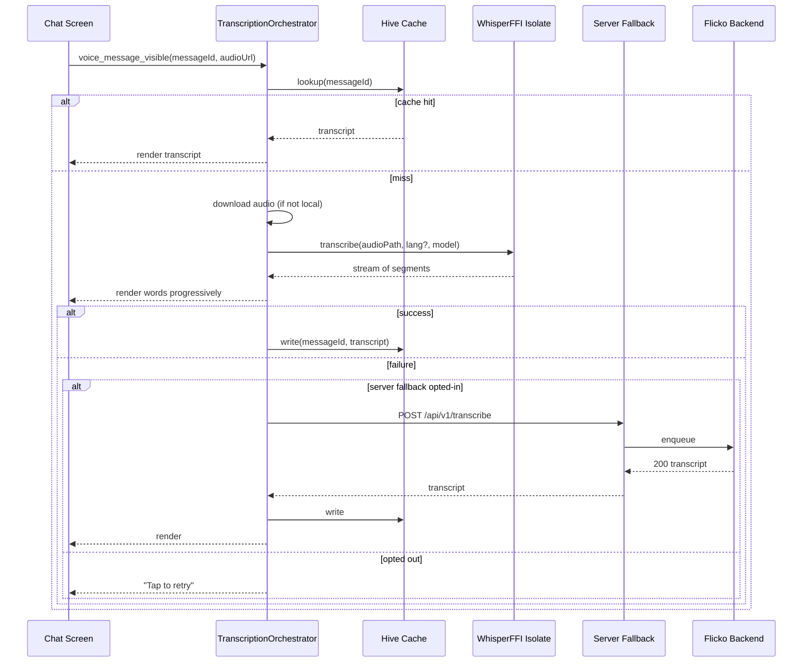
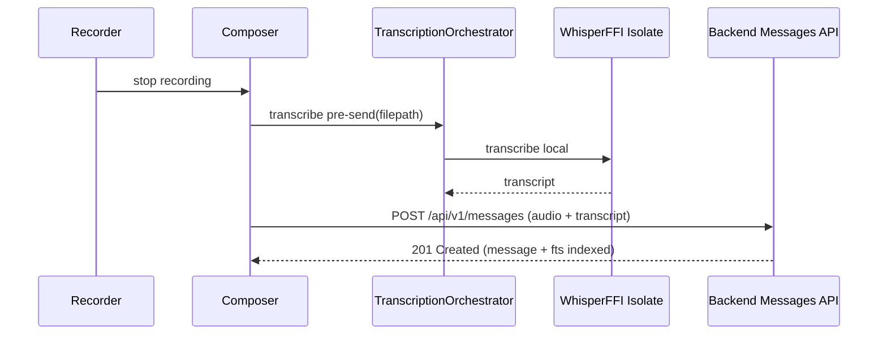
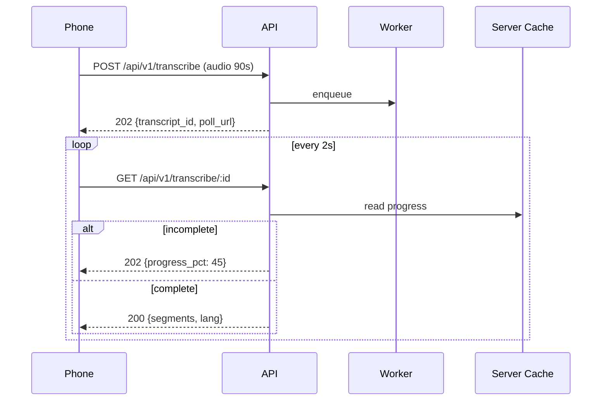
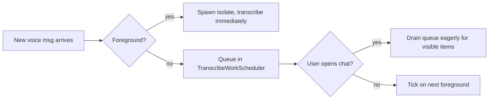
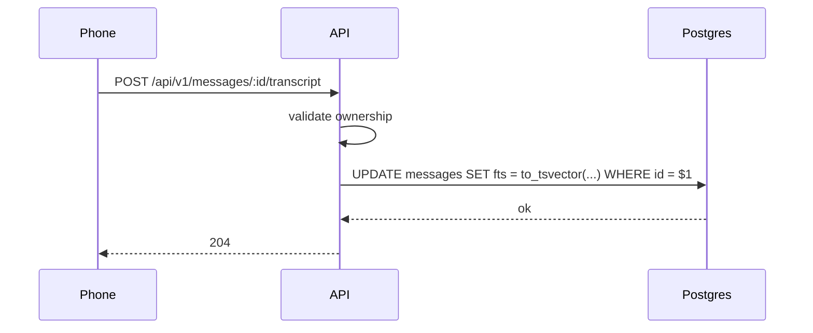

# Voice Message Transcription - APPFLOW

## 1. End-to-End Flow (Recipient)



## 2. End-to-End Flow (Sender, Pre-Transcription)



## 3. Server Fallback Async Flow (Long Clips)



## 4. State Machine - Per-Message Transcription

```
                     ┌──────────────┐
   message visible ► │   PENDING    │
                     └──────┬───────┘
                            │ start engine
                            ▼
                     ┌──────────────┐
                     │  RUNNING     │
                     └─┬─────┬──────┘
              first wd │     │ failure
                       ▼     ▼
              ┌──────────────┐  ┌────────────┐
              │ STREAMING    │  │ FAILED     │
              └─────┬────────┘  └──────┬─────┘
              done  │                  │ retry / fallback
                    ▼                  ▼
              ┌──────────────┐  ┌────────────┐
              │ COMPLETED    │  │ FALLBACK   │
              └──────────────┘  │ (running)  │
                                └─────┬──────┘
                                      │ ok / err
                          ┌───────────┼─────────┐
                          ▼                     ▼
                  ┌──────────────┐      ┌────────────┐
                  │ COMPLETED    │      │ ABANDONED  │
                  └──────────────┘      └────────────┘
```

## 5. Edge Cases

### 5.1 Offline Reception
- Message arrives while offline (push delivered audio link). Audio fetch fails.
- Bubble shows transcript shimmer + "Will transcribe when online." Retry on reconnect.

### 5.2 Audio Cached But Model Missing
- For multilingual: trigger `base` download (with WiFi-only constraint by default).
- Until ready: bubble can use `tiny.en` if message language is English; otherwise wait.

### 5.3 Battery <15%
- On-device disabled; bubble shows "Low battery. Charge to transcribe locally." If fallback opted in, use server.

### 5.4 Long Clip (>90 s)
- Default to server fallback if user opted in. Otherwise on-device with chunking and progress UI.

### 5.5 Phone Goes to Background Mid-Transcription
- Isolate continues if app is in foreground. Background isolates suspend; we resume on foreground.

### 5.6 Whisper Crashes
- Caught at FFI boundary; isolate restarts. After 3 crashes per session for the same model, switch to fallback or alternate model.

### 5.7 Cache Eviction
- Hive box size capped at 200 MB. LRU eviction. Re-transcribed on next view.

### 5.8 User Reactions to Inaccurate Transcripts
- Long-press transcript -> "Report wrong transcript" -> sends opt-in feedback (with audio hash only, no audio) for eval set.

### 5.9 Encryption-At-Rest Audio
- All audio is already AES encrypted by existing media pipeline. Transcript data follows the same key ring.

### 5.10 Sender's Pre-Transcript Is Wrong
- Recipient devices re-run transcription locally if confidence median < 0.55, ignoring sender's transcript.

### 5.11 Two Recipients See Different Transcripts
- Acceptable: each device runs its own engine. Search index uses sender's transcript when present, recipients' otherwise.

### 5.12 Network Partition Mid-Server-Fallback
- Phone retries `GET /api/v1/transcribe/:id` up to 5 minutes. After that, abandon and prompt manual retry.

### 5.13 Code-Switched Language Mid-Clip
- Whisper auto-detects per chunk. Each segment carries its own `lang`. UI renders without flagging.

### 5.14 Hardware-Accelerated Decoding Disabled by OS
- Fall back to CPU. Latency multiplied ~2x; surface "slower than usual" toast on first hit.

## 6. Background Processing Diagram



## 7. Search Indexing Trigger



Indexing only fires for messages the user authored. Recipients' local transcripts are searchable only on the device.
